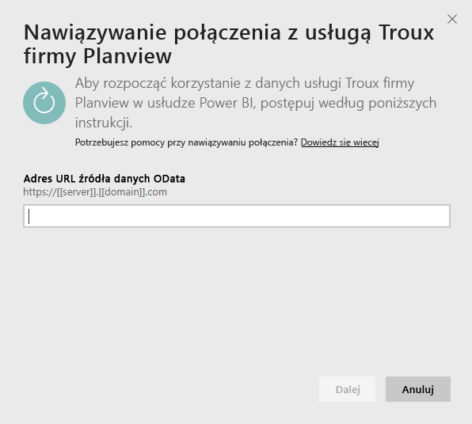
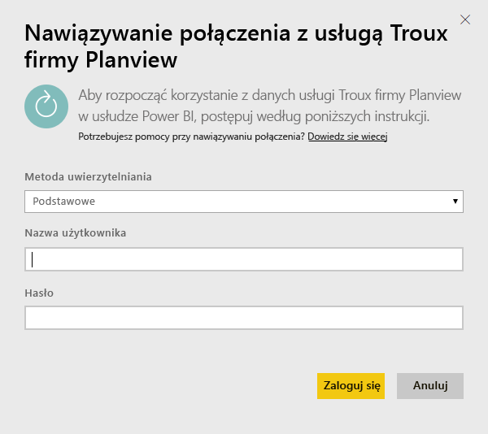
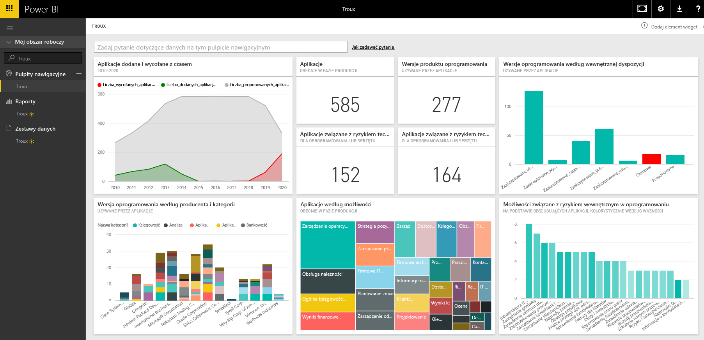

# Łączenie się z pakietem zawartości Troux dla usługi Power BI
Pakiet zawartości Troux pozwala w całkowicie nowy sposób wizualizować repozytorium architektury przedsiębiorstwa bezpośrednio w usłudze Power BI. Ten pakiet zawartości oferuje zestaw szczegółowych danych dotyczących możliwości biznesowych, aplikacji zapewniających te możliwości oraz technologii obsługujących te aplikacje, które mogą być w pełni dostosowywane przy użyciu usługi Power BI.

Połącz się z [pakietem zawartości Troux](https://app.powerbi.com/getdata/services/troux) dla usługi Power BI.

## Jak nawiązać połączenie
1. Wybierz pozycję **Pobierz dane** w dolnej części okienka nawigacji po lewej stronie.
   
   
2. W polu **Usługi** wybierz pozycję **Pobierz**.
   
   
3. Wybierz pozycję **Troux** \>  **Pobierz**.
   
   
4. Określ adres URL Troux OData. Poniżej znajdują się szczegółowe informacje dotyczące [wyszukiwania tych parametrów](#FindingParams).
   
   
5. W polu **Metoda uwierzytelniania** wybierz opcję **Podstawowa**, podaj nazwę użytkownika i hasło (z rozróżnianiem wielkości liter), a następnie wybierz pozycję **Zaloguj**.
   
    
6. Po zatwierdzeniu proces importowania rozpocznie się automatycznie. Po zakończeniu nowy pulpit nawigacyjny, raport i model zostaną wyświetlone w okienku nawigacji. Wybierz pulpit nawigacyjny, aby wyświetlić zaimportowane dane.
   
     

**Co teraz?**

* Spróbuj [zadać pytanie w polu funkcji Pytania i odpowiedzi](consumer/end-user-q-and-a.md) w górnej części pulpitu nawigacyjnego
* [Zmień kafelki](service-dashboard-edit-tile.md) na pulpicie nawigacyjnym.
* [Wybierz kafelek](consumer/end-user-tiles.md), aby otworzyć raport źródłowy.
* Dla zestawu danych jest zaplanowane codzienne odświeżanie, ale możesz zmienić harmonogram odświeżania lub odświeżyć go na żądanie przy użyciu polecenia **Odśwież teraz**

## Wymagania systemowe
Wymagany jest dostęp do źródła danych Troux OData i programu Troux w wersji 9.5.1 lub nowszej.

## Znajdowanie parametrów
Zespół obsługi klienta może dostarczyć użytkownikowi unikatowy adres URL źródła danych Troux OData

## Rozwiązywanie problemów
Jeśli po podaniu poświadczeń wystąpi błąd upływu limitu czasu, spróbuj ponownie nawiązać połączenie.

## Następne kroki
[Wprowadzenie do usługi Power BI](service-get-started.md)

[Pobieranie danych w usłudze Power BI](service-get-data.md)

