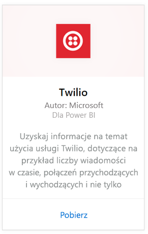
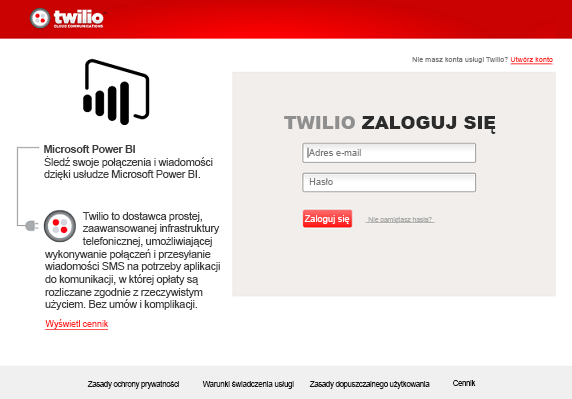
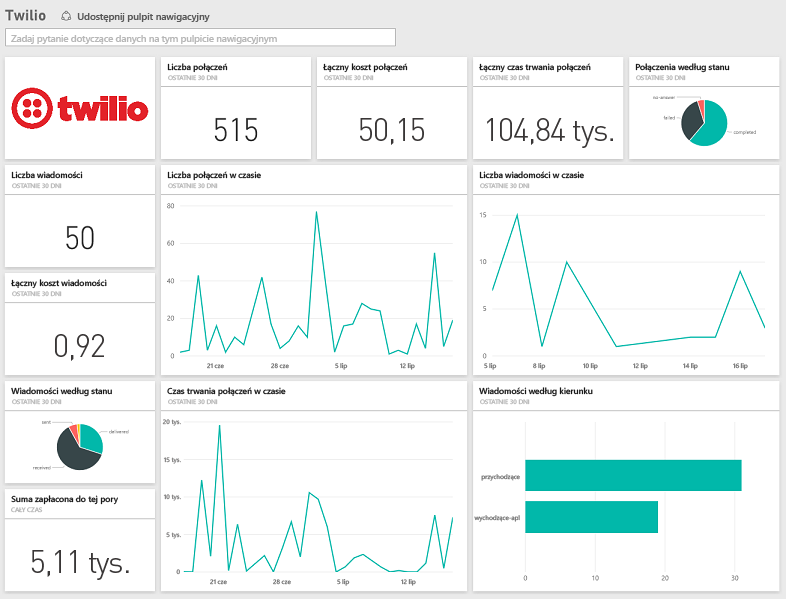

# Łączenie się z usługą Twilio za pomocą usługi Power BI
Pakiet zawartości Microsoft Twilio dla usługi Power BI pozwala na ściąganie danych do usługi Power BI i tworzy gotowy do użycia [pulpit nawigacyjny Twilio](https://powerbi.microsoft.com/integrations/twilio) oraz raport, który zawiera szczegółowe informacje na temat danych. Możesz również tworzyć niestandardowe raporty i pulpit nawigacyjny w zestawie danych tworzonym przez usługę Power BI. Dane będą odświeżane raz dziennie, więc zawsze będziesz widzieć najnowsze dane.

Połącz się z [pakietem zawartości Twilio](https://app.powerbi.com/getdata/services/twilio) dla usługi Power BI.

## Jak nawiązać połączenie
1. Wybierz pozycję **Pobierz dane** w dolnej części okienka nawigacji po lewej stronie.
   
    
2. W polu **Usługi** wybierz pozycję **Pobierz**.
   
    
3. Wybierz pozycję **Twilio** \> **Pobierz**.
   
   
4. Jako **metodę uwierzytelniania** wybierz opcję **oAuth2** \> Zaloguj. Po wyświetleniu monitu podaj swoje poświadczenia Twilio i zezwól aplikacji Power BI na dostęp do danych.
   
   
5. Spowoduje to rozpoczęcie importowania danych z konta Twilio. Pulpit nawigacyjny zostanie wypełniony informacjami o rozmowach i wiadomościach z ostatnich 30 dni. 
   
   

**Co teraz?**

* Spróbuj [zadać pytanie w polu funkcji Pytania i odpowiedzi](power-bi-q-and-a.md) w górnej części pulpitu nawigacyjnego
* [Zmień kafelki](service-dashboard-edit-tile.md) na pulpicie nawigacyjnym.
* [Wybierz kafelek](service-dashboard-tiles.md), aby otworzyć raport źródłowy.
* Zestaw danych zostanie ustawiony na codzienne odświeżanie, ale możesz zmienić harmonogram odświeżania lub spróbować odświeżyć go na żądanie przy użyciu opcji **Odśwież teraz**

## Zawartość pakietu
Szczegółowe informacje na temat wszystkich transakcji dotyczących rozmów i wiadomości z ostatnich 30 dni. Te dane można poddawać wszelkiego rodzaju analizom i agregacji.

Zestaw już zagregowanych statystyk, które możesz kontrolować. Ten zestaw zawiera:

        All Time Calls Count  
        All Time Calls Duration  
        All Time Calls Price  
        All Time Messages Price  
        All Time Messages Count  
        All Time Count of Phone Numbers  
        All Time Price of Phone Numbers  
        All Time Twilio Client Calls Price  
        All Time Twilio Client Calls Duration  
        All Time Twilio Client Calls Count  
        All Time Total Price  
        All Time Inbound Calls Price  
        All Time Inbound Calls Duration  
        All Time Inbound Calls Count  
        All Time Outbound Calls Price  
        All Time Outbound Calls Duration  
        All Time Outbound Calls Count  
        This Month Calls Price  
        This Month Calls Duration  
        This Month Calls Count  
        This Month Messages Count  
        This Month Messages Price  
        This Month Count of Phone Numbers  
        This Month Price of Phone Numbers  
        This Month Twilio Client Calls Price  
        This Month Twilio Client Calls Duration  
        This Month Twilio Client Calls Count  
        This Month Total Price  
        This Month Inbound Calls Price  
        This Month Inbound Calls Duration  
        This Month Inbound Calls Count  
        This Month Outbound Calls Price  
        This Month Outbound Calls Duration  
        This Month Outbound Calls Count  
        This Month Inbound Messages Price  
        This Month Inbound Messages Count  
        This Month Outbound Messages Price  
        This Month Outbound Messages Count

## Rozwiązywanie problemów
Jeśli w ostatnich 30 dniach masz bardzo duże ilości danych (setki tysięcy transakcji), etap pobierania danych może zakończyć się niepowodzeniem. Zdajemy sobie sprawę z problemu i pracujemy nad jego rozwiązaniem. Jeśli napotkasz ten problem, użyj linku do pomocy technicznej, który znajduje się w górnej części strony usługi Power BI, aby poinformować nas o tym, a my skontaktujemy się Tobą, aby kontynuować badanie problemu.

## Następne kroki
[Wprowadzenie do usługi Power BI](service-get-started.md)

[Pobieranie danych w usłudze Power BI](service-get-data.md)

