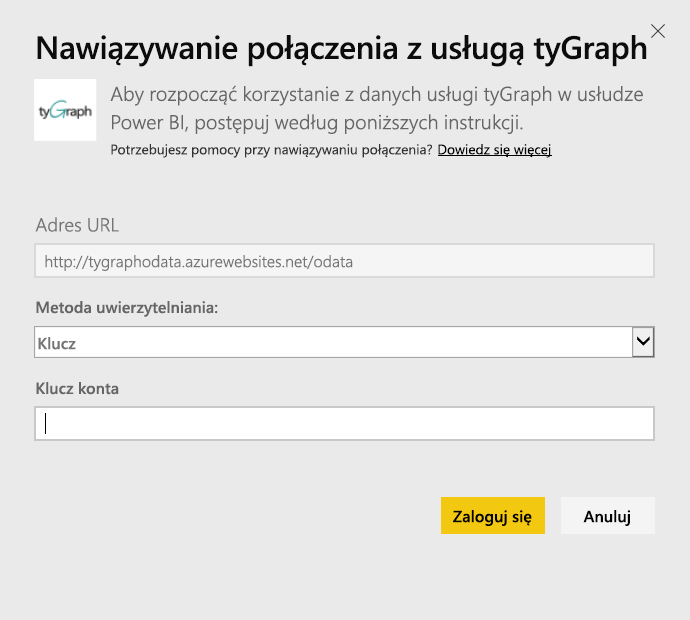

# Nawiązywanie połączenie z usługą tyGraph przy użyciu usługi Power BI
Za pomocą pakietu zawartości dla usługi Power BI można wizualizować i eksplorować dane usługi tyGraph. Najpierw połącz się z kontem tyGraph i załaduj pulpit nawigacyjny, raporty i zestaw danych. Gotowa zawartość obejmuje takie informacje, jak miara aktywnego zaangażowania (wartość MAE) i najaktywniejsi współautorzy. Wyświetlaną zawartość można dostosować, aby wyróżnić najbardziej interesujące informacje.  Dane będą odświeżane automatycznie zgodnie z ustawionym harmonogramem.

Połącz się z [usługą tyGraph dla usługi Power BI](https://app.powerbi.com/getdata/services/tygraph).

## Jak nawiązać połączenie
1. Wybierz pozycję **Pobierz dane** w dolnej części okienka nawigacji po lewej stronie.
   
   
2. W polu **Usługi** wybierz pozycję **Pobierz**.
   
   
3. Wybierz pozycję **tyGraph** \> **Pobierz**.
   
   
4. Określ przedział i grupy, z którymi chcesz nawiązać połączenie, lub wybierz opcję „Wszystko”, aby wyświetlić wszystkie dane. Zwróć uwagę na oczekiwany format daty — RRRR/MM/DD. Poniżej znajdują się szczegółowe informacje dotyczące [wyszukiwania tych parametrów](#FindingParams).
   
   
5. Aby nawiązać połączenie, podaj klucz usługi tyGraph. Poniżej znajdują się szczegółowe informacje dotyczące uzyskiwania tej wartości.
   
    **Jeśli jesteś zweryfikowanym administratorem usługi Yammer**  
    Po pomyślnym utworzeniu konta tyGraph klucz interfejsu API jest wysyłany w wiadomości e-mail. Jeśli nie możesz znaleźć klucza, poproś o nowy, wysyłając wiadomość e-mail na adres support@unlimitedviz.com. Jeśli nie masz jeszcze konta usługi tyGraph, możesz rozpocząć korzystanie z wersji próbnej na stronie [http://www.tygraph.com/](http://www.tygraph.com/). 
   
    **Jeśli nie jesteś zweryfikowanym administratorem usługi Yammer**
   
    Pakiet zawartości tyGraph wymaga konta tyGraph utworzonego przez zweryfikowanego administratora usługi Yammer. Po utworzeniu konta dla użytkowników w tej samej organizacji mogą zostać wystawione dodatkowe klucze. Jeśli zweryfikowany administrator nie utworzył jeszcze konta tyGraph, poproś go o utworzenie konta. Jeśli konto zostało utworzone, możesz poprosić o klucz, wysyłając wiadomość e-mail na adres <mailto:support@unlimitedviz.com>.
   
    
6. Po pomyślnym uwierzytelnieniu proces importowania rozpocznie się automatycznie. Po zakończeniu tego procesu w okienku nawigacji zostaną wyświetlone nowy pulpit nawigacyjny, raport i model. Wybierz pulpit nawigacyjny, aby wyświetlić zaimportowane dane.
   
    

**Co teraz?**

* Spróbuj [zadać pytanie w polu funkcji Pytania i odpowiedzi](power-bi-q-and-a.md) w górnej części pulpitu nawigacyjnego
* [Zmień kafelki](service-dashboard-edit-tile.md) na pulpicie nawigacyjnym.
* [Wybierz kafelek](service-dashboard-tiles.md), aby otworzyć raport źródłowy.
* Zestaw danych zostanie ustawiony na codzienne odświeżanie, ale możesz zmienić harmonogram odświeżania lub spróbować odświeżyć go na żądanie przy użyciu opcji **Odśwież teraz**

## Znajdowanie parametrów
Możesz wyświetlić dane wszystkich grup, do których masz dostęp, lub wskazać ich podzbiór. Możesz również utworzyć podzestaw danych oparty na datach. Za pomocą wielu pulpitów nawigacyjnych tyGraph można monitorować określone zestawy grup i/lub dat. Szczegóły dotyczące tych parametrów można znaleźć poniżej.

**Grupy**

Za pomocą interfejsu API usługi tyGraph można filtrować dane według określonego identyfikatora grupy. Identyfikatory są dostępne w postaci listy rozdzielanej przecinkami. 

    Example: 2427647,946595,1154464

Identyfikator konkretnej grupy w usłudze Yammer można zidentyfikować, przechodząc do źródła danych tej grupy i sprawdzając adres URL.

W powyższym przykładzie identyfikator grupy usługi Yammer to 4054844.

**Od daty**

Parametr Od daty pozwala wskazać najwcześniejszą wartość w zwracanych danych. Do pakietu zawartości będą ładowane tylko dane utworzone w tym dniu lub później. Format parametru Od daty to RRRR/MM/DD. 

    Example: 2013/10/29

W powyższym przykładzie do pakietu zawartości zostaną załadowane wszystkie dane z 29 października 2013 r. oraz dane utworzone później. 

**Do daty** Parametr Do daty pozwala wskazać najpóźniejszą wartość w zwracanych danych. Można go używać razem z parametrem Od daty do ładowania danych z zakresu dat. Do pakietu zawartości będą ładowane tylko dane utworzone w tym dniu lub wcześniej. Format parametru Do daty to RRRR/MM/DD. 

    Example: 2014/10/20

W powyższym przykładzie do pakietu zawartości zostaną załadowane wszystkie dane z 20 października 2014 r. oraz dane utworzone wcześniej. 

## Następne kroki
[Wprowadzenie do usługi Power BI](service-get-started.md)

[Pobieranie danych w usłudze Power BI](service-get-data.md)

