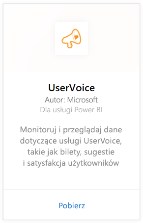
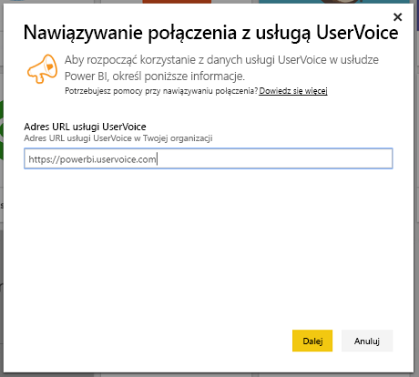
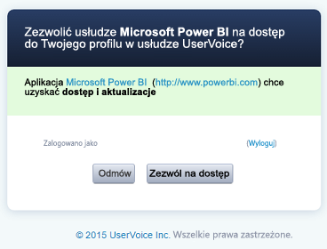
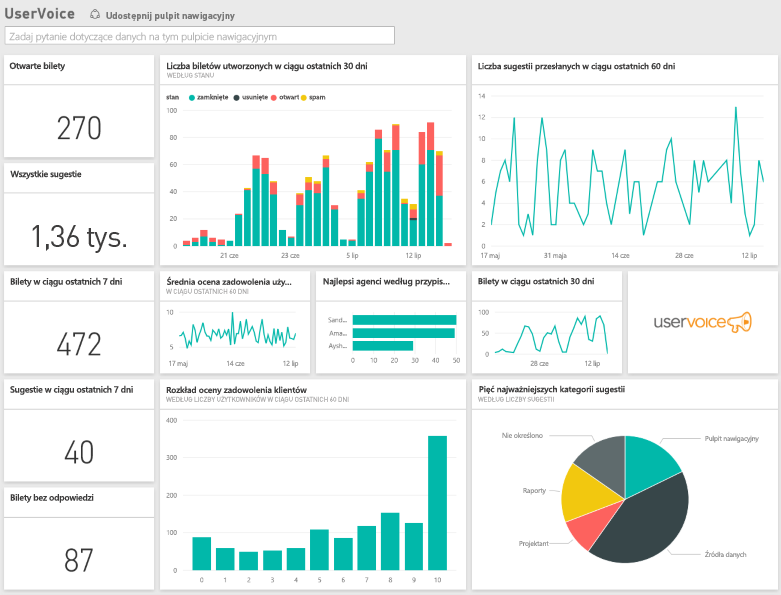

# Nawiązywanie połączenia z usługą UserVoice przy użyciu usługi Power BI
Przy użyciu usługi Power BI i pakietu zawartości UserVoice można łatwo śledzić i eksplorować dane w usłudze UserVoice. Usługa Power BI pobiera dane, w tym zgłoszenia, sugestie i oceny zadowolenia, a następnie na ich podstawie tworzy gotowy pulpit nawigacyjny i raporty.

Połącz się z [pakietem zawartości UserVoice](https://app.powerbi.com/getdata/services/uservoice) dla usługi Power BI.

>[!NOTE]
>Aby nawiązać połączenie z pakietem zawartości usługi Power BI, wymagane jest konto administratora. Ponadto pakiet zawartości korzysta z interfejsu API usługi UserVoice, co powoduje użycie wywołań interfejsu API ograniczonych limitem. Szczegółowe informacje można znaleźć poniżej.

## Jak nawiązać połączenie
1. Wybierz pozycję **Pobierz dane** w dolnej części okienka nawigacji po lewej stronie.
   
   
2. W polu **Usługi** wybierz pozycję **Pobierz**.
   
    
3. Wybierz pozycję **UserVoice**, a następnie **Pobierz**.
   
   
4. Po wyświetleniu monitu wprowadź adres URL usługi UserVoice. Adres URL musi mieć postać https://fabrikam.uservoice.com, przy czym część „fabrikam” zastąp nazwą swojego produktu lub usługi.
   
   >[!NOTE]
   >Adres nie zawiera końcowego ukośnika, a połączenie jest nawiązywane za pośrednictwem protokołu **https**.
   
   
5. Po wyświetleniu monitu wprowadź swoje poświadczenia usługi UserVoice i postępuj zgodnie z procedurą uwierzytelniania w usłudze UserVoice. Jeśli już wcześniej zalogowano się w usłudze UserVoice w przeglądarce, monit o poświadczenia może nie zostać wyświetlony. Aby przyznać aplikacji Power BI dostęp do danych, kliknij pozycję „Zezwól na dostęp”.
   
   >[!NOTE]
   >Musisz mieć poświadczenia administratora usługi UserVoice.
   
   
6. Usługa Power BI pobierze dane usługi UserVoice i automatycznie utworzy gotowy do użycia pulpit nawigacyjny i raport. Usługa Power BI pobiera następujące dane: wszystkie sugestie, otwarte zgłoszenia, oceny zadowolenia użytkowników oraz zgłoszenia utworzone w ciągu ostatnich 30 dni, w tym zamknięte zgłoszenia.
   
   

**Co teraz?**

* Spróbuj [zadać pytanie w polu funkcji Pytania i odpowiedzi](power-bi-q-and-a.md) w górnej części pulpitu nawigacyjnego
* [Zmień kafelki](service-dashboard-edit-tile.md) na pulpicie nawigacyjnym.
* [Wybierz kafelek](service-dashboard-tiles.md), aby otworzyć raport źródłowy.
* Zestaw danych zostanie ustawiony na codzienne odświeżanie, ale możesz zmienić harmonogram odświeżania lub spróbować odświeżyć go na żądanie przy użyciu opcji **Odśwież teraz**

## Rozwiązywanie problemów
**„Walidacja parametru nie powiodła się, upewnij się, że wszystkie parametry są prawidłowe”**

Jeśli po wpisaniu adresu URL usługi UserVoice pojawi się ten komunikat o błędzie, Upewnij się, że są spełnione następujące wymagania:

* Adres URL jest zgodny ze wzorcem „https://fabrikam.uservoice.com”. Część „fabrikam” należy zastąpić poprawnym prefiksem adresu URL usługi UserVoice.
* Upewnij się, że wszystkie litery są małymi literami.
* Adres URL musi zaczynać się od **https**.
* Na końcu adresu URL nie może znajdować się ukośnik.

**„Logowanie nie powiodło się”**

Jeśli po zalogowaniu się przy użyciu poświadczeń usługi UserVoice otrzymasz komunikat o błędzie „Logowanie nie powiodło się”, oznacza to, że konto, którego używasz, nie ma uprawnień do pobierania danych usługi UserVoice. Sprawdź, czy jest to konto administratora, i spróbuj ponownie.

**„Niestety wystąpił błąd”**

Jeśli podczas ładowania danych pojawi się ten komunikat o błędzie, upewnij się, że na używanym koncie usługi UserVoice nie przekroczono miesięcznego limitu przydziału użycia interfejsów API. Jeśli nie przekroczono limitu, spróbuj ponownie nawiązać połączenie. Jeśli problem będzie się powtarzać, skontaktuj się z pomocą techniczną usługi Power BI na stronie [https://community.powerbi.com](https://community.powerbi.com/).

**Inne problemy**  

Pobieranie danych przez pakiet zawartości UserVoice dla usługi Power BI powoduje zużycie wywołań interfejsu API usługi UserVoice. Należy monitorować użycie interfejsu API, aby nie przekroczyć limitu. Jeśli na koncie usługi UserVoice masz dużo danych, możesz zminimalizować użycie interfejsu API, zmieniając częstotliwość odświeżania z wartości domyślnej — raz dziennie — na opcję odświeżania tylko w dni robocze lub co drugi dzień, w zależności od potrzeb. Inne rozwiązanie polega na utworzeniu pakietu zawartości przez jednego z administratorów i udostępnieniu tego pakietu pozostałym członkom zespołu. Pozwala to uniknąć tworzenia pakietów przez wszystkich administratorów w organizacji, co powodowałoby niepotrzebne obciążenie interfejsów API.

## Następne kroki
[Wprowadzenie do usługi Power BI](service-get-started.md)

[Pobieranie danych w usłudze Power BI](service-get-data.md)

