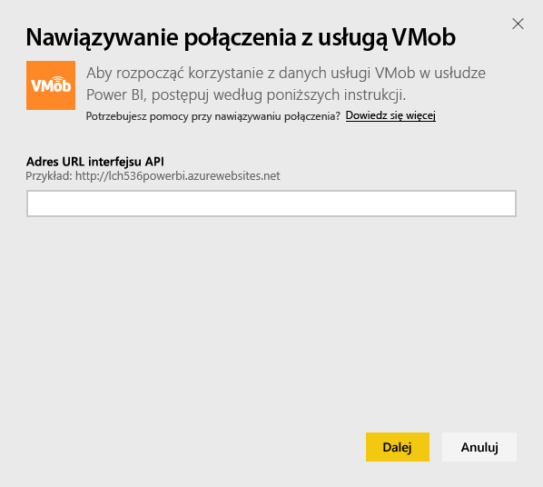

# Łączenie się z pakietem zawartości VMob przy użyciu usługi Power BI
Przy użyciu usługi Power BI i pakietu zawartości VMob można łatwo śledzić i eksplorować dane w usłudze VMob. Usługa Power BI pobiera następujące dane: statystyki użytkowników dla wszystkich okresów łącznie i za ostatnie 30 dni, wskaźnik KPI dotyczący sprzedaży detalicznej za ostatnie 30 dni oraz wydajność kampanii za okres ostatnich 30 dni.

Połącz się z [pakietem zawartości VMob](https://app.powerbi.com/getdata/services/vmob) dla usługi Power BI.

## Jak nawiązać połączenie
1. Wybierz pozycję **Pobierz dane** w dolnej części okienka nawigacji po lewej stronie.
   
    
2. W polu **Usługi** wybierz pozycję **Pobierz**.
   
   
3. Wybierz pozycję **VMob** \> **Pobierz**.
   
   
4. Po wyświetleniu monitu podaj adres URL usługi VMob, a następnie kliknij przycisk Dalej. Ten adres URL jest dostarczany przez usługę VMob oddzielnie.
   
    
5. Z listy rozwijanej metod uwierzytelniania wybierz opcję **Podstawowa**, wprowadź nazwę użytkownika oraz hasło usługi VMob i kliknij przycisk **Zaloguj**.
   
    
6. Proces importowania rozpocznie się automatycznie, a usługa Power BI pobierze dane usługi VMob, aby utworzyć gotowy do użycia pulpit nawigacyjny i raport.
   
   

**Co teraz?**

* Spróbuj [zadać pytanie w polu funkcji Pytania i odpowiedzi](power-bi-q-and-a.md) w górnej części pulpitu nawigacyjnego
* [Zmień kafelki](service-dashboard-edit-tile.md) na pulpicie nawigacyjnym.
* [Wybierz kafelek](service-dashboard-tiles.md), aby otworzyć raport źródłowy.
* Zestaw danych zostanie ustawiony na codzienne odświeżanie, ale możesz zmienić harmonogram odświeżania lub spróbować odświeżyć go na żądanie przy użyciu opcji **Odśwież teraz**

## Następne kroki
[Wprowadzenie do usługi Power BI](service-get-started.md)

[Pobieranie danych w usłudze Power BI](service-get-data.md)

