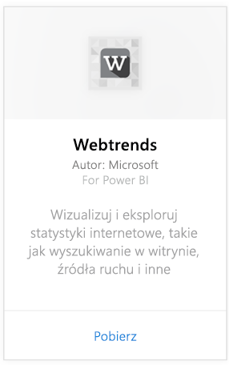
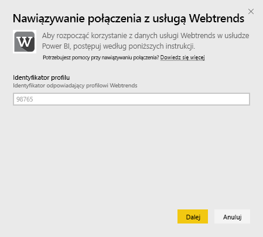
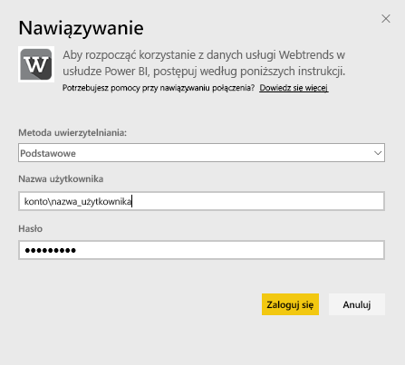
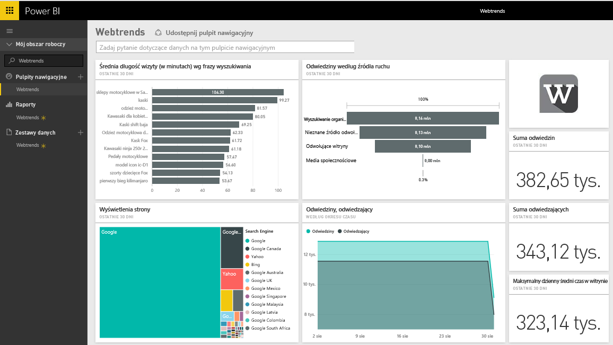
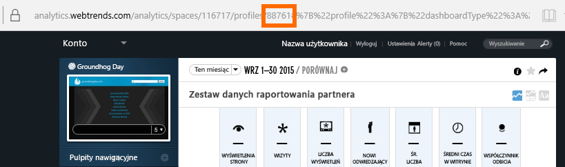
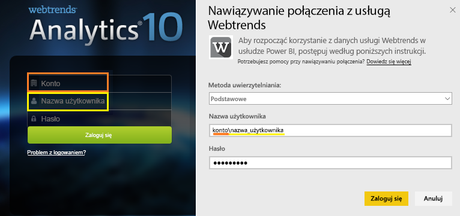

# Łączenie się z rozwiązaniem Webtrends za pomocą usługi Power BI
Pakiet zawartości rozwiązania Webtrends dla usługi Power BI zawiera wiele gotowych metryk, takich jak łączna liczba wyświetleń strony i wizyty według źródła ruchu. Wizualizacja danych rozwiązania Webtrends w usłudze Power BI rozpoczyna się od połączenia z kontem rozwiązania Webtrends. Możesz użyć dostarczonego pulpitu nawigacyjnego i raportów lub dostosować je, aby wyróżnić najważniejsze informacje.  Dane będą odświeżane automatycznie raz dziennie.

Połącz się z [pakietem zawartości rozwiązania Webtrends dla usługi Power BI.](https://app.powerbi.com/getdata/services/webtrends)

## Jak nawiązać połączenie
1. Wybierz pozycję **Pobierz dane** w dolnej części okienka nawigacji po lewej stronie.
   
   
2. W polu **Usługi** wybierz pozycję **Pobierz**.
   
   
3. Wybierz kolejno opcje **Webtrends** \> **Pobierz**.
   
   
4. Pakiet zawartości łączy się z konkretnym identyfikatorem profilu rozwiązania Webtrends. Poniżej znajdują się szczegółowe informacje dotyczące [wyszukiwania tego parametru](#FindingParams).
   
   
5. Wprowadź poświadczenia rozwiązania Webtrends, aby nawiązać połączenie. Pamiętaj, że pole z nazwą użytkownika należy uzupełnić nazwą konta i nazwą użytkownika. [Szczegółowe informacje](#FindingParams) można znaleźć poniżej.
   
   
6. Po zatwierdzeniu proces importowania rozpocznie się automatycznie. Po zakończeniu nowy pulpit nawigacyjny, raport i model zostaną wyświetlone w okienku nawigacji. Wybierz pulpit nawigacyjny, aby wyświetlić zaimportowane dane.
   
   

**Co teraz?**

* Spróbuj [zadać pytanie w polu funkcji Pytania i odpowiedzi](consumer/end-user-q-and-a.md) w górnej części pulpitu nawigacyjnego
* [Zmień kafelki](service-dashboard-edit-tile.md) na pulpicie nawigacyjnym.
* [Wybierz kafelek](consumer/end-user-tiles.md), aby otworzyć raport źródłowy.
* Dla zestawu danych jest zaplanowane codzienne odświeżanie, ale możesz zmienić harmonogram odświeżania lub odświeżyć go na żądanie przy użyciu polecenia **Odśwież teraz**

## Zawartość pakietu

Pakiet zawartości rozwiązania Webtrends uzyskuje dane z następujących raportów:  

| Nazwa raportu | Identyfikator raportu |
| --- | --- |
| Kluczowe metryki | |
| Wyszukiwania lokalne |34awBVEP0P6 |
| Strony końcowe |7FshY8eP0P6 |
| Następne strony |CTd5rpeP0P6 |
| Poprzednie strony |aSdOeaUgnP6 |
| Strony witryny |oOEWQj3sUo6 |
| Kliknięcia reklam w witrynie |41df19b6d9f |
| Miasta |aUuHskcP0P6 |
| Kraje |JHWXJNcP0P6 |
| Odwiedzający |xPcmTDDP0P6 |
| Czas trwania wizyty |U5KAyqdP0P6 |
| Wyszukiwane frazy |IKYEDxIP0P6 |
| Źródła ruchu |JmttAoIP0P6 |
| Wyszukiwarki |yGz3gAGP0P6 |
| Strony początkowe |i6LrkNVRUo6 |

>[!NOTE]
>W przypadku profilów programu SharePoint nazwy metryk mogą się nieco różnić od tego, co pokazano w opcjach interfejsu użytkownika rozwiązania Webtrends. Następujące mapowanie wykonano, aby zachować spójność pomiędzy profilami programu SharePoint a profilami internetowymi:   

    - Sesje = wizyty  
    - Nowi użytkownicy = Nowi odwiedzający  
    - Wyświetlenia na sesję = Wyświetlenia strony na wizytę  
    - Średni czas wizyty użytkownika = Średni czas w witrynie na odwiedzającego  

## Wymagania systemowe
Ten pakiet zawartości wymaga dostępu do profilu rozwiązania Webtrends z włączonym [właściwym zestawem raportów](#Included).

## Znajdowanie parametrów
Identyfikator profilu rozwiązania Webtrends można znaleźć w adresie URL po wybraniu profilu:

Poświadczenia są takie same jak te wprowadzane podczas logowania w rozwiązaniu Webtrends. Jednak nazwa konta i nazwa użytkownika powinny znajdować się w jednym wierszu i być oddzielone lewym ukośnikiem:

## Rozwiązywanie problemów
Po wprowadzeniu poświadczeń podczas ładowania pakietu zawartości może wystąpić problem. Jeśli zobaczysz komunikat „Niestety” podczas ładowania, zapoznaj się z możliwymi sposobami rozwiązywania problemów przedstawionymi poniżej. Jeśli problemy nadal występują, wypełnij zgłoszenie do pomocy technicznej na stronie https://support.powerbi.com

1. Używany jest prawidłowy identyfikator profilu — zapoznaj się z artykułem [Znajdowanie parametrów](#FindingParams), aby uzyskać szczegółowe informacje.
2. Użytkownik ma dostęp do raportów wymienionych w sekcji [„Zawartość pakietu”](#Included).

## Następne kroki
[Co to jest usługa Power BI?](power-bi-overview.md)

[Power BI — podstawowe pojęcia](consumer/end-user-basic-concepts.md)

