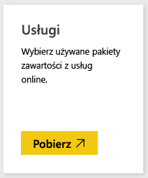
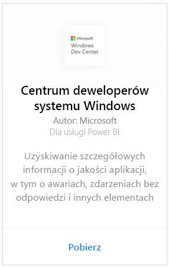
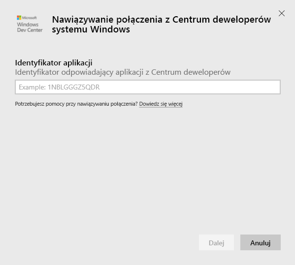
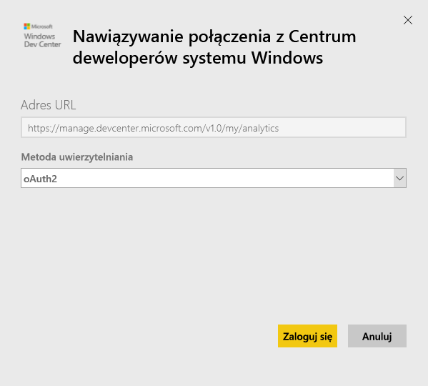
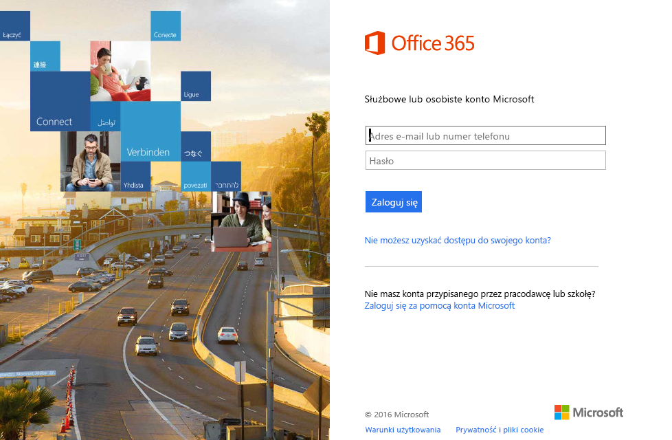
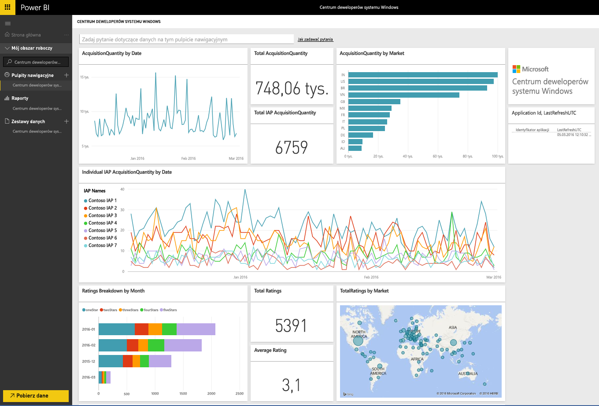
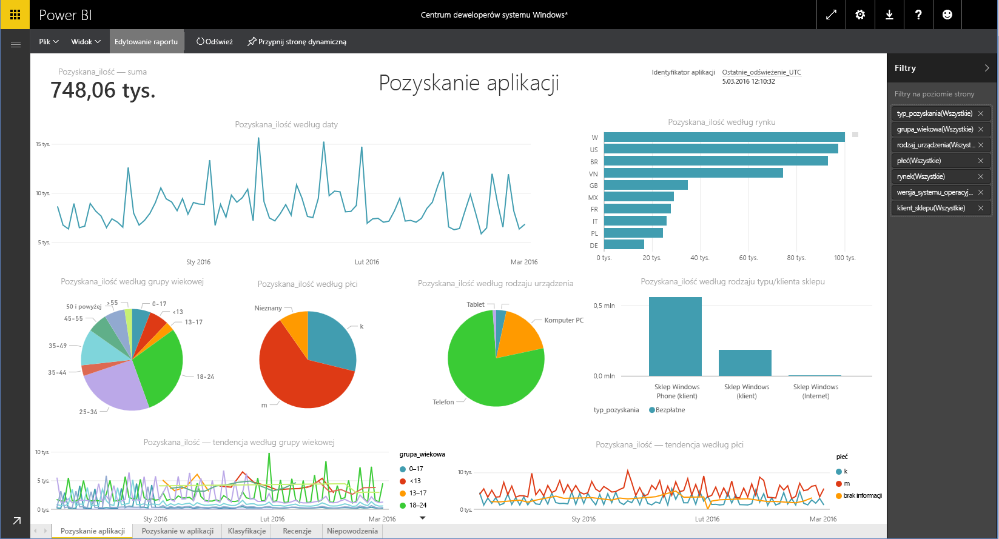

# Nawiązywanie połączenia z Centrum deweloperów systemu Windows przy użyciu usługi Power BI
Eksploruj i monitoruj dane analiz aplikacji Centrum deweloperów systemu Windows w usłudze Power BI przy użyciu pakietu zawartości Power BI. Dane będą odświeżane automatycznie raz dziennie.

Nawiąż połączenie z [pakietem zawartości Centrum deweloperów systemu Windows](https://app.powerbi.com/getdata/services/devcenter) dla usługi Power BI.

## Jak nawiązać połączenie
1. Wybierz pozycję **Pobierz dane** w dolnej części okienka nawigacji po lewej stronie.
   
   
2. W polu **Usługi** wybierz pozycję **Pobierz**.
   
   
3. Wybierz pozycję **Centrum deweloperów systemu Windows** \>  **Pobierz**.
   
   
4. Wprowadź identyfikator posiadanej aplikacji i kliknij przycisk Dalej. Poniżej znajdują się szczegółowe informacje dotyczące [wyszukiwania tych parametrów](#FindingParams).
   
   
5. Jako **metodę uwierzytelniania** wybierz opcję **oAuth2** \> **Zaloguj**. Po wyświetleniu monitu wprowadź poświadczenia usługi Azure Active Directory skojarzone z kontem Centrum deweloperów systemu Windows (więcej informacji znajduje się w sekcji [Wymagania systemowe](#Requirements)).
   
    
   
    
6. Po zatwierdzeniu proces importowania rozpocznie się automatycznie. Po zakończeniu tego procesu w okienku nawigacji zostaną wyświetlone nowy pulpit nawigacyjny, raport i model. Wybierz pulpit nawigacyjny, aby wyświetlić zaimportowane dane, a następnie wybierz kafelek, aby przejść do raportów źródłowych.
   
    
   
    

**Co teraz?**

* Spróbuj [zadać pytanie w polu funkcji Pytania i odpowiedzi](power-bi-q-and-a.md) w górnej części pulpitu nawigacyjnego
* [Zmień kafelki](service-dashboard-edit-tile.md) na pulpicie nawigacyjnym.
* [Wybierz kafelek](service-dashboard-tiles.md), aby otworzyć raport źródłowy.
* Zestaw danych zostanie ustawiony na codzienne odświeżanie, ale możesz zmienić harmonogram odświeżania lub spróbować odświeżyć go na żądanie przy użyciu opcji **Odśwież teraz**

## Zawartość pakietu
Pakiet zawartości Centrum deweloperów dla usługi Power BI zawiera dane analityczne dotyczące aplikacji oraz nabyć IAP, klasyfikacji, recenzji i kondycji aplikacji. Dane są ograniczone do ostatnich 3 miesięcy. oraz jest to okno ruchome, więc uwzględnione daty będą aktualizowane podczas odświeżania zestawu danych.

## Wymagania systemowe
Ten pakiet zawartości wymaga co najmniej jednej aplikacji opublikowanej w Sklepie Windows oraz konta Centrum deweloperów systemu Windows (więcej informacji znajduje się [tutaj](https://msdn.microsoft.com/windows/uwp/publish/manage-account-users)).

## Znajdowanie parametrów
Identyfikator aplikacji można znaleźć na stronie tożsamości aplikacji w sekcji Zarządzanie aplikacjami.

Identyfikator aplikacji znajduje się na końcu adresu URL w Sklepie Windows 10, https://www.microsoft.com/store/apps/ **{applicationId}**

## Następne kroki
[Wprowadzenie do usługi Power BI](service-get-started.md)

[Pobieranie danych w usłudze Power BI](service-get-data.md)

