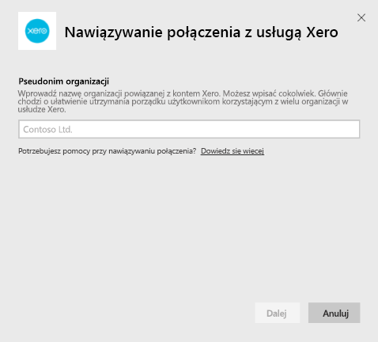
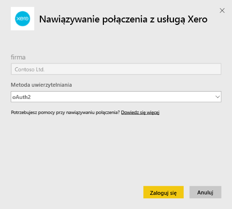
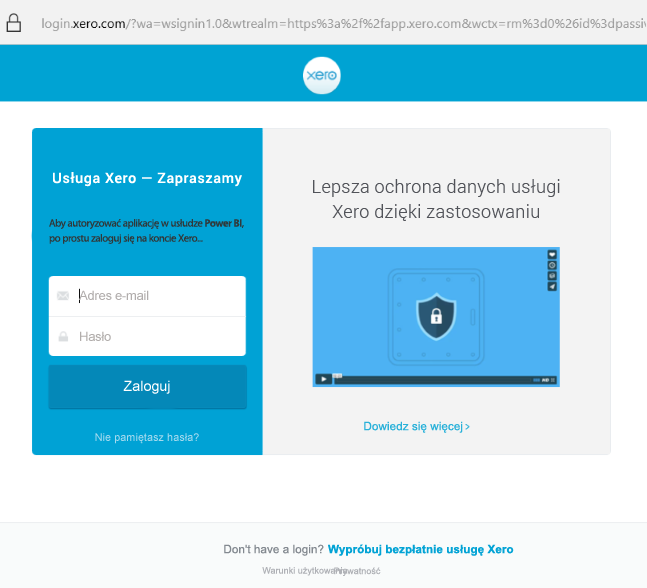
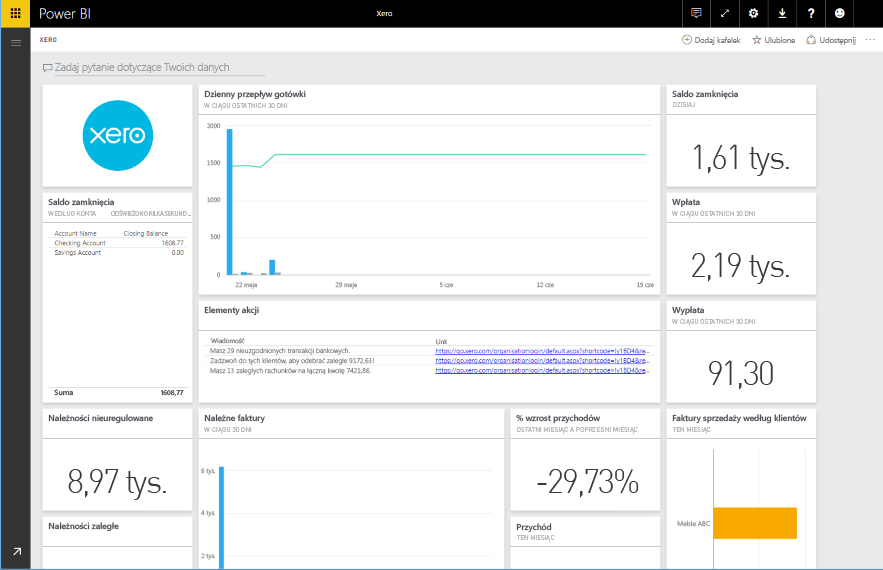

# Nawiązywanie połączenia z usługą Xero przy użyciu usługi Power BI
Xero to łatwe w użyciu oprogramowanie księgowe online, przeznaczone dla małych firm. Ten pakiet zawartości usługi Power BI pozwala tworzyć atrakcyjne wizualizacje, oparte na danych finansowych z usługi Xero. Domyślny pulpit nawigacyjny zawiera wiele metryk używanych przez małe firmy, takich jak stan środków pieniężnych, przychody i wydatki, rachunek zysków i strat, rotacja należności w dniach oraz zwrot z inwestycji.

Połącz się z [pakietem zawartości usługi Xero](https://app.powerbi.com/getdata/services/xero) dla usługi Power BI lub dowiedz się więcej na temat integracji usług [Xero i Power BI](https://help.xero.com/Power-BI).

## Jak nawiązać połączenie
1. Wybierz pozycję **Pobierz dane** w dolnej części okienka nawigacji po lewej stronie.
   
   
2. W polu **Usługi** wybierz pozycję **Pobierz**.
   
   
3. Wybierz pozycję **Xero** \> **Pobierz**.
   
   
4. Wprowadź nazwę organizacji skojarzonej z kontem Xero. Możesz wpisać cokolwiek, głównie chodzi o ułatwienie utrzymania porządku użytkownikom korzystającym z wielu organizacji w usłudze Xero. Szczegółowe informacje można znaleźć [poniżej](#FindingParams).
   
   
5. Jako **metodę uwierzytelniania** wybierz opcję **OAuth**. Gdy zostanie wyświetlony monit, zaloguj się do konta Xero i wybierz organizację, z którą chcesz się połączyć. Gdy to zrobisz, wybierz pozycję **Zaloguj się**, aby uruchomić proces ładowania.
   
    
   
    
6. Po zatwierdzeniu proces importowania rozpocznie się automatycznie. Po zakończeniu nowy pulpit nawigacyjny, raport i model zostaną wyświetlone w okienku nawigacji. Wybierz pulpit nawigacyjny, aby wyświetlić zaimportowane dane.
   
     

**Co teraz?**

* Spróbuj [zadać pytanie w polu funkcji Pytania i odpowiedzi](power-bi-q-and-a.md) w górnej części pulpitu nawigacyjnego
* [Zmień kafelki](service-dashboard-edit-tile.md) na pulpicie nawigacyjnym.
* [Wybierz kafelek](service-dashboard-tiles.md), aby otworzyć raport źródłowy.
* Zestaw danych zostanie ustawiony na codzienne odświeżanie, ale możesz zmienić harmonogram odświeżania lub spróbować odświeżyć go na żądanie przy użyciu opcji **Odśwież teraz**

## Zawartość pakietu
Pulpit nawigacyjny pakietu zawartości zawiera kafelki i metryki, które obejmują różne obszary, oraz odpowiednie raporty, umożliwiające uzyskanie dodatkowych informacji:  

| Obszar | Kafelki pulpitu nawigacyjnego | Raport |
| --- | --- | --- |
| Cash (Gotówka) |Daily cash flow (Dzienny przepływ gotówki)  Cash in (Wpłata)  Cash out (Wypłata)  Closing balance by account (Saldo zamknięcia według kont)  Closing balance today (Saldo zamknięcia dzisiaj) |Bank Accounts (Konta bankowe) |
| Customer (Klient) |Invoiced sales (Faktury sprzedaży)  Invoiced sales by customer (Faktury sprzedaży według klientów)  Invoiced sales growth trend (Tendencja wzrostowa zafakturowanej sprzedaży)  Invoices due (Należne faktury)  Outstanding receivables (Należności zaległe)  Overdue receivables (Należności przeterminowane) |Customer  Inventory (Spis klientów) |
| Supplier (Dostawca) |Billed purchases (Zafakturowane zakupy)  Billed purchases by supplier (Zafakturowane zakupy według dostawców)  Billed purchases growth trend (Tendencja wzrostowa zafakturowanych zakupów)   Bills due (Opłaty zaległe)  Outstanding payables (Zobowiązania zaległe)  Overdue payables (Zobowiązania przeterminowane) |Suppliers  Inventory (Spis dostawców) |
| Inventory (Magazyn) |Monthly sales amount by product (Sprzedaż miesięczna według produktów) |Inventory (Magazyn) |
| Profit and loss (Zyski i straty) |Monthly profit and loss (Zyski i straty w ujęciu miesięcznym)  Net profit this fiscal year (Zysk netto w bieżącym roku obrachunkowym)  Net profit this month (Zysk netto w bieżącym miesiącu)  Top expense accounts (Konta z największymi wydatkami) |Profit and loss (Zyski i straty) |
| Balance sheet (Arkusz bilansowy) |Total assets (Suma aktywów)  Total liabilities (Suma zobowiązań)  Equity (Kapitał) |Balance Sheet (Arkusz bilansowy) |
| Health (Kondycja) |Current ratio (Bieżący wskaźnik)  Gross profit percentage (Procent zysku brutto)   Return on total assets (Zwrot z sumy aktywów)  Total liabilities to equity ratio (Stosunek sumy zobowiązań do kapitału) |Health (Kondycja)  Glossary and Technical Notes (Słownik i uwagi techniczne) |

Zestaw danych zawiera również następujące tabele, umożliwiające dostosowywanie raportów i pulpitów nawigacyjnych:  

* Addresses (Adresy)  
* Alerts (Alerty)  
* Bank Statement Daily Balance (Saldo dzienne konta bankowego)  
* Bank Statements (Wyciągi bankowe)  
* Contacts (Kontakty)  
* Expense Claims (Oświadczenia dotyczące wydatków)  
* Invoice Line Items (Pozycje faktur)  
* Invoices (Faktury)  
* Items (Elementy)  
* Month End (Koniec miesiąca)  
* Organisation (Organizacja)  
* Trial Balance (Bilans próbny)  
* Xero Accounts (Konta Xero)

## Wymagania systemowe
Do uzyskania dostępu do pakietu zawartości Xero są wymagane następujące role: „Standardowa+Raporty" lub „Doradca”.

## Znajdowanie parametrów
Podaj nazwę swojej organizacji do śledzenia w usłudze Power BI. Umożliwia to nawiązanie połączenia z różnymi organizacjami. Zwróć uwagę, że nie można wielokrotnie połączyć się z tą samą organizacją ze względu na zaplanowane odświeżanie.   

## Rozwiązywanie problemów
* Aby użytkownicy usługi Xero mogli uzyskiwać dostęp do pakietu zawartości Xero dla usługi Power BI, muszą mieć przypisane następujące role: „Standardowa+Raporty" lub „Doradca”. Pakiet zawartości korzysta z uprawnień użytkowników do uzyskiwania dostępu do danych raportowania za pomocą usługi Power BI.  
* Jeśli podczas ładowania zostanie wyświetlony komunikat o błędzie, zwróć uwagę, po jakim czasie to nastąpiło. Pamiętaj, że token dostępu usługi Xero jest prawidłowy tylko przez 30 minut, dlatego ładowanie nie powiedzie się, jeśli w tym czasie nie uda się przesłać wszystkich danych. Aktywnie pracujemy nad rozwiązaniem tego problemu.
* Podczas ładowania kafelki na pulpicie nawigacyjnym zachowują ogólny wygląd. Nie należy oczekiwać zmiany wyglądu kafelków przed zakończeniem ładowania. Jeśli otrzymasz powiadomienie o zakończeniu ładowania, ale wygląd kafelków będzie wskazywał, że proces ten wciąż jest w toku, spróbuj odświeżyć kafelki pulpitu nawigacyjnego przy użyciu ikony ... widocznej w prawym górnym rogu pulpitu nawigacyjnego.
* Jeśli odświeżenie pakietu zawartości nie powiedzie się, sprawdź, czy w usłudze Power BI jest wiele połączeń z tą samą organizacją. Usługa Xero obsługuje tylko jedno aktywne połączenie z daną organizacją. Jeśli nawiążesz kilka takich połączeń, może pojawić się komunikat o błędzie informujący o tym, że poświadczenia są nieprawidłowe.  
* W przypadku problemów z połączeniem pakietu zawartości Xero dla usługi Power BI, takich jak komunikaty o błędach lub bardzo wolne ładowanie, wyczyść pamięć podręczną/pliki cookie i uruchom ponownie przeglądarkę, a następnie ponownie połącz się z usługą Power BI.  

W przypadku innych uporczywych problemów wyślij zgłoszenie do pomocy technicznej w witrynie http://support.powerbi.com.

## Następne kroki
[Wprowadzenie do usługi Power BI](service-get-started.md)

[Pobieranie danych w usłudze Power BI](service-get-data.md)

