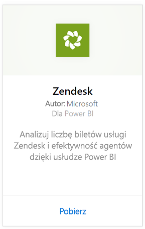
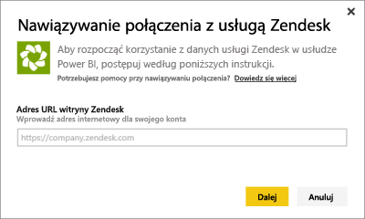
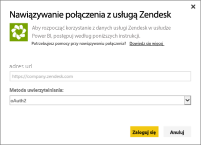
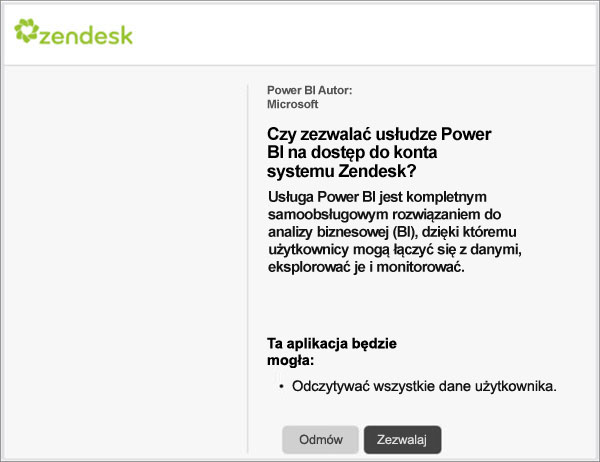
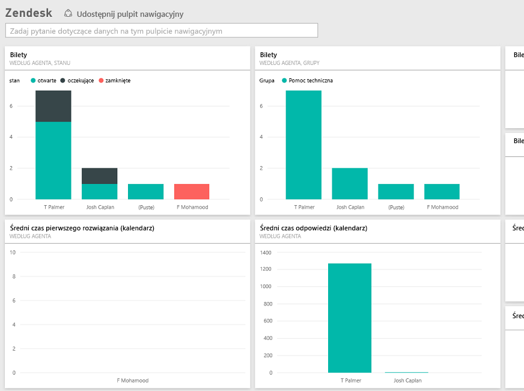

# Nawiązywanie połączenia z systemem Zendesk przy użyciu usługi Power BI
Pakiet zawartości Zendesk oferuje pulpit nawigacyjny usługi Power BI oraz zestaw raportów usługi Power BI zapewniających wgląd w informacje dotyczące liczby biletów i wydajności agentów. Możesz użyć dostarczonego pulpitu nawigacyjnego i raportów lub dostosować je, aby podkreślić najważniejsze informacje.  Dane będą odświeżane automatycznie raz dziennie. 

Połącz się z [pakietem zawartości Zendesk](https://app.powerbi.com/getdata/services/zendesk) lub dowiedz się więcej na temat [integracji systemu Zendesk](https://powerbi.microsoft.com/integrations/zendesk) z usługą Power BI.

>[!NOTE]
>Aby nawiązać połączenie, wymagane jest konto administratora systemu Zendesk. Więcej szczegółowych informacji na temat [wymagań](#Requirements) znajduje się poniżej.

## Jak nawiązać połączenie
1. Wybierz pozycję **Pobierz dane** w dolnej części okienka nawigacji po lewej stronie.
   
   
2. W polu **Usługi** wybierz pozycję **Pobierz**.
   
    
3. Wybierz pozycję **Zendesk** \> **Pobierz**.
   
   
4. Podaj adres URL skojarzony z kontem. Ma on postać **https://firma.zendesk.com**. Szczegółowe informacje dotyczące [znajdowania tych parametrów](#FindingParams) zostały podane poniżej.
   
   
5. Po wyświetleniu monitu wprowadź poświadczenia systemu Zendesk.  Wybierz opcję **oAuth 2** jako mechanizm uwierzytelniania i kliknij przycisk **Zaloguj**. Postępuj zgodnie z przepływem uwierzytelniania systemu Zendesk. (Jeśli już wcześniej zalogowano się w systemie Zendesk w przeglądarce, monit o poświadczenia może nie zostać wyświetlony).
   
   > [!NOTE]
   > Ten pakiet zawartości wymaga połączenia z kontem administratora systemu Zendesk. 
   > 
   > 
   
   
6. Kliknij opcję **Zezwalaj**, aby umożliwić usłudze Power BI uzyskiwanie dostępu do danych z systemu Zendesk.
   
   
7. Kliknij przycisk **Połącz**, aby rozpocząć proces importowania. Po zaimportowaniu danych przez usługę Power BI zobaczysz nowy pulpit nawigacyjny, raport i zestaw danych w okienku nawigacji po lewej stronie. Nowe elementy są oznaczone żółtą gwiazdką \*.
   
   

**Co teraz?**

* Spróbuj [zadać pytanie w polu funkcji Pytania i odpowiedzi](power-bi-q-and-a.md) w górnej części pulpitu nawigacyjnego
* [Zmień kafelki](service-dashboard-edit-tile.md) na pulpicie nawigacyjnym.
* [Wybierz kafelek](service-dashboard-tiles.md), aby otworzyć raport źródłowy.
* Zestaw danych zostanie ustawiony na codzienne odświeżanie, ale możesz zmienić harmonogram odświeżania lub spróbować odświeżyć go na żądanie przy użyciu opcji **Odśwież teraz**

## Zawartość pakietu
Pakiet zawartości Power BI obejmuje dane dotyczące następujących elementów:  

* Użytkownicy (użytkownicy końcowi i agenci)  
* Organizacje  
* Grupy  
* Bilety  

Istnieje również zestaw miar, które zostały obliczone, np. Średni czas oczekiwania oraz Bilety rozwiązane w ciągu ostatnich 7 dni. Pełna lista jest dołączona do pakietu zawartości.

## Wymagania systemowe
W celu uzyskania dostępu do pakietu zawartości Zendesk wymagane jest konto administratora systemu Zendesk. Jeśli jesteś agentem lub użytkownikiem końcowym zainteresowanym wyświetleniem danych systemu Zendesk, dodaj sugestię i sprawdź łącznik Zendesk w programie [Power BI Desktop](desktop-connect-to-data.md).

## Znajdowanie parametrów
Adres URL systemu Zendesk będzie taki sam, jak adres URL, którego używasz do logowania się do konta Zendesk. Jeśli nie masz pewności co do adresu URL systemu Zendesk, możesz skorzystać z [pomocy logowania](https://www.zendesk.com/login/) w systemie Zendesk.

## Rozwiązywanie problemów
Jeśli masz problemy z nawiązaniem połączenia, sprawdź adres URL systemu Zendesk i upewnij się, że korzystasz z konta administratora systemu Zendesk.

## Następne kroki
* [Wprowadzenie do usługi Power BI](service-get-started.md)
* [Pobieranie danych](service-get-data.md)

