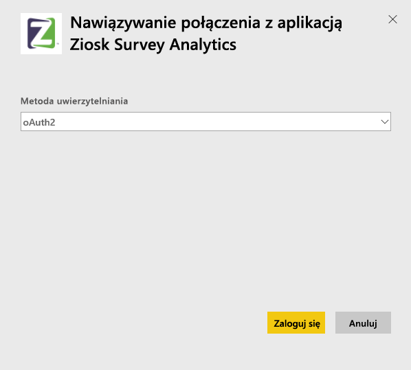

# Łączenie się z aplikacją Ziosk Survey Analytics za pomocą usługi Power BI
Pakiet zawartości Ziosk Survey Analytics dla usługi Power BI zapewnia restauracjom korzystającym z tabletów Ziosk szeroki dostęp do szczegółowych informacji dostarczanych w ramach danych ankietowych Ziosk, w tym na temat segmentacji według dnia, lokalizacji, pracownika i innych.

Połącz się z [zestawem zawartości Ziosk Survey Analytics](https://app.powerbi.com/getdata/services/ziosk-survey-analytics) dla usługi Power BI.

## Jak nawiązać połączenie
1. Wybierz pozycję **Pobierz dane** w dolnej części okienka nawigacji po lewej stronie.  
   
    
2. W polu **Usługi** wybierz pozycję **Pobierz**.  
   
    
3. Wybierz pozycję **Ziosk Survey Analytics**, a następnie wybierz pozycję **Pobierz**.  
   
    
4. Wybierz pozycję **OAuth 2**, a następnie pozycję **Zaloguj**. Po wyświetleniu monitu podaj poświadczenia Ziosk.
   
    
   
    
5. Po nawiązaniu połączenia automatycznie zostanie załadowany pulpit nawigacyjny, raport i zestaw danych. Po zakończeniu kafelki zostaną zaktualizowane o dane pochodzące z konta Ziosk.
   
    

**Co teraz?**

* Spróbuj [zadać pytanie w polu funkcji Pytania i odpowiedzi](power-bi-q-and-a.md) w górnej części pulpitu nawigacyjnego
* [Zmień kafelki](service-dashboard-edit-tile.md) na pulpicie nawigacyjnym.
* [Wybierz kafelek](service-dashboard-tiles.md), aby otworzyć raport źródłowy.
* Zestaw danych zostanie ustawiony na codzienne odświeżanie, ale możesz zmienić harmonogram odświeżania lub spróbować odświeżyć go na żądanie przy użyciu opcji **Odśwież teraz**

## Zawartość pakietu
Pakiet zawartości obejmuje dane z następujących tabel:  

    - Kategoria alkoholu  
    - Kategoria przystawek  
    - Słowa kluczowe komentarza  
    - Data  
    - Pora dnia  
    - Kategoria deserów  
    - Dowolny kształt  
    - Kategoria dla dzieci  
    - Wiadomości  
    - Kategoria zawartości premium  
    - Pytanie  
    - Sklep  
    - Ankiety  
    - Dzień tygodnia  

## Wymagania systemowe
Aby utworzyć wystąpienia tego pakietu zawartości, wymagane jest konto Ziosk z uprawnieniami do powyższych tabel.

## Następne kroki
[Wprowadzenie do usługi Power BI](service-get-started.md)

[Power BI — podstawowe pojęcia](service-basic-concepts.md)

