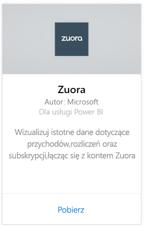
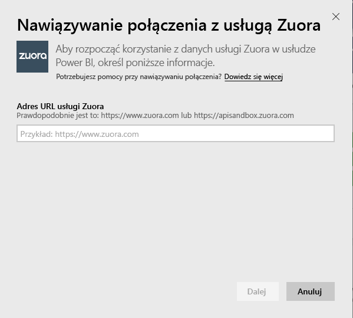
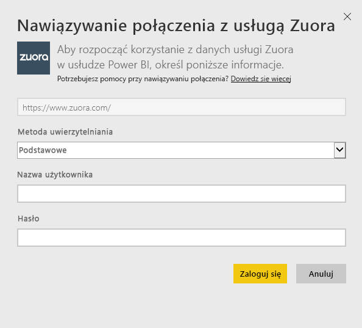
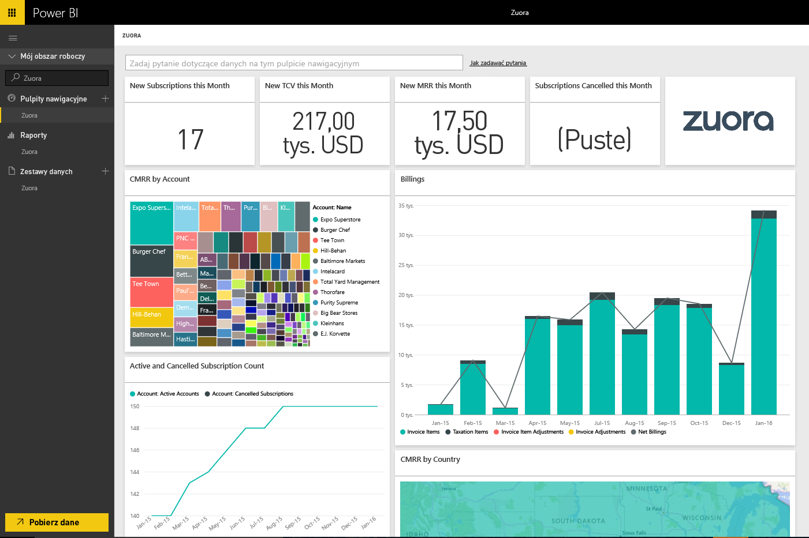

# Nawiązywanie połączenia z usługą Zuora przy użyciu usługi Power BI
Usługa Zuora dla usługi Power BI pozwala wizualizować ważne informacje dotyczące przychodów, rozliczeń i subskrypcji. Za pomocą domyślnego pulpitu nawigacyjnego i raportów można analizować trendy użycia, śledzić rozliczenia i płatności oraz monitorować przychody cykliczne. Pulpit nawigacyjny można również dostosować do własnych potrzeb związanych z raportowaniem.

Połącz się z usługą [Zuora](https://app.powerbi.com/getdata/services/Zuora) dla usługi Power BI.

## Jak nawiązać połączenie
1. Wybierz pozycję **Pobierz dane** w dolnej części okienka nawigacji po lewej stronie.

   
2. W polu **Usługi** wybierz pozycję **Pobierz**.

   
3. Wybierz pozycję **Zuora** \> **Pobierz**.

   
4. Podaj adres URL usługi Zuora. Zwykle adres URL to „<https://www.zuora.com>”. Poniżej znajdują się szczegółowe informacje dotyczące [znajdowania tych parametrów](#FindingParams).

   
5. W polu **Metoda uwierzytelniania** wybierz opcję **Podstawowa**, podaj nazwę użytkownika i hasło (z rozróżnianiem wielkości liter), a następnie wybierz pozycję **Zaloguj**.

    
6. Po zatwierdzeniu proces importowania rozpocznie się automatycznie. Po zakończeniu nowy pulpit nawigacyjny, raport i model zostaną wyświetlone w okienku nawigacji. Wybierz pulpit nawigacyjny, aby wyświetlić zaimportowane dane.

     

**Co teraz?**

* Spróbuj [zadać pytanie w polu funkcji Pytania i odpowiedzi](consumer/end-user-q-and-a.md) w górnej części pulpitu nawigacyjnego
* [Zmień kafelki](service-dashboard-edit-tile.md) na pulpicie nawigacyjnym.
* [Wybierz kafelek](consumer/end-user-tiles.md), aby otworzyć raport źródłowy.
* Dla zestawu danych jest zaplanowane codzienne odświeżanie, ale możesz zmienić harmonogram odświeżania lub odświeżyć go na żądanie przy użyciu polecenia **Odśwież teraz**

## Zawartość pakietu
Pakiet zawartości umożliwia pobieranie poniższych tabel przy użyciu interfejsu API Zuora AQUA:

| Tabele |  |  |
| --- | --- | --- |
| Account |InvoiceItemAdjustment |Refund |
| AccountingCode |Payment |RevenueSchedule |
| AccountingPeriod |PaymentMethod |RevenueScheduleItem |
| BillTo |Product |Subscription |
| DateDim |ProductRatePlan |TaxationItem |
| Invoice |ProductRatePlanCharge |Usage |
| InvoiceAdjustment |RatePlan | |
| InvoiceItem |RatePlanCharge | |

Pakiet zawartości udostępnia również następujące miary obliczeniowe:

| Miara | Opis | Obliczenia przykładowe |
| --- | --- | --- |
| Konto: Płatności |Łączna kwota płatności w danym okresie na podstawie daty płatności. |SUM (Payment.Amount)  WHERE Payment.EffectiveDate =< TimePeriod.EndDate AND    Payment.EffectiveDate >= TimePeriod.StartDate |
| Konto: Zwroty |Łączna kwota zwrotów w danym okresie na podstawie daty zwrotu. Kwota jest podawana jako liczba ujemna. |-1*SUM(Refund.Amount) WHERE Refund.RefundDate =< TimePeriod.EndDate AND    Refund.RefundDate >= TimePeriod.StartDate |
| Konto: Płatności netto |Płatności oraz zwroty na koncie w danym okresie. |Account.Payments + Account.Refunds |
| Konto: Aktywne konta |Liczba kont, które były aktywne w danym okresie. Rozpoczęcie korzystania z subskrypcji musi przypadać przed datą początkową tego okresu (lub w dzień odpowiadający tej dacie). |COUNT (Account.AccountNumber) WHERE     Subscription.Status != "Expired" AND    Subscription.Status != "Draft" AND    Subscription.SubscriptionStartDate <= TimePeriod.StartDate AND    (Subscription.SubscriptionEndDate > TimePeriod.StartDate OR Subscription.SubscriptionEndDate = null) –evergreen subscription |
| Konto: Średni przychód cykliczny |Miesięczny przychód cykliczny brutto na aktywnym koncie w danym okresie. |Miesięczny przychód cykliczny brutto / Account.ActiveAccounts |
| Konto: Anulowane subskrypcje |Liczba kont, na których anulowano subskrypcję w danym okresie. |COUNT (Account.AccountNumber) WHERE Subscription.Status = "Cancelled" AND    Subscription.SubscriptionStartDate <= TimePeriod.StartDate AND    Subscription.CancelledDate >= TimePeriod.StartDate |
| Konto: Błędy płatności |Łączna wartość błędów płatności. |SUM (Payment.Amount) WHERE Payment.Status = "Error" |
| Element planu przychodów: Ujęty przychód |Łączny ujęty przychód w okresie księgowym. |SUM (RevenueScheduleItem.Amount) WHERE AccountingPeriod.StartDate = TimePeriod.StartDate |
| Subskrypcja: Nowe subskrypcje |Liczba nowych subskrypcji w danym okresie. |COUNT (Subscription.ID) WHERE Subscription.Version = "1" AND    Subscription.CreatedDate <= TimePeriod.EndDate AND    Subscription.CreatedDate >= TimePeriod.StartDate |
| Faktura: Invoice Items |Łączna kwota opłat za pozycje faktur w danym okresie. |SUM (InvoiceItem.ChargeAmount) WHERE     Invoice.Status = "Posted" AND    Invoice.InvoiceDate <= TimePeriod.EndDate AND    Invoice.InvoiceDate >= TimePeriod.StartDate |
| Faktura: Taxation Items |Łączna kwota pozycji podatku w danym okresie. |SUM (TaxationItem.TaxAmount) WHERE Invoice.Status = "Posted" AND    Invoice.InvoiceDate <= TimePeriod.EndDate AND    Invoice.InvoiceDate >= TimePeriod.StartDate |
| Faktura: Invoice Item Adjustments |Łączna kwota korekt pozycji faktur w danym okresie. |SUM (InvoiceItemAdjustment.Amount)  WHERE     Invoice.Status = "Posted" AND    InvoiceItemAdjustment.AdjustmentDate <= TimePeriod.EndDate AND    InvoiceItemAdjustment.AdjustmentDate >= TimePeriod.StartDate |
| Faktura: Invoice Adjustments |Łączna kwota korekt faktur w danym okresie. |SUM (InvoiceAdjustment.Amount)  WHERE     Invoice.Status = "Posted" AND    InvoiceAdjustment.AdjustmentDate <= TimePeriod.EndDate AND    InvoiceAdjustment.AdjustmentDate >= TimePeriod.StartDate |
| Faktura: Net Billings |Suma pozycji faktur, pozycji podatku, korekt pozycji faktur i korekt faktur w danym okresie. |Invoice.InvoiceItems + Invoice.TaxationItems + Invoice.InvoiceItemAdjustments + Invoice.InvoiceAdjustments |
| Faktura: Saldo zaległości faktur |Suma zaksięgowanych sald faktur. |SUM (Invoice.Balance)  WHERE     Invoice.Status = "Posted" |
| Faktura: Rozliczenia brutto |Suma opłat za pozycje zaksięgowanych faktur w danym okresie. |SUM (InvoiceItem.ChargeAmount)  WHERE     Invoice.Status = "Posted" AND    Invoice.InvoiceDate <= TimePeriod.EndDate AND    Invoice.InvoiceDate >= TimePeriod.StartDate |
| Faktura: Suma korekt |Suma przetworzonych korekt faktur i korekt pozycji faktur skojarzonych z zaksięgowanymi fakturami. |SUM (InvoiceAdjustment.Amount)  WHERE     Invoice.Status = "Posted" AND    InvoiceAdjustment.Status = "Processed" + SUM (InvoiceItemAdjustment.Amount)  WHERE     Invoice.Status = "Posted" AND    invoiceItemAdjustment.Status = "Processed" |
| Opłata za plan taryfowy: Miesięczny przychód cykliczny brutto |Łączny miesięczny przychód cykliczny z subskrypcji w danym okresie. |SUM (RatePlanCharge.MRR)  WHERE     Subscription.Status != "Expired" AND    Subscription.Status != "Draft" AND    RatePlanCharge.EffectiveStartDate <= TimePeriod.StartDate AND        RatePlanCharge.EffectiveEndDate > TimePeriod.StartDate     OR    RatePlanCharge.EffectiveEndDate = null --evergreen subscription |

## Wymagania systemowe
Wymagany jest dostęp do interfejsu API Zuora.

## Znajdowanie parametrów
Podaj adres URL, którego zwykle używasz do uzyskania dostępu do danych usługi Zuora. Prawidłowe opcje to:  

* https://www.zuora.com  
* Adres URL odpowiadający wystąpieniu usługi  

## Rozwiązywanie problemów
Pakiet zawartości Zuora umożliwia pobieranie wielu różnych informacji z konta Zuora. W przypadku niekorzystania z pewnych funkcji odpowiednie kafelki lub raporty są puste. Jeśli podczas ładowania wystąpią problemy, skontaktuj się z pomocą techniczną usługi Power BI.

## Następne kroki
[Wprowadzenie do usługi Power BI](service-get-started.md)

[Pobieranie danych w usłudze Power BI](service-get-data.md)
