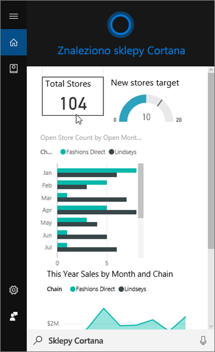
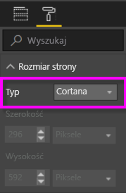
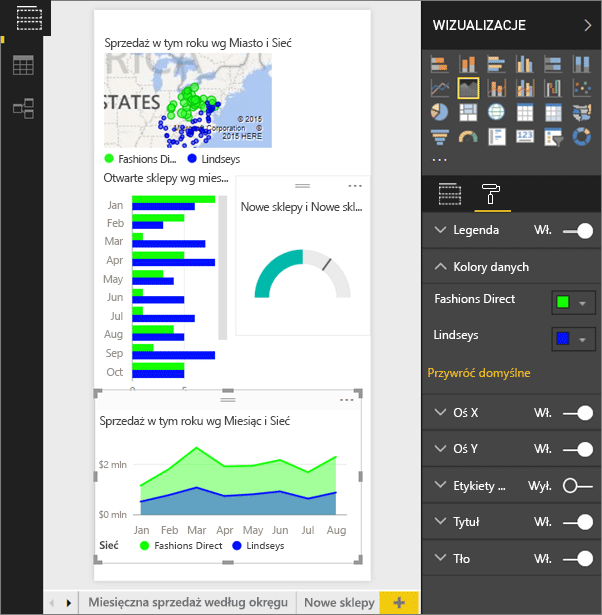
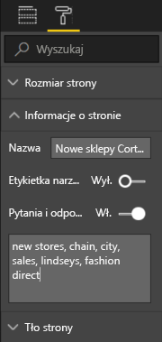
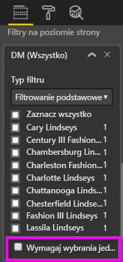

# Tworzenie niestandardowej strony odpowiedzi dla Cortany przy użyciu usługi Power BI lub programu Power BI Desktop
Korzystaj z pełnego zestawu funkcji usługi Power BI, aby tworzyć specjalne strony raportu, nazywane *stronami odpowiedzi Cortany* (a czasami „kartami odpowiedzi Cortany”), przeznaczone specjalnie do odpowiadania na pytania Cortany.

> [!IMPORTANT]
> Jeśli sprawdzasz wersję zapoznawczą Cortany i **pulpitu nawigacyjnego** usługi Power BI, możesz pominąć resztę tego artykułu. Nie ma wymagań dotyczących instalacji dla Cortany, aby mogła wyszukiwać pulpity nawigacyjne usługi Power BI.
> 
> 

## Zanim rozpoczniesz
Dostępne są 4 dokumenty, które przeprowadzą Cię przez proces konfigurowania Cortany dla usługi Power BI i korzystania z niej. Zalecamy zacząć od przeczytania artykułu 1, jeśli jeszcze nie znasz jego treści. Natomiast artykuł 2 jest szczególnie ważny, ponieważ opisuje pewne czynności, które należy wykonać, zanim będzie można zacząć korzystać ze stron odpowiedzi Cortany.

**Artykuł 1**: [dowiedz się, jak Cortana współpracuje z usługą Power BI](service-cortana-intro.md)

**Artykuł 2**: [aby wyszukiwać raporty usługi Power BI: włączanie integracji Cortany, usługi Power BI i systemu Windows](service-cortana-enable.md)

**Artykuł 3**: ten artykuł

**Artykuł 4**: [rozwiązywanie problemów](service-cortana-troubleshoot.md)

## Tworzenie strony odpowiedzi Cortany zaprojektowanej specjalnie z myślą o Cortanie
*Strona odpowiedzi Cortany* w raporcie ma rozmiar dopasowany specjalnie dla Cortany, aby można ją było wyświetlać na ekranie jako odpowiedź na pytanie.  Aby utworzyć stronę odpowiedzi dla Cortany:

1. Zalecamy, aby zacząć od [pustej strony raportu](power-bi-report-add-page.md).
2. W okienku **Wizualizacje** wybierz ikonę wałka malarskiego i wybierz pozycję **Rozmiar strony > Typ > Cortana**.
   
    
3. Utwórz wizualizację lub zbiór wizualizacji, które mają być wyświetlane w Cortanie jako odpowiedź na określone pytanie (lub zestaw pytań).
4. Upewnij się, że wszystkie wizualizacje mieszczą się w granicach strony.  Opcjonalnie zmodyfikuj ustawienia wyświetlania, etykiety danych, kolory i tła.  
   
    
5. Wpisz nazwę strony i dodaj nazwy alternatywne.  Cortana używa tych nazw podczas wyszukiwania wyników. W okienku **Wizualizacje** wybierz ikonę pędzla malarskiego i wybierz pozycję **Informacje o stronie**. Włącz funkcję pytań i odpowiedzi dla tej wizualizacji, przesuwając suwak na pozycję **Włączone**.
   
    
   
   > [!TIP]
   > Aby zwiększyć dokładność wyników, unikaj używania wyrazów, które są także nazwami kolumn.
   > 
   > 
6. Opcjonalnie, jeśli raport zawiera filtry na poziomie strony, przydatne może być ustawienie opcji **Wymagaj wybrania jednej pozycji**. Cortana wyświetli ten raport jako odpowiedź tylko wtedy, gdy jeden, i tylko jeden, z elementów filtru zostanie określony w pytaniu. Opcję **Wymagaj wybrania jednej pozycji** można znaleźć u dołu okienka **Filtry**.
   
   > [!NOTE]
   > Nie trzeba ustawiać opcji **Wymagaj wybrania jednej pozycji**, aby poprosić Cortanę o wyświetlenie raportu z filtrami na poziomie strony.  Na przykład pytanie „pokaż sprzedaż dla Charlotte Lindseys” spowoduje wyświetlenie strony odpowiedzi niezależnie od ustawienia Wymagaj wybrania jednej pozycji.
   > 
   > 
   
     
   
      Jeśli na przykład zapytasz Cortanę:
   
   * „pokaż sprzedaż według nazwy sklepu”, ta strona odpowiedzi nie zostanie wyświetlona, ponieważ nie dołączono żadnych elementów w wymaganym filtrze na poziomie strony.
   * „pokaż sprzedaż dla Cary Lindseys i Charlotte Lindseys”, ta strona odpowiedzi nie zostanie wyświetlona, ponieważ określono więcej niż jeden element z wymaganego filtru na poziomie strony.
   * „pokaż sprzedaż dla Charlotte Lindseys”, ta strona odpowiedzi zostanie wyświetlona.
     
     = „pokaż sprzedaż”, ta strona odpowiedzi nie zostanie wyświetlona, ponieważ nie dołączono żadnych elementów w wymaganym filtrze na poziomie strony.

> [!IMPORTANT]
> Zanim Cortana będzie mogła uzyskiwać dostęp do strony odpowiedzi, trzeba [włączyć zestaw danych dla Cortany](service-cortana-enable.md).
> 
> 

## Jak Cortana porządkuje wyniki?
Wyniki z wysoko ocenianymi odpowiedziami (np. pełne dopasowanie nazwy określonej strony) będą wyświetlane na początku jako *najlepsze dopasowanie* w Cortanie. Jeśli usługa Power BI zawiera wiele stron odpowiedzi Cortany, może zostać wyświetlonych wiele najlepszych dopasowań. Odpowiedzi z oceną średnią lub niską, takie jak odpowiedzi nie oparte na nazwie strony odpowiedzi lub pytania zawierające wyrazy nierozpoznawane przez usługę Power BI, zostaną wymienione jako linki poniżej najlepszych dopasować w Cortanie.

> [!NOTE]
> Gdy nowy zestaw danych lub niestandardowa strona odpowiedzi Cortany zostaną dodane do usługi Power BI i udostępnione Cortanie, oczekiwanie na pojawienie się wyników w Cortanie może potrwać do 30 minut. Wylogowanie się i ponowne zalogowanie w systemie Windows 10 lub ponowne uruchomienie procesu Cortany w systemie Windows 10 w inny sposób spowoduje natychmiastowe wyświetlenie nowej zawartości.
> 
> 

## Następne kroki
[Używanie Cortany z usługą Power BI](service-cortana-intro.md)

Cortana nadal nie działa z usługą Power BI?  Spróbuj wykonać kroki [narzędzia do rozwiązywania problemów z Cortaną](service-cortana-troubleshoot.md).

Masz więcej pytań? [Odwiedź społeczność usługi Power BI](http://community.powerbi.com/)

