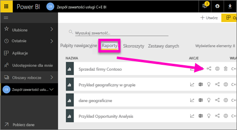
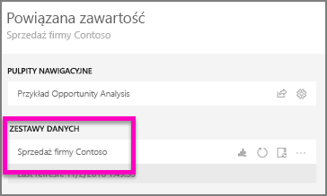
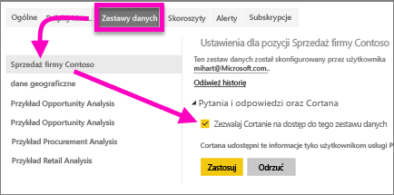
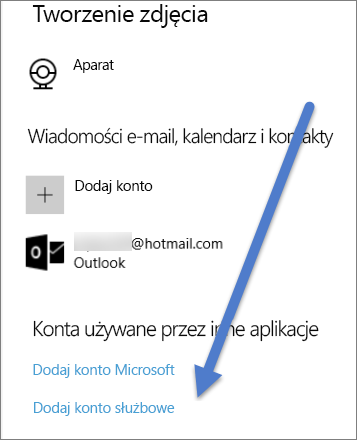

# Włączanie Cortany, aby uzyskać dostęp do raportów usługi Power BI (i ich źródłowych zestawów danych)
Znasz już [Wprowadzenie do Cortany i usługi Power BI](service-cortana-intro.md) (jeśli jeszcze tego nie znasz, może warto w pierwszej kolejności to przeczytać, a dopiero potem wrócić). A teraz chcesz wypróbować jej możliwości samodzielnie.  Zanim będzie można zadawać Cortanie pytania języka naturalnego i znajdować odpowiedzi w danych przechowywanych w ***raportach*** usługi Power BI, trzeba będzie spełnić kilka wymagań. W szczególności należy wykonać następujące czynności.

> [!NOTE]
> Jeśli sprawdzasz wersję zapoznawczą Cortany i ***pulpitu nawigacyjnego*** usługi Power BI, możesz pominąć resztę tego artykułu. Nie ma wymagań dotyczących instalacji dla Cortany, aby mogła wyszukiwać pulpity nawigacyjne usługi Power BI.
> 
> 

W usłudze Power BI

* włącz co najmniej jeden zestaw danych dla Cortany (raporty są tworzone na bazie zestawów danych, więc Cortana musi mieć dostęp do tych zestawów danych)

W systemie Microsoft Windows

* Sprawdź, czy korzystasz z systemu Windows 10 w wersji 1511 lub nowszej
* Upewnij się, że usługa Power BI i system Windows mogą „rozmawiać” ze sobą. Oznacza to połączenie Twojego konta z systemem Windows.

## Używanie usługi Power BI, aby umożliwić Cortanie dostęp do stron raportu w usłudze Power BI
Umożliwienie Cortanie dostępu do raportów w usłudze Power BI jest prostym procesem.  Rzeczywiście, wszystkim, co należy zrobić, jest włączenie źródłowego zestawu danych raportu, wybierając opcję „Zezwól Cortanie na dostęp do tego zestawu danych”. Następnie każdy użytkownik mający dostęp do zestawu danych w usłudze Power BI za pomocą normalnego udostępniania usługi Power BI, aplikacji i funkcji pakietu zawartości, będzie mógł uzyskać odpowiedzi z raportu w Cortanie w systemie Windows 10.

Musisz zalogować się do usługi Power BI (nie do programu Power BI Desktop) i powtórzyć te kroki dla każdego zestawu danych, do którego chcesz Cortanie umożliwić dostęp.

1. Określ, które zestawy danych udostępnić. Z listy zawartości raportu wybierz raport, do którego Cortana ma mieć dostęp, i wybierz ikonę **Wyświetl powiązane**  .
   
    
2. Zestawem danych skojarzonym z tym raportem jest **Sprzedaż firmy Contoso**.
   
    
3. Po prawej stronie nazwy zestawu danych wybierz pozycję **wielokropek (...) > Ustawienia**.  
   
    
4. Wybierz pozycję **Pytania i odpowiedzi i Cortana** > **Zezwalaj Cortanie na dostęp do tego zestawu danych** > **Zastosuj**.
   
   
   
   W tym przykładzie udostępniamy Cortanie zestaw danych o sprzedaży firmy Contoso.
   
   > [!NOTE]
   > Gdy nowy zestaw danych lub karta odpowiedzi Cortany zostaną dodane do usługi Power BI i udostępnione Cortanie, oczekiwanie na pojawienie się wyników może potrwać do 30 minut. Wylogowanie się i ponowne zalogowanie w systemie Windows 10 lub ponowne uruchomienie procesu Cortany w systemie Windows 10 w inny sposób spowoduje natychmiastowe wyświetlenie nowej zawartości.
   > 
   > Jeśli udostępnisz zestaw danych Cortanie i ten zestaw danych jest częścią należącego do Ciebie pakietu zawartości lub aplikacji, trzeba będzie ponownie go opublikować dla współpracowników, aby również oni mogli korzystać z niego za pomocą Cortany.
   > 
   > 

## Dodawanie poświadczeń usługi Power BI do systemu Windows
Musisz mieć uruchomiony system Windows 10 w wersji 1511 lub nowszej.

1. Określ, która wersja systemu Windows 10 jest uruchomiona. Otwórz pozycję **Ustawienia**.
    

    Następnie wybierz pozycję **System > Informacje**. W dolnej części ekranu zobaczysz pozycje **Specyfikacja systemu Windows > Wersja**

   * Jeśli masz system Windows 10 w wersji od 1511 (aktualizacja systemu Windows z 10 listopada 2015 r.) do 1607, dodaj swoje konto służbowe i konto Microsoft (wykonaj kroki 2 i 3 poniżej).
   * Jeśli masz system Windows 10 w wersji 1607 (aktualizacja systemu Windows z 10 lipca 2016 r.) lub nowszej, dodaj konto służbowe (wykonaj tylko krok 2 poniżej).
1. Dodaj swoje konto służbowe dla Cortany.
   
   * Otwórz pozycje **Ustawienia** > **Konta**.
     
       
   * Przewiń do dołu i wybierz pozycję **Dodaj konto służbowe**. Lub na stronie **Konta** wybierz pozycję **Uzyskaj dostęp do miejsca pracy lub nauki > Połącz**.
     
     

Cortana będzie używać tego konta służbowego do sprawdzania usługi Power BI pod kątem potencjalnych odpowiedzi na pytania w Cortanie.

## Następne kroki
[Tworzenie *kart odpowiedzi* Cortany w usłudze Power BI](service-cortana-answer-cards.md)

[Rozwiązywanie problemów integracji Cortany i usługi Power BI](service-cortana-troubleshoot.md)

Masz więcej pytań? [Odwiedź społeczność usługi Power BI](http://community.powerbi.com/)

