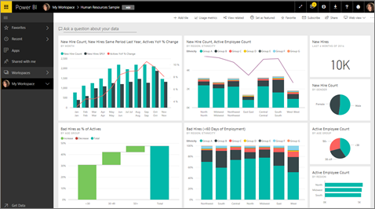
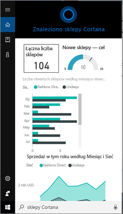

# Szybko znajduj i wyświetlaj dane usługi Power BI za pomocą Cortany dla usługi Power BI
Cortana zapewnia błyskawiczne odpowiedzi na ważne pytania biznesowe na wszystkich Twoich urządzeniach z systemem Windows 10. Dzięki integracji z usługą Power BI Cortana może pobierać kluczowe informacje bezpośrednio z pulpitów nawigacyjnych i raportów usługi Power BI. Potrzebny jest tylko system Windows 10 w wersji z listopada 2015 r. lub nowszej, Cortana, usługa Power BI i dostęp do co najmniej jednego zestawu danych.

## Wersja zapoznawcza nowego środowiska Cortany umożliwiającego przeszukiwanie *pulpitów nawigacyjnych* w systemie Windows 10
Od pewnego czasu można było [pobierać pewne typy stron raportów za pomocą Cortany](service-cortana-answer-cards.md). Teraz dodaliśmy **nowe środowisko**, które umożliwia pobieranie również pulpitów nawigacyjnych. Wypróbuj je i [prześlij nam swoją opinię](mailto:pbicortanasg@microsoft.com). W przyszłości *nowe środowisko* zostanie rozszerzone, aby umożliwić Cortanie przeszukiwanie także raportów.  Jedną z kluczowych zalet nowego środowiska jest to, że nie trzeba wykonywać żadnych specjalnych czynności, aby je skonfigurować — nie trzeba włączać Cortany ani konfigurować systemu Windows 10 — to środowisko po prostu działa.

> [!NOTE]
> Jeśli środowisko nie działa tak po prostu, zobacz [artykuł dotyczący rozwiązywania problemów](service-cortana-troubleshoot.md), aby uzyskać pomoc.
> 
> 

Podstawową używaną technologią jest usługa [Azure Search firmy Microsoft](). Ta usługa wyszukiwania zapewnia dodatkowe możliwości, takie jak inteligentna klasyfikacja, korekcja błędów i autouzupełnianie.

Obydwa środowiska Cortany będą istniały równocześnie.

## Dokumentacja Cortany dla usługi Power BI
Dostępne są 4 dokumenty, które przeprowadzą Cię przez proces konfigurowania Cortany dla usługi Power BI i korzystania z niej. Ta seria artykułów przeprowadzi użytkownika przez następujące kroki:

**Artykuł 1** (ten artykuł): Zapoznanie się ze sposobem, w jaki Cortana współpracuje z usługą Power BI

**Artykuł 2**: [Wyszukiwanie raportów usługi Power BI: Włączenie integracji Cortany, usługi Power BI i systemu Windows](service-cortana-enable.md)

**Artykuł 3**: [Wyszukiwanie raportów usługi Power BI: Tworzenie specjalnych *kart odpowiedzi Cortany*](service-cortana-answer-cards.md)

**Artykuł 4**: [rozwiązywanie problemów](service-cortana-troubleshoot.md)

## Jak Cortana współpracuje z usługą Power BI?
Jeśli zadasz Cortanie pytanie, może ona szukać odpowiedzi także w usłudze Power BI. W usłudze Power BI Cortana może znaleźć szczegółowe odpowiedzi oparte na danych w raportach usługi Power BI (zawierających specjalny typ strony raportu nazywany *kartą odpowiedzi Cortany*) i na pulpitach nawigacyjnych usługi Power BI.

Jeśli Cortana znajdzie zgodne dane, nazwa strony raportu lub pulpitu nawigacyjnego zostanie wyświetlona bezpośrednio na ekranie Cortany. Stronę raportu lub pulpit nawigacyjny można otworzyć w usłudze Power BI. Strony raportów można również przeglądać bezpośrednio w Cortanie — są one interaktywne.

### Cortana i pulpity nawigacyjne (*nowe środowisko*)
Cortana może wyszukiwać odpowiedzi na pulpitach nawigacyjnych, które należą do Ciebie, oraz tych, które zostały dla Ciebie udostępnione. Zadawaj Cortanie pytania, podając tytuły, słowa kluczowe, nazwy właścicieli, nazwy obszarów roboczych, nazwy aplikacji i inne informacje.

Pytanie musi zawierać co najmniej 2 słowa, aby Cortana znalazła odpowiedź. Dlatego w przypadku wyszukiwania pulpitu nawigacyjnego, który ma jednowyrazową nazwę (Marketing), dodaj do pytania wyrazy „show” (pokaż), „Power BI” lub „<owner name>”, na przykład „show Marketing” (pokaż pulpit Marketing) czy „michele hart sample” (przykład michele hart). 

Jeśli pulpit nawigacyjny ma tytuł zawierający więcej niż jeden wyraz, Cortana zwróci ten pulpit nawigacyjny tylko wtedy, gdy wyszukiwany termin będzie zgodny z co najmniej dwoma wyrazami lub gdy pulpit nawigacyjny będzie zgodny z jednym z wyrazów oraz nazwą właściciela. W przypadku pulpitu nawigacyjnego o nazwie „Customer Profitability Sample” (Przykład Rentowność klienta): 

* W przypadku pytania „show me customer” (pokaż klienta) pulpit nawigacyjny usługi Power BI *nie* zostanie zwrócony.   
* W przypadku pytań, takich jak „show me customer profitability” (pokaż rentowność klienta), „customer p” (rentowność k), „customer s” (przykład k), „profitability sample” (przykład rentowność), „michele hart sample” (przykład michele hart), „show customer profitability sample” (pokaż przykład rentowność klienta) i „show me customer p” (pokaż rentowność k) wynik usługi Power BI *zostanie* zwrócony.
* W przypadku dodania wyrazu „powerbi” będzie on traktowany jako jeden z 2 wymaganych wyrazów, więc po zadaniu pytania „powerbi sample” (przykład powerbi) *zostanie* zwrócony wynik usługi Power BI. 
  
    

### Cortana i raporty
 Cortana może znajdować odpowiedzi w raportach, które mają [strony zaprojektowane specjalnie z myślą o wyświetlaniu przez Cortanę](service-cortana-answer-cards.md). Wystarczy zadać pytanie zawierające tytuł lub słowa kluczowe z jednej z tych specjalnych stron raportu.  

Podstawową używaną technologią dla raportów jest funkcja [pytań i odpowiedzi usługi Microsoft Power BI](power-bi-q-and-a.md).

Po zadaniu pytania w Cortanie usługa Power BI udziela odpowiedzi, korzystając ze stron raportu zaprojektowanych specjalnie z myślą o Cortanie. Potencjalne odpowiedzi są określane przez Cortanę na bieżąco bezpośrednio z *kart odpowiedzi* Cortany, które zostały już utworzone w usłudze Power BI.  Aby dokładniej zbadać odpowiedź, wystarczy otworzyć wynik w usłudze Power BI.

> [!NOTE]
> Zanim Cortana będzie mogła szukać odpowiedzi w raportach usługi Power BI, musisz [włączyć tę funkcję za pomocą usługi Power BI i skonfigurować system Windows do komunikowania się z usługą Power BI](service-cortana-enable.md).  
> 
> 

## Uzyskiwanie odpowiedzi z usługi Power BI przy użyciu Cortany
1. Rozpocznij w Cortanie. Istnieje wiele różnych sposobów *otworzenia* Cortany: wybierz ikonę Cortany na pasku zadań (na obrazku poniżej), skorzystaj z poleceń głosowych lub naciśnij ikonę wyszukiwania na urządzeniu przenośnym z systemem Windows.
   
     
2. Gdy Cortana będzie gotowa, zadaj pytanie głosowo lub wpisz je w pasku wyszukiwania Cortany. Cortana wyświetli dostępne wyniki. Jeśli istnieje pulpit nawigacyjny usługi Power BI zgodny z pytaniem, zostanie on wyświetlony w obszarze **Najlepsze dopasowanie** lub **Power BI**.
   
     
   
   > [!NOTE]
   > Obecnie obsługiwany jest tylko język angielski.
   > 
   > 
3. Wybierz pulpit nawigacyjny, aby otworzyć go w Cortanie.

    

    Układ można zmienić, [edytując *widok dla telefonu* na pulpicie nawigacyjnym](service-create-dashboard-mobile-phone-view.md). 

1. Z poziomu Cortany można również korzystać z opcji otwierania pulpitu nawigacyjnego w usłudze Power BI lub usłudze Power BI dla urządzeń przenośnych. Otwórz pulpit nawigacyjny w usłudze Power BI, wybierając pozycję **Otwórz w Internecie**. 
   
      
4. Teraz za pomocą Cortany wyszukajmy raport. Musimy znać [raport, który ma stronę z kartą odpowiedzi Cortany](service-cortana-answer-cards.md). W tym przykładzie raport o nazwie „Cortana-New-Stores” (Cortana — nowe sklepy) ma stronę karty odpowiedzi Cortany o nazwie „cortana stores” (cortana — sklepy).  
   
     Zadaj pytanie głosowo lub wpisz je w pasku wyszukiwania Cortany. Cortana wyświetli dostępne wyniki. Jeśli istnieje strona raportu usługi Power BI zgodna z pytaniem, zostanie ona wyświetlona w obszarze **Najlepsze dopasowanie** lub **Power BI**. W tym przykładzie w obszarze **Dokumenty** jest również wyświetlany plik pbix (i jego kopia zapasowa) użyty do utworzenia karty odpowiedzi.
   
      
5. Wybierz stronę raportu **Cortana stores** (Cortana — sklepy) w celu wyświetlenia jej w oknie Cortany.
   
       
   
    Pamiętaj, że *karta odpowiedzi* jest specjalnym typem strony raportu usługi Power BI utworzonej przez właściciela zestawu danych.  Aby uzyskać więcej informacji, zobacz [Create a Cortana answer card (Tworzenie karty odpowiedzi Cortany)](service-cortana-answer-cards.md).
6. To jednak nie wszystko. Z wizualizacjami na karcie odpowiedzi możesz wchodzić w interakcje tak samo, jak w usłudze Power BI.
   
   * Na przykład wybierz element w jednej wizualizacji, aby filtrować krzyżowo i wyróżnić inne wizualizacje na karcie odpowiedzi.
     
     
   * Do filtrowania wyników możesz też użyć języka naturalnego.  Na przykład zadaj pytanie „Cortana stores for Lindseys” (Cortana — sklepy Lindseys), a karta zostanie odfiltrowana w celu wyświetlania tylko danych dotyczących sieci sklepów Lindseys.
     
     
7. Kontynuuj eksplorowanie. Przewiń na dół okna Cortany i wybierz pozycję **Otwórz w usłudze Power BI**.
   
     
8. Strona raportu zostanie otworzona w usłudze Power BI.    
     

## Zagadnienia i rozwiązywanie problemów
* Cortana nie będzie mieć dostępu do żadnych kart Cortany, dla których nie [włączono obsługi usługi Power BI](service-cortana-enable.md).
* Cortana nadal nie działa z usługą Power BI?  Spróbuj wykonać kroki [narzędzia do rozwiązywania problemów z Cortaną](service-cortana-troubleshoot.md).
* Cortana dla usługi Power BI jest obecnie dostępna tylko w języku angielskim.
* Cortana dla usługi Power BI jest dostępna tylko na urządzeniach przenośnych z systemem Windows.

Masz więcej pytań? [Odwiedź społeczność usługi Power BI](http://community.powerbi.com/)

## Następne kroki
[Włączanie integracji Cortany, usługi Power BI i systemu Windows na potrzeby raportów](service-cortana-enable.md)

