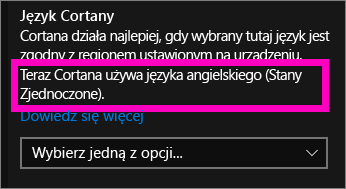
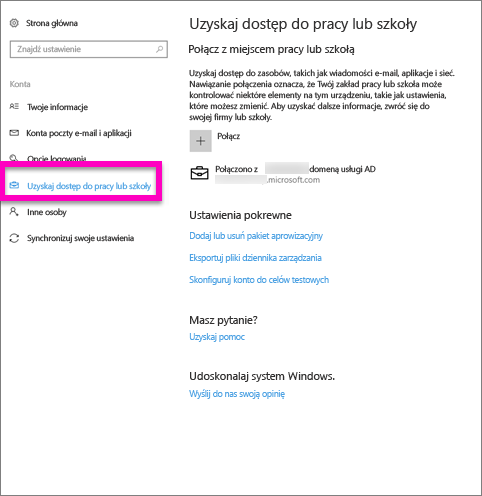
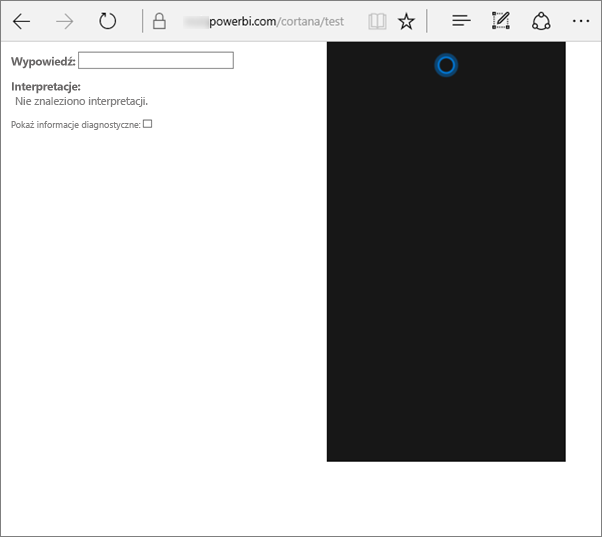
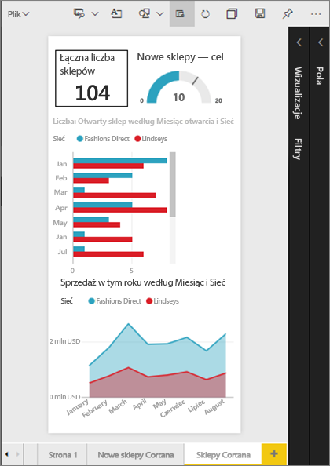
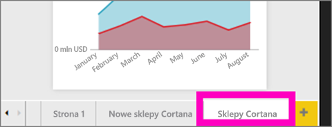
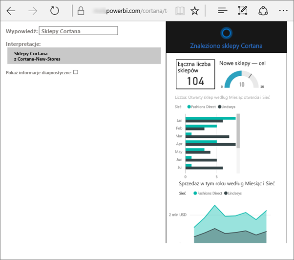
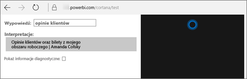

# Rozwiązywanie problemów z Cortaną dla usługi Power BI
Ten artykuł jest częścią serii. Jeśli jeszcze nie zostało to zrobione, zalecamy przeczytanie następujących trzech artykułów.

**Artykuł 1**: [Opis sposobu współpracy Cortany i usługi Power BI w celu wyszukiwania pulpitów nawigacyjnych i raportów usługi Power BI](service-cortana-intro.md)

**Artykuł 2**: [Wyszukiwanie raportów: włączanie integracji Cortana — usługa Power BI — system Windows](service-cortana-enable.md)

**Artykuł 3**: [Wyszukiwanie raportów: tworzenie specjalnych *kart odpowiedzi Cortany*](service-cortana-answer-cards.md)

Jeśli nadal masz problemy z integracją Cortany z usługą Power BI, jesteś w dobrym miejscu. Wykonaj poniższe kroki, aby zdiagnozować i rozwiązać problem.

## Dlaczego Cortana nie znajduje odpowiedzi na podstawie moich raportów i pulpitów nawigacyjnych usługi Power BI?
1. Czy masz konto usługi Power BI?  Jeśli nie, [zarejestruj się, aby uzyskać dostęp do bezpłatnej wersji próbnej](https://powerbi.microsoft.com/get-started/).
2. Czy Cortana działa?  Czy widzisz ikonę Cortana na pasku zadań?

    

    Po jej wybraniu, czy Cortana jest otwierana z polem, w którym możesz pisać?
3. Czy w wyszukiwaniu użyto przynajmniej 2 słów? Cortana musi mieć frazę zawierającą co najmniej 2 słowa, aby znaleźć odpowiedzi w usłudze Power BI. Spróbuj dodać „pokaż” na początku pytania.
4. Jeśli pulpit nawigacyjny ma tytuł zawierający więcej niż jeden wyraz, Cortana zwróci ten pulpit nawigacyjny tylko wtedy, gdy wyszukiwany termin będzie zgodny z co najmniej dwoma wyrazami. Dla pulpitu nawigacyjnego o nazwie „Sales FY16” (Sprzedaż za rok budżetowy 2016):

   * „show sales” (pokaż sprzedaż) *nie* zwróci wyniku usługi Power BI.   
   * „show me sales fy16” (pokaż mi sprzedaż fy16), „sales fy16” (sprzedaż fy16), „show sales fy16” (pokaż sprzedaż fy16) i „show me sales f” (pokaż mi sprzedaż f) *zwróci* wynik usługi Power BI.    
   * W przypadku dodania wyrazu „powerbi” będzie on traktowany jako jeden z 2 wymaganych wyrazów, więc po zadaniu pytania „powerbi sales” (sprzedaż powerbi) *zostanie* zwrócony wynik usługi Power BI.
5. Czy masz dostęp lub uprawnienia do edycji do jakichkolwiek raportów lub pulpitów nawigacyjnych? W przypadku raportów upewnij się, że zawartość, którą chcesz wyszukać, ma [kartę odpowiedzi](service-cortana-answer-cards.md).  W przypadku pulpitów nawigacyjnych upewnij się, że zawartość, którą chcesz wyszukać znajduje się w pozycji **Udostępnione mi**, obszarze roboczym aplikacji lub obszarze **Mój obszar roboczy**. [Użyj narzędzia do rozwiązywania problemów](#try-the-cortana-troubleshooting-tool), aby ułatwić zidentyfikowanie problemu.
6. Czy używasz urządzenia przenośnego?  Aktualnie obsługujemy tylko integrację usługi Power BI i Cortany na urządzeniach przenośnych z systemem Windows.
7. Czy Cortana jest skonfigurowana dla języka angielskiego?  Bieżąca integracja Cortany i usługi Power BI obsługuje tylko język angielski. Otwórz Cortanę i wybierz ikonę koła zębatego, aby wyświetlić ustawienia. Przewiń w dół do pozycji **Język Cortany** i upewnij się, że jest ustawiona jedna z opcji języka angielskiego.

   
8. Masz więcej niż 100 włączonych raportów w Cortanie?  Cortana przeszukuje tylko co najwyżej 100 raportów.  Aby upewnić się, że raport jest dołączony, przenieś lub skopiuj go do obszaru **Mój obszar roboczy**, ponieważ Cortana najpierw przeszukuje ten obszar.
9. Może wystarczy dać jej więcej czasu. Po pierwszym wpisaniu zapytania model może być *zimny*. Poczekaj kilka sekund, aby dane mogły zostać załadowane do pamięci, a następnie spróbuj ponownie.
10. W przypadku pulpitów nawigacyjnych może potrwać do 24 godzin zanim staną się dostępne dla Cortany.    
11. W przypadku raportów, gdy nowy zestaw danych lub niestandardowa karta odpowiedzi zostaną dodane do usługi Power BI i udostępnione Cortanie, oczekiwanie na pojawienie się wyników w Cortanie może potrwać do 30 minut. Wylogowanie się i ponowne zalogowanie w systemie Windows 10 lub ponowne uruchomienie procesu Cortany w systemie Windows 10 w inny sposób spowoduje natychmiastowe wyświetlenie nowej zawartości raportu.  
12. Administrator usługi Power BI może „zrezygnować”. Sprawdź u administratora, aby dowiedzieć się, czy tak się nie stało.

## Tylko raporty: dlaczego Cortana nie znajduje odpowiedzi na podstawie moich raportów usługi Power BI
1. Jeśli szukasz odpowiedzi w raportach, czy masz jakiekolwiek raporty z **kartami odpowiedzi** Cortany? Karty odpowiedzi są jedynym sposobem, w jaki Cortana może znaleźć odpowiedzi w Twoich raportach usługi Power BI.  Aby dowiedzieć się, jak utworzyć kartę odpowiedzi, przeczytaj [Tworzenie kart odpowiedzi Cortany w usłudze Power BI i programie Power BI Desktop](service-cortana-answer-cards.md).
2. Czy masz uruchomiony system Windows w wersji 1511 lub nowszej?  Dowiedz się, otwierając ustawienia systemu Windows i wybierając pozycje **System > Informacje**. Jeśli nie, zaktualizuj swoją wersję systemu Windows.
3. Czy konto systemu Windows i usługi Power BI są połączone? Może to być mylące. Postępuj zgodnie z instrukcjami podanymi w [Włączanie Cortany dla usługi Power BI](service-cortana-enable.md#add-your-power-bi-credentials-to-windows).
4. Czy podstawowe zestawy danych zostały włączone dla Cortany? Może współpracownik udostępnił zestaw danych, który został już włączony dla Cortany. Ale jeśli nie, [dowiedz się, jak samodzielnie włączyć zestawy danych dla Cortany](service-cortana-enable.md). Jest to szybkie i łatwe.

## Tylko pulpity nawigacyjne: dlaczego Cortana nie znajduje odpowiedzi na podstawie moich pulpitów nawigacyjnych usługi Power BI
1. Upewnij się, że masz połączenie z kontem służbowym. Usługa Power BI wymaga tego połączenia, aby mogła uwierzytelnić Twoje uprawnienia dostępu do danych. Aby sprawdzić, czy istnieje połączenie, lub jeśli nie, aby połączyć konto służbowe, użyj pola wyszukiwania systemu Windows w celu przejścia do pozycji „Połącz z miejscem pracy lub szkołą”.  

    
2. Czy masz dostęp do Cortany? Wybierz pole wyszukiwania systemu Windows i podaj uprawnienia dostępu Cortany do Twoich informacji.

## Próbowanie narzędzia do rozwiązywania problemów z Cortaną
Problemy nadal występują?  Teraz jest odpowiedni moment, aby uruchomić narzędzie rozwiązywania problemów Cortany i zawęzić możliwe problemy.

### Masz problem podczas pobierania odpowiedzi z raportu?
1. Dla raportów, przed uruchomieniem narzędzia rozwiązywania problemów, należy ustawić filtry **Poziomu strony** na kartach odpowiedzi Cortany na **Wymagaj wybrania jednej pozycji**. Aby uzyskać pomoc dotyczącą wykonania tej czynności, zobacz [Tworzenie kart odpowiedzi Cortany](service-cortana-answer-cards.md).
2. Otwórz narzędzie rozwiązywania problemów, dodając „/cortana/test” na końcu adresu URL usługi Power BI. Adres URL powinien wyglądać mniej więcej tak:

   app.powerbi.com/cortana/test

   
3. W polu **Wypowiedź**, w celu rozwiązania problemów z raportami, wpisz nazwę karty odpowiedzi Cortany ***dokładnie tak, jak wygląda ona na karcie usługi Power BI***.

   

    

   
4. Czasami, gdy po raz pierwszy wpiszesz coś w pole **Wypowiedź**, nic się nie dzieje. Pomyśl o tym, jak o napełnianiu systemu: przekazujesz narzędziu do rozwiązywania problemów wiedzę, że nadszedł czas, aby się włączyć. Wytnij i wklej lub ponownie wpisz w pole **Wypowiedź**. W tym przykładzie nazwa naszej karty odpowiedzi to **Cortana przechowuje**. Wklejając lub wpisując **Cortana przechowuje** do narzędzia, uzyskujesz jeden wynik, który jest wyświetlany w polu **Interpretacje**. Kliknij, aby zobaczyć kartę odpowiedzi wyświetlaną w oknie Cortany — w tym przypadku **Cortana przechowuje**.

   

   Ponieważ dostaliśmy wynik, teraz wiemy, że Cortana **jest** włączona w usłudze Power BI. Zawęża to problem do czegoś po stronie systemu Windows lub w ustawieniach języka Cortany, lub do włączenia więcej niż 100 zestawów danych dla Cortany.

### Masz problem podczas pobierania odpowiedzi z pulpitu nawigacyjnego?
Szukasz pulpitu nawigacyjnego, który został Ci udostępniony?  Otwórz usługę Power BI > **Udostępnione mi** i znajdź nazwę pulpitu nawigacyjnego.  Następnie wpisz tę nazwę w polu **Wypowiedzi**.

#### Znane problemy narzędzia rozwiązywania problemów
* Jeśli narzędzie nie pobierze wyników za pierwszym razem, zamiast tego wklej zapytanie w pole tekstowe Wypowiedź.
* Zgodnie z projektem zapytanie musi mieć co najmniej 2 słowa.  Jeśli zapytanie jest za krótkie, dodaj wyraz „show” (pokaż).
* Niektóre ciągi zapytania z przyimkami mogą nie działać (np. sprzedaż według elementu). Wypróbuj inne warunki zapytania, które nie używają przyimków i które są unikatowe/łatwe do zrozumienia.

Masz więcej pytań? [Odwiedź społeczność usługi Power BI](http://community.powerbi.com/)
