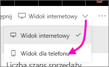
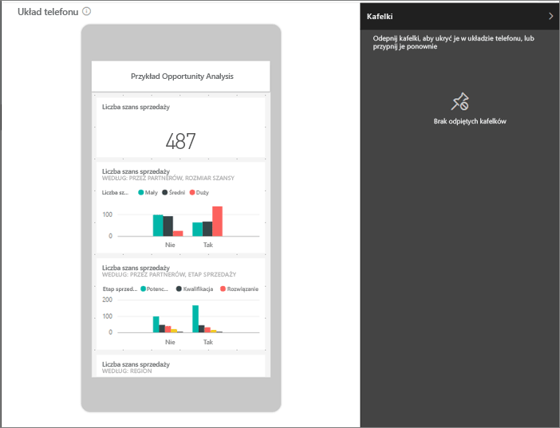
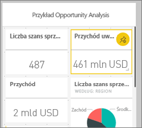
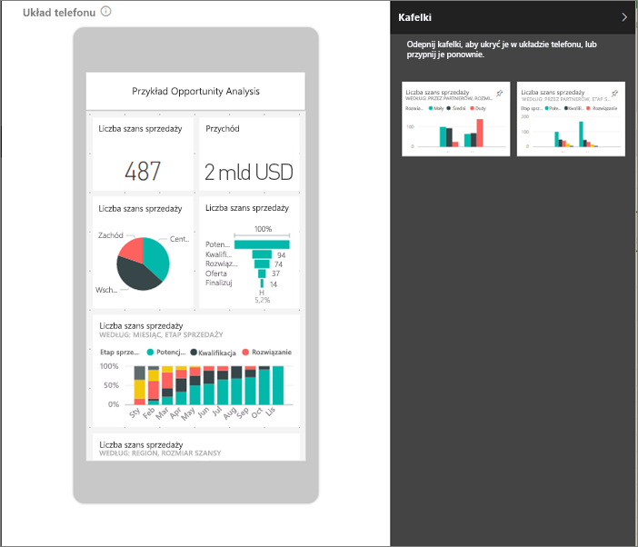
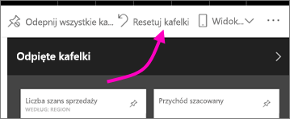

# Tworzenie widoku pulpitu nawigacyjnego usługi Power BI zoptymalizowanego dla telefonów komórkowych
Podczas wyświetlania pulpitów nawigacyjnych w aplikacji mobilnej usługi Power BI na telefonie możesz zauważyć, że kafelki pulpitu nawigacyjnego zostały ułożone po kolei i mają ten sam rozmiar. W usłudze Power BI możesz utworzyć dostosowany widok dowolnego pulpitu nawigacyjnego, który należy do Ciebie, szczególnie dla telefonów.

Po obróceniu telefonu na boki zobaczysz pulpit nawigacyjny tak, jak został rozmieszczony w usłudze, a nie jak został zaprojektowany dla telefonu.

> [!NOTE]
> Podczas edytowania widoku telefonu każda osoba oglądająca pulpit nawigacyjny na telefonie zobaczy wprowadzane zmiany w czasie rzeczywistym. Na przykład, jeśli odpiąć wszystkie kafelki w widoku pulpitu nawigacyjnego telefonu, pulpit nawigacyjny w telefonie nagle nie będzie miał kafelków. 
> 
> 

## Tworzenie widoku pulpitu nawigacyjnego dla telefonu
1. Otwórz pulpit nawigacyjny w usłudze Power BI.
2. Wybierz strzałkę obok pozycji **Widok internetowy** w prawym górnym rogu > wybierz **Widok telefonu**.

    

    Jeśli pulpit nawigacyjny nie należy do Ciebie, nie zobaczysz tej opcji.

    

    Zostanie otwarty widok edycji pulpitu nawigacyjnego telefonu. W tym miejscu możesz odpiąć, zmienić rozmiar i zmienić układ kafelków, aby dopasować widok telefonu. Nie powoduje to zmiany internetowej wersji pulpitu nawigacyjnego.

1. Wybierz kafelek, aby go przeciągnąć, zmienić rozmiar lub odpiąć. Możesz zauważyć,że inne kafelki odsuną się z drogi podczas przeciągania kafelka.
   
    
   
    Odpięte kafelki przechodzą do okienka odpiętych kafelków, gdzie zostają do chwili ich ponownego dodania.
   
    
2. Jeśli zmienisz zdanie, wybierz pozycję **Resetuj kafelki**, aby przywrócić je w ich wcześniejszym rozmiarze i kolejności.
   
    
   
    Samo otwarcie widoku Edycja telefonu w usłudze Power BI nieco zmienia rozmiar i kształt kafelków w telefonie. Dlatego przed otwarciem widoku Edycja telefonu przywrócić dokładny stan pulpitu nawigacyjnego i wybierz pozycję **Resetuj kafelki**.
3. Gdy układ pulpitu nawigacyjnego telefonu jest zadowalający, wybierz strzałkę obok pozycji **Widok telefonu** w prawym górnym rogu > Wybierz pozycję **Widok internetowy**.
   
    Usługa Power BI automatycznie zapisuje układ telefonu.

## Następne kroki
* [Tworzenie raportów zoptymalizowanych pod kątem aplikacji usługi Power BI na telefony](desktop-create-phone-report.md)
* [Tworzenie dynamicznych elementów wizualnych zoptymalizowanych pod kątem dowolnej wielkości](visuals/desktop-create-responsive-visuals.md)
* Masz więcej pytań? [Zadaj pytanie społeczności usługi Power BI](http://community.powerbi.com/)

