# Tworzenie i publikowanie aplikacji z pulpitami nawigacyjnymi i raportami w usłudze Power BI

W usłudze Power BI można tworzyć *aplikacje*, aby zebrać w jednym miejscu powiązane pulpity nawigacyjne i raporty, a następnie publikować je dla dużych grup użytkowników w organizacji. Można również łączyć się z [aplikacjami usługi Power BI dla usług zewnętrznych](service-connect-to-services.md), takich jak Google Analytics i Microsoft Dynamics CRM.

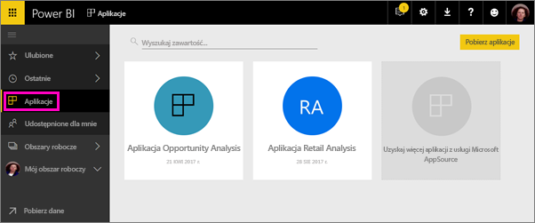

Aby sprawnie działać, użytkownicy biznesowi często potrzebują wielu pulpitów nawigacyjnych i raportów usługi Power BI. Aplikacje zbierają wszystkie te elementy w jednym miejscu, tak aby nie trzeba było pamiętać nazw i lokalizacji wszystkich pulpitów nawigacyjnych.  

Dzięki aplikacjom usługi Power BI, dostępnym teraz w wersji zapoznawczej, możesz tworzyć kolekcje pulpitów nawigacyjnych i raportów i udostępniać te aplikacje całej organizacji lub konkretnym osobom lub grupom. Z perspektywy administratora lub autora raportu aplikacje ułatwiają zarządzanie uprawnieniami do kolekcji pulpitów nawigacyjnych.

Użytkownicy biznesowi instalują te aplikacje z usługi Microsoft AppSource lub możesz im wysłać bezpośredni link. Mogą łatwo odnaleźć Twoją zawartość lub do niej wrócić, ponieważ wszystko znajduje się w jednym miejscu. Mogą automatycznie uzyskiwać aktualizacje, a Ty możesz kontrolować, jak często dane są odświeżane. Dowiedz się więcej na temat [aplikacji dla użytkowników biznesowych](service-install-use-apps.md).

### Aplikacje i pakiety zawartości organizacji
Aplikacje są kolejnym etapem ewolucji pakietów zawartości organizacji. Jeśli masz już pakiety zawartości organizacji, będą one nadal działały równolegle z aplikacjami.

Wiesz już, czym są aplikacje, przejdźmy więc do *obszarów roboczych aplikacji*, w których możesz tworzyć aplikacje. 

## Film wideo: aplikacje i obszary robocze aplikacji
<iframe width="640" height="360" src="https://www.youtube.com/embed/Ey5pyrr7Lk8?showinfo=0" frameborder="0" allowfullscreen></iframe>

## Licencje na aplikacje
Będąc twórcą aplikacji, potrzebujesz licencji usługi Power BI Pro. Użytkownicy aplikacji mają dwie opcje.

* Opcja 1. Wszyscy użytkownicy biznesowi potrzebują licencji usługi **Power BI Pro**, aby móc wyświetlać Twoją aplikację. 
* Opcja 2. Użytkownicy wersji bezpłatnej w Twojej organizacji mogą wyświetlać zawartość aplikacji, jeśli Twoja aplikacja jest przechowywana w pojemności usługi Power BI Premium. Przeczytaj artykuł [Co to jest usługa Power BI Premium?](service-premium.md), aby zapoznać się ze szczegółowymi informacjami.

## Obszary robocze aplikacji
*Obszar roboczy aplikacji* to miejsce, w którym są tworzone aplikacje — a więc zanim utworzysz aplikację, musisz utworzyć obszar roboczy aplikacji. Jeśli masz już doświadczenie w pracy w obszarze roboczym grupy w usłudze Power BI, obszary robocze aplikacji nie będą niczym nowym. Są one kolejnym etapem ewolucji obszarów roboczych grupy — obszarów tymczasowych i kontenerów zawartości w aplikacji. 

Możesz dodawać współpracowników do tych obszarów jako członków lub administratorów. Wszyscy członkowie i administratorzy obszarów roboczych aplikacji muszą mieć licencje usługi Power BI Pro. W obszarze roboczym możecie wspólnie pracować nad pulpitami nawigacyjnymi, raportami i innymi artykułami, które mają zostać rozpowszechnione wśród większej liczby osób lub nawet w całej organizacji. 

Kiedy zawartość jest gotowa, możesz opublikować aplikację. Możesz przesłać bezpośredni link większej grupie odbiorców. Mogą oni również znaleźć Twoją aplikację na karcie Aplikacje, przechodząc do pozycji **Pobierz i odkryj więcej aplikacji w usłudze AppSource**. Te osoby nie mogą zmodyfikować zawartości aplikacji, ale mogą jej używać w usłudze Power Bu lub jednej z aplikacji mobilnych i samodzielnie filtrować, wyróżniać i sortować dane. 

### Czym obszary robocze aplikacji różnią się od obszarów roboczych grupy?
Wszystkie istniejące obszary robocze grupy mogą pełnić rolę obszarów roboczych aplikacji i można z nich publikować aplikacje. Oto jedna z różnic pomiędzy obszarami roboczymi aplikacji a obszarami roboczymi grupy: obszar roboczy aplikacji jest tworzony jako miejsce do tworzenia i przechowywania konkretnej aplikacji. Istnieje bezpośredni związek pomiędzy aplikacją a zawartością obszaru roboczego aplikacji. Wszystko, co znajduje się w obszarze roboczym aplikacji, znajdzie się również w aplikacji po jej opublikowaniu. 

Teraz rozumiesz już, czym są aplikacje i obszary robocze aplikacji. Przejdźmy więc do tworzenia i publikowania aplikacji. 

## Tworzenie obszaru roboczego aplikacji
[!INCLUDE [powerbi-service-create-app-workspace](./includes/powerbi-service-create-app-workspace.md)]

Jest pusty, musisz więc dodać do niego zawartość. Pamiętaj, że po jego utworzeniu może upłynąć około godziny, zanim obszar roboczy zostanie rozpropagowany w usłudze Office 365. 

Dodawanie zawartości jest podobne do dodawania zawartości w oknie Mój obszar roboczy, z tym, że inne osoby w obszarze roboczym mogą go również wyświetlać i na nim pracować. Różnica polega na tym, że po zakończeniu pracy możesz opublikować zawartość jako aplikację. W obszarze roboczym aplikacji możesz przesłać pliki lub połączyć się z nimi, a także połączyć się z usługami innych firm, tak jak w oknie Mój obszar roboczy. Na przykład:

* [Łączenie się z usługami](service-connect-to-services.md) takimi jak Microsoft Dynamics CRM, Salesforce i Google Analytics.
* [Pobieranie danych z plików](service-get-data-from-files.md) takich jak pliki programu Excel, pliki CSV lub pliki programu Power BI Desktop (PBIX).

## Dodawanie obrazu do aplikacji (opcjonalnie)
Usługa Power BI domyślnie tworzy niewielki kolorowy okrąg dla aplikacji, zawierający inicjały jej nazwy. Istnieje jednak możliwość dostosowania przez dodanie obrazu. Aby dodać obraz, potrzebujesz licencji usługi Exchange Online.

1. Wybierz pozycję **Obszary robocze**, wybierz symbol wielokropka (...) znajdujący się obok obszaru roboczego, a następnie wybierz opcję **Członkowie**. 
   
     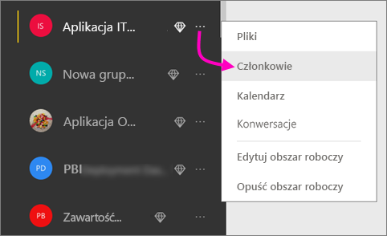
   
    Konto usługi Office 365 Outlook dla obszaru roboczego otwiera się w nowym oknie przeglądarki.
2. Gdy umieścisz kursor na kolorowym okręgu w lewym górnym rogu, zamieni się on w ikonę ołówka. Wybierz ją.
   
     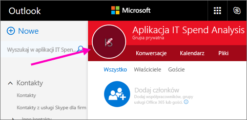
3. Ponownie wybierz ikonę ołówka i znajdź obraz, którego chcesz użyć.
   
     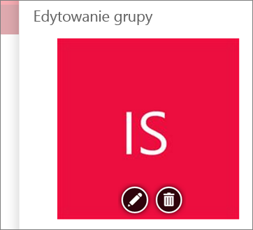
4. Wybierz pozycję **Zapisz**.
   
     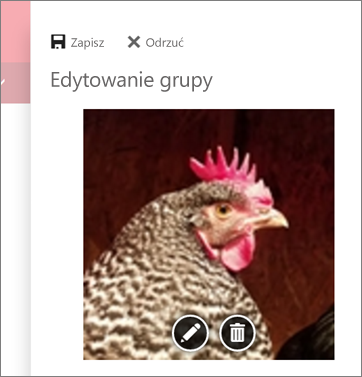
   
    Obraz zastąpi kolorowy okrąg w oknie usługi Office 365 Outlook. 
   
     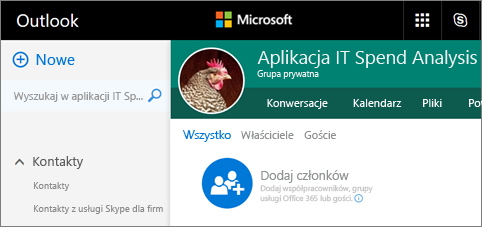
   
    Po kilku minutach pojawi się również w aplikacji w usłudze Power BI.
   
     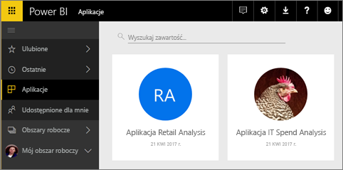

## Publikowanie aplikacji
Jeśli pulpity nawigacyjne i raporty w obszarze roboczym aplikacji są gotowe, możesz opublikować je jako aplikację. Pamiętaj, że nie musisz publikować wszystkich raportów i pulpitów nawigacyjnych w obszarze roboczym. Możesz opublikować tylko te, które są gotowe. 

1. W widoku listy obszarów roboczych zdecyduj, które pulpity nawigacyjne i raporty chcesz dołączyć do aplikacji.

     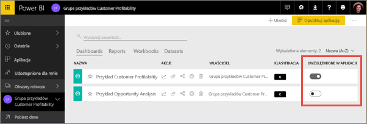

     Jeśli zdecydujesz się nie publikować raportu, wyświetlone zostanie ostrzeżenie obok tego raportu i powiązanego z nim pulpitu nawigacyjnego. W dalszym ciągu możesz opublikować aplikację, ale na powiązanym pulpicie nawigacyjnym nie będzie kafelków z tego raportu.

     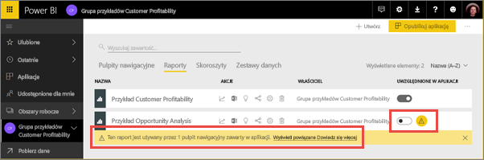

1. Wybierz przycisk **Opublikuj aplikację** w prawym górnym rogu, aby rozpocząć proces udostępniania całej zawartości w tym obszarze roboczym.
   
     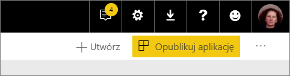

2. Najpierw w obszarze **Szczegóły** uzupełnij pole z opisem, aby umożliwić odnalezienie aplikacji. Możesz ją spersonalizować, ustawiając kolor tła.
   
     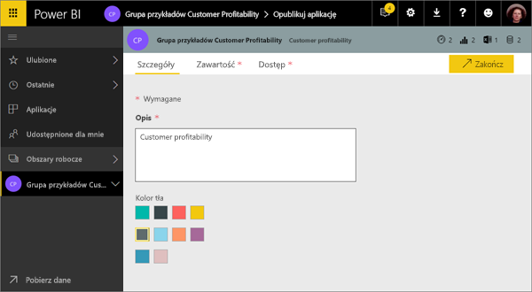

3. Następnie w obszarze **Zawartość** wyświetlona zostanie ta zawartość, która zostanie opublikowana jako część aplikacji, czyli wszystko, co zaznaczono w tym obszarze roboczym. Możesz również skonfigurować stronę docelową aplikacji — pulpit nawigacyjny lub raport, który zostanie wyświetlony natychmiast po przejściu do Twojej aplikacji. Możesz wybrać opcję **Brak**. Wtedy użytkownicy przejdą do listy całej zawartości w aplikacji. 
   
     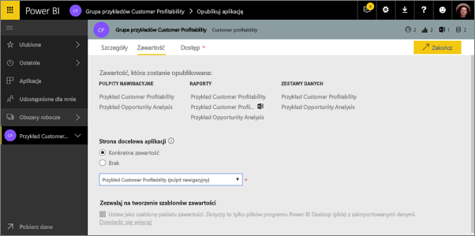

4. Na końcu w obszarze **Dostęp** możesz zdecydować, kto ma mieć dostęp do aplikacji: wszyscy w Twojej organizacji, konkretne osoby, czy grupy zabezpieczeń usługi Active Directory. 

5. Po wybraniu opcji **Zakończ** wyświetlony zostanie komunikat potwierdzający gotowość do publikacji. W oknie dialogowym potwierdzającym powodzenie możesz skopiować adres URL, który jest bezpośrednim linkiem do tej aplikacji, i wysłać go do osób, którym udostępniono aplikację.
   
     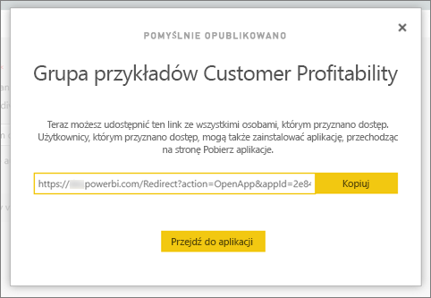

Użytkownicy biznesowi, którym udostępniono aplikację, mogą ją odnaleźć na dwa różne sposoby. Możesz wysłać im bezpośredni link do aplikacji. Mogą oni również wyszukać ją w witrynie Microsoft AppSource, gdzie wyświetlane są wszystkie aplikacje, do których mają dostęp. Następnie zawsze po wybraniu pozycji Aplikacje zobaczą tę aplikację na liście.

Dowiedz się więcej na temat [aplikacji dla użytkowników biznesowych](service-install-use-apps.md).

## Zmienianie opublikowanej aplikacji
Po opublikowaniu aplikacji możesz chcieć ją zmienić lub zaktualizować. Łatwo jest zaktualizować aplikację, jeśli jesteś administratorem lub członkiem obszaru roboczego aplikacji. 

1. Otwórz obszar aplikacji odpowiadający aplikacji. 
   
     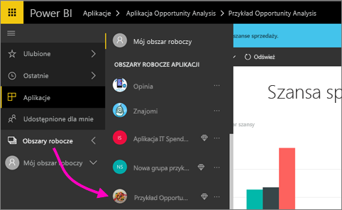
2. Otwórz pulpit nawigacyjny lub raport. Widzisz, że możesz wprowadzić dowolne zmiany.
   
     Obszar roboczy aplikacji to obszar przygotowawczy, a więc zmiany nie zostaną wprowadzone w działającej aplikacji do momentu jej ponownego opublikowania. To umożliwia wprowadzanie zmian bez wpływu na opublikowane aplikacje.  
 
1. Wróć do listy zawartości obszaru roboczego aplikacji i wybierz opcję **Zaktualizuj aplikację**.
   
     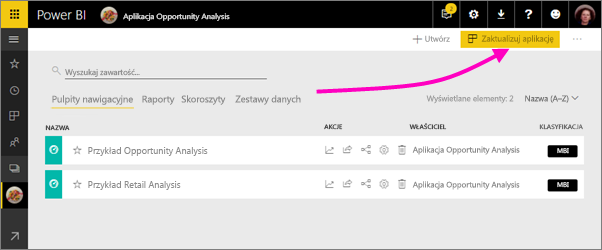
4. Jeśli chcesz, możesz zaktualizować obszary **Szczegóły**, **Zawartość** i **Dostęp**, a następnie wybrać opcję **Zaktualizuj aplikację**.
   
     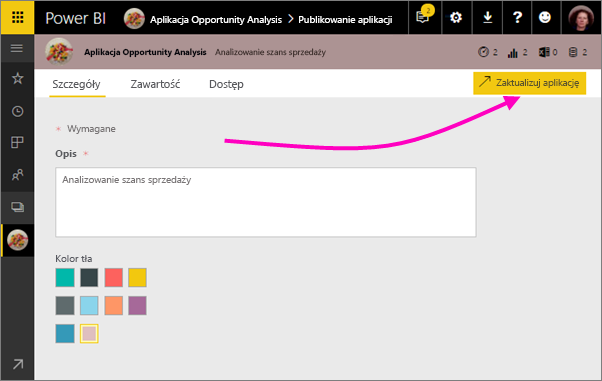

Osoby, którym udostępniono aplikację, automatycznie zobaczą zaktualizowaną wersję aplikacji. 

## Cofanie publikacji aplikacji
Każdy członek grupy roboczej aplikacji może cofnąć publikację aplikacji.

* W obszarze roboczym aplikacji wybierz przycisk wielokropka (**...**) w prawym górnym rogu, a następnie wybierz opcję **Cofnij publikację aplikacji**.
  
     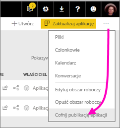

Ta czynność spowoduje odinstalowanie aplikację u wszystkich osób, którym ją udostępniono, i nikt nie będzie miał już do niej dostępu. Nie usuwa jednak obszaru roboczego aplikacji ani jego zawartości.

## Często zadawane pytania dotyczące aplikacji usługi Power BI
### Czym obszary robocze aplikacji różnią się od obszarów roboczych grupy?
W tej wersji zmieniono nazwy wszystkich obszarów roboczych grupy na obszary robocze aplikacji. Możesz opublikować aplikację z dowolnego z obszarów roboczych. Ta funkcja pozostanie w większości zgodna z obszarami roboczymi grupy. W ciągu kilku najbliższych miesięcy planujemy wprowadzić następujące ulepszenia do obszarów roboczych aplikacji: 

* Tworzenie obszarów roboczych aplikacji nie będzie oznaczało tworzenia odpowiadających im elementów w usłudze Office 365, tak jak ma to miejsce w przypadku obszarów roboczych grupy. Możesz więc utworzyć dowolną liczbę obszarów aplikacji, nie martwiąc się, że w tle tworzone są również różne grupy usługi Office 365 (możesz nadal korzystać z usługi OneDrive dla Firm w usłudze Office 365 do przechowywania plików). 
* Obecnie możesz dodawać do list członków i administratorów tylko pojedyncze osoby. Wkrótce możliwe będzie dodawanie wielu grup zabezpieczeń usługi AD lub nowoczesnych grup do tych list w celu ułatwienia zarządzania.  

### W jaki sposób aplikacje różnią się od pakietów zawartości organizacji?
Aplikacje są kolejnym etapem ewolucji i uproszczeniem pakietów zawartości. Istnieje jednak między nimi kilka różnic. 

* Po zainstalowaniu przez użytkowników biznesowych pakiety zawartości tracą swoją tożsamość grupową: stają się tylko listami pulpitów nawigacyjnych i raportów obok innych pulpitów nawigacyjnych i raportów. Natomiast aplikacje utrzymują grupowanie i tożsamość nawet po instalacji. To ułatwia użytkownikom biznesowym dalsze przechodzenie do nich w późniejszym czasie.  
* Możesz tworzyć wiele pakietów zawartości w obszarze roboczym, ale aplikacja ma bezpośrednią relację ze swoim obszarem roboczym. Sądzimy, że dzięki temu aplikacje będą łatwiejsze do zrozumienia i utrzymania w dłuższym okresie. Zapoznaj się z sekcją dotyczącą planów rozwoju na blogu usługi Power BI, aby poznać szczegółowe informacje na temat planów rozwoju tego obszaru. 
* Z czasem planujemy wycofać pakiety zawartości organizacji, więc zalecamy od teraz tworzenie aplikacji.  

### Co z członkami grup z prawami tylko do odczytu?
W grupach możesz dodawać członków z prawami tylko do odczytu, którzy mogą tylko wyświetlać zawartość. Głównym problemem w tym podejściu jest to, że nie można dodawać grup zabezpieczeń jako członków. Dzięki aplikacjom możesz opublikować wersję obszaru roboczego aplikacji tylko do odczytu dla większych grup odbiorców, w tym dla grup zabezpieczeń. Możesz wypróbować zmiany w pulpitach nawigacyjnych i raportach w aplikacji, nie wpływając na użytkowników końcowych. Zalecamy używanie aplikacji w ten sposób w przyszłości. W dłuższej perspektywie planujemy wycofanie członkostwa z uprawnieniami tylko do odczytu z obszarów roboczych.  

## Następne kroki
* [Instalowanie i używanie aplikacji w usłudze Power BI](service-install-use-apps.md)
* [Aplikacje usługi Power BI dla usług zewnętrznych](service-connect-to-services.md)
* Masz pytania? [Zadaj pytanie społeczności usługi Power BI](http://community.powerbi.com/)

