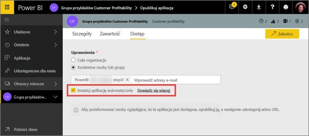

# Publikowanie aplikacji z pulpitami nawigacyjnymi i raportami w usłudze Power BI

W usłudze Power BI możesz opublikować *aplikacje* zawierające kolekcje powiązanych pulpitów nawigacyjnych i raportów. Aplikacje można tworzyć w *obszarach roboczych aplikacji*, gdzie możesz wraz z innymi osobami pracować nad zawartością usługi Power BI. Następnie możesz opublikować gotowe aplikacje dla większych grup osób w Twojej organizacji. Przeczytaj więcej na temat [tworzenia obszarów roboczych aplikacji](service-create-workspaces.md).

Aby sprawnie działać, użytkownicy biznesowi często potrzebują wielu pulpitów nawigacyjnych i raportów usługi Power BI. Dzięki aplikacjom usługi Power BI możesz tworzyć kolekcje pulpitów nawigacyjnych i raportów i udostępniać te aplikacje całej organizacji lub konkretnym osobom lub grupom. Z perspektywy administratora lub autora raportu aplikacje ułatwiają zarządzanie uprawnieniami do tych kolekcji.

Użytkownicy biznesowi mogą uzyskać te aplikacje na kilka różnych sposobów. Jeśli administrator usługi Power BI przyzna Ci odpowiednie uprawnienia, możesz automatycznie instalować aplikacje na kontach usługi Power BI swoich współpracowników. Jeśli nie, mogą oni zainstalować aplikacje z witryny Microsoft AppSource lub otrzymać bezpośredni link. Mogą łatwo odnaleźć Twoją zawartość lub do niej wrócić, ponieważ wszystko znajduje się w jednym miejscu. Nie mogą modyfikować zawartości aplikacji, ale mogą jej używać w usłudze Power Bu lub jednej z aplikacji mobilnych i samodzielnie filtrować, wyróżniać i sortować dane. Mogą automatycznie uzyskiwać aktualizacje, a Ty możesz kontrolować, jak często dane są odświeżane. Dowiedz się więcej na temat [aplikacji dla użytkowników biznesowych](consumer/end-user-apps.md).

**Czy wiesz?** W usłudze Power BI jest dostępna wersja zapoznawcza nowego środowiska obszarów roboczych. Przeczytaj artykuł [Tworzenie nowych obszarów roboczych — wersja zapoznawcza](service-create-the-new-workspaces.md), aby zobaczyć, jak zmienią się obszary robocze w przyszłości. 

## Aplikacje i pakiety zawartości organizacji
Aplikacje są kolejnym etapem ewolucji pakietów zawartości organizacji. Pakiety zawartości nie są dostępne w wersji zapoznawczej nowego środowiska obszarów roboczych. Gdy nowe środowisko obszarów roboczych stanie się ogólnie dostępne, nie będzie możliwości korzystania z pakietów zawartości w nowo utworzonych obszarach roboczych. Zacznij przeprowadzać migrację pakietów zawartości do aplikacji, jeśli jeszcze nie zostało to zrobione.

## Wideo: Aplikacje i obszary robocze aplikacji
<iframe width="640" height="360" src="https://www.youtube.com/embed/Ey5pyrr7Lk8?showinfo=0" frameborder="0" allowfullscreen></iframe>

## Licencje na aplikacje
Każdy członek obszaru roboczego aplikacji musi mieć licencję usługi Power BI Pro. Użytkownicy aplikacji mają dwie opcje.

* Opcja 1. Wszyscy użytkownicy biznesowi potrzebują licencji usługi **Power BI Pro**, aby móc wyświetlać Twoją aplikację. 
* Opcja 2. Jeśli Twoja aplikacja jest przechowywana w pojemności usługi Power BI Premium, użytkownicy wersji bezpłatnej w Twojej organizacji mogą wyświetlać zawartość aplikacji. Przeczytaj artykuł [Co to jest usługa Power BI Premium?](service-premium.md), aby zapoznać się ze szczegółowymi informacjami.

## Publikowanie aplikacji
Gdy pulpity nawigacyjne i raporty są gotowe, możesz wybrać, które pulpity nawigacyjne i raporty chcesz opublikować, a następnie opublikować je jako aplikację. Możesz przesłać bezpośredni link większej grupie odbiorców. Mogą oni również znaleźć Twoją aplikację na karcie Aplikacje, przechodząc do pozycji **Pobierz i odkryj więcej aplikacji w usłudze AppSource**. 

1. W widoku listy obszarów roboczych zdecyduj, które pulpity nawigacyjne i raporty chcesz dołączyć do aplikacji.

     

     Jeśli zdecydujesz się nie publikować raportu, wyświetlone zostanie ostrzeżenie obok tego raportu i powiązanego z nim pulpitu nawigacyjnego. W dalszym ciągu możesz opublikować aplikację, ale na powiązanym pulpicie nawigacyjnym nie będzie kafelków z tego raportu.

     

2. Wybierz przycisk **Opublikuj aplikację** w prawym górnym rogu, aby rozpocząć proces udostępniania całej zawartości w tym obszarze roboczym.
   
     

3. W obszarze **Szczegóły** wypełnij pole z opisem, aby ułatwić odnalezienie aplikacji. Możesz ją spersonalizować, ustawiając kolor tła.
   
     

4. W obszarze **Zawartość** możesz zobaczyć treść, która zostanie opublikowana jako część aplikacji, czyli wszystko, co zostało przez Ciebie zaznaczone w tym obszarze roboczym. Możesz również skonfigurować stronę docelową aplikacji — pulpit nawigacyjny lub raport, który zostanie wyświetlony natychmiast po przejściu do Twojej aplikacji. Możesz wybrać opcję **Brak**. Wtedy użytkownicy przejdą do listy całej zawartości w aplikacji. 
   
     

5. W obszarze **Dostęp** możesz zdecydować, kto ma dostęp do aplikacji: wszyscy w Twojej organizacji, określone osoby, czy grupy zabezpieczeń usługi Active Directory. Jeśli masz odpowiednie uprawnienia, możesz zdecydować się na zainstalowanie aplikacji automatycznie dla odbiorców. To ustawienie administrator usługi Power BI może włączyć w portalu administracyjnym usługi Power BI. Dowiedz się więcej na temat [automatycznego instalowania aplikacji](#how-to-install-an-app-automatically-for-end-users).

    

6. Po wybraniu opcji **Zakończ** wyświetlony zostanie komunikat potwierdzający gotowość do publikacji. W oknie dialogowym potwierdzającym powodzenie możesz skopiować adres URL, który jest bezpośrednim linkiem do tej aplikacji, i wysłać go do osób, którym udostępniono aplikację.
   
     

Dowiedz się więcej na temat [aplikacji dla użytkowników biznesowych](consumer/end-user-apps.md).

## Zmienianie opublikowanej aplikacji
Po opublikowaniu aplikacji możesz chcieć ją zmienić lub zaktualizować. Możesz łatwo zaktualizować aplikację, jeśli jesteś administratorem lub członkiem obszaru roboczego aplikacji albo współautorem w nowym obszarze roboczym aplikacji. 

1. Otwórz obszar aplikacji odpowiadający aplikacji. 
   
     
2. Otwórz pulpit nawigacyjny lub raport. Widzisz, że możesz wprowadzić dowolne zmiany.
   
     Obszar roboczy aplikacji to obszar przygotowawczy, a więc zmiany nie zostaną wprowadzone w działającej aplikacji do momentu jej ponownego opublikowania. To umożliwia wprowadzanie zmian bez wpływu na opublikowane aplikacje.  
 
3. Wróć do listy zawartości obszaru roboczego aplikacji i wybierz opcję **Zaktualizuj aplikację**.
   
     

4. Jeśli chcesz, możesz zaktualizować obszary **Szczegóły**, **Zawartość** i **Dostęp**, a następnie wybrać opcję **Zaktualizuj aplikację**.
   
     

Osoby, którym udostępniono aplikację, automatycznie zobaczą zaktualizowaną wersję aplikacji. 

## Automatyczne instalowanie aplikacji dla użytkowników końcowych
Aplikacje dostarczają dane, których użytkownicy końcowi potrzebują do pracy. Jeśli administrator nada Ci odpowiednie uprawnienia, możesz instalować automatycznie aplikacje dla użytkowników końcowych, co ułatwia rozpowszechnianie odpowiednich aplikacji wśród właściwych osób lub grup. Twoja aplikacja pojawi się automatycznie na liście zawartości Aplikacje użytkownika końcowego. Nie będzie on musiał wyszukiwać ich w usłudze Microsoft AppSource ani używać linku instalacji. Ułatwia to dystrybucję standardowej zawartości usługi Power BI do użytkowników.

### Jak automatycznie instalować aplikacje dla użytkowników końcowych
Przypisanie tych uprawnień przez administratora udostępnia nową opcję **automatycznego instalowania aplikacji**. Jeśli zaznaczysz to pole i wybierzesz pozycję **Zakończ** (lub **Aktualizuj aplikację** w przypadku istniejących aplikacji), aplikacja zostanie wypchnięta do wszystkich użytkowników lub grup zdefiniowanych w sekcji **Uprawnienia** na karcie **Dostęp** aplikacji.

### Jak użytkownicy odbierają wypchnięte do nich aplikacje
Po wypchnięciu aplikacji jest ona automatycznie wyświetlana na liście Aplikacje. Możesz dobrać aplikacje, które konkretni użytkownicy lub stanowiska w organizacji muszą mieć „w zasięgu ręki”.

### Zagadnienia dotyczące automatycznego instalowania aplikacji
Poniżej przedstawiono kwestie, o których należy pamiętać podczas wypychania aplikacji do użytkowników końcowych:

* Automatyczne instalowanie aplikacji dla użytkowników może trwać pewien czas. Większość aplikacji jest instalowana natychmiast, lecz wypychanie aplikacji może trwać pewien czas.  To zależy od liczby elementów w aplikacji i liczby osób, którym udzielono dostępu. Zalecamy wypychanie aplikacji poza godzinami pracy, na długo przed tym, zanim użytkownicy będą ich potrzebować. Zweryfikuj kilku użytkowników przed wysłaniem wiadomości o dostępności aplikacji do szerokiego kręgu użytkowników.

* Odśwież przeglądarkę. Zanim wypchnięta aplikacja będzie widoczna na liście Aplikacje, może być konieczne odświeżenie lub zamknięcie i ponowne otwarcie przeglądarki przez użytkownika.

* Jeśli użytkownik nie widzi natychmiast aplikacji na liście Aplikacje, powinien odświeżyć lub zamknąć i otworzyć ponownie przeglądarkę.

* Nie przeciążaj użytkowników. Nie należy wypychać zbyt wielu aplikacji — dzięki temu użytkownicy będą odbierać wstępnie zainstalowane aplikacje jako przydatne. Dobra praktyka to kontrolowanie, kto może wypychać aplikacje do użytkowników końcowych, w celu koordynowania wypychania. Możesz ustanowić w organizacji punkt kontaktowy na potrzeby pobierania aplikacji wypchniętych do użytkowników końcowych.

* Użytkownicy-goście, którzy nie zaakceptowali zaproszenia, nie otrzymają automatycznie instalowanych aplikacji.  

## Cofanie publikacji aplikacji
Każdy członek grupy roboczej aplikacji może cofnąć publikację aplikacji.

* W obszarze roboczym aplikacji wybierz przycisk wielokropka (**...**) w prawym górnym rogu, a następnie wybierz opcję **Cofnij publikację aplikacji**.
  
     

Ta czynność spowoduje odinstalowanie aplikację u wszystkich osób, którym ją udostępniono, i nikt nie będzie miał już do niej dostępu. Nie usuwa jednak obszaru roboczego aplikacji ani jego zawartości.

## Następne kroki
* [Tworzenie obszaru roboczego aplikacji](service-create-workspaces.md)
* [Instalowanie i używanie aplikacji w usłudze Power BI](consumer/end-user-apps.md)
* [Aplikacje usługi Power BI dla usług zewnętrznych](service-connect-to-services.md)
* [Portal administracyjny usługi Power BI](https://docs.microsoft.com/power-bi/service-admin-portal)
* Masz pytania? [Zadaj pytanie społeczności usługi Power BI](http://community.powerbi.com/)
