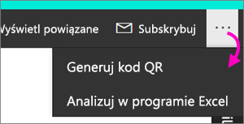
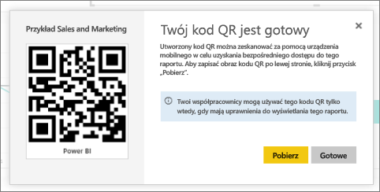

# Tworzenie kodu QR dla raportu w usłudze Power BI do wykorzystania w aplikacjach mobilnych
Kody QR w usłudze Power BI mogą łączyć dowolne elementy w świecie rzeczywistym bezpośrednio z powiązanymi informacjami analizy biznesowej — bez potrzeby korzystania z nawigacji lub wyszukiwania.

Kod QR w usłudze Power BI możesz utworzyć dla dowolnego raportu, nawet dla raportu, którego nie można edytować. Następnie umieść kod QR w kluczowej lokalizacji. Przykładowo możesz wkleić go do wiadomości e-mail lub wydrukować i nakleić w konkretnym miejscu. 

Współpracownicy, którym udostępniono raport, mogą zeskanować kod QR, aby uzyskać dostęp do raportu bezpośrednio na [urządzeniu przenośnym](mobile-apps-qr-code.md). W tym celu mogą użyć skanera kodów QR w aplikacji Power BI lub dowolnego innego skanera kodów QR zainstalowanego na urządzeniu.

## Tworzenie kodu QR dla raportu
1. Otwórz raport w usłudze Power BI.
2. Wybierz wielokropek (...) w prawym górnym rogu kafelka i wybierz polecenie **Generuj kod QR**. 
   
    
3. Zostanie wyświetlone okno dialogowe z kodem QR. 
   
    
4. W tym miejscu możesz zeskanować kod QR lub pobrać i zapisać go, aby: 
   
   * Dodać go do wiadomości e-mail lub innego dokumentu. 
   * Wydrukować i umieścić go w konkretnej lokalizacji. 

## Drukowanie kodu QR
Usługa Power BI generuje kody QR jako pliki JPG gotowe do druku. 

1. Wybierz pozycję **Pobierz**, a następnie otwórz plik JPG na komputerze podłączonym do drukarki.  
   
   > [!TIP]
   > Plik JPG ma taką samą nazwę co kafelek. Na przykład „Przykład Sales and Marketing.jpg”.
   > 
   > 
2. Wydrukuj plik w rozmiarze 100% lub rozmiarze rzeczywistym.  
3. Wytnij kod QR wzdłuż jego krawędzi i przyklej go w miejscu związanym z raportem. 

## Następne kroki
* [Nawiązywanie połączenia z danymi usługi Power BI ze środowisk rzeczywistych](mobile-apps-data-in-real-world-context.md) za pomocą aplikacji mobilnych
* [Skanowanie kodu QR usługi Power BI na urządzeniu przenośnym](mobile-apps-qr-code.md)
* [Tworzenie kodu QR dla kafelka](service-create-qr-code-for-tile.md)
* Masz pytania? [Zadaj pytanie społeczności usługi Power BI](http://community.powerbi.com/)

