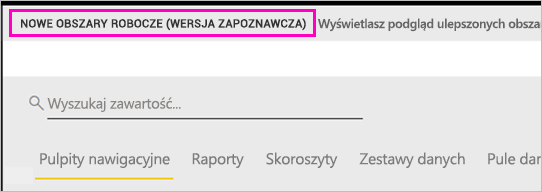

# Tworzenie nowych obszarów roboczych (wersja zapoznawcza) w usłudze Power BI

W usłudze Power BI wprowadzono nowe środowisko obszarów roboczych w wersji zapoznawczej. Obszary robocze to nadal miejsca, w których współpracownicy mogą razem tworzyć kolekcje pulpitów nawigacyjnych i raportów, a następnie łączyć je w *aplikacje* i udostępniać w całej organizacji konkretnym osobom lub grupom. 

Nowe obszary robocze w wersji zapoznawczej umożliwiają:

- Przypisywanie ról obszarów roboczych do grup użytkowników: grup zabezpieczeń, list dystrybucyjnych, grup usługi Office 365 i pojedynczych użytkowników.
- Tworzenie grupy roboczej w usłudze Power BI bez konieczności tworzenia grupy usługi Office 365.
- Korzystanie z bardziej wyspecjalizowanych ról obszarów roboczych, co umożliwia bardziej elastyczne zarządzanie uprawnieniami w obszarze roboczym.
 
Tworząc jeden z nowych obszarów roboczych, nie tworzysz skojarzonej bazowej grupy usługi Office 365. Administracja obszarem roboczym odbywa się w usłudze Power BI, a nie Office 365. Nadal możesz dodać grupę usługi Office 365 do obszaru roboczego, aby dalej zarządzać dostępem użytkowników do zawartości za pośrednictwem grup usługi Office 365. Możesz jednak dodatkowo korzystać z grup zabezpieczeń i list dystrybucyjnych oraz dodawać pojedynczych użytkowników bezpośrednio w usłudze Power BI, co daje więcej możliwości zarządzania dostępem do obszarów roboczych. Ponieważ administrowanie obszarem roboczym jest teraz dostępne w usłudze Power BI, administratorzy usługi Power BI decydują, kto w organizacji może tworzyć obszary robocze. Szczegółowe informacje można znaleźć w [sekcji dotyczącej obszarów roboczych w artykule Portal administracyjny usługi Power BI](service-admin-portal.md#workspace-settings). 

Możesz dodawać grupy użytkowników lub pojedynczych użytkowników do nowych obszarów roboczych jako członków, współautorów lub administratorów. Wszyscy użytkownicy w grupie otrzymują zdefiniowaną przez Ciebie rolę. Jeśli indywidualny użytkownik to wiele grup użytkowników, otrzyma najwyższy poziom uprawnień przewidziany przez rolę.  Zobacz sekcję [Role w nowych obszarach roboczych ](#roles-in-the-new-workspaces) w dalszej części tego artykułu, aby zapoznać się z omówieniem poszczególnych ról.

Wszyscy użytkownicy, których dodasz do obszaru roboczego aplikacji, muszą mieć licencję usługi Power BI Pro. W obszarze roboczym ci użytkownicy mogą wspólnie pracować nad pulpitami nawigacyjnymi i raportami, które mają zostać opublikowane wśród większej liczby osób lub nawet w całej organizacji. Jeśli chcesz rozpowszechniać zawartość wśród innych użytkowników w Twojej organizacji, możesz przypisać im licencje usługi Power BI Pro lub umieścić obszar roboczy w pojemności usługi Power BI Premium.

Wraz z wprowadzeniem nowych obszarów roboczych modyfikujemy niektóre funkcje. Zobacz sekcję [Funkcje obszaru roboczego aplikacji, które działają inaczej](#app-workspace-features-that-work-differently) w dalszej części tego artykułu, aby zapoznać się z omówieniem zmian, które mogą zostać wprowadzone na stałe po wersji zapoznawczej. Ponieważ ta funkcja jest obecnie dostępna w wersji zapoznawczej, ma kilka ograniczeń, o których warto wiedzieć. Zobacz sekcję [Znane problemy](#known-issues) w dalszej części tego artykułu, w której wyjaśnione są aktualne ograniczenia. 

## Wdrażanie nowych obszarów roboczych aplikacji

W okresie obowiązywania wersji zapoznawczej można tworzyć zarówno stare, jak i nowe obszary robocze, a oba typy obszarów roboczych mogą istnieć równolegle. Po zakończeniu okresu obowiązywania wersji zapoznawczej nowych obszarów roboczych i ich ogólnym udostępnieniu stare obszary robocze będą mogły istnieć jeszcze przez jakiś czas. Nie będzie możliwości tworzenia ich i należy się przygotować do przeprowadzenia migracji istniejących obszarów roboczych do infrastruktury nowych obszarów roboczych. Nie martw się, będziesz mieć kilka miesięcy na przeprowadzenie migracji.

## Tworzenie jednego z nowych obszarów roboczych aplikacji

1. Rozpocznij od utworzenia obszaru roboczego aplikacji. Wybierz pozycję **Obszary robocze** > **Utwórz obszar roboczy aplikacji**.
   
     

2. W sekcji **Przejrzyj ulepszone obszary robocze** wybierz pozycję **Wypróbuj teraz**.
   
     

2. Nadaj nazwę obszarowi roboczemu. Jeśli nazwa nie jest dostępna, edytuj ją, aby utworzyć unikatowy identyfikator.
   
     Aplikacja będzie mieć taką samą nazwę jak obszar roboczy.
   
1. Jeśli chcesz, możesz też dodać obraz. Rozmiar pliku musi być mniejszy niż 45 KB.
 
    

1. Wybierz pozycję **Zapisz**.

    W tym momencie na **ekranie powitalnym** nowego obszaru roboczego możesz dodać dane. 

    

1. Możesz na przykład wybrać pozycję **Przykłady** > **Przykład Customer Profitability**.

    Na liście zawartości obszaru roboczego zostanie wyświetlona pozycja **Podgląd nowych obszarów roboczych**. Ponieważ jesteś administratorem, zostanie też wyświetlona akcja **Dostęp**.

    

1. Wybierz pozycję **Dostęp**.

1. Dodaj grupy zabezpieczeń, listy dystrybucyjne, grupy usługi Office 365 lub pojedynczych użytkowników do tych obszarów roboczych jako członków, współautorów lub administratorów. Zobacz sekcję [Role w nowych obszarach roboczych ](#roles-in-the-new-workspaces) w dalszej części tego artykułu, aby zapoznać się z omówieniem poszczególnych ról.

    

9. Wybierz kolejno pozycje **Dodaj** > **Zamknij**.

1. Usługa Power BI tworzy obszar roboczy i otwiera go. Zostanie on wyświetlony na liście obszarów roboczych, których członkiem jesteś. Ponieważ jesteś administratorem, możesz wybrać symbol wielokropka (...), aby powrócić i wprowadzić zmiany w ustawieniach obszaru roboczego, dodając nowych członków lub zmieniając ich uprawnienia.

     

## Dodawanie zawartości do obszaru roboczego aplikacji

Po utworzeniu obszaru roboczego aplikacji w nowym stylu nadszedł czas na dodanie do niego zawartości. Dodawanie zawartości odbywa się podobnie w starych i nowych obszarach roboczych — z jednym wyjątkiem. W obszarze roboczym aplikacji możesz przesłać pliki lub połączyć się z nimi, tak jak w oknie Mój obszar roboczy. W nowych obszarach roboczych nie możesz łączyć się z organizacyjnymi pakietami zawartości ani pakietami zawartości innych firm, takimi jak Microsoft Dynamics CRM, Salesforce czy Google Analytics. W bieżącej wersji obszarów roboczych możesz łączyć się z pakietami zawartości.

Gdy wyświetlasz zawartość na liście zawartości obszaru roboczego aplikacji, nazwa obszaru roboczego aplikacji jest wymieniona jako właściciel.

### Łączenie się z usługami innych firm w nowych obszarach roboczych (wersja zapoznawcza)

W nowym środowisku obszarów roboczych bardziej koncentrujemy się na aplikacjach. Aplikacje dla usług innych firm ułatwiają użytkownikom uzyskiwanie danych z używanych usług, takich jak Microsoft Dynamics CRM, Salesforce czy Google Analytics.
Aplikacje organizacyjne zaopatrują użytkowników w potrzebne im dane wewnętrzne. Planujemy dodanie funkcji do aplikacji organizacyjnych, tak aby użytkownicy mogli dostosowywać zawartość odnalezioną w aplikacjach. Wyeliminuje to konieczność stosowania pakietów zawartości. 

W wersji zapoznawczej nowych obszarów roboczych nie można tworzyć organizacyjnych pakietów zawartości ani ich używać. Można jednak korzystać z dostarczonych aplikacji, aby łączyć się z usługami innych firm, lub zwrócić się do zespołów wewnętrznych o dostarczenie aplikacji dla aktualnie używanych pakietów zawartości. 

## Role w nowych obszarach roboczych

Role umożliwiają zarządzenie uprawnieniami w obszarze roboczym, dzięki czemu zespoły mogą ze sobą współpracować. Nowe obszary robocze umożliwiają przypisywanie ról do pojedynczych użytkowników i do grup: grup zabezpieczeń, grup usługi Office 365 i list dystrybucyjnych. 

Po przypisaniu roli do grupy użytkowników członkowie tej grupy otrzymają dostęp do zawartości. W przypadku zagnieżdżonych grup użytkowników wszyscy użytkownicy w grupie otrzymają uprawnienia. Użytkownik, który znajduje się w kilku grupach użytkowników z różnymi rolami, otrzyma najwyższy poziom uprawnień przypisany do tych grup. 

Nowe obszary robocze oferują trzy role: administratorów, członków i współautorów.

**Administratorzy mogą:**

- Aktualizować i usuwać obszary robocze. 
- Dodawać i usuwać użytkowników, w tym innych administratorów.
- Wykonywać wszystkie czynności, do których są uprawnieni członkowie.

**Członkowie mogą:** 

- Dodawać członków lub innych użytkowników o niższych uprawnieniach.
- Publikować i aktualizować aplikację.
- Udostępniać element lub aplikację.
- Zezwalać innym osobom na dalsze udostępnianie elementów.
- Wykonywać wszystkie czynności, do których są uprawnieni współautorzy.

**Współautorzy mogą:** 

- Tworzyć, edytować i usuwać zawartość w obszarze roboczym. 
- Publikować raporty w obszarze roboczym i usuwać zawartość.
- Nie mogą umożliwiać dostępu innym osobom do zawartości ani udostępniać nowej zawartości, ale mogą udostępniać zawartość osobom, którym już wcześniej udostępniono obszar roboczy, element lub aplikację. 
- Nie mogą modyfikować członków grupy.
 
Tworzymy przepływy pracy dla żądań dostępu w usłudze, tak aby użytkownicy, którzy nie mają dostępu, mogli go zażądać. Istnieją już przepływy pracy dla żądań dostępu do pulpitów nawigacyjnych, raportów i aplikacji.

## Rozpowszechnianie aplikacji

Gdy zawartość jest gotowa, możesz wybrać, które pulpity nawigacyjne i raporty chcesz opublikować, a następnie opublikować je jako *aplikację*. W każdym obszarze roboczym możesz utworzyć jedną aplikację. Twoi współpracownicy mogą uzyskać tę aplikację na kilka różnych sposobów. Możesz automatycznie instalować ją na kontach usługi Power BI swoich współpracowników, jeśli administrator usługi Power BI przyzna Ci odpowiednie uprawnienia. Jeśli nie, mogą oni znaleźć i zainstalować aplikację przy użyciu usługi Microsoft AppSource lub otrzymać bezpośredni link. Mogą automatycznie uzyskiwać aktualizacje, a Ty możesz kontrolować, jak często dane są odświeżane. Zobacz [Tworzenie i publikowanie aplikacji z pulpitami nawigacyjnymi i raportami w usłudze Power BI](service-create-distribute-apps.md), aby uzyskać bardziej szczegółowe informacje.

## Konwertowanie starych obszarów roboczych aplikacji na nowe obszary robocze aplikacji

W trakcie obowiązywania wersji zapoznawczej nie można automatycznie konwertować starych obszarów roboczych aplikacji na nowe. Można jednak utworzyć nowy obszar roboczy aplikacji i opublikować zawartość w nowej lokalizacji. 

Gdy nowe obszary robocze staną się ogólnie dostępne, można będzie włączyć opcję automatycznego migrowania starych obszarów roboczych. W pewnym momencie po opublikowaniu wersji ogólnodostępnej przeprowadzenie migracji stanie się konieczne.

## Często zadawane pytania dotyczące aplikacji usługi Power BI

### Czym różnią się nowe obszary robocze aplikacji od bieżącej wersji obszarów roboczych aplikacji?
* Tworzenie obszarów roboczych aplikacji nie będzie oznaczało tworzenia odpowiadających im elementów w usłudze Office 365, tak jak ma to miejsce w bieżącej wersji obszarów roboczych aplikacji. (Możesz nadal dodać grupę usługi Office 365 do obszaru roboczego, przypisując jej rolę). 
* W bieżącej wersji obszarów roboczych możesz dodawać tylko pojedyncze osoby jako członków i administratorów. W nowych obszarach roboczych możesz dodać wiele grup zabezpieczeń usługi Azure AD, list dystrybucyjnych lub grup usługi Office 365, aby umożliwić łatwiejsze zarządzanie użytkownikami. 
- W bieżącej wersji obszarów roboczych aplikacji możesz tworzyć organizacyjne pakiety zawartości. Nie można tworzyć ich w nowych obszarach roboczych aplikacji.
- W bieżącej wersji obszarów roboczych aplikacji można używać organizacyjnych pakietów zawartości. Nie możesz korzystać z nich w nowych obszarach roboczych aplikacji.
- W trakcie obowiązywania wersji zapoznawczej niektóre funkcje nowych obszarów roboczych aplikacji nie są jeszcze dostępne. Zobacz następną sekcję [Inne planowane funkcje nowych obszarów roboczych](service-create-the-new-workspaces.md#other-planned-new-app-workspace-preview-features), aby uzyskać szczegółowe informacje.

## Planowane funkcje nowych obszarów roboczych aplikacji w wersji zapoznawczej

Niektóre funkcje nowych obszarów roboczych aplikacji w wersji zapoznawczej nadal są w fazie opracowywania i nie zostały udostępnione w momencie publikowania wersji zapoznawczej:

- Brak przycisku **Opuść obszar roboczy**.
- Metryki użycia nie są jeszcze obsługiwane.
- Jak działa wersja Premium: możesz przypisywać obszary robocze i tworzyć je w pojemności Premium, ale aby przenieść obszar roboczy pomiędzy pojemnościami, należy przejść do ustawień obszaru roboczego.
- Osadzanie składników Web Part programu SharePoint nie jest jeszcze obsługiwane.
- Brak przycisku **OneDrive** dla grup usługi Office 365 w obszarze Pobierz dane/pliki.

## Funkcje obszaru roboczego aplikacji, które działają inaczej

Działanie niektórych funkcji różni się w bieżącej wersji obszarów roboczych aplikacji i w nowych obszarach roboczych aplikacji. Te różnice są zamierzone. Zostały wprowadzone na podstawie opinii klientów i umożliwiają bardziej elastyczną współpracę w obszarach roboczych:

- Ustawienie uprawnień do ponownego udostępniania elementów: zastąpione przez rolę współautora
- Obszary robocze tylko do odczytu: zamiast udzielać użytkownikom dostępu tylko do odczytu do obszaru roboczego, przypiszesz ich do nadchodzącej roli Przeglądający, która zapewnia podobny dostęp tylko do odczytu do zawartości w obszarze roboczym.

## Znane problemy

Następujące problemy są znane, a poprawki do nich są w fazie projektowania:

- Użytkownicy lub grupy użytkowników w wersji bezpłatnej dodani jako adresaci subskrypcji wiadomości e-mail mogą nie może otrzymywać wiadomości e-mail zgodnie z oczekiwaniami. Ten problem występuje, gdy nowe środowisko obszaru roboczego jest w pojemności Premium, ale obszar Mój obszar roboczy użytkownika tworzącego subskrypcję nie jest w pojemności Premium. Jeśli obszar Mój obszar roboczy znajduje się w pojemności Premium, użytkownicy i grupy użytkowników w wersji bezpłatnej będą otrzymywać wiadomości e-mail.
- Po przeniesieniu obszaru roboczego z pojemności Premium do udostępnionej pojemności (w niektórych przypadkach) użytkownicy i grupy użytkowników w wersji bezpłatnej nadal będą otrzymywać wiadomości e-mail, chociaż nie powinno to mieć miejsca. Ten problem występuje, gdy obszar Mój obszar roboczy użytkownika tworzącego subskrypcję znajduje się w pojemności Premium.

## Następne kroki
* [Tworzenie obszarów roboczych w bieżącej wersji](service-create-workspaces.md)
* [Instalowanie i używanie aplikacji w usłudze Power BI](service-create-distribute-apps.md)
* Masz pytania? [Zadaj pytanie społeczności usługi Power BI](http://community.powerbi.com/)
