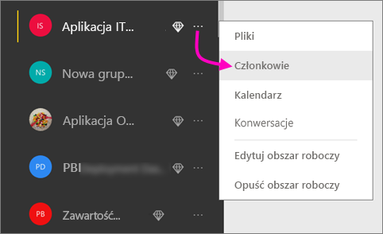
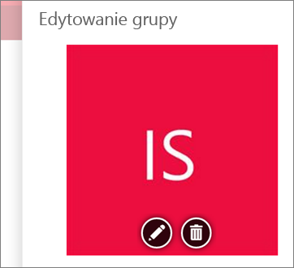
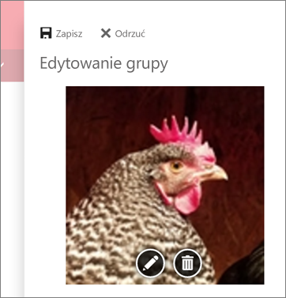
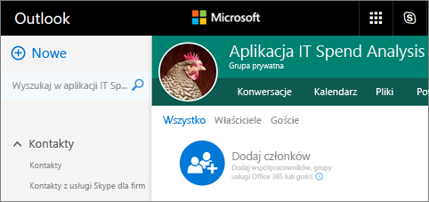
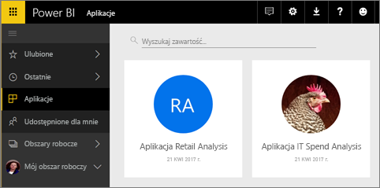

# Tworzenie obszarów roboczych ze współpracownikami w usłudze Power BI

W usłudze Power BI możesz tworzyć *obszary robocze*, czyli miejsca, w których można we współpracy z innymi osobami tworzyć i dostosowywać kolekcje pulpitów nawigacyjnych i raportów. Następnie możesz stworzyć z tych elementów *aplikacje*, którą można rozpowszechnić w całej organizacji lub wśród konkretnych osób lub grup. 

Tworząc obszar roboczy, tworzysz skojarzoną bazową grupę usługi Office 365. Administracja obszarem roboczym odbywa się w usłudze Office 365. Możesz dodawać współpracowników do tych obszarów jako członków lub administratorów. W obszarze roboczym możecie wspólnie pracować nad pulpitami nawigacyjnymi, raportami i innymi artykułami, które mają zostać rozpowszechnione wśród większej liczby osób. Wszyscy użytkownicy, których dodasz do obszaru roboczego aplikacji, muszą mieć licencję usługi Power BI Pro. 

**Czy wiesz?** W usłudze Power BI jest dostępna wersja zapoznawcza nowego środowiska obszarów roboczych. Przeczytaj artykuł [Tworzenie nowych obszarów roboczych — wersja zapoznawcza](service-create-the-new-workspaces.md), aby zobaczyć, jak zmienią się obszary robocze w przyszłości. 

## Film wideo: aplikacje i obszary robocze aplikacji
<iframe width="640" height="360" src="https://www.youtube.com/embed/Ey5pyrr7Lk8?showinfo=0" frameborder="0" allowfullscreen></iframe>

## Tworzenie obszaru roboczego aplikacji na podstawie grupy usługi Office 365

Obszar roboczy aplikacji jest tworzony na podstawie grupy usługi Office 365.

[!INCLUDE [powerbi-service-create-app-workspace](./includes/powerbi-service-create-app-workspace.md)]

Po jego utworzeniu może upłynąć około 60 minut, zanim obszar roboczy zostanie rozpropagowany w usłudze Office 365. 

### Dodawanie obrazu do obszaru roboczego aplikacji usługi Office 365 (opcjonalnie)
Usługa Power BI domyślnie tworzy niewielki kolorowy okrąg dla aplikacji, zawierający inicjały jej nazwy. Istnieje jednak możliwość dostosowania przez dodanie obrazu. Aby dodać obraz, potrzebujesz licencji usługi Exchange Online.

1. Wybierz pozycję **Obszary robocze**, wybierz symbol wielokropka (...) znajdujący się obok obszaru roboczego, a następnie wybierz opcję **Członkowie**. 
   
     
   
    Konto usługi Office 365 Outlook dla obszaru roboczego otwiera się w nowym oknie przeglądarki.
2. Gdy umieścisz kursor na kolorowym okręgu w lewym górnym rogu, zamieni się on w ikonę ołówka. Wybierz ją.
   
     
3. Ponownie wybierz ikonę ołówka i znajdź obraz, którego chcesz użyć.
   
     

4. Wybierz pozycję **Zapisz**.
   
     
   
    Obraz zastąpi kolorowy okrąg w oknie usługi Office 365 Outlook. 
   
     
   
    Po kilku minutach pojawi się również w aplikacji w usłudze Power BI.
   
     

## Dodawanie zawartości do obszaru roboczego aplikacji

Po utworzeniu obszaru roboczego aplikacji czas na dodanie do niego zawartości. Jest to podobne do dodawania zawartości w oknie Mój obszar roboczy, z tym, że inne osoby w obszarze roboczym mogą go również wyświetlać i na nim pracować. Różnica polega na tym, że po zakończeniu pracy możesz opublikować zawartość jako aplikację. Gdy wyświetlasz zawartość na liście zawartości obszaru roboczego aplikacji, nazwa obszaru roboczego aplikacji jest wymieniona jako właściciel.

### Łączenie się z usługami innych firm w obszarach roboczych aplikacji

Dla wszystkich usług innych firm, które obsługuje usługa Power BI, dostarczane są aplikacje, co ułatwia uzyskiwanie danych z używanych usług, takich jak Microsoft Dynamics CRM, Salesforce czy Google Analytics. Możesz publikować aplikacje organizacyjne, aby udostępniać użytkownikom potrzebne im dane.

W bieżącej wersji obszarów roboczych możesz również nawiązywać połączenia za pomocą organizacyjnych pakietów zawartości oraz pakietów zawartości innych firm, takich jak Microsoft Dynamics CRM, Salesforce i Google Analytics. Rozważ migrację organizacyjnych pakietów zawartości do aplikacji.

## Rozpowszechnianie aplikacji

Gdy zawartość jest gotowa, możesz wybrać, które pulpity nawigacyjne i raporty chcesz opublikować, a następnie opublikować je jako *aplikację*. Twoi współpracownicy mogą uzyskać te aplikacje na kilka różnych sposobów. Możesz automatycznie instalować je na kontach usługi Power BI swoich współpracowników, jeśli administrator usługi Power BI przyzna Ci odpowiednie uprawnienia. Jeśli nie, mogą oni znaleźć i zainstalować aplikacje z witryny Microsoft AppSource lub otrzymać bezpośredni link. Mogą automatycznie uzyskiwać aktualizacje, a Ty możesz kontrolować, jak często dane są odświeżane. Zobacz [Tworzenie i publikowanie aplikacji z pulpitami nawigacyjnymi i raportami w usłudze Power BI](consumer/end-user-create-apps.md), aby uzyskać bardziej szczegółowe informacje.

## Często zadawane pytania dotyczące aplikacji usługi Power BI

### W jaki sposób aplikacje różnią się od pakietów zawartości organizacji?
Aplikacje są kolejnym etapem ewolucji pakietów zawartości organizacji. Jeśli masz już pakiety zawartości organizacji, będą one nadal działały równolegle z aplikacjami. Aplikacje i pakiety zawartości istotnie różnią się w kilku aspektach. 

* Po zainstalowaniu przez użytkowników biznesowych pakiety zawartości tracą swoją tożsamość grupową: stają się tylko listami pulpitów nawigacyjnych i raportów obok innych pulpitów nawigacyjnych i raportów. Natomiast aplikacje utrzymują grupowanie i tożsamość nawet po instalacji. To ułatwia użytkownikom biznesowym dalsze przechodzenie do nich w późniejszym czasie.
* Możesz tworzyć wiele pakietów zawartości w obszarze roboczym, ale aplikacja ma bezpośrednią relację ze swoim obszarem roboczym. 
* Z czasem planujemy wycofać pakiety zawartości organizacji, więc zalecamy od teraz tworzenie aplikacji.  
* Nowe środowisko obszarów roboczych w wersji zapoznawczej to pierwszy krok w kierunku wycofania organizacyjnych pakietów zwartości. Nie można ich tworzyć ani z nich korzystać w obszarach roboczych w wersji zapoznawczej.

Zobacz [Czym różnią się nowe obszary robocze aplikacji od bieżącej wersji obszarów roboczych aplikacji?](service-create-the-new-workspaces.md#how-are-the-new-app-workspaces-different-from-current-app-workspaces), aby porównać bieżącą i nową wersję obszarów roboczych aplikacji. 

## Następne kroki
* [Instalowanie i używanie aplikacji w usłudze Power BI](consumer/end-user-apps.md)
* [Aplikacje usługi Power BI dla usług zewnętrznych](consumer/end-user-connect-to-services.md)
- [Tworzenie nowych obszarów roboczych (wersja zapoznawcza)](service-create-the-new-workspaces.md)
* Masz pytania? [Zadaj pytanie społeczności usługi Power BI](http://community.powerbi.com/)
