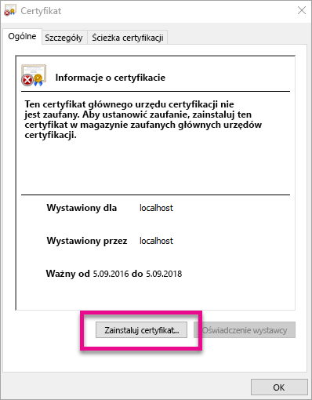
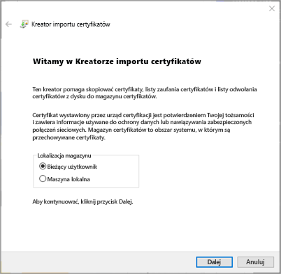
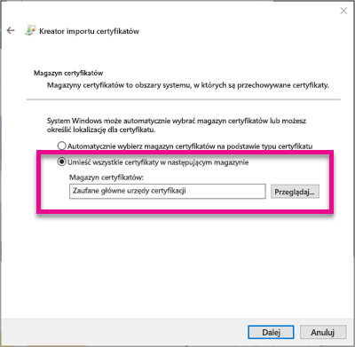
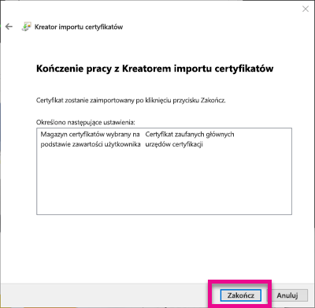
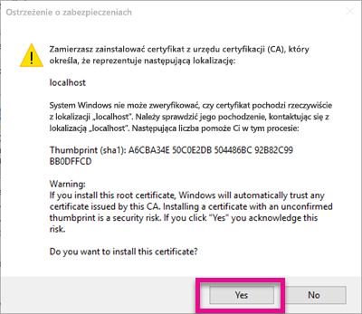
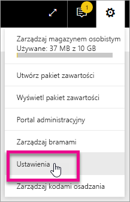
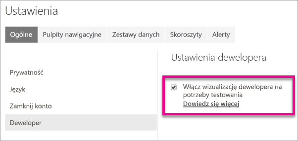
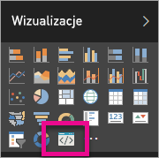

# <a name="use-developer-tools-to-create-custom-visuals"></a>Tworzenie niestandardowych wizualizacji przy użyciu narzędzi deweloperskich
Niestandardowe wizualizacje umożliwiają dostosowanie wizualizacji do potrzeb użytkowników i do projektu aplikacji. Dowiedz się, jak utworzyć niestandardową wizualizację dla usługi Power BI przy użyciu narzędzi deweloperskich.

> [!NOTE]
> Ten dokument pomoże Ci zacząć pracę. Aby uzyskać bardziej szczegółowe informacje, zobacz dokumentację w [repozytorium Git wizualizacji usługi Power BI](https://github.com/Microsoft/PowerBI-visuals).
> 
> 

## <a name="requirements"></a>Wymagania
* Wymagane oprogramowanie NodeJS w wersji 4.0 lub nowszej (zalecana wersja 5.0 lub nowsza) [Pobierz oprogramowanie NodeJS](https://nodejs.org)

## <a name="install-nodejs-and-the-power-bi-tools"></a>Instalowanie oprogramowania NodeJS i narzędzi usługi Power BI
Aby tworzyć niestandardowe wizualizacje, należy zainstalować oprogramowanie NodeJS. Oprogramowanie NodeJS jest wymagane do uruchamiania narzędzi wiersza polecenia.

1. Pobierz i zainstaluj oprogramowanie [NodeJS](https://nodejs.org). Wymagana jest wersja 4.0 lub nowsza, ale zalecamy korzystanie z wersji 5.0 lub nowszej.
2. Zainstaluj narzędzia wiersza polecenia. Uruchom następujące polecenie w wierszu polecenia.
   
        npm install -g powerbi-visuals-tools
3. Możesz sprawdzić, czy wymagane narzędzia są zainstalowane, uruchamiając następujące polecenie bez parametrów.
   
        pbiviz
   
    Powinna zostać zwrócona pomoc.
   
    <pre><code>
         +syyso+/
    oms/+osyhdhyso/
    ym/       /+oshddhys+/
    ym/              /+oyhddhyo+/
    ym/                     /osyhdho
    ym/                           sm+
    ym/               yddy        om+
    ym/         shho /mmmm/       om+
     /    oys/ +mmmm /mmmm/       om+
    oso  ommmh +mmmm /mmmm/       om+
   ymmmy smmmh +mmmm /mmmm/       om+
   ymmmy smmmh +mmmm /mmmm/       om+
   ymmmy smmmh +mmmm /mmmm/       om+
   +dmd+ smmmh +mmmm /mmmm/       om+
         /hmdo +mmmm /mmmm/ /so+//ym/
               /dmmh /mmmm/ /osyhhy/
                 //   dmmd
                       ++
   
       PowerBI Custom Visual Tool
   
    Usage: pbiviz [options] [command]
   
    Commands:
   
    new [name]        Create a new visual
    info              Display info about the current visual
    start             Start the current visual
    package           Package the current visual into a pbiviz file
    update [version]  Updates the api definitions and schemas in the current visual. Changes the version if specified
    help [cmd]        display help for [cmd]
   
    Options:
   
    -h, --help      output usage information
    -V, --version   output the version number
    --install-cert  Install localhost certificate
    </code></pre>

<a name"ssl-setup"></a>

### <a name="server-certificate-setup"></a>Konfiguracja certyfikatu serwera
Aby umożliwić podgląd wizualizacji na żywo, wymagany jest zaufany serwer https. Przed rozpoczęciem należy zainstalować certyfikat SSL umożliwiający ładowanie zasobów wizualnych w przeglądarce internetowej. 

> [!NOTE]
> Wymaga to jednorazowej konfiguracji na stacji roboczej dewelopera.
> 
> 

Aby *dodać* certyfikat, uruchom następujące polecenie.

    pbiviz --install-cert

**System operacyjny Windows**

1. Wybierz pozycję **Zainstaluj certyfikat**.
   
    
2. Wybierz pozycję **Bieżący użytkownik**, a następnie **Dalej**.
   
    
3. Wybierz pozycję **Umieść wszystkie certyfikaty w następującym magazynie**, a następnie **Przeglądaj**.
4. Wybierz pozycję **Zaufane główne urzędy certyfikacji**, a następnie przycisk **OK**. Wybierz pozycję **Dalej**.
   
    
5. Wybierz pozycję **Zakończ**.
   
    
6. Wybierz przycisk **Tak** w oknie dialogowym z ostrzeżeniem o zabezpieczeniach.
   
    
7. Zamknij wszelkie otwarte okna przeglądarki.

> [!NOTE]
> Jeśli certyfikat nie zostanie rozpoznany, może być konieczne ponowne uruchomienie komputera.
> 
> 

**System OSX**

1. Jeśli kłódka w lewym górnym rogu jest zamknięta, wybierz ją, aby ją otworzyć. Wyszukaj ciąg *localhost* i kliknij dwukrotnie certyfikat.
   
    
2. Wybierz pozycję **Zawsze ufaj** i zamknij okno.
   
    
3. Wprowadź nazwę użytkownika i hasło. Wybierz polecenie **Aktualizuj ustawienia**.
   
    
4. Zamknij wszelkie otwarte okna przeglądarki.

> [!NOTE]
> Jeśli certyfikat nie zostanie rozpoznany, może być konieczne ponowne uruchomienie komputera.
> 
> 

## <a name="enable-live-preview-of-developer-visual"></a>Włączanie podglądu na żywo wizualizacji dewelopera
Aby włączyć podgląd na żywo wizualizacji niestandardowej, wykonaj następujące czynności. To umożliwi używanie wizualizacji w usłudze Power BI podczas edycji raportów.

1. Przejdź do witryny [app.powerbi.com](https://app.powerbi.com) i zaloguj się.
2. Wybierz **ikonę koła zębatego**, a następnie pozycję **Ustawienia**.
   
    
3. Wybierz pozycję **Deweloper**, a następnie **Włącz element wizualny dewelopera na potrzeby testu**.
   
    
4. Wybierz pozycję **Element wizualny dewelopera** w okienku **Wizualizacja**.
   
    
   
   > [!NOTE]
   > To wymaga uprzedniego uruchomienia polecenia `pbiviz start` z poziomu folderu wizualizacji na maszynie deweloperskiej. Aby uzyskać więcej informacji na temat tworzenia wizualizacji, zobacz [Tworzenie nowej wizualizacji](#create-a-new-visual) w tym artykule.
   > 
   > 
5. Wybierz wizualizację na kanwie raportu. Możesz powiązać z nią dane tak samo, jak w przypadku innych wizualizacji.

Teraz możesz rozpocząć opracowywanie wizualizacji.

## <a name="create-a-new-visual"></a>Tworzenie nowej wizualizacji
Możesz utworzyć nowy projekt wizualizacji, uruchamiając następujące polecenie.

```
pbiviz new My Visual name
```

Ciąg *My Visual Name* możesz zastąpić wybraną nazwą wizualizacji. Tę nazwę można później zmienić, modyfikując pola `name` i `displayName` w wygenerowanym pliku `pbiviz.json`.

To polecenie spowoduje utworzenie nowego folderu w katalogu, w którym uruchomiono polecenie. Zostanie wygenerowany podstawowy szablon początkowy wizualizacji. Po wykonaniu polecenia możesz otworzyć ten katalog i rozpocząć pracę nad nową wizualizacją w preferowanym edytorze.

## <a name="testing-your-visual-in-power-bi"></a>Testowanie wizualizacji w usłudze Power BI
Możesz przetestować wizualizację w raportach i pulpitach nawigacyjnych w usłudze Power BI.

<a name="running-your-visual"></a>

### <a name="running-your-visual"></a>Uruchamianie wizualizacji
Aby uruchomić wizualizację, wykonaj następujące czynności.

1. Otwórz wiersz polecenia.
2. Zmień katalog na folder zawierający wizualizację. Jest to folder, w którym znajduje się plik `pbiviz.json`.
3. Uruchom następujące polecenie.
   
    ```
    pbiviz start
    ```
   
    

Jeśli jesteś w niewłaściwej lokalizacji, zobaczysz błąd podobny do przedstawionego poniżej.

```
    error  LOAD ERROR Error: pbiviz.json not found. You must be in the root of a visual project to run this command.
        at e (C:\Users\[user]\AppData\Roaming\npm\node_modules\powerbi-visuals-tools\lib\VisualPackage.js:67:35)
        at Function.loadVisualPackage (C:\Users\[user]\AppData\Roaming\npm\node_modules\powerbi-visuals-tools\lib\VisualPackage.js:62:16)
        at Object.<anonymous> (C:\Users\[user]\AppData\Roaming\npm\node_modules\powerbi-visuals-tools\bin\pbiviz-start.js:43:15)
        at Module._compile (module.js:556:32)
        at Object.Module._extensions..js (module.js:565:10)
        at Module.load (module.js:473:32)
        at tryModuleLoad (module.js:432:12)
        at Function.Module._load (module.js:424:3)
        at Module.runMain (module.js:590:10)
        at run (bootstrap_node.js:394:7)
```

### <a name="viewing-your-visual-in-power-bi"></a>Wyświetlanie wizualizacji w usłudze Power BI
Aby wyświetlić wizualizację w raporcie, przejdź do tego raportu i wybierz wizualizację w okienku **Wizualizacje**.

> [!NOTE]
> Przed wykonaniem tych czynności należy uruchomić polecenie `pbiviz start`, zgodnie z opisem w sekcji [Uruchamianie wizualizacji](#running-your-visual).
> 
> 


Następnie zobaczysz początkowy szablon wizualizacji.


| Element paska narzędzi | Opis |
| --- | --- |
| Odśwież wizualizację |Umożliwia ręczne odświeżanie wizualizacji, gdy automatyczne ponowne ładowanie jest wyłączone. |
| Przełącz automatyczne ponowne ładowanie |Gdy to ustawienie jest włączone, wizualizacja będzie automatycznie aktualizowana przy każdym zapisaniu pliku wizualizacji. |
| Pokaż widok danych |Pokazuje widok danych bazowych wizualizacji na potrzeby debugowania. |
| Uzyskaj pomoc |Dokumentacja w witrynie GitHub. |
| Prześlij opinię |Powiadom nas, jeśli możemy poprawić to środowisko! (Wymagane konto GitHub) |

## <a name="package-your-visual-for-use-in-power-bi-desktop-and-distribution"></a>Pakowanie wizualizacji na potrzeby używania w programie Power BI Desktop i dystrybucji
Aby było możliwe ładowanie wizualizacji w programie [Power BI Desktop](https://powerbi.microsoft.com/desktop/) lub udostępnianie jej społeczności w [galerii wizualizacji usługi Power BI](https://visuals.powerbi.com), należy wygenerować plik `pbiviz`.

Aby spakować wizualizację, wykonaj następujące czynności.

1. Otwórz wiersz polecenia.
2. Zmień katalog na folder zawierający wizualizację. Jest to folder, w którym znajduje się plik `pbiviz.json`.
3. Uruchom następujące polecenie.
   
    ```
    pbiviz package
    ```

Uruchomienie tego polecenia spowoduje utworzenie pliku `pbiviz` w katalogu `dist/` projektu wizualizacji. Jeśli plik `pbiviz` już istnieje, zostanie zastąpiony.

## <a name="updating-the-visuals-api-version"></a>Aktualizowanie wersji interfejsu API wizualizacji
Podczas tworzenia wizualizacji przy użyciu polecenia `pbiviz new` kopia schematów json i definicji typów interfejsu API jest zapisywana w katalogu wizualizacji. W razie potrzeby możesz zaktualizować te pliki przy użyciu polecenia `pbiviz update`. To może być przydatne w przypadku udostępnienia poprawek dla starszej wersji interfejsu API lub chęci uaktualnienia do najnowszej wersji interfejsu API.

### <a name="updating-your-existing-api-version"></a>Aktualizowanie istniejącej wersji interfejsu API
W przypadku udostępnienia aktualizacji istniejącego interfejsu API możesz uzyskać najnowszą wersję, wykonując następujące czynności.

```
#Update your version of pbiviz
npm install -g powerbi-visuals-tools

#Run update from the root of your visual project, where pbiviz.json is located
pbiviz update
```

To spowoduje pobranie najnowszych narzędzi npm, w tym zaktualizowanych definicji typów i schematów. Użycie polecenia `pbiviz update` spowoduje zastąpienie właściwości `apiVersion` w pliku *pbiviz.json* najnowszą wersją.

### <a name="upgrading-to-a-different-api-version"></a>Uaktualnianie do innej wersji interfejsu API
Możesz przeprowadzić aktualizację do innej wersji interfejsu API, wykonując czynności opisane powyżej. Możesz wprost określić wersję interfejsu API, której chcesz użyć.

```
#Update your version of pbiviz
npm install -g powerbi-visuals-tools

#Run update from the root of your visual project, where pbiviz.json is located
pbiviz update 1.2.0
```

To polecenie spowodowałoby aktualizację wizualizacji do wersji 1.2.0 interfejsu API. Możesz zastąpić wartość `1.2.0` dowolną wersją, której chcesz używać.

> [!WARNING]
> Domyślną wersją interfejsu API używaną przez te narzędzia jest zawsze wersja stabilna. Wszelkie wersje interfejsu API nowsze niż domyślna są wersjami niestabilnymi i mogą ulec zmianie. To może spowodować nieoczekiwane działanie oraz różnice w działaniu między usługą Power BI a programem Power BI Desktop. Bieżącą stabilną wersję interfejsu API wskazuje [dziennik zmian](https://github.com/Microsoft/PowerBI-visuals/blob/master/ChangeLog.md). Aby uzyskać więcej informacji o wersjach wstępnych, zobacz [plan rozwoju](https://github.com/Microsoft/PowerBI-visuals/blob/master/Roadmap/README.md).
> 
> 

## <a name="inside-the-visual-project"></a>Wewnątrz projektu wizualizacji
Projekt wizualizacji to folder tworzony po uruchomieniu polecenia `pbiviz new`. 

### <a name="file-structure"></a>Struktura plików
| Element | Opis |
| --- | --- |
| assets/ |Tu przechowywane są zasoby wizualizacji (ikona, zrzuty ekranu itp.). |
| dist/ |Tutaj zostanie wygenerowany plik pbiviz po uruchomieniu polecenia `pbiviz package`. |
| src/ |Kod języka TypeScript wizualizacji. |
| style/ |Style języka Less wizualizacji. |
| .gitignore |Polecenie dla usługi Git powodujące ignorowanie plików, które nie powinny być śledzone w tym repozytorium. |
| capabilities.json |Definiuje [możliwości](https://github.com/Microsoft/PowerBI-visuals/blob/master/Capabilities/Capabilities.md) wizualizacji. |
| package.json |Plik używany przez oprogramowanie [npm](https://www.npmjs.com/) do zarządzania modułami. |
| pbiviz.json |Główny plik konfiguracji. |
| tsconfig.json |Ustawienia kompilatora języka TypeScript. Uzyskaj więcej informacji o pliku [tsconfig.json](https://www.typescriptlang.org/docs/handbook/tsconfig-json.html). |

### <a name="pbivizjson"></a>pbiviz.json
Jest to główny plik konfiguracji wizualizacji. Zawiera metadane oraz informacje o plikach wymagane do skompilowania wizualizacji.

```
{
    "visual": {
        "name": "myVisual", // internal visual name (should not contain spaces)
        "displayName": "My Visual!", // visual name displayed to user (used in gallery)
        "guid": "PBI_CV_xxxxxxx", // a unique id for this visual MUST BE UNIQUE
        "visualClassName": "Visual" // the entry class for your visual
        "version": "1.0.0", // visual version. Should be semantic version (increment if you update the visual)
        "description": "", // description used in gallery
        "supportUrl": "", // url to where users can get support for this visual
        "gitHubUrl": "" // url to the source in github (if applicable)
    },
    "apiVersion": "1.0.0", //API version this visual was created with
    "author": {
        "name": "", // your name
        "email": "" // your e-mail
    },
    "assets": {
        "icon": "assets/icon.png" // relative path to your icon file (20x20 png)
    },
    "style": "style/visual.less", // relative path to your less file
    "capabilities": "capabilities.json" // relative path to your capabilities definition 
}
```

### <a name="visual-source-typescript"></a>Kod źródłowy wizualizacji (TypeScript)
Kod wizualizacji należy napisać w języku TypeScript, będącym nadzbiorem języka JavaScript obsługującym bardziej zaawansowane funkcje oraz wczesny dostęp do funkcji ES6/ES7.

Wszystkie pliki języka TypeScript powinny znajdować się w katalogu `src/` i być dodane do tablicy `files` w pliku `tsconfig.json`. To umożliwia kompilatorowi języka TypeScript ładowanie ich w odpowiedniej kolejności.

Podczas kompilowania wizualizacji cały kod języka TypeScript zostanie skompilowany w jednym pliku JavaScript. To umożliwia odwoływanie się do elementów wyeksportowanych z innych plików bez konieczności ręcznego uruchamiania polecenia `require`, o ile oba pliki są wymienione w pliku tsconfig.

Można utworzyć dowolną liczbę plików i klas na potrzeby tworzenia wizualizacji.

Dowiedz się więcej na temat języka [TypeScript](http://www.typescriptlang.org/).

### <a name="visual-style-less"></a>Styl wizualizacji (Less)
Style wizualizacji są obsługiwane za pomocą kaskadowych arkuszy stylów (CSS). Dla wygody używany jest kompilator wstępny języka Less, obsługujący niektóre funkcje zaawansowane, takie jak zagnieżdżanie, zmienne, domieszki, warunki, pętle itp. Jeśli nie chcesz używać żadnych z tych funkcji, możesz zapisać w pliku języka Less zwykły kod CSS.

Wszystkie pliki języka Less powinny znajdować się w katalogu `style/`. Zostanie załadowany plik wskazany w polu `style` w pliku `pbiviz.json`. Wszelkie dodatkowe pliki należy załadować przy użyciu polecenia `@import`.

Dowiedz się więcej na temat języka [Less](http://lesscss.org/).

## <a name="debugging"></a>Debugowanie
Aby uzyskać wskazówki dotyczące debugowania wizualizacji niestandardowej, zobacz [przewodnik po debugowaniu](https://github.com/Microsoft/PowerBI-visuals/blob/master/tools/debugging.md).

## <a name="submit-your-visual-to-appsource"></a>Przesyłanie własnej wizualizacji do usługi AppSource
Własną wizualizację można udostępnić do użytku innym, przesyłając ją do usługi AppSource. Aby uzyskać więcej informacji na temat tego procesu, zobacz [Publish custom visuals to AppSource](developer/office-store.md) (Publikowanie wizualizacji niestandardowych w usłudze AppSource).

## <a name="troubleshooting"></a>Rozwiązywanie problemów
**Nie znaleziono polecenia Pbiviz (i podobne błędy)**

Po uruchomieniu polecenia `pbiviz` w terminalu lub wierszu polecenia powinien zostać wyświetlony ekran pomocy. Jeśli tak nie jest, nie zostało ono poprawnie zainstalowane. Upewnij się, że masz zainstalowaną wersję oprogramowania NodeJS 4.0 lub nowszą.

Aby uzyskać więcej informacji, zobacz [Instalowanie oprogramowania NodeJS i narzędzi usługi Power BI](#install-nodejs-and-the-power-bi-tools).

**Nie można znaleźć wizualizacji debugowania na karcie Wizualizacje**

Wizualizacja debugowania wygląda jak ikona wiersza polecenia na karcie **Wizualizacje**.


Jeśli jej nie widać, sprawdź, czy została włączona w ustawieniach usługi Power BI. 

> [!NOTE]
> Wizualizacja debugowania jest aktualnie dostępna tylko w usłudze Power BI, a nie w programie Power BI Desktop ani aplikacji mobilnej. Natomiast spakowana wizualizacja będzie działała wszędzie.
> 
> 

Aby uzyskać więcej informacji, zobacz [Włączanie podglądu na żywo wizualizacji dewelopera](#enable-live-preview-of-developer-visual).

**Nie można skontaktować się z serwerem wizualizacji**

Uruchom serwer wizualizacji, wprowadzając polecenie `pbiviz start` w terminalu lub wierszu polecenia na poziomie katalogu głównego projektu wizualizacji. Jeśli serwer jest uruchomiony, prawdopodobnie nie zainstalowano poprawnie certyfikatów SSL.

Aby uzyskać więcej informacji, zobacz [Uruchamianie wizualizacji](#running-your-visual) lub [Konfiguracja certyfikatu serwera](#ssl-setup).

## <a name="next-steps"></a>Następne kroki
[Wizualizacje w usłudze Power BI](power-bi-report-visualizations.md)  
[Wizualizacje niestandardowe w usłudze Power BI](power-bi-custom-visuals.md)  
[Publikowanie wizualizacji niestandardowych w Sklepie Office](developer/office-store.md)  
[Język TypeScript](http://www.typescriptlang.org/)  
[Język Less CSS](http://lesscss.org/)  

Masz więcej pytań? [Zadaj pytanie społeczności usługi Power BI](http://community.powerbi.com/)

