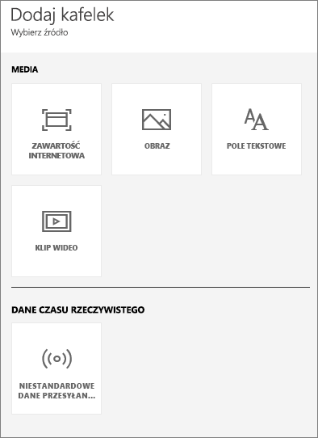
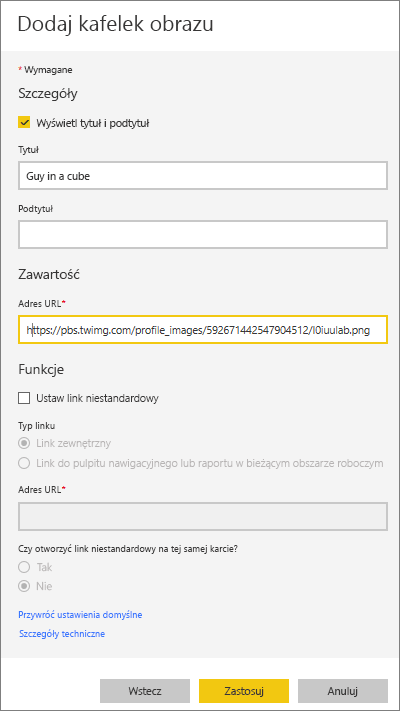
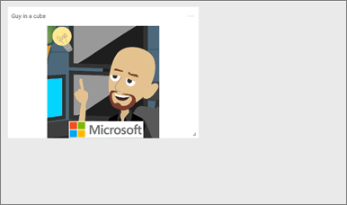
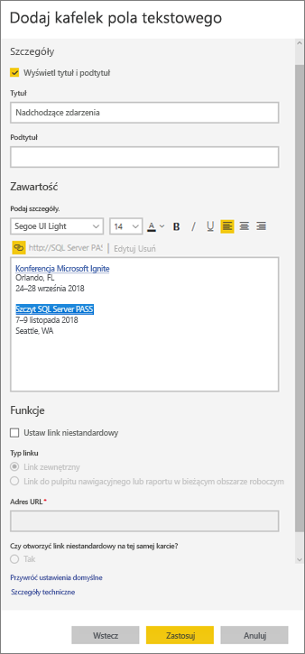
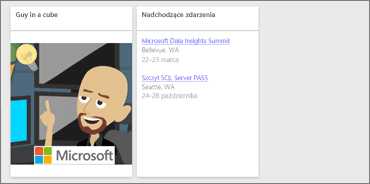
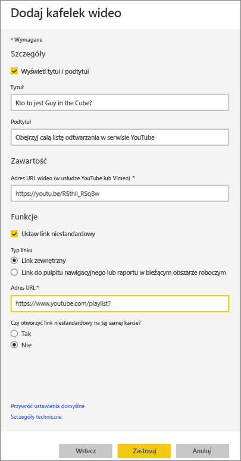
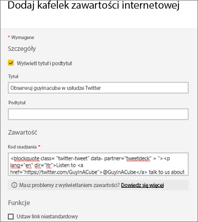
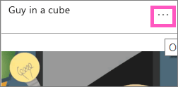
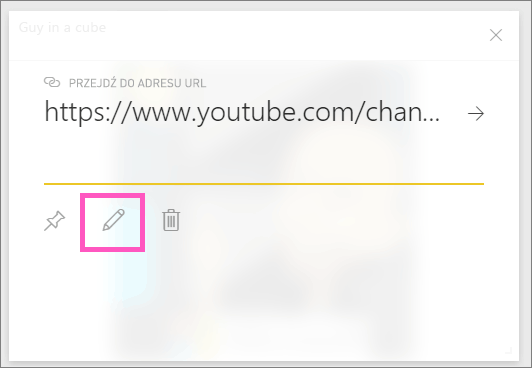

# <a name="add-image-text-video-and-more-to-your-dashboard"></a>Dodawanie obrazu, tekstu, wideo itd. do pulpitu nawigacyjnego
<iframe width="560" height="315" src="https://www.youtube.com/embed/e2PD8m1Q0vU" frameborder="0" allowfullscreen></iframe>


## <a name="add-tile"></a>Dodawanie kafelka
Kontrolka **Dodawanie kafelka** umożliwia bezpośrednie dodanie obrazu, pola tekstowego, wideo, danych strumieniowych lub kodu internetowego do własnego pulpitu nawigacyjnego.

1. Wybierz pozycję **Dodaj kafelek** na pasku menu u góry. W zależności od ograniczeń miejsca może zostać wyświetlony tylko znak plus .
   
    
2. Wybierz typ kafelka do dodania: **Obraz**, **Pole tekstowe**, **Wideo**, **Treść internetowa** lub **Niestandardowe dane strumieniowe**.
   
    

## <a name="add-an-image"></a>Dodawanie obrazu
Załóżmy, że chcesz umieścić logo swojej firmy na swoim pulpicie nawigacyjnym lub jakiś inny obraz. Musisz zapisać plik obrazu w trybie online i połączyć się z nim. Upewnij się, że specjalne poświadczenia nie są wymagane do uzyskania dostępu do pliku obrazu. Na przykład usługa OneDrive i program SharePoint wymagają uwierzytelniania, dzięki czemu obrazy tam przechowywane nie mogą zostać dodane do pulpitu nawigacyjnego w ten sposób.  

1. Wybierz pozycje **Obraz** > **Dalej**.
2. Dodaj informacje o obrazie w oknie **Dodawanie kafelka obrazu**.
   
    
   
   * aby wyświetlić tytuł powyżej obrazu, wybierz pozycję *Wyświetl tytuł i podtytuł* oraz wpisz tytuł lub podtytuł.
   * wprowadź adres URL obrazu
   * aby przekształcić kafelek w hiperlink, wybierz pozycję **Ustaw link niestandardowy**, a następnie wprowadź adres URL.  Gdy współpracownicy klikną ten obraz lub tytuł, zostaną przekierowani do tego adresu URL.
   * Wybierz pozycję **Zastosuj**.  Na pulpicie nawigacyjnym zmień rozmiar i przenieś obraz odpowiednio do potrzeb.
     
     

## <a name="add-a-text-box-or-dashboard-heading"></a>Dodawanie pola tekstowego lub nagłówka pulpitu nawigacyjnego
1. Wybierz pozycje **Pole tekstowe > Dalej**.
   
   > **UWAGA**: Aby dodać nagłówek pulpitu nawigacyjnego, wpisz swój nagłówek w polu tekstowym i zwiększ czcionki.
   > 
2. Formatowanie pola tekstowego:
   
   * aby wyświetlić tytuł powyżej pola tekstowego, wybierz pozycję **Wyświetl tytuł i podtytuł** oraz wpisz tytuł lub podtytuł.
   * wprowadź i sformatuj zawartość pola tekstowego.  
   * Opcjonalnie ustaw niestandardowy link dla tytułu. Link niestandardowy może prowadzić do witryny zewnętrznej lub pulpitu nawigacyjnego albo raportu w obszarze roboczym. Jednak w tym przykładzie dodano hiperlinki w samym polu tekstowym, więc pole **Ustaw link niestandardowy** pozostanie niezaznaczone.

     
   
3. Wybierz pozycję **Zastosuj**.  Na pulpicie nawigacyjnym zmień rozmiar i przenieś pole tekstowe odpowiednio do potrzeb.
   
   

## <a name="add-a-video"></a>Dodawanie wideo
Po dodaniu kafelka wideo serwisu YouTube lub Vimeo do pulpitu nawigacyjnego odtwarzanie wideo odbywa się bezpośrednio na pulpicie nawigacyjnym.

1. Wybierz pozycje **Wideo > Dalej**.
2. Dodaj informacje o filmie wideo w okienku **Dodawanie kafelka wideo**.
   
    
   
   * aby wyświetlić tytuł lub podtytuł na górze kafelka wideo, wybierz pozycję *Wyświetl tytuł i podtytuł* oraz wpisz tytuł lub podtytuł. W tym przykładzie dodamy podtytuł, a następnie przekształcimy go w hiperlink z powrotem do całej listy odtwarzania w serwisie YouTube.
   * wprowadź adres URL wideo
   * Dodaj hiperlink do tytułu i podtytułu.  Prawdopodobnie po obejrzeniu przez współpracowników osadzonego wideo chcesz, aby wyświetlili całą listę odtwarzania w serwisie YouTube — dodaj link do swojej listy odtwarzania tutaj.
   * Wybierz pozycję **Zastosuj**.  Na pulpicie nawigacyjnym zmień rozmiar i przenieś kafelek wideo odpowiednio do potrzeb.
     
      
3. Wybierz kafelek wideo, aby odtworzyć wideo.
4. Wybierz podtytuł, aby odwiedzić listę odtwarzania w serwisie YouTube.

## <a name="add-streaming-data"></a>Dodawanie danych strumieniowych
<iframe width="560" height="315" src="https://www.youtube.com/embed/kOuINwgkEkQ" frameborder="0" allowfullscreen></iframe>

## <a name="add-web-content"></a>Dodawanie treści internetowych
Wklej lub wpisz dowolną zawartość HTML.  Usługa Power BI doda ją, jako kafelek, do Twojego pulpitu nawigacyjnego. Wprowadź kod osadzania ręcznie lub skopiuj/wklej z takich witryn, jak Twitter, YouTube, embed.ly i inne.

1. Wybierz pozycje **Treść internetowa > Dalej**.
2. Dodaj informacje do okienka **Dodaj kafelek z treścią internetową**.
   
    
   
   * aby wyświetlić tytuł powyżej kafelka, wybierz pozycję *Wyświetl tytuł i podtytuł* oraz wpisz tytuł lub podtytuł.
   * wprowadź kod osadzania. W tym przykładzie kopiujemy i wklejamy kanał informacyjny usługi Twitter.
3. Wybierz pozycję **Zastosuj**.  Na pulpicie nawigacyjnym zmień rozmiar i przenieś kafelek treści internetowej odpowiednio do potrzeb.
     
      

## <a name="tips-for-embedding-web-content"></a>Porady dotyczące osadzania treści internetowej
* Dla ramek iframe użyj bezpiecznego źródła. Po wprowadzeniu swojego kodu osadzania ramek iframe i uzyskaniu pustego kafelka sprawdź, czy używasz protokołu **http** jako źródła ramek iframe.  Jeśli tak, zmień protokół na **https**.
  
  ```
  <iframe src="https://xyz.com">
  ```
* Edytuj informacje o szerokości i wysokości. Ten kod osadzania osadza klip wideo i ustawia odtwarzacz wideo na 560 x 315 pikseli.  Ten rozmiar nie zmieni się, gdy zmieniasz rozmiar kafelka.
  
  ```
  <iframe width="560" height="315"
  src="https://www.youtube.com/embed/Cle_rKBpZ28" frameborder="0"
   allowfullscreen></iframe>
  ```
  
  Jeśli chcesz zmienić rozmiar odtwarzacza, aby dopasować rozmiar kafelka, ustaw szerokości i wysokości na 100%.
  
  ```
  <iframe width="100%" height="100%"
  src="https://www.youtube.com/embed/Cle_rKBpZ28" frameborder="0"
   allowfullscreen></iframe>
  ```
* Ten kod osadza tweet i zachowuje, jako osobne linki na pulpicie nawigacyjnym, linki dla podkastu **AFK**, **@GuyInACube stronę serwisu Twitter**, **Wykonaj**,  **#analytics**, **odpowiedź**, **prześlij tweet ponownie** i **lubię**.  Wybranie samego kafelka przeniesie Cię do podkastów w serwisie Twitter.
  
  ```
  <blockquote class="twitter-tweet" data-partner="tweetdeck">
  <p lang="en" dir="ltr">Listen to
  <a href="https://twitter.com/GuyInACube">@GuyInACube</a> talk to
  us about making videos about Microsoft Business Intelligence
  platform
  <a href="https://t.co/TmRgalz7tv">https://t.co/TmRgalz7tv </a>
  <a href="https://twitter.com/hashtag/analytics?src=hash">
  #analytics</a></p>&mdash; AFTK Podcast (@aftkpodcast) <a
  href="https://twitter.com/aftkpodcast/status/693465456531771392">
  January 30, 2016</a></blockquote> <script async src="//platform.twitter.com/widgets.js" charset="utf-8"></script>
  ```

## <a name="edit-a-tile"></a>Edytowanie kafelka
Aby wprowadzić zmiany na kafelku...

1. Ustaw kursor nad prawym górnym rogiem kafelka i wybierz wielokropek.
   
    
2. Wybierz ikonę edycji, aby ponownie otworzyć okienko **Szczegóły kafelka** i dokonać zmian.
   
    

## <a name="considerations-and-troubleshooting"></a>Istotne zagadnienia i rozwiązywanie problemów
* Aby ułatwić przenoszenie kafelka na Twoim pulpicie nawigacyjnym, dodaj tytułu lub podtytuł.
* Jeśli chcesz osadzić pewne treści z witryny internetowej, ale witryna nie udostępnia Ci kodu osadzania do kopiowania i wklejania, zapoznaj się z embed.ly, aby uzyskać pomoc dotyczącą generowania kodu osadzania.

## <a name="next-steps"></a>Następne kroki
[Kafelki pulpitu nawigacyjnego](service-dashboard-tiles.md)

Masz więcej pytań? [Odwiedź Społeczność usługi Power BI](http://community.powerbi.com/).

