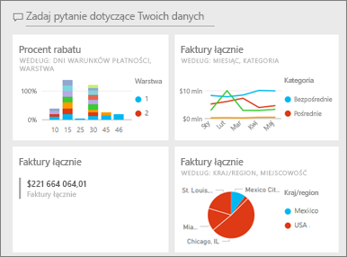
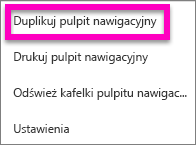
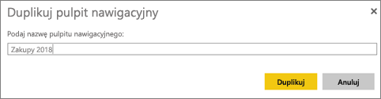
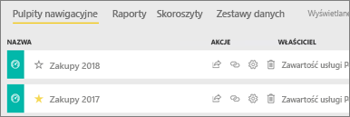

# Tworzenie kopii pulpitu nawigacyjnego w usłudze Power BI

 Istnieje wiele różnych powodów, dla których kopia pulpitu nawigacyjnego może być potrzebna. Być może chcesz wprowadzić zmiany i przetestować jego działanie w porównaniu z oryginałem lub utworzyć nieco inne wersje do rozpowszechniania wśród współpracowników, w regionie lub zespole. Prawdopodobnie współpracowniczka podziwia Twój projekt pulpitu nawigacyjnego i chce używać go do raportowania do jej menedżerów. Inną przyczyną może być to, że jeśli masz nową bazę danych z tą samą strukturą i typami danych oraz chcesz ponownie użyć pulpitu nawigacyjnego, który został już utworzony — to też może zostać zrobione, ale będzie wymagało pewnych dodatkowych prac w programie Power BI Desktop. 

Pulpity nawigacyjne są tworzone (i kopiowane) przy użyciu usługi Power BI i mogą być wyświetlane w usłudze Power BI dla urządzeń przenośnych i Power BI Embedded.  Pulpity nawigacyjne nie są dostępne w programie Power BI Desktop. 

Aby utworzyć kopię pulpitu nawigacyjnego, musisz być *twórcą* pulpitu nawigacyjnego. Pulpity nawigacyjne, które zostały Ci udostępnione jako aplikacja, nie mogą być duplikowane.

1. Otwórz pulpit nawigacyjny.
2. W prawym górnym rogu wybierz wielokropek (...), a następnie wybierz pozycję **Duplikuj pulpit nawigacyjny**.
   
   
3. Nadaj pulpitowi nawigacyjnemu nazwę i wybierz pozycję **Duplikuj**. 
   
   
4. Nowy pulpit nawigacyjny zostanie zapisany w tym samym obszarze roboczym co oryginalny. 
   
   

5.    Otwórz nowy pulpit nawigacyjny i zmodyfikuj go zgodnie z potrzebami. Poniżej przedstawiono niektóre czynności, które możesz zrobić później:    
    a. [Przenoszenie kafelków, zmiana ich nazwy lub rozmiaru, a nawet ich usuwanie](service-dashboard-edit-tile.md).  
    b. Edytowanie szczegółów i hiperlinków kafelków przez wybranie wielokropka (...) dla kafelka, a następnie wybranie pozycji **Edytuj szczegóły**.  
    c. [Dodawanie nowych kafelków z paska menu pulpitu nawigacyjnego](service-dashboard-add-widget.md) (**Dodaj kafelek**)  
    d. Przypinanie nowych kafelków [z funkcji pytań i odpowiedzi](service-dashboard-pin-tile-from-q-and-a.md) lub [z raportów](service-dashboard-pin-tile-from-report.md).  
    e. Zmiana nazwy pulpitu nawigacyjnego, włączanie i wyłączanie funkcji pytań i odpowiedzi oraz konfigurowanie przepływu kafelka z okienka ustawień pulpitu nawigacyjnego.  (wybierz menu rozwijane wielokropka [...] pulpitu nawigacyjnego, a następnie wybierz pozycję **Ustawienia**)  
    f. Udostępnianie swojego pulpitu nawigacyjnego współpracownikom bezpośrednio lub w ramach aplikacji usługi Power BI. 

## Następne kroki
* [Porady dotyczące projektowania doskonałych pulpitów nawigacyjnych](service-dashboards-design-tips.md) 

Masz więcej pytań? [Odwiedź społeczność usługi Power BI](http://community.powerbi.com/)

