# Tworzenie pulpitu nawigacyjnego usługi Power BI z raportu
Po zapoznaniu się z tematem [Pulpity nawigacyjne w usłudze Power BI](service-dashboards.md) możesz teraz utworzyć własny raport. Istnieje wiele sposobów, aby utworzyć pulpit nawigacyjny — z raportu, od podstaw, z zestawu danych, duplikując istniejący pulpit nawigacyjny itp.  

Przy rozpoczynaniu pracy po raz pierwszy może to wydawać się trudne, dlatego zaczniemy, tworząc szybki i łatwy pulpit nawigacyjny poprzez przypięcie wizualizacji z raportu, który został już utworzony. Po ukończeniu tego przewodnika Szybki Start będziesz dobrze rozumieć relacje między pulpitami nawigacyjnymi a raportami, a także umieć otwierać Widok do edycji w edytorze raportów, przypinać kafelki i nawigować między pulpitem nawigacyjnym a raportem. Następnie użyj linków w spisie treści po lewej stronie lub skorzystaj z opcji **Następne kroki** na dole, aby przejść do bardziej zaawansowanych tematów.

## Kto może utworzyć pulpit nawigacyjny?
Tworzenie pulpitu nawigacyjnego jest funkcją **twórcy** i wymaga uprawnień do edytowania raportu. Uprawnienia do edytowania są dostępne dla twórców raportu i tych współpracowników, którym twórca udzieli dostępu. Na przykład, jeśli David utworzy raport w obszarze roboczym workspaceABC, a następnie doda Ciebie jako członka tego obszaru roboczego, Ty i David będziecie mieli uprawnienia do edycji. Z drugiej strony, jeśli raport został udostępniony Ci bezpośrednio lub jako część [aplikacji Power BI](service-create-distribute-apps.md) (jesteś **użytkownikiem** raportu), nie będziesz mieć możliwości przypinania kafelków do pulpitu nawigacyjnego.

> **Uwaga**: pulpity nawigacyjne są funkcjami usługi Power BI, a nie programu Power BI Desktop. Pulpitów nawigacyjnych nie można tworzyć w usłudze Power BI dla urządzeń przenośnych, można je jednak [wyświetlać i udostępniać](consumer/mobile/mobile-apps-view-dashboard.md).
>
> 

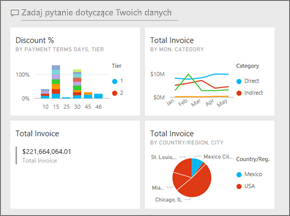

## Film wideo: Tworzenie pulpitu nawigacyjnego przez przypinanie wizualizacji i obrazów z raportu
Obejrzyj film wideo, w którym Amanda tworzy nowy pulpit nawigacyjny przez przypięcie wizualizacji z raportu. Następnie spróbuj zrobić to samodzielnie za pomocą przykładu Próbka analizy zakupów, wykonując kroki opisane poniżej filmu wideo.

<iframe width="560" height="315" src="https://www.youtube.com/embed/lJKgWnvl6bQ" frameborder="0" allowfullscreen></iframe>

### Wymagania wstępne
W celu skorzystania z przewodnika trzeba pobrać skoroszyt programu Excel „Analiza zakupów” i otworzyć go w usłudze Power BI (app.powerbi.com).

## Importowanie zestawu danych z raportem
Zaimportujemy jeden z przykładowych zestawów danych usługi Power BI i użyjemy go do utworzenia nowego pulpitu nawigacyjnego. Przykładowe dane, których będziemy używać, to skoroszyt programu Excel z dwoma arkuszami PowerView. Podczas importowania skoroszytu usługa Power BI doda zestaw danych oraz raport do obszaru roboczego.  Raport jest tworzony automatycznie na podstawie arkuszy PowerView.

1. [Wybierz ten link](http://go.microsoft.com/fwlink/?LinkId=529784), aby pobrać i zapisać plik programu Excel z przykładem Procurement Analysis. Zalecamy zapisanie go w usłudze OneDrive dla Firm.
2. Otwórz usługę Power BI w przeglądarce (app.powerbi.com).
3. Wybierz pozycję **Mój obszar roboczy**.
4. W okienku nawigacji po lewej stronie wybierz pozycję **Pobierz dane**.

    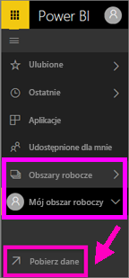
5. Wybierz pozycję **Pliki**.

   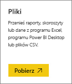
6. Przejdź do miejsca, w którym został zapisany plik programu Excel z przykładem Procurement Analysis. Zaznacz go i wybierz polecenie **Połącz**.

   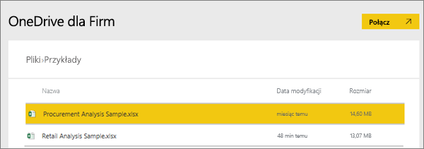
7. W ramach tego ćwiczenia wybierz pozycję **Importuj**.

    
8. Gdy pojawi się komunikat o powodzeniu, wybierz pozycję **x**, aby go zamknąć.

   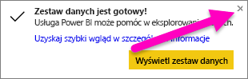

### Otwieranie raportu i przypinanie kafelków do pulpitu nawigacyjnego
1. Pozostając w tym samym obszarze roboczym, wybierz kartę **Raporty**. Zostanie wyświetlony nowo zaimportowany raport oznaczony żółtą gwiazdką. Wybierz nazwę raportu, aby go otworzyć.

    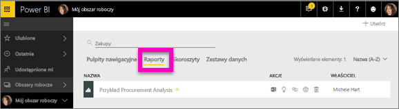
2. Raport zostanie otwarty w widoku do czytania. Zwróć uwagę na dwie karty u dołu: Discount Analysis i Spend Overview. Każda karta reprezentuje stronę raportu.
    Wybierz pozycję **Edytuj raport**, aby otworzyć raport w widoku do edycji.

    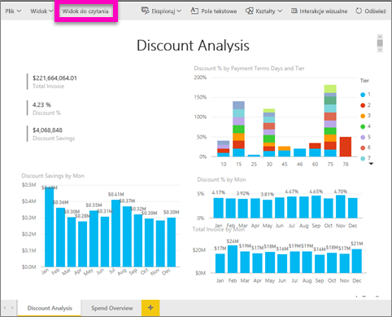
3. Umieść kursor nad wizualizacją, aby wyświetlić dostępne opcje. Aby dodać wizualizację do pulpitu nawigacyjnego, wybierz ikonę przypinania .

    
4. Ponieważ tworzymy nowy pulpit nawigacyjny, wybierz opcję **Nowy pulpit nawigacyjny** i nadaj mu nazwę.

   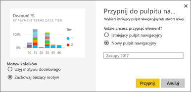
5. Po wybraniu przycisku **Przypnij** usługa Power BI utworzy nowy pulpit nawigacyjny w bieżącym obszarze roboczym. Po wyświetleniu komunikatu **Przypięto do pulpitu nawigacyjnego** wybierz przycisk **Przejdź do pulpitu nawigacyjnego**. Jeśli zostanie wyświetlony monit o zapisanie raportu, wybierz pozycję **Zapisz**.

     
6. Usługa Power BI otworzy nowy pulpit nawigacyjny z jednym kafelkiem — właśnie przypiętą wizualizacją.

   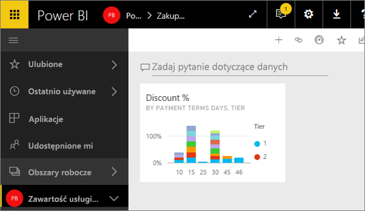
7. Aby powrócić do raportu, wybierz ten kafelek. Przypnij jeszcze kilka kafelków do nowego pulpitu nawigacyjnego. Tym razem, kiedy zostanie wyświetlone okno **Przypinanie do pulpitu nawigacyjnego**, wybierz opcję **Istniejący pulpit nawigacyjny**.  

   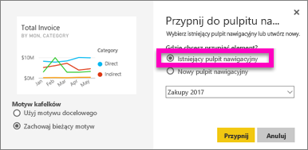

## Przypinanie całej strony raportu do pulpitu nawigacyjnego
Zamiast przypinania po jednym elemencie wizualnym, możesz [przypiąć całą stronę raportu jako *dynamiczny kafelek*](service-dashboard-pin-live-tile-from-report.md). Zróbmy to.

1. W edytorze raportów wybierz kartę **Spend Overview**, aby otworzyć drugą stronę raportu.

   

2. Chcesz mieć na pulpicie nawigacyjnym wszystkie te elementy wizualne.  W prawym górnym rogu paska menu wybierz opcję **Przypnij stronę dynamiczną**. Na pulpicie nawigacyjnym kafelki strony dynamicznej są aktualizowane zawsze po odświeżeniu strony.

   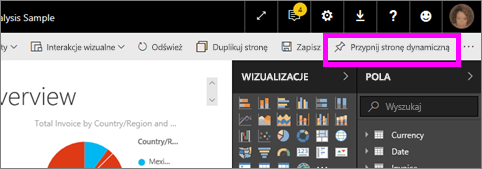

3. Gdy zostanie wyświetlone okno **Przypinanie do pulpitu nawigacyjnego**, wybierz opcję **Istniejący pulpit nawigacyjny**.

   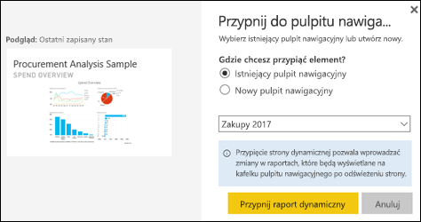

4. Gdy pojawi się komunikat o powodzeniu, wybierz pozycję **Przejdź do pulpitu nawigacyjnego**. Zobaczysz tam kafelki przypięte przez Ciebie z raportu. W poniższym przykładzie przypięliśmy już 2 kafelki ze strony 1 raportu i jeden dynamiczny kafelek, którym jest strona 2 raportu.

   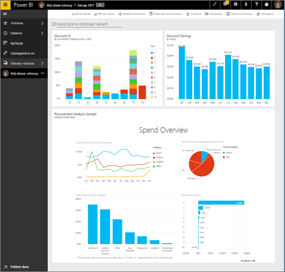

Gratulujemy utworzenia pierwszego pulpitu nawigacyjnego! Teraz, gdy masz już pulpit nawigacyjny, dostępnych jest wiele różnych możliwości.  Spróbuj wykonać jeden z sugerowanych **poniżej kroków** lub zacznij eksperymentować i eksplorować samodzielnie.   

## Następne kroki
* [Zmienianie rozmiaru i przenoszenie kafelków](service-dashboard-edit-tile.md)
* [Wszystkie informacje o kafelkach pulpitu nawigacyjnego](service-dashboard-tiles.md)
* [Udostępnianie pulpitu nawigacyjnego przez tworzenie aplikacji](service-install-use-apps.md)
* [Power BI — podstawowe pojęcia](service-basic-concepts.md)
* [Porady dotyczące projektowania doskonałych pulpitów nawigacyjnych](service-dashboards-design-tips.md)

Masz więcej pytań? [Odwiedź społeczność usługi Power BI](http://community.powerbi.com/)
