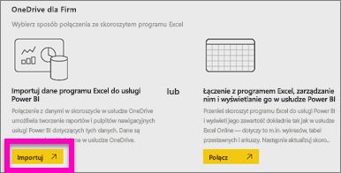

# Tworzenie pulpitu nawigacyjnego usługi Power BI z raportu
Po zapoznaniu się z tematem [Pulpity nawigacyjne w usłudze Power BI](service-dashboards.md) możesz teraz utworzyć własny raport. Istnieje wiele sposobów, aby utworzyć pulpit nawigacyjny — z raportu, od podstaw, z zestawu danych, duplikując istniejący pulpit nawigacyjny itp.  W tym temacie i filmie wideo pokazano, jak utworzyć nowy pulpit nawigacyjny, przypinając wizualizacje z istniejącego raportu.

> **Uwaga**: pulpity nawigacyjne są funkcjami usługi Power BI, a nie programu Power BI Desktop. Pulpitów nawigacyjnych nie można tworzyć w usłudze Power BI dla urządzeń przenośnych, można je jednak [wyświetlać i udostępniać](mobile-apps-view-dashboard.md).
> 
> 

## Film wideo: Tworzenie pulpitu nawigacyjnego przez przypinanie wizualizacji i obrazów z raportu
Obejrzyj film wideo, w którym Amanda tworzy nowy pulpit nawigacyjny przez przypięcie wizualizacji z raportu. Następnie spróbuj zrobić to samodzielnie za pomocą przykładu Procurement Analysis, wykonując kroki opisane poniżej filmu wideo.

<iframe width="560" height="315" src="https://www.youtube.com/embed/lJKgWnvl6bQ" frameborder="0" allowfullscreen></iframe>

## Importowanie zestawu danych z raportem
Zaimportujemy jeden z przykładowych zestawów danych usługi Power BI i użyjemy go do utworzenia nowego pulpitu nawigacyjnego. Przykładowe dane, których będziemy używać, to skoroszyt programu Excel z dwoma arkuszami PowerView. Podczas importowania skoroszytu usługa Power BI doda zestaw danych oraz raport do obszaru roboczego.  Raport jest tworzony automatycznie na podstawie arkuszy PowerView.

1. [Wybierz ten link](http://go.microsoft.com/fwlink/?LinkId=529784), aby pobrać i zapisać plik programu Excel z przykładem Procurement Analysis. Zalecamy zapisanie go w usłudze OneDrive dla Firm.
2. Otwórz usługę Power BI w przeglądarce (app.powerbi.com).
3. Wybierz istniejący obszar roboczy lub utwórz nowy obszar roboczy aplikacji.
4. W okienku nawigacji po lewej stronie wybierz pozycję **Pobierz dane**.
   
    
5. Wybierz pozycję **Pliki**.
   
   
6. Przejdź do miejsca, w którym został zapisany plik programu Excel z przykładem Procurement Analysis. Zaznacz go i wybierz polecenie **Połącz**.
   
   
7. W ramach tego ćwiczenia wybierz pozycję **Importuj**.
   
    
8. Gdy pojawi się komunikat o powodzeniu, wybierz pozycję **x**, aby go zamknąć.
   
   

### Otwieranie raportu i przypinanie kafelków do pulpitu nawigacyjnego
1. Pozostając w tym samym obszarze roboczym, wybierz kartę **Raporty**. Zostanie wyświetlony nowo zaimportowany raport oznaczony żółtą gwiazdką. Wybierz nazwę raportu, aby go otworzyć.
   
    
2. Raport zostanie otworzony w [widoku do czytania](service-reading-view-and-editing-view.md). Zwróć uwagę na dwie karty u dołu: Discount Analysis i Spend Overview. Każda karta reprezentuje stronę raportu.
   
    
3. Umieść kursor nad wizualizacją, aby wyświetlić dostępne opcje. Aby dodać wizualizację do pulpitu nawigacyjnego, wybierz ikonę przypinania .
   
    
4. Ponieważ tworzymy nowy pulpit nawigacyjny, wybierz opcję **Nowy pulpit nawigacyjny** i nadaj mu nazwę. 
   
   
5. Po wybraniu przycisku **Przypnij** usługa Power BI utworzy nowy pulpit nawigacyjny w bieżącym obszarze roboczym. Po wyświetleniu komunikatu **Przypięto do pulpitu nawigacyjnego** wybierz przycisk **Przejdź do pulpitu nawigacyjnego**. Jeśli zostanie wyświetlony monit o zapisanie raportu, wybierz pozycję **Zapisz**.
   
     
6. Usługa Power BI otworzy nowy pulpit nawigacyjny z jednym kafelkiem — wizualizacją, którą właśnie przypięliśmy. 
   
   
7. Aby powrócić do raportu, wybierz ten kafelek. Przypnij jeszcze kilka kafelków do nowego pulpitu nawigacyjnego. Tym razem, kiedy zostanie wyświetlone okno **Przypinanie do pulpitu nawigacyjnego**, wybierz opcję **Istniejący pulpit nawigacyjny**.  
   
   

Gratulujemy utworzenia pierwszego pulpitu nawigacyjnego! Teraz, gdy masz już pulpit nawigacyjny, dostępnych jest wiele różnych możliwości.  Spróbuj wykonać jeden z sugerowanych **poniżej kroków** lub zacznij eksperymentować i eksplorować samodzielnie.   

## Następne kroki
* [Zmienianie rozmiaru i przenoszenie kafelków](service-dashboard-edit-tile.md)
* [Wszystkie informacje o kafelkach pulpitu nawigacyjnego](service-dashboard-tiles.md)
* [Udostępnianie pulpitu nawigacyjnego przez tworzenie aplikacji](service-create-distribute-apps.md)
* [Power BI — podstawowe pojęcia](service-basic-concepts.md)
* [Pulpity nawigacyjne w usłudze Power BI](service-dashboards.md)
* [Porady dotyczące projektowania doskonałych pulpitów nawigacyjnych](service-dashboards-design-tips.md)

Masz więcej pytań? [Odwiedź społeczność usługi Power BI](http://community.powerbi.com/)

