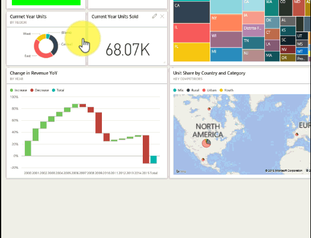

# Edytowanie lub usuwanie kafelka pulpitu nawigacyjnego

## *Właściciele* a *użytkownicy* pulpitów nawigacyjnych
Gdy tworzysz pulpit nawigacyjny lub jesteś jego właścicielem, masz wiele opcji zmiany wyglądu i domyślnego zachowania kafelków na tym pulpicie nawigacyjnym. Za pomocą poniższych ustawień i strategii możesz zaprojektować środowisko *używania* pulpitu nawigacyjnego dla współpracowników.  Czy wybranie kafelka spowoduje otworzenie raportu źródłowego, niestandardowego adresu URL, czy innego pulpitu nawigacyjnego? Może [dodasz kafelek, który wyświetla film wideo lub dane przesyłane strumieniowo](service-dashboard-add-widget.md)? A może nawet zechcesz [utworzyć kafelek zawierający interaktywne fragmentatory](service-dashboard-pin-live-tile-from-report.md). Jako *twórca* masz wiele opcji. 

<iframe width="560" height="315" src="https://www.youtube.com/embed/lJKgWnvl6bQ" frameborder="0" allowfullscreen></iframe>

Niniejszy artykuł obejmuje następujące tematy.

* [Tworzenie wizualizacji i przypinanie jej do pulpitu nawigacyjnego](#create)
* [Przenoszenie kafelka](#move)
* [Zmiana rozmiaru kafelka](#resize)
* [Zmiana nazwy kafelka](#rename)
* [Dodawanie hiperlinku do kafelka](#hyperlink)
* [Przypinanie kafelka do innego pulpitu nawigacyjnego](#different)
* [Usuwanie kafelka](#delete)
  
 > [!TIP]
 > Aby zmienić wizualizację wyświetlaną w kafelku, usuń kafelek i dodaj nowy [kafelek pulpitu nawigacyjnego](service-dashboard-tiles.md).
 > 

 ### Wymagania wstępne
 1. Aby samodzielnie wykonywać odpowiednie czynności, otwórz usługę Power BI (nie program Power BI Desktop) i [pobierz przykład IT Spend Analysis](sample-it-spend.md). Gdy pojawi się komunikat „Powodzenie”, wybierz pozycję **Przejdź do pulpitu nawigacyjnego**

- - -

## Tworzenie nowej wizualizacji i przypinanie jej do pulpitu nawigacyjnego
1. Na pulpicie nawigacyjnym IT Spend Analysis wybierz kafelek „Amount”, aby otworzyć raport.

    

2. Otwórz raport w widoku do edycji, wybierając pozycję **Edytuj raport** z górnego paska menu.

3. Dodaj nową stronę raportu, wybierając znak plus (+) w dolnej części raportu.

    

4. W okienku POLA wybierz pozycję **Fact > Amount** i **Business Area > Business Area**.
 
5. W okienku WIZUALIZACJE wybierz ikonę Wykres pierścieniowy, aby przekonwertować wizualizację na wykres pierścieniowy.

    

5. Wybierz ikonę pinezki i przypnij wykres pierścieniowy do pulpitu nawigacyjnego przykładu IT Spend Analysis.

   

6. Gdy pojawi się komunikat „Powodzenie”, wybierz pozycję **Przejdź do pulpitu nawigacyjnego**. Zostanie wyświetlony monit o zapisanie zmian. Wybierz pozycję **Zapisz**.

- - -

## Przenoszenie kafelka
Zlokalizuj nowy kafelek na pulpicie nawigacyjnym. Wybierz i przytrzymaj kafelek, aby przeciągnąć go do nowej lokalizacji na kanwie pulpitu nawigacyjnego.

- - -

## Zmiana rozmiaru kafelka
Kafelki można tworzyć w wielu różnych rozmiarach: od kafelków 1 × 1 do kafelków 5 × 5 jednostek. Wybierz i przeciągnij uchwyt (w prawym dolnym rogu), aby zmienić rozmiar kafelka.

- - -
## Menu wielokropka (...)

1. Wybierz wielokropek (...) w prawym górnym rogu kafelka. 
   
   

2. Umieść kursor nad kafelkiem „Amount” i wybierz wielokropek, aby wyświetlić opcje. Dostępne opcje różnią się w zależności od typu kafelka.  Na przykład opcje dostępne dla aktywnego kafelka różnią się od opcji dostępnych dla standardowego kafelka wizualizacji. Ponadto jeśli pulpit nawigacyjny został Ci udostępniony (nie jesteś właścicielem), dostępnych będzie mniej opcji.

   

3. Wybierz pozycję **Edytuj szczegóły**, aby otworzyć okno „Szczegóły kafelka”. 

    Zmień tytuł i domyślne zachowanie kafelka.  Na przykład możesz zdecydować, że po wybraniu kafelka przez *użytkownika* zamiast otwarcia raportu użytego do utworzenia tego kafelka zostanie wyświetlony nowy pulpit nawigacyjny.  
   

### Zmiana nazwy kafelka
W górnej części okna „Szczegóły kafelka” zmień **Tytuł** na **Amount spent**.

### Zmiana domyślnego hiperlinku
Domyślnie wybranie kafelka zazwyczaj spowoduje przeniesienie użytkownika do raportu, w którym utworzono kafelek, lub do funkcji Pytania i odpowiedzi (jeśli kafelek został w niej utworzony). Aby skierować użytkownika do strony internetowej, innego pulpitu nawigacyjnego lub innego raportu (w tym samym obszarze roboczym), raportu SSRS albo innej zawartości online, dodaj link niestandardowy.

1. W obszarze Funkcje wybierz pozycję **Ustaw link niestandardowy**.

2. Wybierz opcję **Link do pulpitu nawigacyjnego lub raportu w bieżącym obszarze roboczym**, a następnie wybierz element z listy rozwijanej.  W tym przykładzie został wybrany pulpit nawigacyjny przykładu Human Resources. Jeśli nie masz jeszcze tego przykładu w obszarze roboczym, możesz go dodać i wrócić do tego kroku lub wybrać inny pulpit nawigacyjny. 

    

3. Wybierz pozycję **Zastosuj**.

4. Na kafelku będzie wyświetlany nowy tytuł.  Dodatkowo po wybraniu kafelka usługa Power BI otworzy pulpit nawigacyjny Human Resources. 

    

### Przypinanie kafelka do innego pulpitu nawigacyjnego
1. Z menu rozwijanego wielokropka wybierz polecenie **Przypnij kafelek** .
2. Zdecyduj, czy chcesz przypiąć duplikat tego kafelka do istniejącego, czy nowego pulpitu nawigacyjnego. 
   
   
3. Wybierz pozycję **Przypnij**.

### Usuwanie kafelka
1. Aby trwale usunąć kafelek z pulpitu nawigacyjnego, wybierz polecenie **Usuń kafelek**  z menu rozwijanego wielokropka. 

2. Usunięcie kafelka nie spowoduje usunięcia wizualizacji źródłowej. Otwórz raport źródłowy, wybierając kafelek „Amount”. Otwórz ostatnią stronę w raporcie, aby zobaczyć, że oryginalna wizualizacja nie została usunięta z raportu. 

- - -
## Następne kroki
[Kafelki pulpitu nawigacyjnego w usłudze Power BI](service-dashboard-tiles.md)

[Pulpity nawigacyjne w usłudze Power BI](service-dashboards.md)

[Power BI — podstawowe pojęcia](service-basic-concepts.md)

Masz więcej pytań? [Odwiedź społeczność usługi Power BI](http://community.powerbi.com/)

