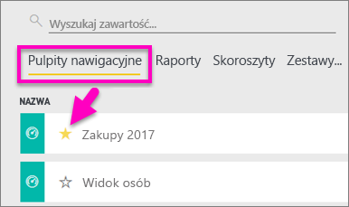
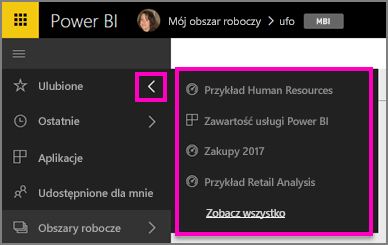
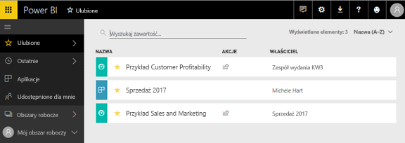
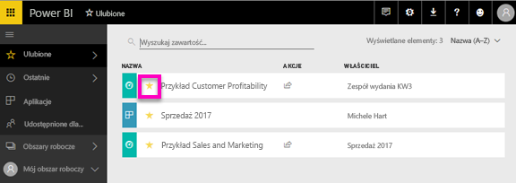

# Ulubione pulpity nawigacyjne w usłudze Power BI
Po ustawieniu pulpitu nawigacyjnego jako *ulubionego* można uzyskiwać do niego dostęp we wszystkich obszarach roboczych.  Ulubione to zwykle elementy odwiedzane najczęściej.

> [!NOTE]
> Ten temat dotyczy usługi Power BI, a nie programu Power BI Desktop.
> 
> 

Możesz również wybrać pojedynczy pulpit nawigacyjny jako [proponowany pulpit nawigacyjny](service-dashboard-featured.md) w usłudze Power BI.

## Dodawanie pulpitu jako *ulubionego*
Obejrzyj, jak Amanda dodaje ulubione do swojego obszaru roboczego, a następnie wykonaj szczegółowe instrukcje wyświetlane poniżej filmu wideo, aby przećwiczyć tę procedurę samodzielnie.

<iframe width="560" height="315" src="https://www.youtube.com/embed/G26dr2PsEpk" frameborder="0" allowfullscreen></iframe>

1. Otwórz pulpit nawigacyjny, z którego często korzystasz. Nawet pulpity, które zostały Ci udostępnione, można ustawić jako *ulubione*.
2. W prawym górnym rogu w usłudze Power BI wybierz pozycję **Dodaj do ulubionych** lub ikonę gwiazdy .
   
   
   
   Możesz również dodać pulpit nawigacyjny do ulubionych z poziomu karty **Pulpity nawigacyjne** w obszarze roboczym.
   
   

## Praca z *ulubionymi*
1. Aby uzyskać dostęp do ulubionych, w dowolnym obszarze roboczym kliknij strzałkę po prawej stronie przycisku **Ulubione**.  W tym miejscu można wybrać ulubiony pulpit nawigacyjny, aby go otworzyć. Wyświetlana jest lista zawierająca tylko pięć elementów ulubionych (w porządku alfabetycznym). Jeśli masz więcej niż pięć ulubionych, wybierz pozycję **Pokaż wszystkie**, aby otworzyć ekran Ulubione (zobacz pkt 2 poniżej). 
   
   
2. Aby wyświetlić **wszystkie** pulpity nawigacyjne, które zostały dodane jako ulubione, w lewym okienku nawigacyjnym wybierz pozycję **Ulubione** lub ikonę Ulubione .  
   
    
   
   W tym miejscu możesz wybrać pulpit nawigacyjny, aby go otworzyć, lub udostępnić pulpit nawigacyjny współpracownikom.

## Usuwanie pulpitu nawigacyjnego z ulubionych
Nie korzystasz już tak często z pulpitu nawigacyjnego?  Możesz usunąć go z ulubionych. Usunięcie pulpitu nawigacyjnego z ulubionych spowoduje jego usunięcie z listy ulubionych, ale nie z usługi Power BI.

1. W lewym okienku nawigacji wybierz pozycję **Ulubione**, aby otworzyć ekran **Ulubione**.
   
   
2. Wybierz żółtą gwiazdę obok pulpitu nawigacyjnego, aby usunąć go z ulubionych.

> **UWAGA**: Możesz również usunąć pulpit nawigacyjny z ulubionych z poziomu pulpitu nawigacyjnego. W prawym górnym rogu pulpitu nawigacyjnego jest wyświetlana żółta gwiazda i polecenie **Usuń z ulubionych**. Wybierz dowolny z tych elementów, aby usunąć pulpit nawigacyjny z listy ulubionych. 
> 
> 

## Następne kroki
[Wprowadzenie do usługi Power BI](service-get-started.md)

[Power BI — podstawowe pojęcia](service-basic-concepts.md)

Masz więcej pytań? [Odwiedź społeczność usługi Power BI](http://community.powerbi.com/)

