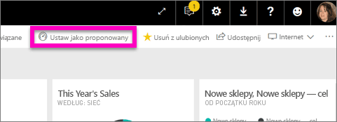
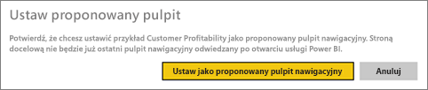
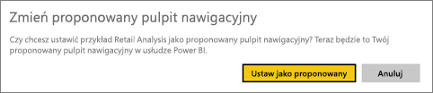
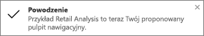
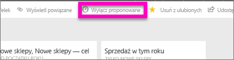

# Proponowane pulpity nawigacyjne w usłudze Power BI
## Tworzenie proponowanego pulpitu nawigacyjnego
Wiele osób odwiedza jeden pulpit nawigacyjny częściej niż inne.  Może to być pulpit nawigacyjny używany do prowadzenia firmy lub zawierający agregację kafelków z wielu różnych pulpitów nawigacyjnych i raportów.

Jeśli pulpit nawigacyjny zostanie wybrany jako *proponowany*, będzie on wyświetlany po każdym uruchomieniu usługi Power BI.  

> **UWAGA**: Możesz również wybrać kilka pulpitów nawigacyjnych i ustawić je jako *ulubione*. Zobacz [Ulubione pulpity nawigacyjne](service-dashboard-favorite.md).
> 
> 

Jeśli proponowany pulpit nawigacyjny nie został jeszcze ustawiony, usługa Power BI otworzy ostatnio używany pulpit nawigacyjny.  

### Aby ustawić pulpit nawigacyjny jako **Proponowany**
Zobacz, jak Amanda tworzy proponowany pulpit nawigacyjny, a następnie wykonaj instrukcje poniżej filmu wideo, aby wypróbować tę funkcję samodzielnie.

<iframe width="560" height="315" src="https://www.youtube.com/embed/G26dr2PsEpk" frameborder="0" allowfullscreen></iframe>

1. Otwórz pulpit nawigacyjny, który chcesz ustawić jako *Proponowany*. 
2. Na górnym pasku nawigacyjnym będzie widoczny przycisk **Ustaw jako proponowany** lub tylko ikona Proponowane . Wybierz jeden z tych elementów.
   
    
3. Potwierdź wybór.
   
    

## Zmiana proponowanego pulpitu nawigacyjnego
Oczywiście w przypadku zmiany zdania możesz ustawić nowy pulpit nawigacyjny jako proponowany.

1. Wykonaj powyższe kroki 1 i 2.
   
    
2. Wybierz przycisk **Ustaw jako proponowany**. Anulowanie ustawienia pulpitu nawigacyjnego jako proponowanego nie powoduje usunięcia go z obszaru roboczego.  
   
    

## Usuwanie proponowanego pulpitu nawigacyjnego
Jeśli żaden pulpit nawigacyjny nie ma być ustawiony jako proponowany, możesz anulować ustawienie proponowanego pulpitu nawigacyjnego w następujący sposób.

1. Otwórz pulpit nawigacyjny, który jest obecnie proponowany.
2. Na górnym pasku menu wybierz opcję **Wyłącz proponowany**.
   
    

## Następne kroki
[Dodawanie pulpitu nawigacyjnego do ulubionych](service-dashboard-favorite.md)

Masz więcej pytań? [Odwiedź społeczność usługi Power BI](http://community.powerbi.com/)

