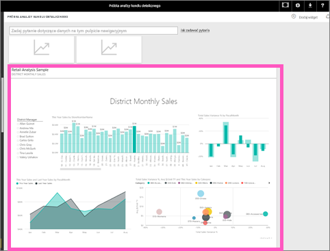

# Przypinanie całej strony raportu do pulpitu nawigacyjnego usługi Power BI jako dynamicznego kafelka
Innym sposobem dodania nowego [kafelka pulpitu nawigacyjnego](service-dashboard-tiles.md) jest przypięcie całej strony raportu.  Jest to prosty sposób na jednoczesne przypięcie więcej niż jednej wizualizacji.  Ponadto po przypięciu całej strony kafelki są *dynamiczne*. Możesz wchodzić z nimi w interakcje bezpośrednio na pulpicie nawigacyjnym. Zmiany wprowadzone w dowolnej wizualizacji w edytorze raportów, takie jak dodanie filtru lub zmiana pól używanych na wykresie, również są odzwierciedlane na kafelku pulpitu nawigacyjnego.  

> [!NOTE]
> Nie możesz przypinać kafelków z raportów, które zostały Ci udostępnione.
> 
> 

## Przypinanie strony raportu
Zobacz, jak Amanda przypina dynamiczną stronę raportu do pulpitu nawigacyjnego, a następnie wykonaj instrukcje krok po kroku umieszczone poniżej filmu wideo, aby samodzielnie wypróbować tę funkcję.

<iframe width="560" height="315" src="https://www.youtube.com/embed/EzhfBpPboPA" frameborder="0" allowfullscreen></iframe>

1. Otwórz raport w [widoku do edycji](service-interact-with-a-report-in-editing-view.md).
2. Bez wybierania żadnej wizualizacji na pasku menu wybierz pozycję **Przypnij stronę dynamiczną**.
   
    
3. Przypnij kafelek do istniejącego lub nowego pulpitu nawigacyjnego. Zwróć uwagę na wyróżniony tekst: *Przypięcie strony dynamicznej pozwala wprowadzać zmiany w raportach, które będą wyświetlane na kafelku pulpitu nawigacyjnego po odświeżeniu strony.*
   
   * Istniejący pulpit nawigacyjny: z listy rozwijanej wybierz nazwę pulpitu nawigacyjnego. Pulpity nawigacyjne, które zostały Ci udostępnione, nie będą wyświetlane na liście rozwijanej.
   * Nowy pulpit nawigacyjny: wpisz nazwę nowego pulpitu nawigacyjnego.
     
     
4. Wybierz przycisk **Przypnij raport dynamiczny**. Komunikat o powodzeniu (w prawym górnym rogu) informuje o tym, że strona została dodana do pulpitu nawigacyjnego jako kafelek.

## Otwieranie pulpitu nawigacyjnego, aby zobaczyć przypięty kafelek dynamiczny
1. W okienku nawigacji wybierz pulpit nawigacyjny z nowym kafelkiem dynamicznym. Tam możesz między innymi [zmienić nazwę, zmienić rozmiar, utworzyć link i przenieść](service-dashboard-edit-tile.md) przypiętą stronę raportu.  
2. Wykonaj czynności na kafelku dynamicznym.  Na poniższym zrzucie ekranu zaznaczenie paska na wykresie kolumnowym spowodowało filtrowanie krzyżowe i wyróżnienie krzyżowe innych wizualizacji na kafelku.
   
    

## Następne kroki
[Pulpity nawigacyjne w usłudze Power BI](service-dashboards.md)

Masz więcej pytań? [Odwiedź społeczność usługi Power BI](http://community.powerbi.com/)

