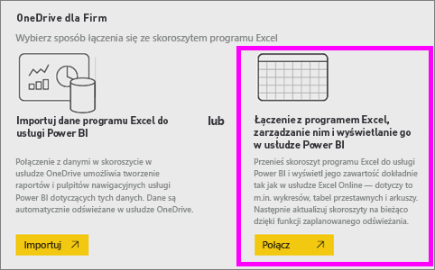
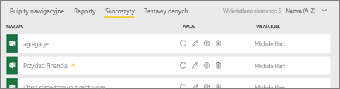
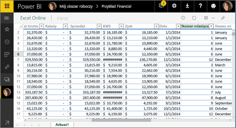
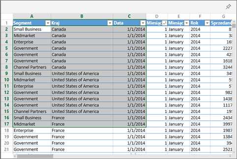
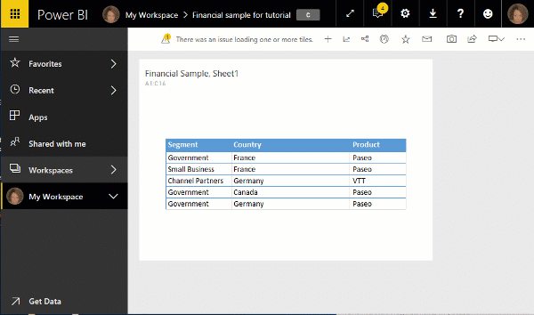

# Przypinanie kafelka do pulpitu nawigacyjnego usługi Power BI z programu Excel
Zanim będzie możliwe przypięcie kafelka ze skoroszytu programu Excel połącz ten skoroszyt z usługą Power BI (app.powerbi.com). Zasadniczo łączenie skoroszytu powoduje przeniesienie połączonej wersji tylko do odczytu tego skoroszytu do usługi Power BI i pozwala przypiąć zakresy do pulpitów nawigacyjnych. Możesz nawet przypiąć cały arkusz do pulpitu nawigacyjnego.  
Jeśli skoroszyt został Ci udostępniony, będziesz mieć możliwość wyświetlania kafelków przypiętych przez właściciela, ale nie samodzielnego tworzenia jakichkolwiek kafelków pulpitu nawigacyjnego. 

Aby uzyskać szczegółowe informacje o współdziałaniu programu Excel i usługi Power BI, zobacz [Pobieranie danych z plików skoroszytów programu Excel](http://go.microsoft.com/fwlink/?LinkID=521962).

Obejrzyj Willa demonstrującego kilka sposobów importowania danych ze skoroszytów programu Excel i łączenia się z nimi.

<iframe width="560" height="315" src="https://www.youtube.com/embed/l8JoB7w0zJA" frameborder="0" allowfullscreen></iframe>

## Łączenie skoroszytu programu Excel z poziomu usługi OneDrive dla Firm z usługą Power BI
Po wybraniu pozycji **Połącz** skoroszyt pojawi się w usłudze Power BI, podobnie jak w programie Excel Online. Jednak, w przeciwieństwie do programu Excel Online, będziesz mieć dostęp do pewnych doskonałych funkcji ułatwiających przypinanie elementów z arkuszy bezpośrednio do pulpitów nawigacyjnych.

W usłudze Power BI nie możesz edytować swojego skoroszytu. Ale jeśli musisz wprowadzić pewne zmiany, możesz wybrać ikonę ołówka na karcie **Skoroszyty** swojego obszaru roboczego, a następnie wprowadzić zmiany do swojego skoroszytu w programie Excel Online lub otworzyć go w programie Excel na komputerze. Wszelkie wprowadzone zmiany są zapisywane w skoroszycie w usłudze OneDrive.

1. Przekaż swój skoroszyt do usługi OneDrive dla Firm.

2. Z usługi Power BI [połącz się z tym skoroszytem](service-excel-workbook-files.md). W tym celu wybierz opcję **Pobierz dane > Pliki > OneDrive — dla firm** i przejdź do lokalizacji, w której zapisano plik programu Excel. Zaznacz plik i wybierz polecenie **Połącz > Połącz**.

    

3. W usłudze Power BI skoroszyt jest dodawany do karty **Skoroszyty** Twojego obszaru roboczego.  Ikona  wskazuje, że jest to skoroszyt programu Excel, a żółta gwiazdka wskazuje, że jest on nowy.
    
    
4. Otwórz skoroszyt w usłudze Power BI, wybierając nazwę skoroszytu.

    Zmiany wprowadzone do skoroszytu w usłudze Power BI nie zostały zapisane i nie mają wpływu na oryginalny skoroszyt w usłudze OneDrive dla Firm. Jeśli sortujesz, filtrujesz lub zmieniasz wartości w usłudze Power BI, tych zmian nie można zapisać ani przypiąć. Jeśli musisz wprowadzić zmiany, które zostaną zapisane, wybierz opcję **Edytuj** w prawym górnym rogu, aby go otworzyć do edycji w programie Excel Online lub Excel. Po wprowadzonych w ten sposób zmianach czas potrzebny do zaktualizowania kafelków na pulpicie nawigacyjnym może potrwać kilka minut.
   
    

## Przypinanie zakresu komórek do pulpitu nawigacyjnego
Jednym sposobem dodania nowego [kafelka pulpitu nawigacyjnego](consumer/end-user-tiles.md) jest realizowany z wnętrza skoroszytu programu Excel w usłudze Power BI. Zakresy można przypiąć ze skoroszytów programu Excel, które zostały zapisane w usłudze OneDrive dla Firm lub innej bibliotece dokumentów udostępnionych w grupie. Zakresy mogą zawierać dane, wykresy, tabele, tabele przestawne, wykresy przestawne i inne składniki programu Excel.

1. Wyróżnij komórki, które chcesz przypiąć do pulpitu nawigacyjnego.
   
    
2. Wybierz ikonę pinezki  . 
3. Przypnij kafelek do istniejącego lub nowego pulpitu nawigacyjnego. 
   
   * Istniejący pulpit nawigacyjny: z listy rozwijanej wybierz nazwę pulpitu nawigacyjnego.
   * Nowy pulpit nawigacyjny: wpisz nazwę nowego pulpitu nawigacyjnego.
   
     
4. Wybierz pozycję **Przypnij**. Komunikat o powodzeniu (w prawym górnym rogu) informuje o tym, że zakres został dodany do pulpitu nawigacyjnego jako kafelek. 
   
    
5. Wybierz pozycję **Przejdź do pulpitu nawigacyjnego**. W tym miejscu możesz [zmienić nazwę, rozmiar, link i przenieść](service-dashboard-edit-tile.md) przypiętą wizualizację. Domyślnie wybranie przypiętego kafelka otwiera skoroszyt w usłudze Power BI.

## Przypinanie całej tabeli lub tabeli przestawnej do pulpitu nawigacyjnego
Wykonaj kroki opisane powyżej, z wyjątkiem tego, że zamiast zaznaczania zakresu komórek zaznacz całą tabelę lub tabelę przestawną.

Aby przypiąć tabelę, zaznacz cały zakres tabeli, pamiętając o uwzględnieniu nagłówków.  Aby przypiąć tabelę przestawną, upewnij się, że została uwzględniona każda widoczna część tabeli przestawnej łącznie z filtrami, jeśli były używane.

 

Kafelek utworzony na podstawie tabeli lub tabeli przestawnej wyświetli całą tabelę.  Jeśli dodasz/usuniesz/przefiltrujesz wiersze lub kolumny w oryginalnym skoroszycie, zostaną one również dodane/usunięte/przefiltrowane na kafelku.

## Wyświetlanie skoroszytu połączonego z kafelkiem
Wybranie kafelka skoroszytu otwiera połączony skoroszyt w usłudze Power BI. Ponieważ plik skoroszytu znajduje się w usłudze OneDrive dla Firm właściciela, wyświetlenie skoroszytu wymaga posiadania uprawnienia do odczytu skoroszytu. Jeśli nie masz uprawnienia, otrzymasz komunikat o błędzie.  

 

## Istotne zagadnienia i rozwiązywanie problemów
Nieobsługiwane funkcje: usługa Power BI korzysta z usług programu Excel do pobierania kafelków skoroszytu. W związku z tym, ponieważ niektóre funkcje programu Excel nie są obsługiwane w interfejsie API REST usług programu Excel, nie będą widoczne na kafelkach w usłudze Power BI. Na przykład: wykresy przebiegu w czasie, zestaw ikon formatowania warunkowego i fragmentatory czasu. Aby uzyskać pełną listę nieobsługiwanych funkcji, zobacz [Nieobsługiwane funkcje w interfejsie API REST usług programu Excel](http://msdn.microsoft.com/library/office/ff394477.aspx)

## Następne kroki
[Udostępnianie pulpitu nawigacyjnego, który zawiera linki do skoroszytu programu Excel](service-share-dashboard-that-links-to-excel-onedrive.md)

[Pobieranie danych ze skoroszytów programu Excel](service-excel-workbook-files.md)

Masz więcej pytań? [Odwiedź społeczność usługi Power BI](http://community.powerbi.com/)

