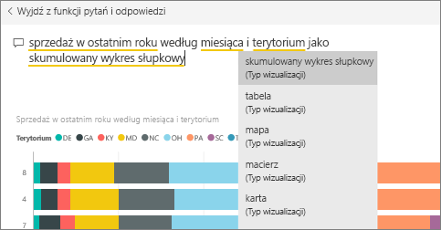
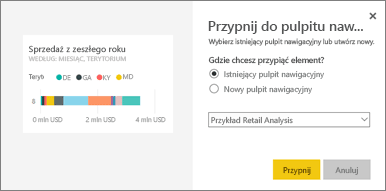
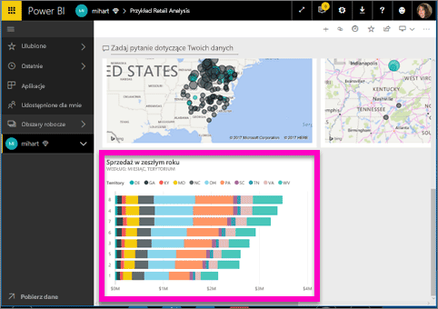
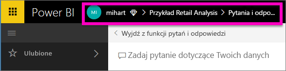

# Przypinanie kafelka do pulpitu nawigacyjnego z narzędzia pytań i odpowiedzi
## Przypinanie kafelka z narzędzia pytań i odpowiedzi
Narzędzie pytań i odpowiedzi to narzędzie raportowania ad hoc usługi Power BI. Chcesz znaleźć określone dane szczegółowe? Zadaj pytanie dotyczące danych i odbierz odpowiedź w postaci wizualizacji.

W tych instrukcjach użyjemy usługi Power BI (app.powerbi.com), aby otworzyć pulpit nawigacyjny, zadać pytanie przy użyciu języka naturalnego w celu utworzenia wizualizacji i przypiąć tę wizualizację do pulpitu nawigacyjnego. Pulpity nawigacyjne nie są dostępne w programie Power BI Desktop. Aby uzyskać informacje o używaniu funkcji Pytania i odpowiedzi z inną zawartością i innymi narzędziami usługi Power BI, zobacz [Omówienie funkcji Pytania i odpowiedzi usługi Power BI](power-bi-q-and-a.md). 

Aby z tego skorzystać, otwórz [pulpit nawigacyjny przykładu Retail Analysis](sample-retail-analysis.md).

1. Otwórz [pulpit nawigacyjny](service-dashboards.md), który ma co najmniej jeden kafelek przypięty z raportu. Gdy zadajesz pytanie, usługa Power BI wyszukuje odpowiedź w dowolnym zestawie danych, który ma kafelek przypięty do tego pulpitu nawigacyjnego.  Aby dowiedzieć się więcej, zobacz [pobieranie danych](service-get-data.md).
2. W polu pytania w górnej części pulpitu nawigacyjnego rozpocznij wpisywanie tego, co chcesz wiedzieć o danych.  
   
3. Na przykład podczas wpisywania „sprzedaż za ostatni rok według miesiąca i terytorium”...  
   

   w polu pytania pojawiają się sugestie.
4. Aby dodać wykres do pulpitu nawigacyjnego jako kafelek, wybierz pinezkę  po prawej górnej stronie kanwy. Jeśli pulpit nawigacyjny został Ci udostępniony, nie będzie można przypiąć żadnej wizualizacji.

5. Przypnij kafelek do istniejącego lub nowego pulpitu nawigacyjnego.

   

   * Istniejący pulpit nawigacyjny: z listy rozwijanej wybierz nazwę pulpitu nawigacyjnego. Twój wybór będzie ograniczony tylko do pulpitów nawigacyjnych wewnątrz bieżącego obszaru roboczego.
   * Nowy pulpit nawigacyjny: wpisz nazwę nowego pulpitu nawigacyjnego a zostanie ona dodana do Twojego bieżącego obszaru roboczego.

6. Wybierz pozycję **Przypnij**.

   Komunikat o powodzeniu (w pobliżu prawego górnego rogu) informuje o tym, że wizualizacja została dodana do Twojego pulpitu nawigacyjnego jako kafelek.  

   
7. Wybierz pozycję **Przejdź do pulpitu nawigacyjnego**, aby wyświetlić nowy kafelek. Tam możesz [zmienić nazwę, rozmiar i położenie kafelka, dodać hiperlink oraz wykonać inne akcje](service-dashboard-edit-tile.md) na pulpicie nawigacyjnym.

   

## Istotne zagadnienia i rozwiązywanie problemów
* Po rozpoczęciu wprowadzania pytania narzędzie pytań i odpowiedzi natychmiast zaczyna wyszukiwanie najlepszej odpowiedzi we wszystkich zestawach danych skojarzonych z bieżącym pulpitem nawigacyjnym.  „Bieżący pulpit nawigacyjny” to pulpit nawigacyjny wymieniony na górnym pasku nawigacyjnym. Na przykład to pytanie jest zadawane na pulpicie nawigacyjnym **Próbka analizy handlu detalicznego**, który jest częścią obszaru roboczego aplikacji **mihart**.

  
* **Skąd narzędzie pytań i odpowiedzi wie, których zestawów danych ma użyć**?  Funkcja Pytania i odpowiedzi ma dostęp do wszystkich zestawów danych, które mają co najmniej jedną wizualizację przypiętą do tego pulpitu nawigacyjnego.

* **Nie widzisz pola pytania**? Skontaktuj się z administratorem usługi Power BI. Administrator ma możliwość wyłączenia funkcji Pytania i odpowiedzi.

## Następne kroki
[(Zmienianie nazwy, rozmiaru, dodawanie hiperlinku, zmienianie położenia kafelka i inne](service-dashboard-edit-tile.md)    
[Wyświetlanie kafelka pulpitu nawigacyjnego w trybie koncentracji uwagi](service-focus-mode.md)     
[Powrót do pytań i odpowiedzi w usłudze Power BI](power-bi-q-and-a.md)  
Masz więcej pytań? [Odwiedź społeczność usługi Power BI](http://community.powerbi.com/)
