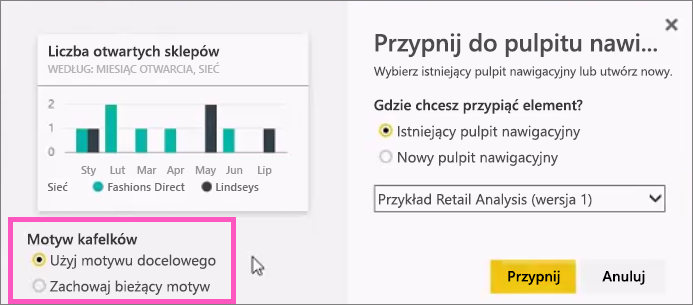
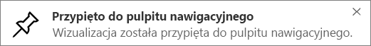

# Przypinanie kafelka do pulpitu nawigacyjnego usługi Power BI z raportu
## Przypinanie kafelków z raportu
Jednym ze sposobów dodawania nowego [kafelka pulpitu nawigacyjnego](consumer/end-user-tiles.md) jest wstawienie go z [raportu w usłudze Power BI](consumer/end-user-reports.md). W rzeczywistości można dodawać wiele nowych kafelków z raportu.  Każdy z tych kafelków po kliknięciu staje się linkiem do raportu.

Do pulpitu nawigacyjnego można przypinać całe strony raportów.  Jest to również znane jako przypinanie kafelka *dynamicznego*.  *Dynamiczny* — ponieważ możesz wchodzić w interakcję z kafelkiem na pulpicie nawigacyjnym i, w przeciwieństwie do poszczególnych kafelków wizualizacji, zmiany wprowadzane w raporcie są synchronizowane z pulpitem nawigacyjnym. Więcej informacji na temat tego zagadnienia znajdziesz poniżej.

Nie można przypinać kafelków z raportów, które zostały Ci udostępnione lub udostępnione z poziomu programu Power BI Desktop. 

> **PORADA**: Niektóre wizualizacje wykorzystują obrazy tła. Przypinanie może nie zadziałać, jeśli obraz tła jest za duży.  Spróbuj zmniejszyć rozmiar obrazu lub użyć kompresji obrazu.  
> 
> 

## Przypinanie kafelka z raportu
Obejrzyj klip wideo, w którym Amanda tworzy pulpit nawigacyjny przez przypinanie wizualizacji i obrazów z raportu usługi Power BI.

<iframe width="560" height="315" src="https://www.youtube.com/embed/lJKgWnvl6bQ" frameborder="0" allowfullscreen></iframe>

Teraz utwórz własny pulpit nawigacyjny przy użyciu jednego z przykładowych raportów usługi Power BI.

1. Najedź kursorem na wizualizację, którą chcesz przypiąć, i wybierz ikonę pinezki . W usłudze Power BI otwiera się ekran **Przypnij do pulpitu nawigacyjnego**.
   
     
2. Zdecyduj, czy chcesz przypiąć wizualizację do istniejącego czy nowego pulpitu nawigacyjnego.
   
   * Istniejący pulpit nawigacyjny: z listy rozwijanej wybierz nazwę pulpitu nawigacyjnego. Pulpity nawigacyjne, które zostały Ci udostępnione, nie będą wyświetlane na liście rozwijanej.
   * Nowy pulpit nawigacyjny: wpisz nazwę nowego pulpitu nawigacyjnego.
3. W niektórych przypadkach przypinany element może mieć już zastosowany *motyw*.  Przykładem są wizualizacje przypięte ze skoroszytu programu Excel. W takim przypadku wybierz, który motyw zastosować do kafelka.
4. Wybierz pozycję **Przypnij**.
   
   Komunikat o powodzeniu (w prawym górnym rogu) informuje o tym, że wizualizacja została dodana do pulpitu nawigacyjnego jako kafelek.
   
   
5. W okienku nawigacji wybierz pulpit nawigacyjny z nowym kafelkiem. Wybierz kafelek, aby wrócić do raportu. Możesz też [edytować wyświetlanie i zachowanie kafelka](service-dashboard-edit-tile.md).

## Przypinanie całej strony raportu
Innym rozwiązaniem jest przypięcie do pulpitu nawigacyjnego całej strony raportu. Jest to prosty sposób na jednoczesne przypięcie więcej niż jednej wizualizacji.  Ponadto po przypięciu całej strony kafelki są *dynamiczne*. Możesz wchodzić z nimi w interakcje bezpośrednio na pulpicie nawigacyjnym. Zmiany wprowadzone w dowolnej wizualizacji w edytorze raportów, takie jak dodanie filtru lub zmiana pól używanych na wykresie, również są odzwierciedlane na kafelku pulpitu nawigacyjnego.  

Aby uzyskać więcej informacji, zobacz [Przypinanie całej strony raportu](service-dashboard-pin-live-tile-from-report.md)

## Następne kroki
[Pulpity nawigacyjne w usłudze Power BI](consumer/end-user-dashboards.md)

[Kafelki pulpitu nawigacyjnego w usłudze Power BI](consumer/end-user-tiles.md)

[Raporty w usłudze Power BI](consumer/end-user-reports.md)

[Odświeżanie danych w usłudze Power BI](refresh-data.md)

[Power BI — podstawowe pojęcia](consumer/end-user-basic-concepts.md)

Masz więcej pytań? [Odwiedź społeczność usługi Power BI](http://community.powerbi.com/)

