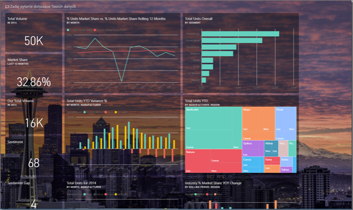
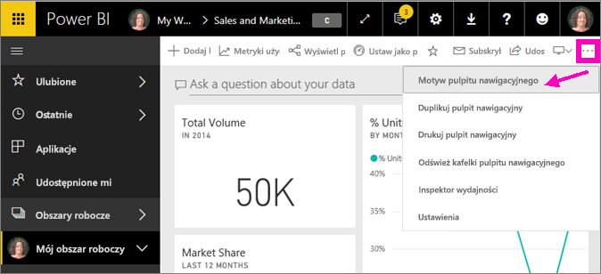
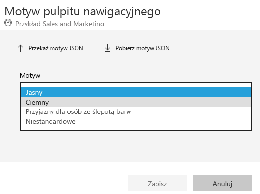
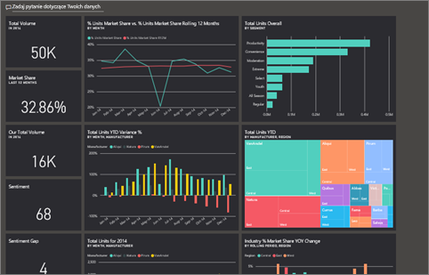
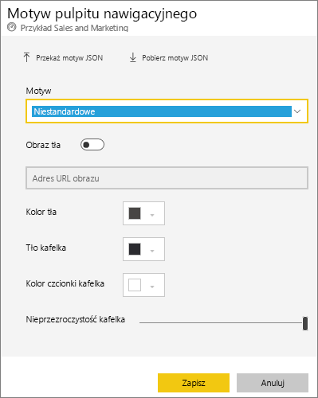
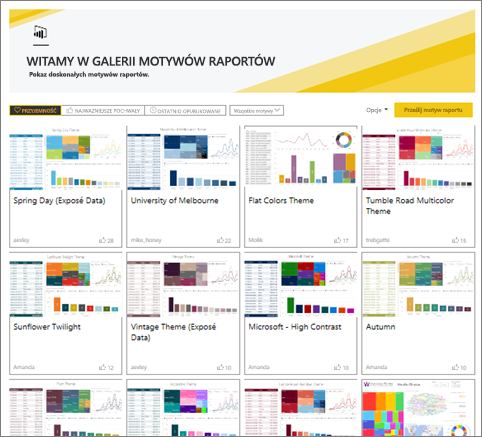
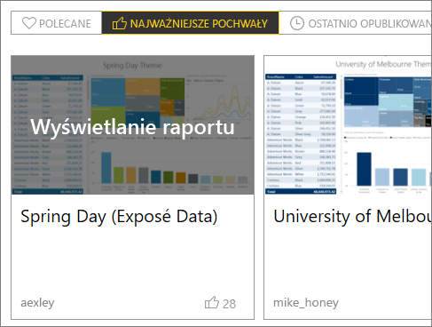
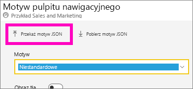
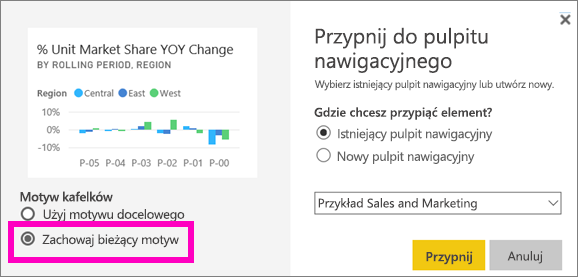
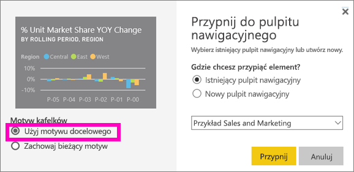

# Używanie motywów pulpitu nawigacyjnego w usłudze Power BI
**Motywy pulpitu nawigacyjnego** umożliwiają zastosowanie motywu kolorystycznego — kolorów firmowych, okolicznościowych lub innego dowolnego motywu kolorystycznego — do całego pulpitu nawigacyjnego. Zastosowanie **motywu pulpitu nawigacyjnego** spowoduje, że kolory tego motywu będą używane we wszystkich wizualizacjach na pulpicie nawigacyjnym (z kilkoma wyjątkami opisanymi w dalszej części tego artykułu).

Zmienianie kolorów wizualizacji raportu na pulpicie nawigacyjnym nie będzie wpływać na wizualizacje w raporcie. Ponadto jeśli przypinasz kafelki z raportu, który ma już [zastosowany motyw raportu](desktop-report-themes.md), możesz zachować bieżący motyw lub użyć motywu pulpitu nawigacyjnego.

## Wymagania wstępne
* Aby z tego skorzystać, otwórz [pulpit nawigacyjny przykładu Sales and Marketing](sample-datasets.md).

## Jak działają motywy pulpitu nawigacyjnego
Aby rozpocząć pracę, otwórz utworzony pulpit nawigacyjny (lub pulpit, w przypadku którego masz uprawnienia do edycji), który chcesz dostosować. Wybierz wielokropek (...), a następnie wybierz pozycję **Motyw pulpitu nawigacyjnego**. 

W wyświetlonym okienku nawigacyjnym wybierz jeden ze wstępnie utworzonych motywów.  W poniższym przykładzie wybraliśmy motyw **Ciemny**.

## Tworzenie motywu niestandardowego

Domyślny motyw pulpitów nawigacyjnych usługi Power BI to **Jasny**. Aby dostosować kolory lub utworzyć własny motyw, wybierz pozycję **Niestandardowy** z listy rozwijanej. 

Do tworzenia własnych motywów pulpitu nawigacyjnego należy użyć opcji niestandardowych. Przy dodawaniu obrazu tła zaleca się użycie obrazu o rozdzielczości co najmniej 1920 x 1080 pikseli. Aby użyć obrazu jako tła, przekaż obraz do publicznej witryny internetowej, skopiuj adres URL i wklej go w polu **Adres URL obrazu**. 

### Korzystanie z motywów JSON
Motyw niestandardowy można także utworzyć, przekazując plik JSON zawierający ustawienia wszystkich kolorów do użycia na pulpicie nawigacyjnym. W programie Power BI Desktop twórcy raportu używają plików JSON do [tworzenia motywów dla raportów](desktop-report-themes.md). Te same pliki JSON można przekazywać do pulpitów nawigacyjnych. Można też znaleźć i przekazać pliki JSON ze [strony galerii motywów](https://community.powerbi.com/t5/Themes-Gallery/bd-p/ThemesGallery) dostępnej w społeczności usługi Power BI 

Można również zapisać motyw niestandardowy jako plik JSON, a następnie udostępnić go innym twórcom pulpitów nawigacyjnych. 

### Używanie motywu z galerii motywów

Podobnie jak w przypadku opcji wbudowanych i niestandardowych, po przekazaniu motywu kolory zostaną automatycznie zastosowane do wszystkich kafelków na pulpicie nawigacyjnym. 

1. Najedź kursorem na motyw i wybierz pozycję **Wyświetl raport**.

    

2. Przewiń w dół i znajdź link do pliku JSON.  Wybierz ikonę pobierania i zapisz plik.

    

3. Po powrocie do usługi Power BI w oknie niestandardowego motywu pulpitu nawigacyjnego wybierz pozycję **Przekaż motyw JSON**.

    

4. Przejdź do lokalizacji, w której zapisano motyw pliku JSON, i wybierz pozycję **Otwórz**.

5. Na stronie motywu pulpitu nawigacyjnego wybierz pozycję **Zapisz**. Nowy motyw zostanie zastosowany do pulpitu nawigacyjnego.

    

## Istotne zagadnienia i ograniczenia

* Jeśli raport używa innego motywu niż pulpit nawigacyjny, możesz kontrolować, czy wizualizacja zachowuje bieżący motyw, czy też używa motywu pulpitu nawigacyjnego w celu ujednolicenia wyglądu wizualizacji pochodzących z różnych źródeł. Aby podczas przypinania kafelka do pulpitu nawigacyjnego zachować motyw raportu, wybierz pozycję **Zachowaj bieżący motyw**. W wizualizacji na pulpicie nawigacyjnym zostanie zachowany motyw raportu, w tym ustawienia przezroczystości. 

    Opcje obszaru **Motyw kafelków** są widoczne tylko w przypadku utworzenia raportu w programie Power BI Desktop, [dodania motywu raportu](desktop-report-themes.md) i opublikowania raportu w usłudze Power BI. 

    

    Spróbuj ponownie przypiąć kafelek i wybrać pozycję **Użyj motywu pulpitu nawigacyjnego**.

    

* Motywów pulpitu nawigacyjnego nie można stosować do przypiętych stron dynamicznych raportu, kafelków elementów iframe, kafelków usługi SSRS, kafelków skoroszytów ani obrazów.
* Motywy pulpitu nawigacyjnego mogą być wyświetlane na urządzeniach przenośnych, ale tworzenie motywu pulpitu nawigacyjnego jest możliwe tylko w usłudze Power BI. 
* Motywy niestandardowe pulpitu nawigacyjnego działają jedynie w przypadku kafelków przypiętych z raportów. 

