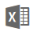

# Wprowadzenie do kafelków pulpitów nawigacyjnych dla projektantów usługi Power BI

Kafelek stanowi migawkę danych przypiętą do pulpitu nawigacyjnego. Kafelek można utworzyć z raportu, zestawu danych, pulpitu nawigacyjnego, pola funkcji pytań i odpowiedzi, programu Excel, a także raportów usług SQL Server Reporting Services (SSRS) i innych.  Ten zrzut ekranu przedstawia wiele różnych kafelków przypiętych do pulpitu nawigacyjnego.

Pulpity nawigacyjne i kafelki pulpitu nawigacyjnego są funkcjami usługi Power BI, a nie programu Power BI Desktop. Nie można tworzyć pulpitów nawigacyjnych na urządzeniach przenośnych, ale można je na nich [wyświetlać i udostępniać](mobile-apps-view-dashboard.md).

Oprócz przypinania, autonomiczne kafelki można tworzyć bezpośrednio na pulpicie nawigacyjnym za pomocą polecenia [Dodaj kafelek](service-dashboard-add-widget.md). Autonomiczne kafelki obejmują: pola tekstowe, obrazy, klipy wideo, dane przesyłane strumieniowo oraz treści internetowe.

Potrzebujesz pomocy dotyczącej bloków konstrukcyjnych tworzących usługę Power BI?  Zobacz [Power BI — podstawowe pojęcia](service-basic-concepts.md).

> [!NOTE]
> Jeśli zmienia się oryginalna wizualizacja użyta do utworzenia kafelka, kafelek nie ulegnie zmianie.  Jeśli na przykład przypniemy wykres liniowy z raportu, a następnie zmienimy ten wykres liniowy na wykres słupkowy, kafelek pulpitu nawigacyjnego w dalszym ciągu wyświetlać będzie wykres liniowy. Dane zostaną odświeżone, ale typ wizualizacji nie ulegnie zmianie.
> 
> 

## Przypinanie kafelka z...
Istnieje wiele sposobów, aby dodać (przypiąć) kafelek na pulpicie nawigacyjnym. Kafelki można przypinać z:

* [pytań i odpowiedzi usługi Power BI](service-dashboard-pin-tile-from-q-and-a.md)
* [raportu](service-dashboard-pin-tile-from-report.md)
* [innego pulpitu nawigacyjnego](service-pin-tile-to-another-dashboard.md)
* [skoroszytu programu Excel w usłudze OneDrive dla Firm](service-dashboard-pin-tile-from-excel.md)
* [usługi Power BI Publisher dla programu Excel](publisher-for-excel.md)
* [szybkiego wglądu w szczegółowe dane](service-insights.md)
* [Reporting Services](https://docs.microsoft.com/sql/reporting-services/pin-reporting-services-items-to-power-bi-dashboards)

Autonomiczne kafelki obrazów, pól tekstowych, klipów wideo, danych przesyłanych strumieniowo i treści internetowych można tworzyć bezpośrednio na pulpicie nawigacyjnym za pomocą polecenia [Dodaj kafelek](service-dashboard-add-widget.md).

  

## Interakcja z kafelkami na pulpicie nawigacyjnym
### Przenoszenie i zmienianie rozmiaru kafelka
Chwyć kafelek i [przemieszczaj go na pulpicie nawigacyjnym](service-dashboard-edit-tile.md). Aktywuj i wybierz uchwyt , aby zmienić rozmiar kafelka.

### Najeżdżanie kursorem na kafelek w celu zmiany wyglądu i zachowania
1. Najedź kursorem na kafelek, aby wyświetlić wielokropek.
   
    
2. Wybierz symbol wielokropka, aby otworzyć menu akcji kafelka.
   
    
   
    W tym miejscu można wykonać następujące czynności:
   
   * [Otworzyć raport, który został użyty do utworzenia tego kafelka ](service-reports.md)   
   
   * [Otworzyć arkusz, który został użyty do utworzenia tego kafelka ](service-reports.md)   
     
    * [Wyświetlić w trybie koncentracji uwagi ](service-focus-mode.md)   
     * [Wyeksportować dane użyte na kafelku](visuals/power-bi-visualization-export-data.md) 
     * [Edytować tytuł i podtytuł, dodać hiperlink](service-dashboard-edit-tile.md) 
     * [Uruchomić szczegółowe informacje](service-insights.md) 
     * [Przypiąć kafelek do innego pulpitu nawigacyjnego](service-pin-tile-to-another-dashboard.md)
       
     * [Usunąć kafelek](service-dashboard-edit-tile.md)
     
3. Aby zamknąć menu akcji, wybierz pusty obszar na kanwie.

### Wybieranie (klikanie) kafelka
To co dzieje się po wybraniu kafelka zależy od tego, jak został on utworzony. Jeśli ma on [niestandardowy link](service-dashboard-edit-tile.md), wybranie kafelka spowoduje przejście do tego linku. W przeciwnym razie wybranie kafelka spowoduje przejście do raportu, skoroszytu aplikacji Excel Online, raportu lokalnych usług Reporting Services lub do pytania sekcji pytań i odpowiedzi, które zostały użyte do utworzenia kafelka.

> [!NOTE]
> Wyjątek stanowią kafelki wideo utworzone bezpośrednio na pulpicie nawigacyjnym za pomocą polecenia **Dodaj kafelek**. Wybranie kafelka wideo (utworzonego w ten sposób) spowoduje odtworzenie filmu wideo bezpośrednio na pulpicie nawigacyjnym.   
> 
> 

## Zagadnienia i rozwiązywanie problemów

* Jeśli raport, który został użyty do utworzenia wizualizacji, nie został zapisany, wybranie kafelka nie wywoła żadnej akcji.
* Jeśli kafelek został utworzony na podstawie skoroszytu aplikacji Excel Online, musisz mieć co najmniej uprawnienia do odczytu tego skoroszytu. W przeciwnym razie wybranie kafelka nie spowoduje otwarcia skoroszytu w aplikacji Excel Online.
* Przykład: utworzono kafelek bezpośrednio na pulpicie nawigacyjnym przy użyciu polecenia **Dodaj kafelek** i ustawiono dla niego niestandardowy hiperlink. W takiej sytuacji wybranie tytułu, podtytułu lub kafelka spowoduje otwarcie tego adresu URL. W przeciwnym razie domyślnie wybranie kafelka utworzonego bezpośrednio na pulpicie nawigacyjnym dla obrazu, kodu internetowego lub pola tekstowego nie wywoła żadnej akcji.
* Jeśli nie masz uprawnień do raportu w ramach usług Reporting Services, wybranie kafelka utworzonego na podstawie raportu usług Reporting Services spowoduje przejście do strony informującej o braku dostępu (rsAccessDenied).
* Jeśli nie masz dostępu do sieci, w której znajduje się serwer usług Reporting Services, wybranie kafelka utworzonego na podstawie usług Reporting Services spowoduje przejście do strony informującej o braku możliwości zlokalizowania serwera (HTTP 404). Urządzenie musi mieć dostęp do sieci i serwera raportów, aby wyświetlić raport.
* Jeśli zmienia się oryginalna wizualizacja użyta do utworzenia kafelka, kafelek nie ulegnie zmianie.  Jeśli na przykład przypniemy wykres liniowy z raportu, a następnie zmienimy ten wykres liniowy na wykres słupkowy, kafelek pulpitu nawigacyjnego w dalszym ciągu wyświetlać będzie wykres liniowy. Dane zostaną odświeżone, ale typ wizualizacji nie ulegnie zmianie.

## Następne kroki
[Tworzenie karty (kafelka z dużą liczbą) dla pulpitu nawigacyjnego](power-bi-visualization-card.md)

[Pulpity nawigacyjne w usłudze Power BI](service-dashboards.md)  

[Odświeżanie danych](refresh-data.md)

[Power BI — podstawowe pojęcia](service-basic-concepts.md)

[Eksportowanie kafelka do programu PowerPoint](http://blogs.msdn.com/b/powerbidev/archive/2015/09/28/integrating-power-bi-tiles-into-office-documents.aspx)

[Przypinanie elementów usług Reporting Services do pulpitów nawigacyjnych usługi Power BI](https://msdn.microsoft.com/library/mt604784.aspx)

Masz więcej pytań? [Odwiedź społeczność usługi Power BI](http://community.powerbi.com/)

