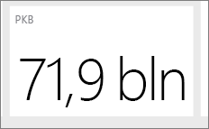

# Porady dotyczące projektowania doskonałych pulpitów nawigacyjnych usługi Power BI
Gdy już udało Ci się utworzyć pulpit nawigacyjny i dodać kafelki, zadbaj o to, aby Twój projekt był nie tylko ładny, ale i funkcjonalny. Ogólnie rzecz biorąc, chodzi o wyróżnienie najważniejszych informacji, tak aby pulpit nawigacyjny nie wyglądał na przepełniony i pozostał przejrzysty.

Poniżej przedstawiono kilka wskazówek.

> [!TIP]
> Wiele zasad projektowania raportów dotyczy także pulpitów nawigacyjnych.  Zobacz nasz oficjalny dokument [Best design principles for reports and visualizations (Najlepsze zasady projektowania raportów i wizualizacji)](power-bi-visualization-best-practices.md).
>
>

## Obejrzyj [seminarium internetowe dotyczące przerabiania pulpitu nawigacyjnego](https://info.microsoft.com/CO-PowerBI-WBNR-FY16-05May-12-Dashboard-Makeover-Registration.html)
Zobacz głównego menedżera programu Microsoft i eksperta od pulpitów nawigacyjnych usługi Power BI, Marca Reguera, [przeprowadzającego zmiany pulpitu nawigacyjnego](https://info.microsoft.com/CO-PowerBI-WBNR-FY16-05May-12-Dashboard-Makeover-Registration.html).

## Pamiętaj o potrzebach odbiorców
Jakie kluczowe metryki ułatwią im podejmowanie decyzji? Jak będzie używany pulpit nawigacyjny? Jakie zakorzenione wzorce lub założenia kulturowe mogą mieć wpływ na decyzje projektowe? Jakich informacji potrzebują odbiorcy, aby działać skutecznie?

Pamiętaj o tym, że pulpit nawigacyjny zapewnia przegląd danych i stanowi centrum monitorowania ich bieżącego stanu. Pulpit nawigacyjny jest oparty na źródłowych raportach i zestawach danych, które mogą zawierać mnóstwo szczegółowych informacji. Użytkownicy mogą przejść do szczegółów podanych w raportach z poziomu pulpitu nawigacyjnego. Dlatego nie umieszczaj ich na pulpicie nawigacyjnym, chyba że odbiorcy muszą monitorować właśnie te informacje.

Gdzie będzie wyświetlany pulpit nawigacyjny? Na dużym monitorze można umieścić więcej zawartości. Jeśli będzie to ekran tabletu, mniejsza liczba kafelków zapewni lepszą czytelność.

## Przekazywanie informacji na jednym ekranie
Pulpity nawigacyjne mają umożliwiać szybkie uzyskanie ważnych informacji, dlatego najlepiej umieścić wszystkie kafelki na jednym ekranie. Czy możesz zrezygnować z pasków przewijania na pulpicie nawigacyjnym?

Pulpit nawigacyjny jest przepełniony?  Zostaw na nim tylko niezbędne informacje, które można łatwo odczytać i zinterpretować.

## Wykorzystaj tryb pełnoekranowy
Pulpit nawigacyjny możesz wyświetlić na [pełnym ekranie](service-fullscreen-mode.md) bez elementów rozpraszających uwagę.

## Największy rozmiar dla najważniejszych informacji
Jeśli rozmiar tekstu i rozmiar wizualizacji będą takie same, użytkownicy będą mieć trudności ze skupieniem się na tym, co najważniejsze. Na przykład dobrą metodą wyróżnienia ważnej liczby jest użycie wizualizacji na kartach:  

Pamiętaj jednak, aby udostępnić kontekst.  

Dowiedz się więcej na temat [tworzenia kafelka zawierającego tylko liczbę](power-bi-visualization-card.md).

## Najważniejsze informacje umieszczaj na górze
Większość osób przyswaja wiedzę, czytając od góry do dołu. Z tego względu najbardziej ogólne informacje umieść na górze, a kolejne szczegóły dołączaj zgodnie z kierunkiem, w jakim czytają Twoi odbiorcy (od lewej do prawej lub od prawej do lewej).

## Wybierz odpowiednią wizualizację danych i sformatuj je tak, aby były czytelne
Różnorodność wizualizacji nie jest najważniejsza.  Wizualizacje mają „przedstawiać obraz” i powinny być czytelne oraz łatwe do zinterpretowania.  W niektórych sytuacjach wystarczy prosta graficzna wizualizacja danych. Inne przypadki mogą wymagać bardziej złożonych wizualizacji — pamiętaj, aby używać tytułów i etykiet oraz innych dostosowań, ułatwiających pracę użytkownikom.  

* [Wybieraj odpowiednie wizualizacje danych](http://blogs.msdn.com/b/microsoft_business_intelligence1/archive/2012/10/08/best-practices-in-data-visualization.aspx). Zachowaj ostrożność, używając na przykład wykresów 3W, które zniekształcają rzeczywistość. Pamiętaj, że ludzki mózg nie najlepiej radzi sobie z interpretacją okrągłych kształtów. Wykresy kołowe i pierścieniowe, mierniki oraz inne rodzaje okrągłych wykresów mogą ładnie wyglądać, ale nie są najlepsze do wizualizacji danych.
* Zachowaj spójność w zakresie skali na osiach wykresu oraz stopniowania jego wymiarów, a także pod względem kolorów używanych do oznaczania wartości wymiarów na wykresach.
* Zadbaj o przyjazny format danych ilościowych. Nie wyświetlaj liczb zawierających więcej niż trzy lub cztery cyfry. Miary wyświetlaj przy użyciu jednej lub dwóch cyfr z lewej strony separatora dziesiętnego. Używaj odpowiedniej skali dla tysięcy lub milionów — 3,4 mln, a nie 3 400 000.
* Nie używaj różnych poziomów dokładności i miar czasu. Zadbaj o to, aby przedziały czasu były zrozumiałe.  Wykresu z zeszłego miesiąca nie umieszczaj obok przefiltrowanych wykresów z jakiegoś innego miesiąca.
* Na używaj jednej skali (np. na wykresie liniowym lub słupkowym) do przedstawienia zarówno dużych, jak i małych miar.  Na przykład jedna miara może być w milionach, a druga — w tysiącach.  Przy tak dużej skali trudno będzie dostrzec różnice miary przedstawionej w tysiącach.  Jeśli musisz używać różnych miar, wybierz wizualizację, która udostępnia drugą oś.
* Nie zaśmiecaj wykresów niepotrzebnymi etykietami danych. Wykresy słupkowe są zwykle zrozumiałe bez wyświetlania liczb.
* Pamiętaj o [sortowaniu wykresów](power-bi-report-change-sort.md).  Jeśli chcesz zwrócić uwagę na największą lub najmniejszą liczbę, posortuj według miary.  Jeśli chcesz, aby użytkownicy mogli szybko znaleźć określoną kategorię wśród wielu innych kategorii, posortuj według osi.  
* Wykresy kołowe najlepiej sprawdzają się, gdy zawierają mniej niż osiem kategorii. Na wykresach kołowych nie można zestawić wartości obok siebie, dlatego trudniej jest je porównywać niż w przypadku wykresów słupkowych lub kolumnowych. Wykresy kołowe są dobre do wyświetlania relacji części do całości, a nie do porównywania wartości. Wykresy w postaci mierników są doskonałe do wyświetlania bieżącego stanu w kontekście celu.

Aby uzyskać więcej wskazówek dotyczących wizualizacji, zobacz [Typy wizualizacji w usłudze Power BI](power-bi-visualization-types-for-reports-and-q-and-a.md).  

## Dowiedz się więcej na temat najlepszych rozwiązań w zakresie projektowania pulpitów nawigacyjnych
Aby opanować sztukę doskonałego projektowania pulpitów nawigacyjnych, zapoznaj się z podstawowymi zasadami Gestalt dotyczącymi percepcji wizualnej i sposobów czytelnego przekazywania inspirujących do działania informacji w kontekście. Na szczęście dostępnych jest mnóstwo zasobów, które można również znaleźć na naszych blogach. Oto kilka naszych ulubionych książek:

* *Information Dashboard Design*, autor: Stephen Few  
* *Show Me the Numbers*, autor: Stephen Few  
* *Now You See It*, autor: Stephen Few  
* *Envisioning Information*, autor: Edward Tufte  
* *Advanced Presentations by Design*, autor: Andrew Abela   

## Następne kroki
[Tworzenie pulpitu nawigacyjnego na podstawie raportu](service-dashboard-create.md)  
[Power BI — podstawowe pojęcia](service-basic-concepts.md)  
Masz więcej pytań? [Odwiedź społeczność usługi Power BI](http://community.powerbi.com/)
