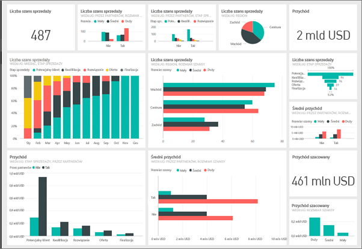

# Pulpity nawigacyjne w usłudze Power BI

***Pulpit nawigacyjny*** usługi Power BI to pojedyncza strona, często nazywana kanwą, umożliwiająca przekazywanie informacji za pomocą wizualizacji. Ponieważ jest to tylko jedna strona, dobrze zaprojektowany pulpit nawigacyjny zawiera tylko najistotniejsze informacje.

Wizualizacje wyświetlane na pulpicie nawigacyjnym nazywane są *kafelkami* i są *przypinane* do pulpitu nawigacyjnego z poziomu raportów. Jeśli jesteś nowym użytkownikiem usługi Power BI, zapoznaj się z podstawowymi informacjami w temacie [Power BI — podstawowe pojęcia](service-basic-concepts.md).

> [!NOTE]
> Pulpity nawigacyjne są funkcją usługi Power BI i nie są dostępne w programie Power BI Desktop. Pulpitów nawigacyjnych nie można tworzyć na urządzeniach mobilnych, można je jednak [wyświetlać i udostępniać](consumer/mobile/mobile-apps-view-dashboard.md).
> 
> 

Wizualizacje na pulpicie nawigacyjnym pochodzą z raportów, a każdy raport jest tworzony w oparciu o jeden zestaw danych. Pulpit nawigacyjny można porównać do drzwi prowadzących do bazowych raportów i zestawów danych. Wybierając wizualizację, możesz przejść do raportu (i zestawu danych), który został użyty do jej utworzenia.

## Zalety pulpitów nawigacyjnych
Pulpity nawigacyjne to świetny sposób na monitorowanie sytuacji w firmie, szukanie odpowiedzi i błyskawiczne zapoznanie się ze wszystkimi najistotniejszymi metrykami. Wizualizacje na pulpicie nawigacyjnym mogą pochodzić z jednego bazowego zestawu danych lub raportu albo wielu zestawów danych lub raportów. Pulpit nawigacyjny łączy dane lokalne i przechowywane w chmurze, zapewniają skonsolidowany widok bez względu na to, gdzie znajdują się dane.

Pulpit nawigacyjny jest nie tylko atrakcyjny wizualnie — stanowi wysoce interaktywne narzędzie dostosowujące się do potrzeb użytkownika, a jego kafelki są aktualizowane na bieżąco, odzwierciedlając zmiany w danych bazowych.

## Pulpity nawigacyjne a raporty
[Raporty](service-reports.md) są często mylone z pulpitami nawigacyjnymi, ponieważ także są kanwami wypełnionymi wizualizacjami. Istnieją jednak pewne podstawowe różnice.

| **Funkcja** | **Pulpity nawigacyjne** | **Raporty** |
| --- | --- | --- |
| Strony |Jedna strona |Jedna lub kilka stron |
| Źródła danych |Co najmniej jeden raport i co najmniej jeden zestaw danych na pulpit nawigacyjny |Jeden zestaw danych na raport |
| Dostępność w programie Power BI Desktop |Nie |Tak, można tworzyć i wyświetlać raporty w programie Desktop |
| Przypinanie |Można przypinać istniejące wizualizacje (kafelki) tylko z bieżącego pulpitu nawigacyjnego do innych pulpitów nawigacyjnych |Można przypinać wizualizacje (jako kafelki) do wszystkich swoich pulpitów nawigacyjnych. Można przypinać całe strony raportów do wszystkich swoich pulpitów nawigacyjnych. |
| Subskrypcja |Nie można subskrybować pulpitu nawigacyjnego |Można subskrybować strony raportu |
| Filtrowanie |Nie można filtrować ani wycinać |Wiele różnych sposobów filtrowania, wyróżniania i wycinania |
| Ustawianie alertów |Można tworzyć alerty wysyłające wiadomość e-mail, gdy zostaną spełnione określone warunki |Nie |
| Promowanie |Można ustawić jeden pulpit nawigacyjny jako „proponowany” |Nie można tworzyć proponowanych raportów |
| Zapytania w języku naturalnym |Dostępne z poziomu pulpitu nawigacyjnego |Niedostępne z poziomu raportów |
| Zmienianie typu wizualizacji |Nie. W rzeczywistości, jeśli właściciel raportu zmieni typ wizualizacji w raporcie, wizualizacja przypięta na pulpicie nawigacyjnym nie zostanie zaktualizowana |Tak |
| Wyświetlanie tabel i pól bazowego zestawu danych |Nie. Można eksportować dane, ale nie można wyświetlać tabel i pól na pulpicie nawigacyjnym. |Tak. Można wyświetlać tabele, pola i wartości zestawu danych. |
| Tworzenie wizualizacji |Ograniczone do dodawania widgetów na pulpicie nawigacyjnym przy użyciu opcji „Dodaj kafelek” |Można tworzyć wiele różnych typów wizualizacji, dodawać niestandardowe wizualizacje, edytować wizualizacje i wykonywać inne czynności, mając uprawnienia do edycji |
| Dostosowywanie |Można wykonywać różne czynności na wizualizacjach (kafelkach), na przykład przenosić i rozmieszczać, zmieniać rozmiar, dodawać linki, zmieniać nazwę, usuwać i wyświetlać na pełnym ekranie. Jednak dane i same wizualizacje są tylko do odczytu. |W widoku do czytania można publikować, osadzać, filtrować, eksportować, pobierać jako plik pbix, wyświetlać powiązaną zawartość, generować kody QR, analizować w programie Excel i nie tylko.  W widoku do edycji można wykonywać wszystkie wymienione już czynności i wiele innych. |

## Twórcy i użytkownicy pulpitów nawigacyjnych
W zależności od swojej roli możesz tworzyć pulpity nawigacyjne na własny użytek lub w celu udostępniania ich współpracownikom. Warto zatem dowiedzieć się, jak tworzyć i udostępniać pulpity nawigacyjne. Możesz być otrzymywać pulpity nawigacyjne od innych osób. W takim przypadku warto dowiedzieć się, jak czytać pulpity nawigacyjne i jak z nich korzystać.

Poniżej przedstawiono kilka tematów według roli, które pomogą Ci w rozpoczęciu pracy.

Usługa Power BI Pro jest wymagana w przypadku udostępniania pulpitu nawigacyjnego oraz wyświetlania udostępnionego pulpitu nawigacyjnego.

### Jeśli będziesz tworzyć i udostępniać pulpity nawigacyjne
* Użyj jednego z naszych przykładów, aby [utworzyć pulpit nawigacyjny na podstawie raportu](service-dashboard-create.md).
* Uzyskaj informacje na temat [kafelków pulpitu nawigacyjnego](service-dashboard-tiles.md) i różnych sposobów przypinania ich do pulpitu nawigacyjnego.
* Pomóż użytkownikom pulpitu nawigacyjnego, tworząc pulpity nawigacyjne, które [dobrze działają z zapytaniami w języku naturalnym funkcji pytań i odpowiedzi](service-prepare-data-for-q-and-a.md) oraz z funkcją [szybkiego wglądu w szczegółowe dane](service-insights-optimize.md).
* Poznaj różne sposoby [udostępniania pulpitu nawigacyjnego współpracownikom](service-how-to-collaborate-distribute-dashboards-reports.md).

### Jeśli będziesz otrzymywać pulpity nawigacyjne i korzystać z nich
* Dobrze poznaj pulpity nawigacyjne, eksperymentując na jednym z naszych [przykładowych pulpitów nawigacyjnych](sample-tutorial-connect-to-the-samples.md).
* Dowiedz się więcej na temat [kafelków pulpitu nawigacyjnego](service-dashboard-tiles.md) i tego, co się stanie, gdy wybierzesz jeden z nich.
* Nie podoba Ci się wygląd pulpitu nawigacyjnego?  Możesz [przenosić kafelki oraz zmieniać ich rozmiar i nazwy](service-dashboard-edit-tile.md).
* Chcesz śledzić wybrany kafelek pulpitu nawigacyjnego i otrzymać wiadomość e-mail po osiągnięciu przez niego określonego progu? [Utwórz alerty kafelków](service-set-data-alerts.md).
* Baw się, zadając pytania pulpitowi nawigacyjnemu. Dowiedz się, jak używać funkcji [pytań i odpowiedzi w usłudze Power BI](power-bi-tutorial-q-and-a.md), aby zadawać pytania dotyczące danych i uzyskiwać odpowiedzi w formie wizualizacji.

> [!TIP]
> Jeśli nie ma tutaj tego, czego szukasz, skorzystaj ze spisu treści po lewej stronie.
> 
> 

## Następne kroki
[Co to jest usługa Power BI?](power-bi-overview.md)  
[Power BI — podstawowe pojęcia](service-basic-concepts.md)  
[Power BI Premium — co to jest?](service-premium.md)  

Masz więcej pytań? [Zadaj pytanie społeczności usługi Power BI](http://community.powerbi.com/)

