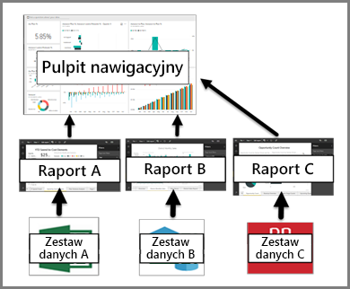

# Pulpity nawigacyjne w usłudze Power BI

***Pulpit nawigacyjny*** usługi Power BI to pojedyncza strona, często nazywana kanwą, umożliwiająca przekazywanie informacji za pomocą wizualizacji. Ponieważ jest to tylko jedna strona, dobrze zaprojektowany pulpit nawigacyjny zawiera tylko najistotniejsze informacje.

Pulpity nawigacyjne są funkcją usługi Power BI i nie są dostępne w programie Power BI Desktop. Pulpitów nawigacyjnych nie można tworzyć na urządzeniach mobilnych, można je jednak [wyświetlać i udostępniać](mobile-apps-view-dashboard.md).

## Twórcy i użytkownicy pulpitów nawigacyjnych
W zależności od swojej roli możesz tworzyć pulpity nawigacyjne na własny użytek lub w celu udostępniania ich współpracownikom. Informacje można znaleźć w temacie **Pulpity nawigacyjne dla twórców**. Jeśli jesteś kimś, kto otrzymuje pulpity nawigacyjne od innych. W takim przypadku warto dowiedzieć się, jak czytać pulpity nawigacyjne i jak z nich korzystać. Ten artykuł jest dla Ciebie.

### Jeśli będziesz otrzymywać pulpity nawigacyjne i korzystać z nich

Wizualizacje wyświetlane na pulpicie nawigacyjnym nazywane są *kafelkami* i są *przypinane* do pulpitu nawigacyjnego z poziomu raportów przez *twórców* pulpitów nawigacyjnych. Jeśli jesteś nowym użytkownikiem usługi Power BI, zapoznaj się z podstawowymi informacjami w temacie [Power BI — podstawowe pojęcia](service-basic-concepts.md).

> [!IMPORTANT]
> Do wyświetlania udostępnionego pulpitu nawigacyjnego jest wymagana usługa [Power BI Pro](service-free-vs-pro.md).

Wizualizacje na pulpicie nawigacyjnym pochodzą z raportów, a każdy raport jest tworzony w oparciu o jeden zestaw danych. Pulpit nawigacyjny można porównać do drzwi prowadzących do bazowych raportów i zestawów danych. Wybierając wizualizację, możesz przejść do raportu (i zestawu danych), który został użyty do jej utworzenia.

## Zalety pulpitów nawigacyjnych
Pulpity nawigacyjne to świetny sposób na monitorowanie sytuacji w firmie, szukanie odpowiedzi i błyskawiczne zapoznanie się ze wszystkimi najistotniejszymi metrykami. Wizualizacje na pulpicie nawigacyjnym mogą pochodzić z jednego bazowego zestawu danych lub raportu albo wielu zestawów danych lub raportów. Pulpit nawigacyjny łączy dane lokalne i przechowywane w chmurze, zapewniają skonsolidowany widok bez względu na to, gdzie znajdują się dane.

Pulpit nawigacyjny jest nie tylko atrakcyjny wizualnie — jest wysoce interaktywny, a jego kafelki są aktualizowane na bieżąco, odzwierciedlając zmiany w danych bazowych.

## Pulpity nawigacyjne a raporty
[Raporty](service-reports.md) są często mylone z pulpitami nawigacyjnymi, ponieważ także są kanwami wypełnionymi wizualizacjami. Jednak istnieją pewne podstawowe różnice dla użytkowników usługi Power BI.

| **Funkcja** | **Pulpity nawigacyjne** | **Raporty** |
| --- | --- | --- |
| Strony |Jedna strona |Jedna lub kilka stron |
| Źródła danych |Co najmniej jeden raport i co najmniej jeden zestaw danych na pulpit nawigacyjny |Jeden zestaw danych na raport |
| Dostępność w programie Power BI Desktop |Nie |Tak, ***twórcy*** mogą tworzyć i wyświetlać raporty w programie Desktop |
| Subskrybuj |Można subskrybować pulpit nawigacyjny |Można subskrybować strony raportu |
| Filtrowanie |Nie można filtrować ani wycinać |Wiele różnych sposobów filtrowania, wyróżniania i wycinania |
| Polecane |Można ustawić jeden pulpit nawigacyjny jako „proponowany” |Nie można tworzyć proponowanych raportów |
| Ulubione | Można oznaczać pulpity nawigacyjne jako *ulubione* | Można ustawiać raporty jako *ulubione*
| Ustawianie alertów |Dostępne dla kafelków pulpitu nawigacyjnego w pewnych okolicznościach |Niedostępne z poziomu raportów |
| Zapytania w języku naturalnym |Dostępne z poziomu pulpitu nawigacyjnego |Niedostępne z poziomu raportów |
| Wyświetlanie tabel i pól bazowego zestawu danych |Nie. Można eksportować dane, ale nie można wyświetlać tabel i pól na pulpicie nawigacyjnym. |Tak. Można wyświetlać tabele, pola i wartości zestawu danych. |
| Dostosowywanie |Nie |W widoku do czytania można publikować, osadzać, filtrować, eksportować, pobierać jako plik pbix, wyświetlać powiązaną zawartość, generować kody QR, analizować w programie Excel i nie tylko.  |

## Następne kroki
* Dobrze poznaj pulpity nawigacyjne, eksperymentując na jednym z naszych [przykładowych pulpitów nawigacyjnych](sample-tutorial-connect-to-the-samples.md).
* Dowiedz się więcej na temat [kafelków pulpitu nawigacyjnego](service-dashboard-tiles.md) i tego, co się stanie, gdy wybierzesz jeden z nich.
* Chcesz śledzić wybrany kafelek pulpitu nawigacyjnego i otrzymać wiadomość e-mail po osiągnięciu przez niego określonego progu? [Utwórz alerty kafelków](service-set-data-alerts.md).
* Baw się, zadając pytania pulpitowi nawigacyjnemu. Dowiedz się, jak używać funkcji [pytań i odpowiedzi w usłudze Power BI](power-bi-tutorial-q-and-a.md), aby zadawać pytania dotyczące danych i uzyskiwać odpowiedzi w formie wizualizacji.
