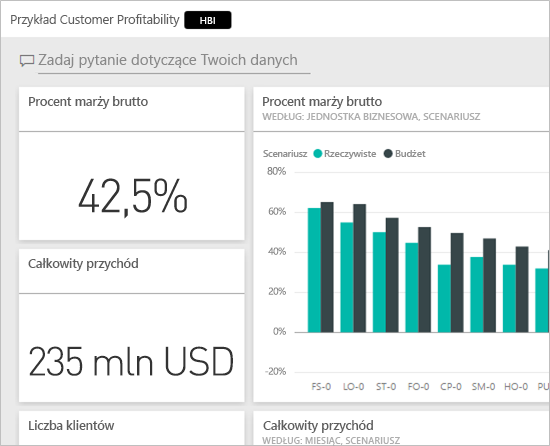
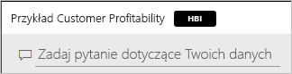
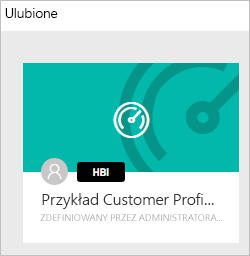
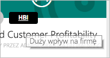
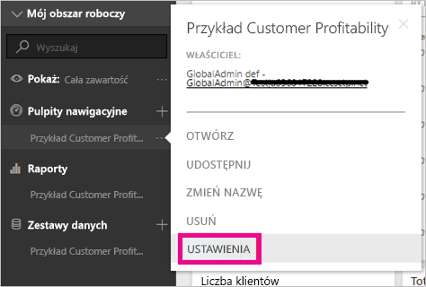
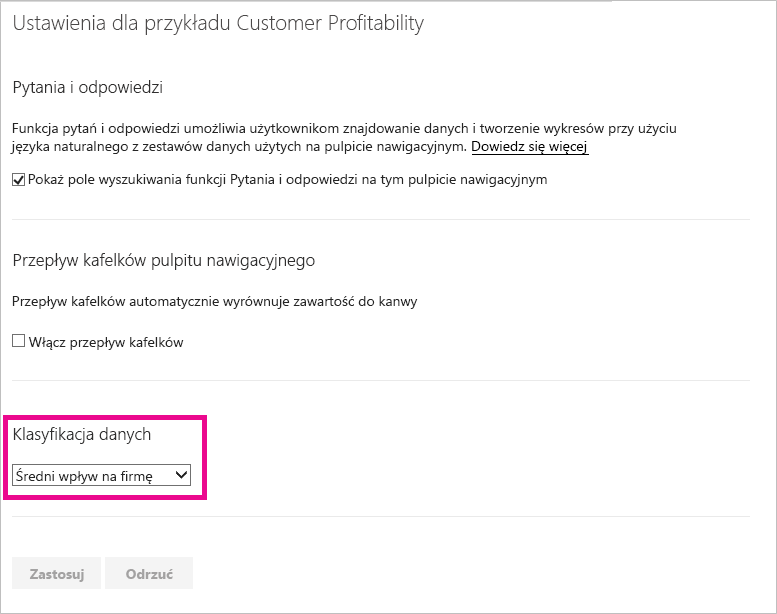
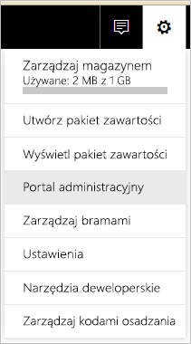
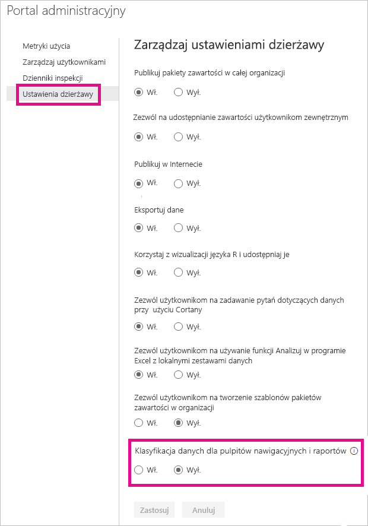
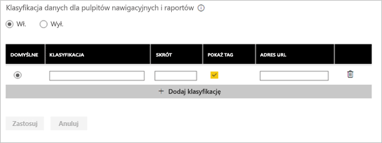
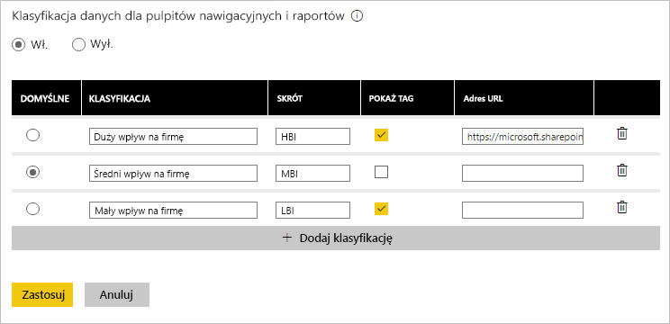

# Klasyfikacja danych pulpitu nawigacyjnego
Każdy pulpit nawigacyjny jest inny. W zależności od źródła danych, z którym nawiązywane jest połączenie, prawdopodobnie zauważysz, że Twoi współpracownicy, którym udostępniasz pulpit nawigacyjny, będą musieli podjąć inne kroki niż Ty, w zależności od poufności danych. Niektóre pulpity nawigacyjne nigdy nie powinny być udostępniane osobom spoza firmy lub drukowane, podczas gdy inne można udostępniać swobodnie. Korzystając z klasyfikacji danych pulpitu nawigacyjnego, możesz zwiększyć świadomość osób przeglądających pulpity nawigacyjne w zakresie poziomu zabezpieczeń, który należy zastosować. Możesz oznaczyć pulpity nawigacyjne przy użyciu klasyfikacji zdefiniowanych przez dział IT w firmie, aby każda osoba wyświetlająca zawartość mogła uzyskać te same informacje o poufności danych.

## Tagi klasyfikacji danych
Tagi klasyfikacji danych są wyświetlane obok nazwy pulpitu nawigacyjnego, dzięki czemu każda osoba wyświetlająca pulpit uzyska informacje o poziomie zabezpieczeń, które należy zastosować wobec pulpitu nawigacyjnego i danych w nim zawartych.

Tag będzie również wyświetlany obok tytułu pulpitu nawigacyjnego na liście Ulubione.

Po najechaniu kursorem na tag zobaczysz pełną nazwę klasyfikacji.

Administratorzy mogą też ustawić adres URL dla tagu, aby zapewnić dodatkowe informacje.

> [!NOTE]
> W zależności od ustawień klasyfikacji wprowadzonych przez administratora niektóre typy klasyfikacji mogą nie być wyświetlane jako tag na pulpicie nawigacyjnym. Jeśli jesteś właścicielem pulpitu nawigacyjnego, zawsze możesz sprawdzić typ klasyfikacji pulpitu nawigacyjnego w ustawieniach pulpitu nawigacyjnego.
> 
> 

## Ustawianie klasyfikacji pulpitu nawigacyjnego
Jeśli klasyfikacja danych jest włączona w firmie, wszystkie pulpity nawigacyjne zaczynają z domyślnym typem klasyfikacji, ale właściciel pulpitu nawigacyjnego może zmienić klasyfikację, aby dopasować poziom zabezpieczeń.

Aby zmienić klasyfikację, wykonaj następujące czynności.

1. Przejdź do ustawień pulpitu nawigacyjnego, wybierając **wielokropek** obok nazwy pulpitu nawigacyjnego, a następnie wybierz opcję **Ustawienia**.
   
    
2. W obszarze Ustawienia pulpitu nawigacyjnego możesz zobaczyć bieżącą klasyfikację pulpitu nawigacyjnego i użyć menu rozwijanego, aby zmienić typ klasyfikacji.
   
    
3. Po zakończeniu wybierz opcję **Zastosuj**.

Po zastosowaniu zmiany każda osoba, której udostępniono pulpit nawigacyjny, zobaczy aktualizację podczas kolejnego ponownego załadowania pulpitu.

## Praca z tagami klasyfikacji danych na poziomie administratora
Klasyfikacja danych jest ustawiana przez administratora globalnego w organizacji. Aby włączyć klasyfikację danych, wykonaj następujące czynności.

1. Wybierz koło zębate Ustawienia i wybierz opcję **Portal administracyjny**.
   
    
2. Przełącz opcję **Klasyfikacja danych dla pulpitów nawigacyjnych i raportów** na wartość *Wł.* na karcie **Ustawienia dzierżawy**.
   
    

Po włączeniu opcji zobaczysz formularz umożliwiający utworzenie różnych klasyfikacji w organizacji.

Każda klasyfikacja ma **nazwę** i **nazwę skróconą**, która będzie wyświetlana na pulpicie nawigacyjnym. Dla każdej klasyfikacji możesz zdecydować, czy tag z nazwą skróconą będzie wyświetlany na pulpicie nawigacyjnym, wybierając opcję **Pokaż tag**. Jeśli zdecydujesz, żeby nie pokazywać typu klasyfikacji na pulpicie nawigacyjnym, właściciel nadal będzie w stanie wyświetlić typ, sprawdzając ustawienia pulpitu nawigacyjnego. Ponadto możesz opcjonalnie dodać **adres URL**, który zawiera więcej informacji o wytycznych dotyczących klasyfikacji oraz wymaganiach użytkowania w organizacji.  

Ostatni krok to podjęcie decyzji o tym, która klasyfikacja będzie klasyfikacją domyślną.  

Po wypełnieniu formularza z typami klasyfikacji wybierz opcję **Zastosuj**, aby zapisać ustawienia.

W tym momencie wszystkie pulpity nawigacyjne otrzymają klasyfikację domyślną, a właściciele pulpitów nawigacyjnych będą w stanie zaktualizować typ klasyfikacji do typu odpowiedniego dla zawartości. Możesz wrócić tutaj później, aby dodać lub usunąć typy klasyfikacji bądź zmienić domyślny typ klasyfikacji.  

> [!NOTE]
> Jest kilka ważnych rzeczy do zapamiętania na wypadek powrotu w celu wprowadzenia zmian:
> 
> * Jeśli wyłączysz klasyfikację danych, żadne tagi nie zostaną zapamiętane. Ponowne włączenie opcji będzie wymagało rozpoczęcia całej procedury od początku.  
> * Jeśli usuniesz typ klasyfikacji, wszystkie pulpity nawigacyjne przypisane do usuniętego typu klasyfikacji powrócą do domyślnego typu klasyfikacji do momentu ponownego ustawienia typu przez właściciela.  
> * Jeśli zmienisz domyślny typ klasyfikacji, wszystkie pulpity nawigacyjne, które nie miały jeszcze przypisanego typu klasyfikacji przez właściciela zostaną przypisane do nowego typu domyślnego.
> 
> 

