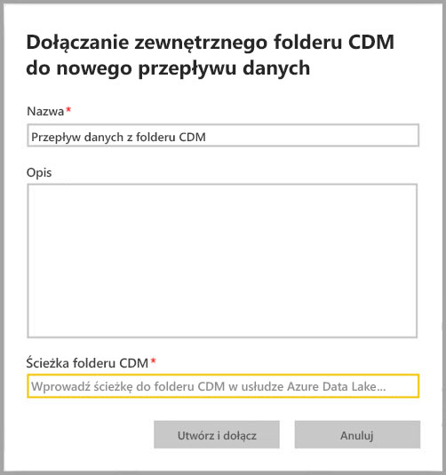

# Dodawanie folderu CDM do usługi Power BI jako przepływu danych (wersja zapoznawcza)

W usłudze Power BI można dodawać foldery CDM (Common Data Model) przechowywane w usłudze Azure Data Lake Store Gen2 organizacji jako przepływy danych. Po utworzeniu przepływu danych na podstawie folderu CDM można używać programu **Power BI Desktop** i **usługi Power BI** do tworzenia zestawów danych, raportów, pulpitów nawigacyjnych i aplikacji, które opierają się na danych umieszczanych w folderach CDM.

Istnieją pewne wymagania dotyczące tworzenia przepływów danych na podstawie folderów CDM. Przedstawiono je na poniższej liście:

* Tworzenie przepływów danych na podstawie folderów CDM jest dostępne *tylko* w [środowisku nowego obszaru roboczego](service-create-the-new-workspaces.md). 
* Dodawanie folderu CDM do usługi Power BI wymaga, aby użytkownik dodający folder miał [autoryzację związaną z folderem CDM i jego plikami](https://go.microsoft.com/fwlink/?linkid=2029121).
* Musisz mieć przyznane uprawnienia do odczytu i wykonywania dla wszystkich plików i folderów w folderze CDM, aby dodawać je do usługi Power BI.

W poniższej sekcji opisano sposób tworzenia przepływu danych na podstawie folderu CDM.

> [!NOTE]
> Funkcjonalność przepływów danych jest dostępna w wersji zapoznawczej. Przed przejściem do wersji ogólnodostępnej może ona podlegać zmianom i aktualizacjom.

## Tworzenie przepływu danych na podstawie folderu CDM

Aby rozpocząć tworzenie przepływu danych z folderu CDM, uruchom **usługę Power BI** i wybierz **obszar roboczy aplikacji** w okienku nawigacji po lewej stronie. Możesz również utworzyć nowy obszar roboczy, w którym będzie można utworzyć nowy przepływ danych.

Na wyświetlonym ekranie wybierz pozycję **Utwórz i dołącz**, jak pokazano na poniższej ilustracji.

Na wyświetlonym ekranie można nadać nazwę przepływu danych, podać jego opis oraz określić ścieżkę do folderu CDM na koncie usługi Azure Data Lake Gen2 w organizacji. Zapoznaj się z sekcją w artykule opisującym [sposób uzyskiwania ścieżki folderu CDM](service-dataflows-configure-workspace-storage-settings.md#get-the-uri-of-stored-dataflow-files). 

Po podaniu informacji wybierz przycisk **Utwórz i dołącz** w celu utworzenia przepływu danych.

Przepływy danych z folderów CDM wyświetlane w usłudze Power BI są oznaczone ikoną *zewnętrzne*. W następnej sekcji opisujemy różnice między standardowymi przepływami danych i przepływami danych utworzonymi na podstawie folderów CDM.

Po poprawnym ustawieniu uprawnień zgodnie z opisem wcześniej w tym artykule możesz nawiązać połączenie z przepływem danych w programie **Power BI Desktop**.

## Istotne zagadnienia i ograniczenia

W przypadku pracy z uprawnieniami do przepływu danych utworzonego na podstawie folderu CDM proces jest podobny do zewnętrznych źródeł danych w usłudze Power BI. Uprawnienia są zarządzane w źródle danych, a nie z poziomu usługi Power BI. W celu zapewnienia prawidłowej współpracy z usługą Power BI należy odpowiednio zdefiniować uprawnienia w źródle danych, takim jak przepływ danych utworzony na podstawie folderu CDM.

Poniższe listy pomogą wyjaśnić, jak przepływy danych z folderów CDM współdziałają z usługą Power BI.

Obszary robocze usługi Power BI Pro, Premium i Embedded:
* Nie można edytować przepływów danych z folderów CDM
* Uprawnienia do odczytu przepływu danych utworzonego na podstawie folderu CDM są zarządzane przez właściciela folderu CDM, a nie przez usługę Power BI

Power BI Desktop:
* Tylko użytkownicy autoryzowani do pracy z obszarem roboczym, w którym utworzono przepływ danych, oraz z folderem CDM mają dostęp do ich danych z poziomu łącznika przepływów danych usługi Power BI

Poniżej przedstawiono również kilka dodatkowych zagadnień:

* Tworzenie przepływów danych na podstawie folderów CDM jest dostępne *tylko* w [środowisku nowego obszaru roboczego](service-create-the-new-workspaces.md)
* Połączone jednostki są niedostępne w przypadku przepływów danych tworzonych na podstawie folderów CDM

Klienci programu **Power BI Desktop** nie mogą uzyskiwać dostępu do przepływów danych przechowywanych na koncie usługi Azure Data Lake Storage Gen2, chyba że są właścicielami przepływu danych lub mają jawną autoryzację do korzystania z folderu CDM przepływu danych. Rozpatrzmy następującą sytuację:

1.  Anna tworzy nowy obszar roboczy aplikacji i konfiguruje go do przechowywania przepływów danych z folderu CDM.
2.  Jan, który również jest członkiem obszaru roboczego utworzonego przez Annę, chce używać programu Power BI Desktop i łącznika przepływu danych do pobierania danych z przepływu danych, który utworzyła Anna.
3.  Jan zobaczy komunikat o błędzie, ponieważ nie został dodany jako autoryzowany użytkownik do folderu CDM przepływu danych w usłudze Data Lake.

    

Aby rozwiązać ten problem, Jan musi mieć uprawnienia czytelnika do folderu CDM i jego plików. Dowiedz się więcej na temat sposobu przyznawania dostępu do folderu CDM w [tym artykule](https://go.microsoft.com/fwlink/?linkid=2029121).

## Następne kroki

W tym artykule przedstawiono wskazówki dotyczące sposobu konfigurowania magazynu obszaru roboczego na potrzeby przepływów danych. Aby uzyskać więcej informacji, zapoznaj się z następującymi artykułami:

Aby uzyskać więcej informacji na temat przepływów danych, modelu CDM i usługi Azure Data Lake Storage Gen2, przeczytaj następujące artykuły:

* [Integracja przepływów danych z usługą Azure Data Lake (wersja zapoznawcza)](service-dataflows-azure-data-lake-integration.md)
* [Konfigurowanie ustawień przepływów danych w obszarze roboczym (wersja zapoznawcza)](service-dataflows-configure-workspace-storage-settings.md)
* [Łączenie usługi Azure Data Lake Storage Gen2 na potrzeby magazynowania przepływów danych (wersja zapoznawcza)](service-dataflows-connect-azure-data-lake-storage-gen2.md)

Aby uzyskać ogólne informacje na temat przepływów danych, zapoznaj się z tymi artykułami:

* [Tworzenie i używanie przepływów danych w usłudze Power BI](service-dataflows-create-use.md)
* [Używanie obliczonych jednostek w usłudze Power BI Premium (wersja zapoznawcza)](service-dataflows-computed-entities-premium.md)
* [Używanie przepływów danych z lokalnymi źródłami danych (wersja zapoznawcza)](service-dataflows-on-premises-gateways.md)
* [Zasoby dla deweloperów dotyczące przepływów danych usługi Power BI (wersja zapoznawcza)](service-dataflows-developer-resources.md)

Aby uzyskać więcej informacji na temat usługi Azure Storage, możesz przeczytać następujące artykuły:
* [Azure Storage security guide](https://docs.microsoft.com/azure/storage/common/storage-security-guide) (Przewodnik po zabezpieczeniach usługi Azure Storage)
* [Konfigurowanie zaplanowanego odświeżania](refresh-scheduled-refresh.md)
* [Get started with github samples from Azure Data Services](https://aka.ms/cdmadstutorial) (Wprowadzenie do przykładów usługi github dotyczących usług Azure Data Services)

Aby uzyskać więcej informacji na temat modelu Common Data Model, można przeczytać artykuł zawierający jego omówienie:
* [Omówienie usługi Common Data Model](https://docs.microsoft.com/powerapps/common-data-model/overview)
* [CDM folders](https://go.microsoft.com/fwlink/?linkid=2045304) (Foldery modelu CDM)
* [CDM model file definition](https://go.microsoft.com/fwlink/?linkid=2045521) (Definicja pliku modelu CDM)

Możesz również zawsze spróbować [zadać pytania społeczności usługi Power BI](http://community.powerbi.com/).

