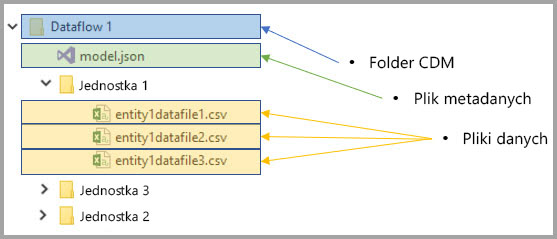
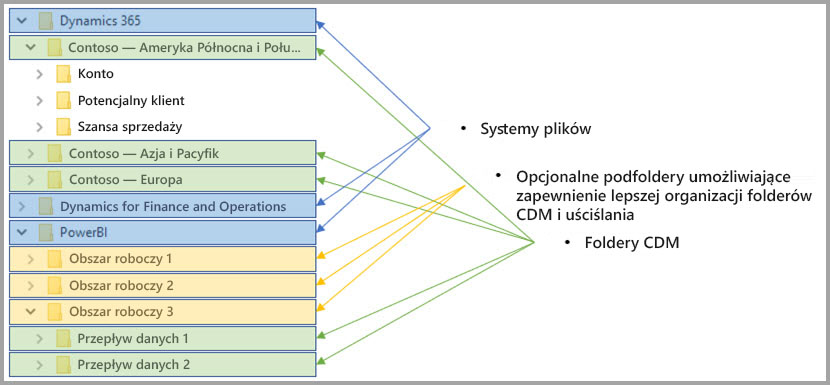

# Integracja przepływów danych z usługą Azure Data Lake (wersja zapoznawcza)

Domyślnie dane używane z usługą Power BI są przechowywane w magazynie wewnętrznym oferowanym przez usługę Power BI. Dzięki integracji przepływów danych i usługi Azure Data Lake Storage Gen2 (ADLS Gen2) można przechowywać swoje przepływy danych na koncie usługi Azure Data Lake Storage Gen2 organizacji. 

> [!NOTE]
> Funkcjonalność przepływów danych jest dostępna w wersji zapoznawczej. Przed przejściem do wersji ogólnodostępnej może ona podlegać zmianom i aktualizacjom.

## Jak foldery CDM są powiązane z przepływami danych

Dzięki **przepływom danych** użytkownicy i organizacje mogą ujednolicać dane z różnych źródeł i przygotowywać je do modelowania. Za pomocą modelu CDM (Common Data Model) organizacje mogą używać formatu danych, który zapewnia spójność semantyki w aplikacjach i wdrożeniach. A przy użyciu usługi Azure Data Lake Storage gen2 (ADLS Gen2) można stosować szczegółową kontrolę dostępu i autoryzacji do usług Data Lake na platformie Azure. Po połączeniu te elementy udostępniają atrakcyjne scentralizowane dane, dane ze strukturą, bardziej precyzyjną kontrolę dostępu oraz spójność semantyki dla aplikacji i inicjatyw w całym przedsiębiorstwie.

Dane przechowywane w formacie CDM oferują spójność semantyki w wielu aplikacjach i wdrożeniach w organizacji. Dzięki integracji modelu CDM z usługą ADLS Gen2 można zastosować tę samą spójność strukturalną i znaczenie semantyczne do danych przechowywanych w usłudze ADLS Gen2 przy użyciu folderów CDM, które zawierają dane ze schematem w standardowym formacie CDM. Ustandaryzowane metadane i samoopisujące dane w usłudze Azure Data Lake ułatwiają odnajdywanie metadanych oraz współdziałanie między producentami i użytkownikami danych, takimi jak usługi Power BI, Azure Data Factory, Azure Data Lake, Databricks i Azure Machine Learning (ML). 

Przepływy danych przechowują definicje i dane w folderach CDM w następujących formatach:

**Model.json**
* Plik opisu metadanych **Model.json** zawiera semantyczne informacje dotyczące rekordów i atrybutów jednostek oraz linki do podstawowych plików danych. Obecność pliku model.json wskazuje na zgodność z formatem metadanych CDM i może uwzględniać jednostki standardowe, które mają dodatkowe rozbudowane metadane semantyczne dostępne po instalacji, z których mogą korzystać aplikacje.
* Usługa Power BI przechowuje również wszystkie informacje o źródle danych razem z **zapytaniami i przekształceniami** wygenerowanymi w środowisku edytora przepływu danych w usłudze Power BI. Hasła do źródeł danych nie są przechowywane w pliku modelu.

**Pliki danych**
* Pliki danych znajdują się w folderze CDM i mają dobrze zdefiniowaną strukturę oraz format (podfoldery są opcjonalne, jak opisano w dalszej części tego artykułu). Są one przywoływane w pliku model.json. Obecnie pliki danych muszą mieć format CSV, ale dodatkowe formaty mogą być obsługiwane w przyszłych aktualizacjach. 

Na poniższym diagramie przedstawiono przykładowy folder CDM utworzony przez przepływ danych usługi Power BI, który zawiera trzy jednostki:

Plik model.json lub plik metadanych na poprzedniej ilustracji udostępnia wskaźniki do plików danych jednostek w folderze CDM.

## Usługa Power BI organizuje foldery CDM w usłudze Data Lake

Przy użyciu przepływów danych usługi Power BI i jej integracji z usługą ADLS Gen2 usługa Power BI może tworzyć dane w usłudze Data Lake. Jako producent danych usługa Power BI musi utworzyć folder CDM dla każdego przepływu danych zawierającego plik model.json i skojarzone z nim pliki danych. Usługa Power BI przechowuje dane oddzielnie od innych producentów danych w usłudze Data Lake, korzystając z *systemów plików*. Dalsze informacje na temat hierarchicznej przestrzeni nazw i systemu plików usługi Azure Data Lake Storage Gen2 można znaleźć w [artykule z ich opisem](https://docs.microsoft.com/azure/storage/data-lake-storage/namespace).

Usługa Power BI używa podfolderów w celu uściślania oraz zapewniania udoskonalonej organizacji danych prezentowanych przez **usługę Power BI**. Struktura i nazewnictwo folderów reprezentują obszary robocze (foldery) i przepływy danych (foldery CDM). Na poniższym diagramie pokazano, jaką strukturę może mieć usługa Data Lake udostępniana usłudze Power BI i innym producentom danych. Każda usługa, w tym przypadku Dynamics 365, Dynamics for Finance i Operation oraz Power BI, tworzy i obsługuje własny system plików. W zależności od środowiska w poszczególnych usługach podfoldery są tworzone w celu lepszej organizacji folderów CDM w systemie plików. 

## Usługa Power BI chroni dane w usłudze Data Lake

Usługa Power BI używa tokenów *elementu nośnego standardu OAuth usługi Active Directory* i funkcjonalności *list ACL modelu POSIX* udostępnianych przez usługę Azure Data Lake Storage Gen2. Te funkcje umożliwiają określanie zakresu dostępu usługi Power BI do systemu plików, którym zarządza ona w usłudze Data Lake, a także określanie zakresu dostępu użytkowników tylko do tworzonych przez nich przepływów danych lub folderów CDM. 

Do tworzenia folderów CDM i zarządzania nimi w systemie plików usługi Power BI są wymagane uprawnienia do odczytu, zapisu i wykonywania w systemie plików. Każdy przepływ danych utworzony w usłudze Power BI jest przechowywany we własnym folderze CDM, a właściciel przepływu danych otrzymuje uprawnienia tylko do odczytu do folderu CDM i jego zawartości. To podejście zapewnia ochronę integralności danych generowanych przez usługę Power BI i oferuje administratorom możliwość monitorowania użytkowników, którzy uzyskiwali dostęp do folderu CDM, za pomocą dzienników inspekcji. 

### Autoryzowanie użytkowników lub usług do folderów CDM

Udostępnianie folderów CDM konsumentom danych, takim jak użytkownicy lub usługi, którzy muszą odczytywać dane, zostało uproszczone dzięki tokenom elementu nośnego standardu OAuth usługi Active Directory i listom kontroli dostępu modelu POSIX. Dzięki temu administratorzy mogą monitorować użytkownicy, którzy uzyskiwali dostęp do folderu CDM. Jedyna wymagana akcja to udzielenie wybranemu obiektowi usługi Active Directory (np. grupy użytkowników lub usługi) dostępu do folderu CDM. Zalecamy, aby wszystkie prawa dostępu do folderu CDM dla dowolnej tożsamości innej niż producenci danych były prawami tylko do odczytu. Ten sposób zapewnia ochronę integralności danych generowanych przez producenta.

Aby dodawać foldery CDM do usługi Power BI, użytkownik dodający folder CDM powinien mieć listy ACL dla dostępu typu *Odczyt* do samego folderu CDM oraz wszystkich plików i folderów, które się w nim znajdują. Ponadto potrzebne będą listy ACL dla dostępu typu *Wykonywanie* do folderu CDM i znajdujących się w nim folderów. W celu uzyskania dalszych informacji zalecamy zapoznanie się z artykułami [Access control lists on files and directory](https://docs.microsoft.com/azure/storage/blobs/data-lake-storage-access-control#access-control-lists-on-files-and-directories) (Listy kontroli dostępu do plików i katalogu) oraz [Best practices for using Azure Data Lake Storage Gen2](https://docs.microsoft.com/azure/storage/blobs/data-lake-storage-best-practices) (Najlepsze rozwiązania dotyczące korzystania z usługi Azure Data Lake Storage Gen2).

### Alternatywne formy autoryzacji

Osoby lub usługi poza usługą Power BI mogą również korzystać z alternatywnych rodzajów autoryzacji, które pozwalają posiadaczom klucza na dostęp do *wszystkich* zasobów na koncie i pełny dostęp do wszystkich zasobów usługi Data Lake. Tego zakresu nie można zmienić na systemy plików lub foldery CDM. Te alternatywy mogą być prostymi sposobami udzielania dostępu, ale ograniczają możliwość udostępniania określonych zasobów w usłudze Data Lake i nie umożliwiają użytkownikom inspekcji osób, które uzyskiwały do magazynu. Pełne informacje na temat dostępnych schematów autoryzacji znajdują się w artykule [Access control in Azure Data Lake Storage Gen2](https://docs.microsoft.com/azure/storage/blobs/data-lake-storage-access-control
) (Kontrola dostępu w usługach Azure Data Lake Storage Gen2).

## Następne kroki

W tym artykule przedstawiono omówienie integracji przepływów danych usługi Power BI, folderów CDM i usługi Azure Data Lake Storage Gen2. Aby uzyskać więcej informacji, zapoznaj się z następującymi artykułami:

Aby uzyskać więcej informacji na temat przepływów danych, modelu CDM i usługi Azure Data Lake Storage Gen2, przeczytaj następujące artykuły:

* [Konfigurowanie ustawień przepływów danych w obszarze roboczym (wersja zapoznawcza)](service-dataflows-configure-workspace-storage-settings.md)
* [Dodawanie folderu CDM do usługi Power BI jako przepływu danych (wersja zapoznawcza)](service-dataflows-add-cdm-folder.md)
* [Łączenie usługi Azure Data Lake Storage Gen2 na potrzeby magazynowania przepływów danych (wersja zapoznawcza)](service-dataflows-connect-azure-data-lake-storage-gen2.md)

Aby uzyskać ogólne informacje na temat przepływów danych, zapoznaj się z tymi artykułami:

* [Tworzenie i używanie przepływów danych w usłudze Power BI](service-dataflows-create-use.md)
* [Używanie obliczonych jednostek w usłudze Power BI Premium (wersja zapoznawcza)](service-dataflows-computed-entities-premium.md)
* [Używanie przepływów danych z lokalnymi źródłami danych (wersja zapoznawcza)](service-dataflows-on-premises-gateways.md)
* [Zasoby dla deweloperów dotyczące przepływów danych usługi Power BI (wersja zapoznawcza)](service-dataflows-developer-resources.md)

Aby uzyskać więcej informacji na temat usługi Azure Storage, możesz przeczytać następujące artykuły:
* [Azure Storage security guide](https://docs.microsoft.com/azure/storage/common/storage-security-guide) (Przewodnik po zabezpieczeniach usługi Azure Storage)
* [Get started with github samples from Azure Data Services](https://aka.ms/cdmadstutorial) (Wprowadzenie do przykładów usługi github dotyczących usług Azure Data Services)

Aby uzyskać więcej informacji na temat modelu Common Data Model, można przeczytać artykuł zawierający jego omówienie:
* [Omówienie usługi Common Data Model](https://docs.microsoft.com/powerapps/common-data-model/overview)
* [CDM folders](https://go.microsoft.com/fwlink/?linkid=2045304) (Foldery modelu CDM)
* [CDM model file definition](https://go.microsoft.com/fwlink/?linkid=2045521) (Definicja pliku modelu CDM)

Możesz również zawsze spróbować [zadać pytania społeczności usługi Power BI](http://community.powerbi.com/).
