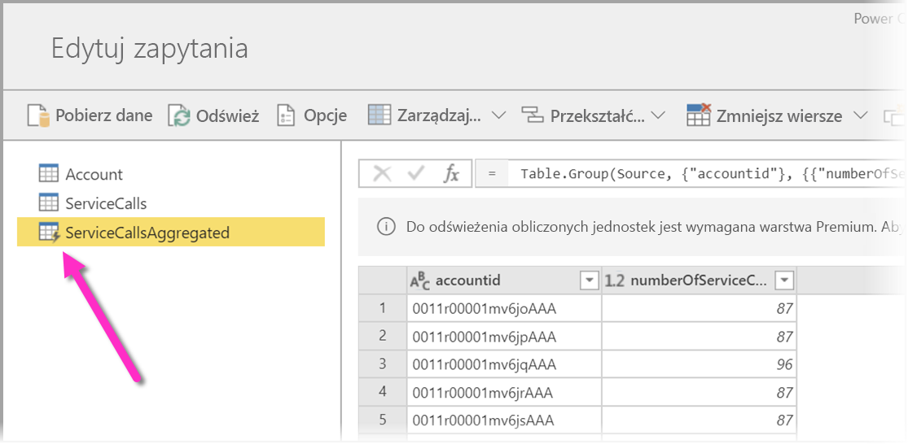
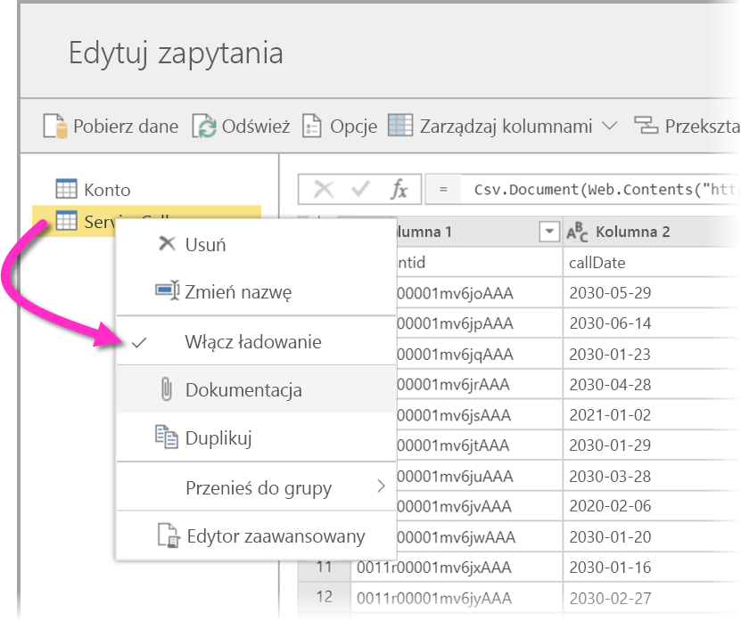
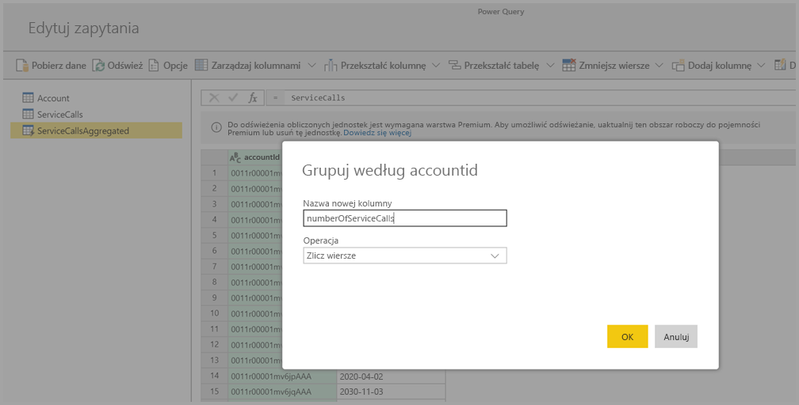
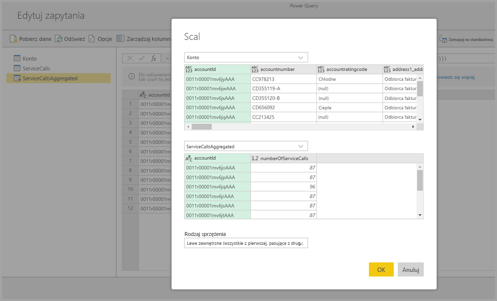
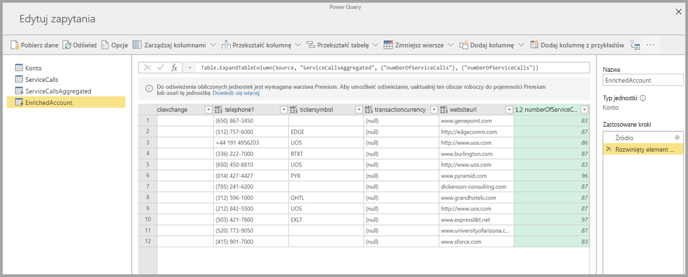

# Używanie obliczonych jednostek w usłudze Power BI Premium (wersja zapoznawcza)

**Obliczenia w magazynie** można wykonywać w przypadku korzystania z **przepływów danych** w ramach subskrypcji usługi Power BI Premium. Umożliwia to wykonywanie obliczeń w istniejących przepływach danych, a zwracane wyniki pozwalają Ci skoncentrować się na tworzeniu i analizowaniu raportów. 

Aby móc wykonywać **obliczenia w magazynie**, należy najpierw utworzyć przepływ danych i przenieść dane do tego magazynu przepływów danych usługi Power BI. Po utworzeniu przepływu danych zawierającego dane można utworzyć **obliczone jednostki**, czyli jednostki, które wykonują obliczenia w magazynie. 

Istnieją dwa sposoby łączenia danych przepływu danych z usługą Power BI:

* [Przy użyciu funkcji samoobsługowego tworzenia przepływu danych](service-dataflows-create-use.md)
* Przy użyciu zewnętrznego przepływu danych

W poniższych sekcjach opisano sposób tworzenia obliczonych jednostek w obrębie danych przepływu danych.

> [!NOTE]
> Funkcjonalność przepływów danych jest dostępna w wersji zapoznawczej. Przed przejściem do wersji ogólnodostępnej może ona podlegać zmianom i aktualizacjom.

## Jak utworzyć obliczone jednostki 

Gdy masz już przepływ danych z listą jednostek, możesz wykonywać obliczenia na tych jednostkach.

W narzędziu do tworzenia przepływów danych w usłudze Power BI wybierz pozycję **Edytuj jednostki**, a następnie kliknij prawym przyciskiem myszy jednostkę, której chcesz użyć jako podstawy dla obliczonej jednostki i w ramach której chcesz wykonywać obliczenia. W menu kontekstowym wybierz pozycję **Odwołanie**.

Aby jednostka kwalifikowała się jako obliczona jednostka, należy zaznaczyć polecenie **Włącz ładowanie**, jak pokazano na poniższej ilustracji. Kliknij prawym przyciskiem myszy jednostkę, aby wyświetlić to menu kontekstowe.

Wybierając pozycję **Włącz ładowanie**, tworzysz nową jednostkę, której źródłem jest przywoływana jednostka. Ikona zmienia się i przedstawia wartość **obliczono**, jak pokazano na poniższej ilustracji.

Wszystkie przekształcenia wykonywane w obrębie nowo utworzonej jednostki będą uruchamiane dla danych, które już znajdują się w magazynie przepływów danych usługi Power BI. Oznacza to, że zapytanie nie zostanie uruchomione względem zewnętrznego źródła danych, z którego dane zostały zaimportowane (na przykład z bazy danych SQL, z której ściągnięto dane), ale zostanie wykonane na danych, które znajdują się w magazynie przepływów danych.

### Przykładowe przypadki użycia
Jakie rodzaju przekształcenia można wykonywać przy użyciu obliczonych jednostek? Wszystkie przekształcenia, które zwykle określasz przy użyciu interfejsu użytkownika przekształceń w usłudze Power BI lub edytorze języka M, są obsługiwane podczas przeprowadzania obliczeń w magazynie. 

Rozważ następujący przykład: masz jednostkę *Konto*, która zawiera nieprzetworzone dane dla wszystkich klientów z subskrypcji usługi Dynamics 365. Masz również nieprzetworzone dane *ServiceCalls* z centrum obsługi. Są to dane dotyczące rozmów z działem pomocy technicznej, które zostały wykonane z innego konta w każdym dniu roku.

Wyobraź sobie, że chcesz wzbogacić jednostkę *Konto* przy użyciu danych rozmów *ServiceCalls*. 

Najpierw musisz zagregować dane dotyczące rozmów ServiceCalls w celu obliczenia liczby rozmów z działem pomocy technicznej, które zostały wykonane dla każdego konta w ciągu ostatniego roku. 

Następnie scalisz jednostkę *Konto* z jednostką *ServiceCallsAggregated* w celu obliczenia wartości wzbogaconej tabeli **Konto**.

Następnie zostaną wyświetlone wyniki pokazane jako *EnrichedAccount* na poniższej ilustracji.

I to wszystko — przeprowadzono przekształcenie danych w przepływie danych, który znajduje się w subskrypcji usługi Power BI Premium, a nie danych źródłowych.

## Istotne zagadnienia i ograniczenia

Należy pamiętać, że jeśli usuniesz obszar roboczy z pojemności Premium usługi Power BI, skojarzony przepływ danych nie będzie już odświeżany. 

Podczas pracy z przepływami danych utworzonymi specjalnie na koncie usługi Azure Data Lake Storage Gen2 w organizacji połączone jednostki i obliczone jednostki działają prawidłowo tylko w sytuacji, gdy jednostki znajdują się w tym samym koncie magazynu. Aby uzyskać więcej informacji, zobacz temat [Łączenie usługi Azure Data Lake Storage Gen2 na potrzeby przechowywania przepływów danych (wersja zapoznawcza)](service-dataflows-connect-azure-data-lake-storage-gen2.md).

Ponadto połączone jednostki są niedostępne w przypadku przepływów danych tworzonych na podstawie folderów CDM. Zobacz [Dodawanie folderu CDM do usługi Power BI jako przepływu danych (wersja zapoznawcza)](service-dataflows-add-cdm-folder.md).

## Następne kroki

W tym artykule opisano obliczone jednostki i przepływy danych dostępne w usłudze Power BI. Oto kilka innych pomocnych artykułów.

* [Przygotowywanie danych samoobsługi przy użyciu przepływów danych](service-dataflows-overview.md)
* [Tworzenie i używanie przepływów danych w usłudze Power BI](service-dataflows-create-use.md)
* [Używanie przepływów danych z lokalnymi źródłami danych (wersja zapoznawcza)](service-dataflows-on-premises-gateways.md)
* [Zasoby dla deweloperów dotyczące przepływów danych usługi Power BI (wersja zapoznawcza)](service-dataflows-developer-resources.md)
* [Konfigurowanie ustawień przepływów danych w obszarze roboczym (wersja zapoznawcza)](service-dataflows-configure-workspace-storage-settings.md)
* [Dodawanie folderu CDM do usługi Power BI jako przepływu danych (wersja zapoznawcza)](service-dataflows-add-cdm-folder.md)
* [Łączenie usługi Azure Data Lake Storage Gen2 na potrzeby magazynowania przepływów danych (wersja zapoznawcza)](service-dataflows-connect-azure-data-lake-storage-gen2.md)

Aby uzyskać więcej informacji na temat dodatku Power Query oraz zaplanowanego odświeżania, możesz przeczytać następujące artykuły:
* [Omówienie zapytań w programie Power BI Desktop](desktop-query-overview.md)
* [Konfigurowanie zaplanowanego odświeżania](refresh-scheduled-refresh.md)

Aby uzyskać więcej informacji na temat modelu Common Data Model, można przeczytać artykuł zawierający jego omówienie:
* [Omówienie usługi Common Data Model](https://docs.microsoft.com/powerapps/common-data-model/overview)

