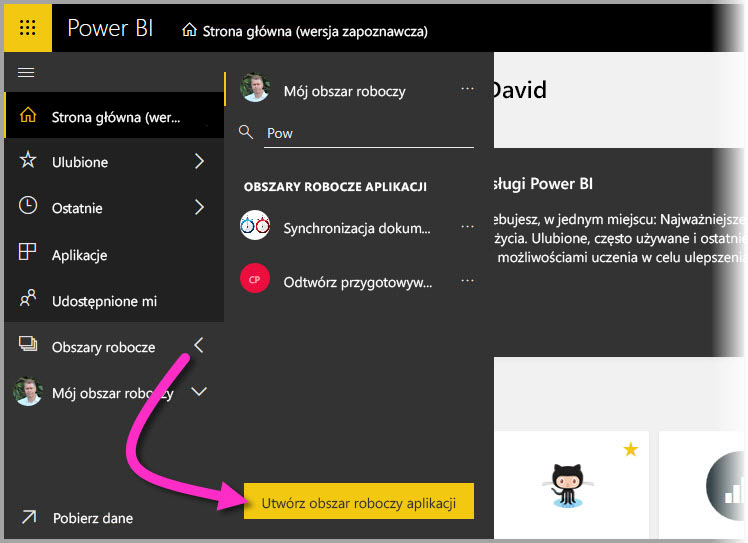
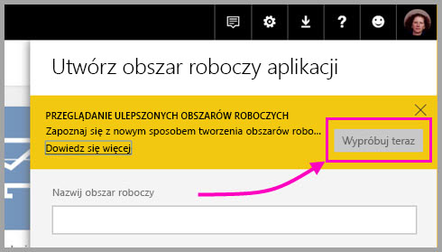
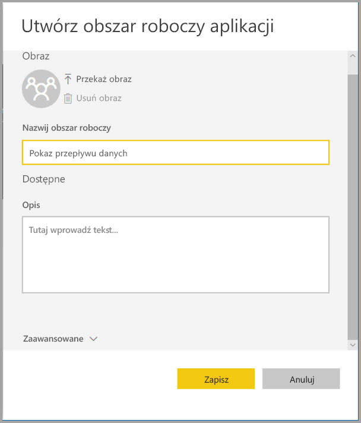
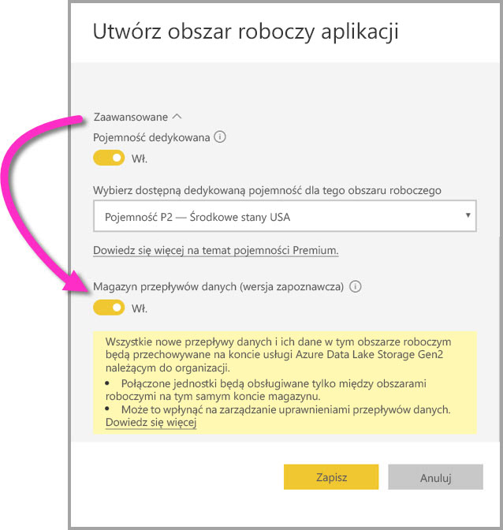
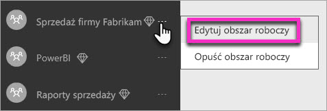
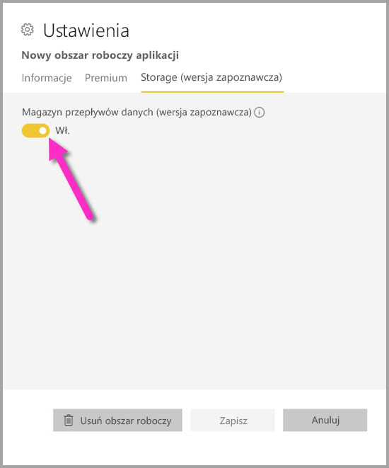
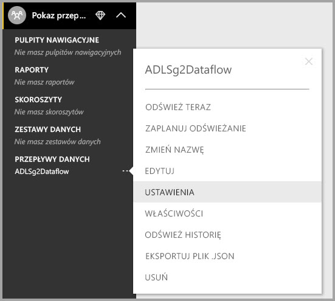
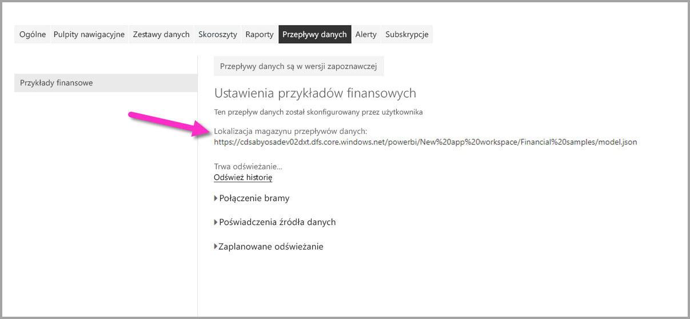

# Konfigurowanie ustawień przepływów danych w obszarze roboczym (wersja zapoznawcza)

Dzięki usłudze Power BI i przepływom danych można przechowywać plik definicji przepływu danych i pliki danych obszaru roboczego na koncie usługi Azure Data Lake Storage Gen2. Administratorzy obszarów roboczych mogą w tym celu odpowiednio konfigurować usługę Power BI. W tym artykule szczegółowo opisano kroki, które muszą wykonać. 

Aby można było skonfigurować lokalizację magazynu przepływu danych obszaru roboczego, administrator globalny w firmie musi połączyć konto magazynu organizacji z usługą Power BI, a następnie włączyć uprawnienia do przypisywania magazynu na tym koncie magazynu. * [Łączenie usługi Azure Data Lake Storage Gen2 na potrzeby przechowywania przepływów danych (wersja zapoznawcza)](service-dataflows-connect-azure-data-lake-storage-gen2.md) 

Istnieją dwa sposoby konfigurowania ustawień magazynu przepływu danych obszaru roboczego: 

* Podczas tworzenia obszaru roboczego
* Przez edytowanie istniejącego obszaru roboczego

W kolejnych sekcjach przyjrzymy się obydwu metodom. 

> [!IMPORTANT]
> Ustawienie magazynu przepływu danych obszaru roboczego można zmienić tylko, jeśli obszar roboczy nie zawiera żadnych przepływów danych. Ponadto ta funkcja jest dostępna tylko w środowisku nowego obszaru roboczego. Więcej informacji na temat nowego obszaru roboczego można znaleźć w artykule [Tworzenie nowych obszarów roboczych (wersja zapoznawcza) w usłudze Power BI](service-create-the-new-workspaces.md).

## Tworzenie nowego obszaru roboczego i konfigurowanie jego magazynu przepływu danych

Aby utworzyć nowy obszar roboczy aplikacji w usłudze Power BI, wybierz pozycję **Obszary robocze > Utwórz obszar roboczy aplikacji**.

W oknie dialogowym Tworzenie obszaru roboczego aplikacji może pojawić się żółte pole o nazwie **Przejrzyj ulepszone obszary robocze**. W tym obszarze wybierz pozycję **Wypróbuj teraz**.

W wyświetlonym oknie dialogowym możesz nadać nowemu obszarowi roboczego unikatową nazwę. Nie wybieraj jeszcze przycisku **Zapisz**, ponieważ musisz wprowadzić ustawienia zaawansowane.

Następnie rozwiń obszar **Zaawansowane** okna dialogowego **Tworzenie obszaru roboczego aplikacji**. Możesz w nim włączyć ustawienie **Magazyn przepływu danych(wersja zapoznawcza)**.

Wybierz przycisk **Zapisz**, aby utworzyć nowy obszar roboczy. Każdy nowy przepływ danych utworzony w tym obszarze roboczym przechowuje teraz plik definicji (jego plik Model.json) i dane na koncie usługi Azure Data Lake Storage Gen2 organizacji. 

> [!NOTE]
> Funkcjonalność przepływów danych jest dostępna w wersji zapoznawczej. Przed przejściem do wersji ogólnodostępnej może ona podlegać zmianom i aktualizacjom.

## Aktualizowanie magazynu przepływu danych dla istniejącego obszaru roboczego

Zamiast tworzyć nowy obszar roboczy, można również zaktualizować istniejący obszar roboczy do przechowywania pliku definicji i danych na koncie usługi Azure Data Lake Storage Gen2 w organizacji. Pamiętaj, że ustawienie magazynu przepływu danych obszaru roboczego można zmienić tylko, jeśli obszar roboczy nie zawiera już przepływu danych.

Aby edytować obszar roboczy aplikacji, wybierz wielokropek **(...)**, a następnie wybierz pozycję **Edytuj obszar roboczy**. 

W wyświetlonym oknie **Edytowanie obszaru roboczego** rozwiń węzeł **Zaawansowane**, a następnie włącz ustawienie **Magazyn przepływu danych (wersja zapoznawcza)** (**Wł.**). 

Następnie wybierz przycisk **Zapisz**. Każdy nowy przepływ danych utworzony w tym obszarze roboczym przechowuje plik definicji i dane na koncie usługi Azure Data Lake Storage Gen2 organizacji.

## Uzyskiwanie identyfikatora URI przechowywanych plików przepływu danych

Po utworzeniu przepływu danych w obszarze roboczym przypisanym do konta usługi Azure Data Lake w organizacji możesz bezpośrednio uzyskiwać uzyskać dostęp do jego definicji i plików danych. Ich lokalizacja jest dostępna na stronie **Ustawienia przepływu danych**. Aby przejść do tego miejsca, wykonaj następujące czynności:

Wybierz wielokropek **(...)** obok przepływu danych wymienionego w obszarze **Przepływy danych** w obszarze roboczym. W wyświetlonym menu wybierz pozycję **Ustawienia**.

W wyświetlonym obszarze informacji lokalizacja folderu CDM przepływu danych znajduje się w obszarze **Lokalizacja magazynu przepływu danych**, jak pokazano na poniższej ilustracji.

> [!NOTE]
> Usługa Power BI konfiguruje właściciela przepływu danych przy użyciu uprawnień czytelnika folderu CDM, w którym są przechowywane pliki przepływu danych. Udzielanie praw dostępu do lokalizacji magazynu przepływu danych innym osobom lub usługom wymaga, aby właściciel konta magazynu udzielił dostępu na platformie Azure.

## Istotne zagadnienia i ograniczenia

Niektóre funkcje przepływu danych nie są obsługiwane, gdy magazyn przepływu danych znajduje się w usłudze Azure Data Lake Storage Gen2: 

Obszary robocze usługi Power BI Pro, Premium i Embedded:
* Funkcja **połączonych jednostek** będzie obsługiwana tylko między obszarami roboczymi na tym samym koncie magazynu.
* Uprawnienia obszaru roboczego nie dotyczą przepływów danych przechowywanych w usłudze Azure Data Lake Storage Gen2. Tylko właściciel przepływu danych ma do nich dostęp.
* Poza tym wszystkie funkcje przygotowywania danych są takie same jak w przypadku przepływów danych przechowywanych w magazynie usługi Power BI.

Poniżej przedstawiono również kilka dodatkowych zagadnień:

* Po skonfigurowaniu lokalizacji magazynu przepływu danych nie można jej zmienić.
* Tylko właściciel przepływu danych przechowywanego w usłudze Azure Data Lake Storage Gen2 mają dostęp do jego danych.
* Lokalne źródła danych w ramach pojemności udostępnionych usługi Power BI nie są obsługiwane w przepływach danych przechowywanych w usłudze Azure Data Lake Storage Gen2 organizacji.

Klienci programu **Power BI Desktop** nie mogą uzyskiwać dostępu do przepływów danych przechowywanych na koncie usługi Azure Data Lake Storage Gen2, chyba że są właścicielami przepływu danych. Rozpatrzmy następującą sytuację:

1.  Anna tworzy nowy obszar roboczy aplikacji i konfiguruje go do przechowywania przepływów danych w usłudze Data Lake w organizacji.
2.  Jan, który również jest członkiem obszaru roboczego utworzonego przez Annę, chce używać programu Power BI Desktop i łącznika przepływu danych do pobierania danych z przepływu danych, który utworzyła Anna.
3.  Jan zobaczy komunikat o błędzie, ponieważ nie został dodany jako autoryzowany użytkownik do folderu CDM przepływu danych w usłudze Data Lake.

    

## Następne kroki

W tym artykule przedstawiono wskazówki dotyczące sposobu konfigurowania magazynu obszaru roboczego na potrzeby przepływów danych. Aby uzyskać więcej informacji, zapoznaj się z następującymi artykułami:

Aby uzyskać więcej informacji na temat przepływów danych, modelu CDM i usługi Azure Data Lake Storage Gen2, przeczytaj następujące artykuły:

* [Integracja przepływów danych z usługą Azure Data Lake (wersja zapoznawcza)](service-dataflows-azure-data-lake-integration.md)
* [Dodawanie folderu CDM do usługi Power BI jako przepływu danych (wersja zapoznawcza)](service-dataflows-add-cdm-folder.md)
* [Łączenie usługi Azure Data Lake Storage Gen2 na potrzeby magazynowania przepływów danych (wersja zapoznawcza)](service-dataflows-connect-azure-data-lake-storage-gen2.md)

Aby uzyskać ogólne informacje na temat przepływów danych, zapoznaj się z tymi artykułami:

* [Tworzenie i używanie przepływów danych w usłudze Power BI](service-dataflows-create-use.md)
* [Używanie obliczonych jednostek w usłudze Power BI Premium (wersja zapoznawcza)](service-dataflows-computed-entities-premium.md)
* [Używanie przepływów danych z lokalnymi źródłami danych (wersja zapoznawcza)](service-dataflows-on-premises-gateways.md)
* [Zasoby dla deweloperów dotyczące przepływów danych usługi Power BI (wersja zapoznawcza)](service-dataflows-developer-resources.md)

Aby uzyskać więcej informacji na temat usługi Azure Storage, możesz przeczytać następujące artykuły:

* [Azure Storage security guide](https://docs.microsoft.com/azure/storage/common/storage-security-guide) (Przewodnik po zabezpieczeniach usługi Azure Storage)
* [Get started with github samples from Azure Data Services](https://aka.ms/cdmadstutorial) (Wprowadzenie do przykładów usługi github dotyczących usług Azure Data Services)

Aby uzyskać więcej informacji na temat modelu Common Data Model, można przeczytać artykuł zawierający jego omówienie:

* [Omówienie usługi Common Data Model](https://docs.microsoft.com/powerapps/common-data-model/overview)
* [CDM folders](https://go.microsoft.com/fwlink/?linkid=2045304) (Foldery modelu CDM)
* [CDM model file definition](https://go.microsoft.com/fwlink/?linkid=2045521) (Definicja pliku modelu CDM)

Możesz również zawsze spróbować [zadać pytania społeczności usługi Power BI](http://community.powerbi.com/).
