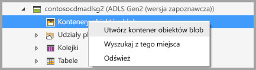
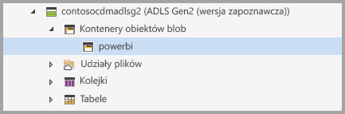
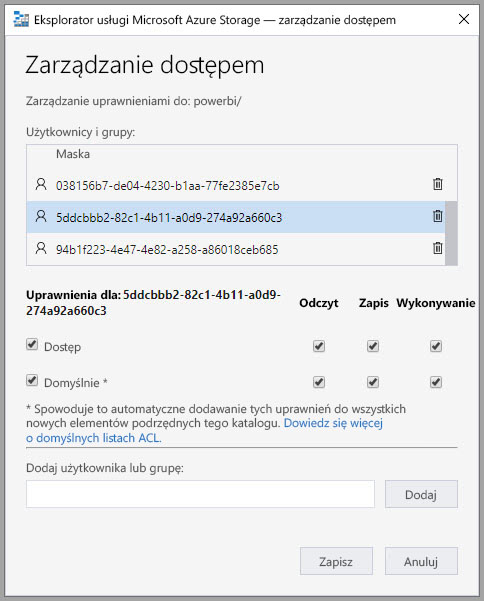

# Łączenie usługi Azure Data Lake Storage Gen2 na potrzeby magazynowania przepływów danych (wersja zapoznawcza)

Obszary robocze usługi Power BI można skonfigurować tak, aby przechowywały przepływy danych na koncie usługi Azure Data Lake Storage Gen2 organizacji. W tym artykule opisano ogólne kroki, które należy w tym celu wykonać, oraz przedstawiono wskazówki i najlepsze rozwiązania do zastosowania w trakcie tego procesu. Z konfigurowaniem obszarów roboczych do przechowywania plików danych i definicji przepływów danych w usłudze Data Lake związane są pewne korzyści, na przykład:

* Usługa Azure Data Lake Storage Gen2 udostępnia magazyn danych skalowalny w ogromnym stopniu
* Deweloperzy z działu IT mogą używać plików definicji i danych przepływu danych w przypadku korzystania z usług Azure Data Services i sztucznej inteligencji (AI), jak pokazano w [przykładach dotyczących usług Azure Data Services w serwisie github](https://aka.ms/cdmadstutorial)
* Deweloperzy w organizacji mogą integrować dane przepływu danych w aplikacjach wewnętrznych i rozwiązaniach biznesowych, korzystając z zasobów deweloperskich związanych z przepływami danych i platformą Azure

Aby używać usługi Azure Data Lake Storage Gen2 na potrzeby przepływów danych, potrzebujesz następujących elementów:

* **Dzierżawa usługi Power BI** — co najmniej jedno konto w dzierżawie usługi Azure Active Directory (AAD) musi zostać zarejestrowane w celu korzystania z usługi Power BI
* **Konto administratora globalnego** — to konto jest wymagane do nawiązania połączenia z usługą Power BI i skonfigurowania jej do przechowywania definicji przepływu danych i danych na koncie usługi Azure Data Lake Storage Gen2
* **Subskrypcja platformy Azure** — subskrypcja ta jest niezbędna do korzystania z usługi Azure Data Lake Storage Gen2
* **Grupa zasobów** — użyj swojej grupy zasobów lub utwórz nową
* **Konto usługi Azure Storage z włączoną funkcją Data Lake Storage Gen2 (wersja zapoznawcza)** — aby nawiązać połączenie z usługą Azure Data Lake Storage Gen2, musisz utworzyć konto jej publicznej wersji zapoznawczej

> [!TIP]
> Jeśli nie masz subskrypcji platformy Azure, przed rozpoczęciem utwórz [bezpłatne konto](https://azure.microsoft.com/free/).

## Przygotowywanie usługi Azure Data Lake Storage Gen2 do użycia w usłudze Power BI

Przed rozpoczęciem konfigurowania usługi Power BI przy użyciu konta usługi Azure Data Lake Storage Gen2 należy utworzyć i skonfigurować konto magazynu. Przyjrzyjmy się wymaganiom dotyczącym usługi Power BI:

1. Konto magazynu należy utworzyć w dzierżawie usługi AAD używanej jako dzierżawa usługi Power BI.
2. Konto magazynu należy utworzyć w regionie używanym przez dzierżawę usługi Power BI. Aby określić, gdzie znajduje się dzierżawa usługi Power BI, zobacz temat [Gdzie znajduje się moja dzierżawa usługi Power BI](service-admin-where-is-my-tenant-located.md).
3. Konto magazynu musi mieć włączoną funkcję *Hierarchiczna przestrzeń nazw*.
4. Usługa Power BI musi mieć przyznaną rolę *Czytelnik* na koncie magazynu.
5. Należy utworzyć system plików o nazwie **powerbi**.
6. Usługi Power BI muszą być autoryzowane do korzystania z utworzonego systemu plików **powerbi**.

W następnych sekcjach przedstawiono szczegółowy opis czynności niezbędnych do skonfigurowania konta usługi Azure Data Lake Storage Gen2.

> [!NOTE]
> Funkcjonalność przepływów danych jest dostępna w wersji zapoznawczej. Przed przejściem do wersji ogólnodostępnej może ona podlegać zmianom i aktualizacjom.

### Tworzenie konta magazynu

Wykonaj kroki przedstawione w artykule [Create an Azure Data Lake Storage Gen2 storage account](https://docs.microsoft.com/azure/storage/blobs/data-lake-storage-quickstart-create-account) (Tworzenie konta magazynu usługi Azure Data Lake Storage Gen2).

1. Upewnij się, że wybrano lokalizację dzierżawy usługi Power BI i ustawiono magazyn jako **StorageV2 (ogólnego przeznaczenia w wersji 2)**
2. Upewnij się, że funkcja hierarchicznej przestrzeni nazw została włączona
3. Zaleca się ustawienie replikacji na **Magazyn geograficznie nadmiarowy dostępny do odczytu (RA-GRS)**

### Przyznawanie usłudze Power BI roli Czytelnik

Następnie przyznaj usłudze Power BI rolę Czytelnik w ramach utworzonego konta magazynu. Jest to rola wbudowana, więc kroki są proste do wykonania. 

Wykonaj kroki przedstawione w artykule [Assign a role to a security principal](https://docs.microsoft.com/azure/storage/common/storage-auth-aad-rbac#assign-a-role-to-a-security-principal) (Przypisywanie roli do podmiotu zabezpieczeń).

W oknie **Dodawanie przypisania roli** wybierz rolę **Czytelnik** do przypisania do usługi Power BI. Następnie użyj funkcji wyszukiwania, aby zlokalizować **usługę Power BI**. Poniższa ilustracja przedstawia rolę **Czytelnik** przypisaną do usługi Power BI.

### Tworzenie systemu plików dla usługi Power BI

Przed dodaniem konta magazynu do usługi Power BI musisz utworzyć system plików o nazwie *powerbi*. Istnieje wiele sposobów tworzenia takiego systemu plików, w tym użycie usług Azure Databricks lub HDInsight, narzędzia AZCopy albo Eksploratora usługi Azure Storage. W tej sekcji przedstawiono prosty sposób tworzenia systemu plików przy użyciu Eksploratora usługi Azure Storage.

Ten krok wymaga zainstalowania Eksploratora usługi Azure Storage w wersji 1.6.2 lub nowszej. W celu zainstalowania Eksploratora usługi Azure Storage dla systemu Windows, Macintosh lub Linux przejdź na stronę [Eksplorator usługi Azure Storage](https://azure.microsoft.com/features/storage-explorer/).

1. Po pomyślnym zainstalowaniu Eksploratora usługi Azure Storage i jego pierwszym uruchomieniu zostanie wyświetlone okno Eksplorator usługi Microsoft Azure Storage — łączenie. Eksplorator usługi Storage oferuje kilka sposobów łączenia z kontem magazynu, ale obecnie w przypadku wymaganej konfiguracji jest obsługiwany tylko jeden ze sposobów. 

2. W okienku po lewej stronie znajdź i rozwiń utworzone powyżej konto magazynu.

3. Kliknij prawym przyciskiem myszy pozycję Kontenery obiektów blob i z menu kontekstowego wybierz pozycję Utwórz kontener obiektów blob.

   

4. Pod folderem Kontenery obiektów blob zostanie wyświetlone pole tekstowe. Wprowadź nazwę *powerbi* 

   

5. Po zakończeniu naciśnij klawisz Enter, aby utworzyć kontener obiektów blob

   

W następnej sekcji przyznasz rodzinie usług Power BI pełny dostęp do utworzonego systemu plików. 

### Udzielanie usłudze Power BI uprawnień do systemu plików

Aby udzielić uprawnień do systemu plików, możesz zastosować ustawienia listy kontroli dostępu (ACL), które służą do przydzielania praw dostępu usługi Power BI. Pierwszym krokiem tego procesu jest uzyskanie tożsamości usług Power BI w dzierżawie. Lista aplikacji usługi Azure Active Directory (AAD) znajduje się w sekcji **Aplikacje dla przedsiębiorstw** witryny Azure Portal.

Aby znaleźć aplikacje dzierżawy, wykonaj następujące kroki:

1. W witrynie [Azure Portal](https://portal.azure.com/) wybierz pozycję **Azure Active Directory** w panelu nawigacyjnym po lewej stronie.
2. W bloku Azure **Active Directory** wybierz pozycję **Aplikacje dla przedsiębiorstw**.
3. Z listy rozwijanej **Typ aplikacji** wybierz pozycję **Wszystkie aplikacje**, a następnie wybierz przycisk **Zastosuj**. Zostanie wyświetlony przykład aplikacji dzierżawy podobny do poniższej ilustracji.

    

4. Na pasku wyszukiwania wpisz wyraz *Power*. Zostanie wyświetlona kolekcja identyfikatorów obiektów dla aplikacji usługi Power BI i dodatku Power Query. Wszystkie te trzy wartości będą potrzebne w kolejnych krokach.  

    

5. Wybierz i skopiuj oba identyfikatory obiektów dla usługi Power BI i usługi Power BI Premium z wyników wyszukiwania. Przygotuj się do wklejania tych wartości w kolejnych krokach.

7. Następnie użyj **Eksploratora usługi Azure Storage** w celu przejścia do systemu plików *powerbi* utworzonego w poprzednim kroku. Wykonaj instrukcje z sekcji [Managing access](https://docs.microsoft.com/azure/storage/blobs/data-lake-storage-how-to-set-permissions-storage-explorer#managing-access) (Zarządzanie dostępem) artykułu [Set file and directory level permissions using Azure Storage explorer](https://docs.microsoft.com/azure/storage/blobs/data-lake-storage-how-to-set-permissions-storage-explorer) (Ustawianie uprawnień na poziomie pliku i katalogu przy użyciu Eksploratora usługi Azure Storage).

8. W przypadku każdego z dwóch identyfikatorów obiektów usługi Power BI zebranych w kroku 5 przydziel prawa dostępu typu **Odczyt**, **Zapis** i **Wykonywanie** oraz domyślne listy ACL do systemu plików *powerbi*.

   

9. W przypadku identyfikatora obiektu online w dodatku Power Query zebranego w kroku 4 przydziel prawa dostępu **Zapis** i **Wykonywanie** oraz domyślne listy ACL do systemu plików *powerbi*.

   

10. Ponadto dla pozycji **Inne** przypisz prawa dostępu **Wykonywanie** oraz domyślne listy ACL.

    

## Łączenie usługi Azure Data Lake Storage Gen2 z usługą Power BI

Po skonfigurowaniu konta usługi Azure Data Lake Storage Gen2 w witrynie Azure Portal połącz ją z usługą Power BI w **portalu administracyjnym usługi Power BI**. Możesz również zarządzać magazynem przepływu danych usługi Power BI w sekcji ustawień **Magazyn przepływu danych (wersja zapoznawcza)** portalu administracyjnego usługi Power BI. Aby uzyskać wskazówki dotyczące uruchamiania i podstawowych sposobów użycia, zapoznaj się ze szczegółowymi informacjami w temacie [Jak uzyskać dostęp do portalu administracyjnego](service-admin-portal.md).

Aby połączyć konto usługi **Azure Data Lake Storage Gen2**, wykonaj następujące kroki:

1. Przejdź na kartę **Ustawienia przepływu danych (wersja zapoznawcza)** w **portalu administracyjnym usługi Power BI**.

     

2. Wybierz przycisk **Połącz usługę Azure Data Lake Storage Gen2**. Zostanie wyświetlone następujące okno.

     

3. Wprowadź wartość w polu **Identyfikator subskrypcji** dla konta magazynu.
4. Wprowadź wartość w polu **Nazwa grupy zasobów** dla grupy, w której utworzono konto magazynu.
5. Wprowadź wartość w polu **Nazwa konta magazynu**.
6. Wybierz pozycję **Połącz**.

Po pomyślnym wykonaniu tych kroków konto usługi Azure Data Lake Storage Gen2 będzie połączone z usługą Power BI. 

Następnie musisz włączyć osoby w swojej organizacji, aby skonfigurować ich obszary robocze. Pozwoli im to na używanie tego konta magazynu do przechowywania danych i definicji przepływu danych. Zróbmy to w następnej sekcji. 

## Zezwalanie administratorom na przypisywanie obszarów roboczych

Domyślnie pliki danych i definicji przepływu danych są przechowywane w magazynie udostępnianym przez usługę Power BI. Aby umożliwić uzyskiwanie dostępu do plików przepływu danych na Twoim koncie magazynu, administratorzy obszarów roboczych muszą najpierw skonfigurować obszar roboczy tak, aby zezwolić na przypisywanie i magazynowanie przepływów danych na nowym koncie magazynu. Zanim administrator obszaru roboczego będzie mógł skonfigurować ustawienia magazynu przepływu danych, musi otrzymać uprawnienia do przypisywania magazynu w **portalu administracyjnym usługi Power BI**.

Aby udzielić uprawnień do przypisywania magazynu, przejdź na kartę **Ustawienia przepływu danych (wersja zapoznawcza)** w **portalu administracyjnym usługi Power BI**. Znajduje na niej przycisk radiowy *Zezwalaj administratorom obszarów roboczych na przypisywanie obszarów roboczych do tego konta magazynu*, który należy ustawić na **Zezwalaj**. Po włączeniu tego suwaka wybierz przycisk **Zastosuj**, aby zastosować zmianę. 

 

To wszystko. Administratorzy obszarów roboczych usługi Power BI mogą teraz przypisywać przepływy pracy do utworzonego systemu plików.

## Istotne zagadnienia i ograniczenia

Ta funkcja jest dostępna w wersji zapoznawczej, dlatego w miarę zbliżania się do momentu wydania jej zachowanie może ulec zmianie. Pracując z magazynem przepływu danych, należy wziąć pod uwagę kilka zagadnień i ograniczeń:

* Po skonfigurowaniu lokalizacji magazynu przepływu danych nie można jej zmienić.
* Tylko właściciele przepływu danych przechowywanego w usłudze Azure Data Lake Storage Gen2 mają domyślnie dostęp do jego danych. Aby autoryzować dodatkowe osoby do korzystania z przepływów danych przechowywanych na platformie Azure, należy dodać je do folderu CDM przepływu danych. 
* Tworzenie przepływów danych z połączonymi jednostkami jest możliwe tylko w sytuacji, gdy są one przechowywane na tym samym koncie magazynu.
* Lokalne źródła danych w ramach pojemności udostępnionych usługi Power BI nie są obsługiwane w przepływach danych przechowywanych w usłudze Data Lake organizacji.

Istnieje również kilka znanych problemów opisanych w tej sekcji.

Klienci programu Power BI Desktop nie mogą uzyskiwać dostępu do przepływów danych przechowywanych na **koncie usługi Azure Data Lake Storage**, chyba że są właścicielami przepływu danych lub mają autoryzację do korzystania z folderu CDM w usłudze Data Lake. Scenariusz może wyglądać jak poniższy:

1. Anna utworzyła nowy obszar roboczy aplikacji i skonfigurowała go do przechowywania przepływów danych w usłudze Data Lake w organizacji. 
2. Jan, który również jest członkiem obszaru roboczego utworzonego przez Annę, chce używać programu Power BI Desktop i łącznika przepływu danych do pobierania danych z przepływu danych, który utworzyła Anna.
3. Jan zobaczy komunikat o błędzie podobny do tego na ilustracji, ponieważ nie został autoryzowany do używania folderu CDM przepływu danych w usłudze Data Lake.

Oto przykładowe typowe pytania i odpowiedzi:

**Pytanie:** Co mogę zrobić, jeśli mam utworzone wcześniej przepływy danych w obszarze roboczym i chcę zmienić lokalizację ich magazynu?

**Odpowiedź:** Nie możesz zmienić lokalizacji magazynu przepływu danych po jego utworzeniu. 

**Pytanie:** Kiedy mogę zmienić lokalizację magazynu przepływu danych w obszarze roboczym?

**Odpowiedź:** Zmiana lokalizacji magazynu przepływu danych w obszarze roboczym jest dozwolona tylko w sytuacji, gdy obszar roboczy nie zawiera żadnych przepływów danych.

## Następne kroki

W tym artykule przedstawiono wskazówki dotyczące łączenia usługi Azure Data Lake Gen2 na potrzeby magazynu przepływu danych. Aby uzyskać więcej informacji, zapoznaj się z następującymi artykułami:

Aby uzyskać więcej informacji na temat przepływów danych, modelu CDM i usługi Azure Data Lake Storage Gen2, przeczytaj następujące artykuły:

* [Integracja przepływów danych z usługą Azure Data Lake (wersja zapoznawcza)](service-dataflows-azure-data-lake-integration.md)
* [Konfigurowanie ustawień przepływów danych w obszarze roboczym (wersja zapoznawcza)](service-dataflows-configure-workspace-storage-settings.md)
* [Dodawanie folderu CDM do usługi Power BI jako przepływu danych (wersja zapoznawcza)](service-dataflows-add-cdm-folder.md)

Aby uzyskać ogólne informacje na temat przepływów, zapoznaj się z tymi artykułami:

* [Tworzenie i używanie przepływów danych w usłudze Power BI](service-dataflows-create-use.md)
* [Używanie obliczonych jednostek w usłudze Power BI Premium (wersja zapoznawcza)](service-dataflows-computed-entities-premium.md)
* [Używanie przepływów danych z lokalnymi źródłami danych (wersja zapoznawcza)](service-dataflows-on-premises-gateways.md)
* [Zasoby dla deweloperów dotyczące przepływów danych usługi Power BI (wersja zapoznawcza)](service-dataflows-developer-resources.md)

Aby uzyskać więcej informacji na temat usługi Azure Storage, możesz przeczytać następujące artykuły:
* [Azure Storage security guide](https://docs.microsoft.com/azure/storage/common/storage-security-guide) (Przewodnik po zabezpieczeniach usługi Azure Storage)

Aby uzyskać więcej informacji na temat modelu Common Data Model, można przeczytać artykuł zawierający jego omówienie:
* [Omówienie usługi Common Data Model](https://docs.microsoft.com/powerapps/common-data-model/overview)
* [CDM folders](https://go.microsoft.com/fwlink/?linkid=2045304) (Foldery modelu CDM)
* [CDM model file definition](https://go.microsoft.com/fwlink/?linkid=2045521) (Definicja pliku modelu CDM)

Możesz również zawsze spróbować [zadać pytania społeczności usługi Power BI](http://community.powerbi.com/).
