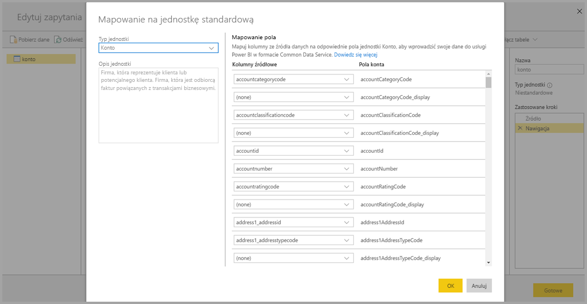

# Tworzenie i używanie przepływów danych w usłudze Power BI (wersja zapoznawcza)

Za pomocą zaawansowanej funkcji przygotowywania danych dostępnej w **usłudze Power BI** można utworzyć kolekcję o nazwie „przepływ danych”, która następnie posłuży do łączenia z danymi biznesowymi z różnych źródeł, czyszczenia danych, przekształcania ich, a następnie ładowania ich do magazynu usługi Power BI.

**Przepływ danych** to kolekcja *jednostek* (jednostki są podobne do tabel) tworzonych i zarządzanych w obszarach roboczych aplikacji w usłudze Power BI. Jednostki można dodawać i edytować w przepływie danych, a także zarządzać harmonogramami odświeżania danych bezpośrednio z poziomu obszaru roboczego, w którym został utworzony przepływ danych.

Po utworzeniu przepływu danych można używać programu **Power BI Desktop** i **usługi Power BI** do tworzenia zestawów danych, raportów, pulpitów nawigacyjnych i aplikacji, które opierają się na danych umieszczanych w przepływach danych usługi Power BI i dlatego uzyskują szczegółowy wgląd w operacje biznesowe.

Aby zacząć korzystać z przepływu danych, należy wykonać trzy podstawowe kroki:

1. Utworzenie przepływu danych za pomocą narzędzi firmy Microsoft zaprojektowanych w celu uproszczenia tego procesu
2. Zaplanowanie częstotliwości odświeżania danych, które zostaną umieszczone w przepływie danych
3. Skompilowanie zestawu danych przy użyciu przepływu danych w programie Power BI Desktop 

W poniższych sekcjach przyjrzymy się każdemu z tych kroków i zapoznamy się z narzędziami udostępnionymi w celu ukończenia danego kroku. Zaczynajmy.

> [!NOTE]
> Funkcjonalność przepływów danych jest dostępna w wersji zapoznawczej. Przed przejściem do wersji ogólnodostępnej może ona podlegać zmianom i aktualizacjom.

## Tworzenie przepływu danych
Aby utworzyć przepływ danych, uruchom usługę Power BI w przeglądarce, a następnie wybierz **obszar roboczy aplikacji** (przepływy danych nie są dostępne w obszarze *my-workspace* w usłudze Power BI) w okienku nawigacji po lewej stronie, jak pokazano na poniższym ekranie. Możesz również utworzyć nowy obszar roboczy, w którym chcesz utworzyć nowy przepływ danych. 

Gdy znajdziesz się w **obszarze roboczym aplikacji**, w którym można utworzyć przepływ danych, w prawym górnym rogu kanwy pojawi się przycisk **+ Utwórz**. Wybierz przycisk **+ Utwórz**, a następnie z listy rozwijanej wybierz pozycję **Przepływ danych**. 

Ważne jest, aby wiedzieć, że każdy przepływ danych ma tylko *jednego właściciela*, czyli osobę, która go utworzyła. Tylko właściciel może edytować przepływ danych. Wszyscy członkowie **obszaru roboczego aplikacji** z uprawnieniami do odczytu i zapisu w obszarze roboczym aplikacji, w którym został utworzony przepływ danych, mogą łączyć się z przepływem danych z poziomu programu **Power BI Desktop**, zgodnie z opisem w dalszej części tego artykułu.

Z tego miejsca możesz dodać **jednostki**, które bardziej szczegółowo opisujemy w następnej sekcji.

### Dodawanie jednostek

**Jednostka** to zbiór pól służących do przechowywania danych, bardzo podobny do tabeli w bazie danych. Poniższa ilustracja przedstawia wybrane źródła danych, z których można pozyskiwać dane do usługi Power BI.

W przypadku wybierania źródła danych zostanie wyświetlony monit o podanie ustawień połączenia, w tym konta do użycia podczas łączenia ze źródłem danych, tak jak pokazano na poniższej ilustracji.

Po nawiązaniu połączenia można wybrać dane do użycia w przypadku jednostki. Po wybraniu danych i źródła usługa Power BI będzie następnie nawiązywać połączenie ze źródłem danych, aby dane w przepływie danych były regularnie odświeżane z częstotliwością, którą wybierzesz w dalszej części procesu konfiguracji.

Po wybraniu danych do użycia w jednostce możesz użyć edytora przepływu danych w celu kształtowania danych lub przekształcania ich do formatu niezbędnego do użycia w przepływie danych.

### Korzystanie z edytora przepływu danych

Po wskazaniu, które dane ze źródła będą używane w jednostce, można przekształcić wybrane dane w formularz działający najlepiej w przypadku danej jednostki, używając środowiska edytowania dodatku Power Query, podobnego do **edytora Power Query** w programie **Power BI Desktop**. Dowiedz się więcej na temat dodatku Power Query (dodatek Power Query jest włączany do programu Power BI Desktop jako edytor Power Query) z [artykułu zawierającego omówienie zapytań](desktop-query-overview.md) w programie Power BI Desktop. 

Jeśli chcesz wyświetlić kod, który Edytor zapytań tworzy dla każdego kroku, lub chcesz utworzyć własny kod kształtowania, możesz użyć **Edytora zaawansowanego**. 

### Przepływy danych i model Common Data Model (CDM)

Przepływy danych jednostki obejmują nowe narzędzia umożliwiające łatwe mapowanie danych biznesowych na model Common Data Model (ustandaryzowany schemat firmy Microsoft), wzbogacanie go przy użyciu danych firmy Microsoft i innych firm oraz uzyskiwanie uproszczonego dostępu do uczenia maszynowego. Te nowe możliwości pozwalają na uzyskiwanie wglądu w szczegółowe informacje biznesowe w sposób inteligentny i pozwalający na podejmowanie odpowiednich akcji. Po zakończeniu wybranych przekształceń w kroku edytowania zapytań można mapować kolumny z tabel źródeł danych do pól jednostki standardowej, zgodnie z definicją modelu Common Data Model. Jednostki standardowe mają znany schemat definiowany przez model Common Data Model.

Więcej informacji na temat tego podejścia oraz modelu Common Data Model można znaleźć w artykule [Co to jest Common Data Model?](https://docs.microsoft.com/powerapps/common-data-model/overview)

Aby używać modelu Common Data Model w przepływie danych, kliknij przekształcenie **Zamapuj na standardową** w oknie dialogowym **Edytowanie zapytań**. Na wyświetlonym ekranie **Mapowanie jednostek** można wybrać standardową jednostkę, na którą chcesz mapować.

Podczas mapowania kolumny źródłowej na pole standardowe są wykonywane następujące czynności:

1. Kolumna źródłowa przyjmuje nazwę pola standardowego (nazwa kolumny jest zmieniana, jeśli nazwy są różne)
2. Kolumna źródłowa pobiera typ danych pola standardowego

Aby zachować standardową jednostkę modelu Common Data Model, wszystkie pola standardowe, które nie są mapowane, uzyskują wartości *Null*.

Wszystkie kolumny źródłowe, które nie są mapowane, pozostają w obecnym stanie, co gwarantuje, że wynikiem mapowania będzie jednostka standardowa z polami niestandardowymi.

Gdy wybrano już opcje, a ustawienia jednostki i jej danych są gotowe do zapisania, możesz wybrać pozycję **Zapisz** z menu. Pamiętaj, że można utworzyć wiele jednostek, wybierając przycisk **Dodaj jednostki** oraz że można edytować jednostki w celu uściślenia utworzonych zapytań i jednostek.

Po wybraniu pozycji **Zapisz** zostanie wyświetlony monit o nadanie nazwy przepływowi danych, a następnie wprowadzenie opisu.

Gdy wszystko będzie gotowe i wybierzesz przycisk **Zapisz**, zostanie wyświetlone okno informujące o utworzeniu **przepływu danych**. 

Świetnie — teraz możesz przystąpić do kolejnego etapu, czyli planowania częstotliwości odświeżania źródła danych.

## Planowanie częstotliwości odświeżania

Po zapisaniu przepływu danych należy zaplanować częstotliwość odświeżania dla każdego z połączonych źródeł danych.

Przepływy danych usługi Power BI umożliwiają aktualizowanie danych w ramach procesu odświeżania danych usługi Power BI. W **usłudze Power BI** w sekcji **obszaru roboczego aplikacji** znajduje się kolekcja obszarów, w których można wyświetlać informacje, w tym przepływy danych, jak pokazano na poniższej ilustracji.

Wpis *Przepływ danych usługi Dynamics* na poprzedniej ilustracji to przepływ danych utworzony w poprzedniej sekcji. Aby zaplanować odświeżanie, wybierz ikonę **Zaplanuj odświeżanie** w sekcji **Akcje**, jak pokazano na poniższej ilustracji. 

Po wybraniu ikony **Zaplanuj odświeżanie** nastąpi przekierowanie do okienka **Planowanie odświeżania**, w którym można ustawić częstotliwość i godziny odświeżania przepływu danych.

Aby uzyskać więcej informacji na temat planowania odświeżania, zobacz artykuł na temat [konfigurowania zaplanowanego odświeżania](refresh-scheduled-refresh.md), który opisuje zachowanie funkcji odświeżania zestawów danych usługi Power BI. W przypadku ustawień odświeżania przepływy danych zachowują się tak jak zestawy danych usługi Power BI. 

## Łączenie z przepływami danych w programie Power BI Desktop

Po utworzeniu przepływu danych i zaplanowaniu częstotliwości odświeżania poszczególnych źródeł danych, które wypełnią model, można rozpocząć wykonywanie trzeciego, ostatniego kroku. Będzie to nawiązanie połączenia z przepływem danych z poziomu programu **Power BI Desktop**. 

Aby połączyć się z przepływem danych, w programie Power BI Desktop wybierz pozycję **Pobierz dane > Power BI > Przepływy danych usługi Power BI (wersja beta)**, jak pokazano na poniższej ilustracji.

Z tego miejsca przejdź do **obszaru roboczego aplikacji**, w którym zapisano przepływ danych, wybierz przepływ danych, a następnie z listy wybierz utworzone jednostki.

Możesz również użyć **paska wyszukiwania** w górnej części okna, aby szybko znaleźć nazwę przepływu danych lub jednostek wśród wielu jednostek przepływu danych.

Gdy wybierzesz jednostkę, a następnie wybierzesz przycisk **Załaduj**, jednostki zostaną wyświetlone w okienku **Pola** w programie **Power BI Desktop**. Ich wyświetlanie i zachowanie będzie identyczne jak w przypadku **tabel** z dowolnego zestawu danych.

## Używanie przepływów danych przechowywanych w usłudze Azure Data Lake Storage Gen2

Niektóre organizacje chcą używać własnego magazynu do tworzenia przepływów danych i zarządzania nimi. Jeśli będziesz postępować zgodnie z wymaganiami i prawidłowo zarządzać uprawnieniami, zyskasz możliwość zintegrowania przepływów danych z usługą Azure Data Lake Storage Gen2. Aby zapoznać się z dokumentacją dotyczącą wszystkich wymagań takiego podejścia, można rozpocząć od dokumentu z omówieniem [Dataflows and Azure Data Lake integration (Preview)](service-dataflows-azure-data-lake-integration.md) (Przepływy danych i integracja w usłudze Azure Data Lake (wersja zapoznawcza)).

## Rozwiązywanie problemów z połączeniami danych

Mogą wystąpić sytuacje, gdy podczas łączenia ze źródłami danych dla przepływów danych napotkasz problemy. Ta sekcja zawiera wskazówki dotyczące rozwiązywania problemów tego typu. 

* **Łącznik platformy Salesforce** — używanie konta wersji próbnej platformy Salesforce wraz z przepływami danych powoduje wystąpienie błędu połączenia bez żadnych informacji. Aby rozwiązać ten problem, do testowania należy użyć produkcyjnego konta platformy Salesforce produkcji lub konta dewelopera.

* **Łącznik programu SharePoint** — upewnij się, że podajesz adres katalogu głównego witryny programu SharePoint bez podfolderów ani dokumentów. Możesz na przykład użyć linku podobnego do następującego: https://microsoft.sharepoint.com/teams/ObjectModel/ 

## Następne kroki

W tym artykule opisano sposób tworzenia własnego **przepływu danych** oraz tworzenia zestawu danych i raportu w programie **Power BI Desktop** w celu korzystania z ich zalet. Jeśli chcesz zapoznać się z dalszymi informacjami i scenariuszami związanymi z używaniem przepływów danych, warto skorzystać z następujących artykułów:

* [Przygotowywanie danych samoobsługi przy użyciu przepływów danych](service-dataflows-overview.md)
* [Używanie obliczonych jednostek w usłudze Power BI Premium (wersja zapoznawcza)](service-dataflows-computed-entities-premium.md)
* [Używanie przepływów danych z lokalnymi źródłami danych (wersja zapoznawcza)](service-dataflows-on-premises-gateways.md)
* [Zasoby dla deweloperów dotyczące przepływów danych usługi Power BI (wersja zapoznawcza)](service-dataflows-developer-resources.md)
* [Integracja przepływów danych z usługą Azure Data Lake (wersja zapoznawcza)](service-dataflows-azure-data-lake-integration.md)

Aby uzyskać więcej informacji na temat modelu Common Data Model, można przeczytać artykuł zawierający jego omówienie:
* [Omówienie usługi Common Data Model](https://docs.microsoft.com/powerapps/common-data-model/overview)
* [Dowiedz się więcej na temat jednostek i schematu modelu Common Data Model w usłudze GitHub](https://github.com/Microsoft/CDM)

Powiązane artykuły dotyczące programu Power BI Desktop:

* [Łączenie się z zestawami danych w usłudze Power BI z programu Power BI Desktop](desktop-report-lifecycle-datasets.md)
* [Omówienie zapytań w programie Power BI Desktop](desktop-query-overview.md)

Powiązane artykuły dotyczące usługi Power BI:
* [Konfigurowanie zaplanowanego odświeżania](refresh-scheduled-refresh.md)
