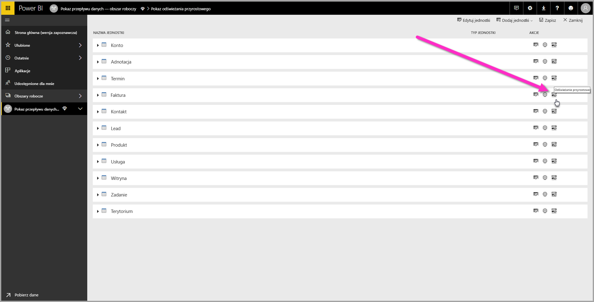
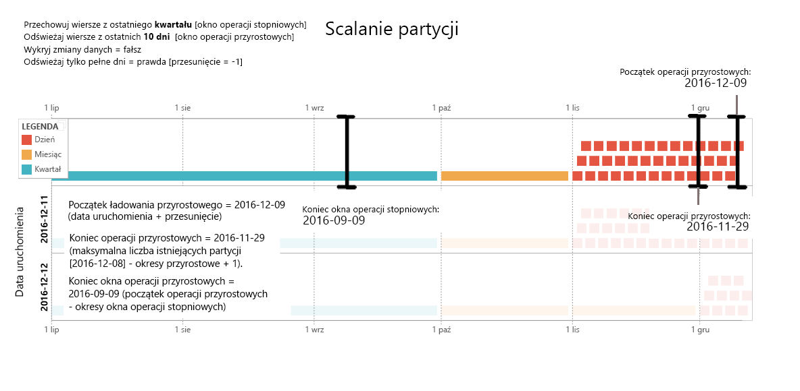
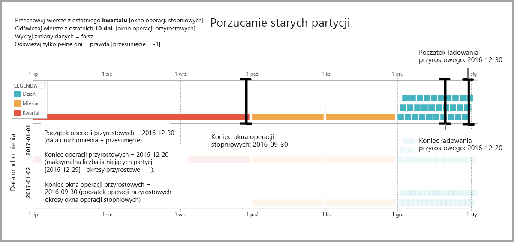
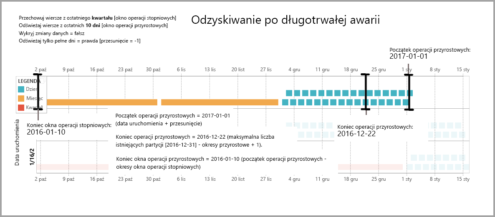

# Korzystanie z odświeżania przyrostowego przy użyciu przepływów danych usługi Power BI (wersja zapoznawcza)

Za pomocą przepływów danych można przenosić duże ilości danych do usługi Power BI w celu tworzenia atrakcyjnych raportów i analiz. W niektórych przypadkach aktualizowanie pełnej kopii danych źródłowych podczas każdego odświeżania nie będzie praktycznym rozwiązaniem. Dobra alternatywa to **odświeżanie przyrostowe**, które oferuje następujące korzyści związane z przepływami danych:

* **Odświeżanie jest wykonywane szybciej** — tylko dane, które uległy zmianie, muszą zostać odświeżone. Na przykład można odświeżyć tylko dane z ostatnich pięciu dni, znajdujące się w przepływie danych obejmującym okres 10 lat.
* **Odświeżanie jest bardziej niezawodne** — na przykład nie trzeba utrzymywać długotrwałych połączeń z nietrwałymi systemami źródłowymi.
* **Użycie zasobów jest redukowane** — mniejsza ilość danych do odświeżenia ogranicza ogólne zużycie pamięci i innych zasobów.

Użycie odświeżania przyrostowego przepływów danych usługi Power BI wymaga, aby obszar roboczy z przepływem danych znajdował się w [pojemności Premium](service-premium.md) w celu uruchomienia, a źródło danych pozyskane do przepływu danych miało pole *daty/godziny*, względem którego można filtrować podczas odświeżania przyrostowego. 

## Konfigurowanie odświeżania przyrostowego dla przepływów danych

Przepływ danych może zawierać wiele jednostek. Odświeżanie przyrostowe jest konfigurowane na poziomie jednostki, co umożliwia jednemu przepływowi danych przechowywanie jednostek w pełni odświeżonych oraz jednostek odświeżanych przyrostowo.

Aby skonfigurować jednostkę odświeżaną przyrostowo, rozpocznij od skonfigurowania jednostki, tak jak w przypadku każdej innej jednostki. Aby dowiedzieć się więcej na temat konfiguracji przepływu danych, zobacz artykuł [Przygotowywanie danych samoobsługi w usłudze Power BI (wersja zapoznawcza)](service-dataflows-overview.md).

Po utworzeniu i zapisaniu przepływu danych wybierz ikonę **odświeżania przyrostowego** w widoku jednostki, tak jak pokazano na poniższej ilustracji:

Po kliknięciu ikony zostanie wyświetlone okno **Ustawienia odświeżania przyrostowego**. Po przełączeniu odświeżania przyrostowego do pozycji **Wł.** można skonfigurować odświeżanie przyrostowe.

Poniższa lista zawiera objaśnienia dotyczące ustawień w oknie **Ustawienia odświeżania przyrostowego**. 

1. **Przełącznik włączania/wyłączania odświeżania przyrostowego** — ten suwak przełącza zasady odświeżania przyrostowego jako włączone/wyłączone dla jednostki
2. **Filtr pola listy rozwijanej** — wybiera pola zapytania, przy użyciu których jednostka ma być filtrowana na potrzeby przyrostów. To pole zawiera tylko pola *daty/godziny*. Nie można użyć odświeżania przyrostowego, jeśli jednostka nie zawiera pola *daty/godziny*.
3. **Przechowywanie wierszy z przeszłości** — poniższy przykład pomoże w objaśnieniu kilku kolejnych ustawień.

    W tym przykładzie definiujemy zasady odświeżania, zgodnie z którymi dane są przechowywane łącznie przez pięć lat, a odświeżanie przyrostowe obejmuje dane z 10 dni. W przypadku codziennego odświeżania jednostki w każdej operacji odświeżania są przeprowadzane następujące działania:

    * Dodanie danych z nowego dnia.
    * Odświeżenie danych z 10 dni poprzedzających bieżącą datę.
    * Usunięcie danych starszych niż pięć lat. Na przykład jeśli bieżąca data to 1 stycznia 2019 r., zostają usunięte dane z 2013 roku.

    Pierwsze odświeżenie przepływu danych może potrwać pewien czasu ze względu na konieczność zaimportowania wszystkich pięciu pięć lat, ale kolejne operacje odświeżania zostaną prawdopodobnie ukończone w ułamku czasu odświeżania początkowego.

4. **Wykrywanie zmian danych** — odświeżanie przyrostowe danych z 10 dni jest o wiele efektywniejsze niż pełne odświeżenie 5 lat, ale możemy zrobić to jeszcze lepiej. Zaznaczenie pola wyboru **Wykryj zmiany danych** pozwala wybrać kolumnę daty/godziny w celu identyfikacji i odświeżania tylko tych dni, w których dane zmieniły się. Taka kolumna musi istnieć w systemie źródłowym. Działanie to wykonuje się zazwyczaj na potrzeby inspekcji. Dla każdego okresu w zakresie przyrostowym jest wyznaczana maksymalna wartość w tej kolumnie. Jeśli te dane nie zmieniły się od czasu ostatniej operacji odświeżania, nie trzeba odświeżać okresu. W tym przykładzie można dodatkowo ograniczyć liczbę dni odświeżanych przyrostowo — prawdopodobnie z 10 do dwóch.

> [!TIP]
> Bieżący projekt wymaga, aby dane z kolumny służącej do wykrywania zmian były utrwalane i buforowane w pamięci. Aby zmniejszyć kardynalność i zużycie pamięci, warto skorzystać z jednej z poniższych metod:
>
>    * Podczas odświeżania utrwalaj tylko maksymalną wartość tej kolumny, na przykład przy użyciu funkcji dodatku Power Query.
>    * Zmniejsz dokładność do akceptowalnego poziomu, zgodnego z wymaganiami częstotliwości odświeżania.

5. **Odświeżaj tylko pełne okresy** — załóżmy, że uruchomienie odświeżania zostało zaplanowane na godzinę 4:00 codziennie rano. Prawdopodobnie nie chcesz uwzględniać danych, które pojawiły się w systemie źródłowym w ciągu tych pierwszych czterech godzin dnia. Uwzględnianie niektórych metryk biznesowych, takich jak liczba baryłek na dzień w przemyśle naftowym i gazowym, nie jest praktyczne ani uzasadnione w przypadku niepełnych dni pracy.

    Innym przykładem sytuacji, w której ma sens tylko odświeżanie pełnych okresów, jest odświeżanie danych z systemu finansowego. Załóżmy, że w systemie finansowym dane z poprzedniego miesiąca są zatwierdzane 12 dnia kalendarzowego bieżącego miesiąca. Możesz ustawić zakres przyrostowy na jeden miesiąc i zaplanować uruchamianie odświeżania na 12 dzień miesiąca. Po wybraniu tej opcji dane ze stycznia (ostatni pełny okres miesięczny) zostaną odświeżone 12 lutego.

> [!NOTE]
> Odświeżanie przyrostowe przepływu danych określa daty zgodnie z następującą logiką: jeśli zaplanowano odświeżanie, odświeżanie przyrostowe dla przepływów danych używa strefy czasowej zdefiniowanej w zasadach odświeżania. Jeśli harmonogram odświeżania nie istnieje, odświeżanie przyrostowe używa czasu z maszyny, na której jest uruchamiane.

## Zapytanie dotyczące odświeżania przyrostowego

Po skonfigurowaniu odświeżania przyrostowego przepływ danych automatycznie zmienia swoje zapytanie, aby uwzględnić filtr według daty. Zapytanie generowane automatycznie można edytować za pomocą **zaawansowanego edytora Power Query** w celu dostrojenia lub dostosowania odświeżania. Poniższa sekcja zawiera dalsze informacje na temat odświeżania przyrostowego oraz sposobu jego działania.

## Porównanie odświeżania przyrostowego dla jednostek połączonych i obliczonych

W przypadku *połączonych* jednostek odświeżanie przyrostowe polega na aktualizacji jednostki źródłowej. Ponieważ połączone jednostki po prostu wskazują jednostkę oryginalną, odświeżanie przyrostowe nie ma wpływu na połączoną jednostkę. Podczas odświeżania jednostki źródłowej zgodnie ze zdefiniowanymi zasadami odświeżania w każdej połączonej jednostce należy przyjąć założenie, że dane w źródle są odświeżane.

*Obliczone* jednostki opierają się na zapytaniach uruchamianych w magazynie danych, który może być innym przepływem danych. Dlatego obliczone jednostki zachowują się tak samo jak połączone jednostki.

Ponieważ jednostki połączone i obliczone zachowują się podobnie, wymagania i kroki konfiguracji są takie same dla obydwu typów jednostek. Jedyną różnicą jest to, że w przypadku niektórych konfiguracji obliczonych jednostek odświeżanie przyrostowe nie może działać w sposób zoptymalizowany ze względu na metodę tworzenia partycji. 

## Wprowadzanie zmian między odświeżaniem przyrostowym i pełnym

Przepływy danych obsługują wprowadzanie zmian zasad odświeżania między odświeżaniem przyrostowym i pełnym. Zmiana w dowolnym kierunku (odświeżanie pełne na przyrostowe lub przyrostowe na pełne) będzie wpływać na przepływ danych po następnym odświeżeniu.

W przypadku przenoszenia przepływu danych z odświeżania pełnego do przyrostowego nowa logika odświeżania aktualizuje przepływ danych zgodnie z przedziałem czasu odświeżania i przyrostem zdefiniowanym w ustawieniach odświeżania przyrostowego.

W przypadku przenoszenia przepływu danych z odświeżania przyrostowego do pełnego wszystkie dane zakumulowane podczas odświeżania przyrostowego są zastępowane przez zasady zdefiniowane na potrzeby odświeżania pełnego. Tę akcję trzeba zatwierdzić.

## Odświeżanie przyrostowe przepływów danych i zestawy danych

Odświeżanie przyrostowe przepływu danych i odświeżanie przyrostowe zestawu danych zostały zaprojektowane z myślą o współdziałaniu. Sytuacje, w których odświeżana przyrostowo jednostka w przepływie danych jest w pełni ładowana do zestawu danych lub w pełni ładowana jednostka w przepływie danych jest przyrostowo ładowana do zestawu danych, są dopuszczalne i obsługiwane. 

Obydwa podejścia są stosowane zgodnie z definicjami podanymi w ustawieniach odświeżania.
Więcej informacji na temat odświeżania przyrostowego można znaleźć w artykule [Odświeżanie przyrostowe w usłudze Power BI Premium](service-premium-incremental-refresh.md).

## Obsługa stref czasowych podczas odświeżania przyrostowego

Odświeżanie przyrostowe przepływu danych zależy od czasu, w którym jest uruchamiane. Filtrowanie zapytania zależy od dnia uruchomienia.

Aby uwzględnić te zależności i zapewnić spójność danych, odświeżanie przyrostowe przepływów danych implementuje następujący algorytm heurystyczny w scenariuszach typu *Odśwież teraz*:

* Jeśli zaplanowane odświeżanie zostało zdefiniowane w systemie — odświeżanie przyrostowe używa ustawień strefy czasowej zaplanowanego odświeżania. Daje to gwarancję, że niezależnie od strefy czasowej, której znajduje się osoba odświeżająca przepływ danych, odświeżanie zawsze będzie zgodne z definicją systemu.

* Jeśli nie zdefiniowano zaplanowanego odświeżania, w przepływach danych zostanie użyta strefa czasowa komputera użytkownika przeprowadzającego odświeżanie.

Odświeżanie przyrostowe można również wywoływać przy użyciu interfejsów API. W takim przypadku wywołanie interfejsu API może przechowywać ustawienie strefy czasowej stosowane podczas odświeżania. Korzystanie z interfejsów API może być pomocne dla celów testowania i walidacji.

## Szczegóły implementacji odświeżania przyrostowego

Do odświeżania przyrostowego przepływów danych jest używane partycjonowanie. Gdy punkty końcowe specyfikacji XMLA usługi Power BI Premium zostaną udostępnione, partycje staną się widoczne. Odświeżanie przyrostowe w przepływach danych zachowuje minimalną liczbę partycji w celu spełnienia wymagań zasad odświeżania. Stare partycje, które wykraczają poza zakres, są pomijane, w celu obsługi ruchomego przedziału czasowego. Partycje są okazyjnie scalane, co powoduje zmniejszenie łącznej liczby wymaganych partycji. Zwiększa to kompresję, a w niektórych przypadkach może nawet poprawić wydajność zapytań.

Przykłady w tej sekcji mają następujące wspólne zasady odświeżania:

* Przechowuj wiersze z ostatniego kwartału
* Odświeżaj wiersze z ostatnich 10 dni
* Wykryj zmiany danych = fałsz
* Odświeżaj tylko pełne dni = prawda

### Scalanie partycji

W tym przykładzie partycje dni są automatycznie scalane na poziomie miesiąca, gdy znajdą się zakresem przyrostowym. Partycje w zakresie przyrostowym muszą być utrzymywane na dziennym poziomie szczegółowości, aby umożliwić odświeżanie tylko takich dni.
Operacja odświeżania z *datą uruchomienia 11.12.2016*  powoduje scalenie dni w listopadzie, ponieważ wykraczają poza zakres przyrostowy.

### Porzucanie starych partycji

Stare partycje, które wykraczają poza zakres całkowity, są porzucane. Operacja odświeżania z *datą uruchomienia 02.01.2017* porzuca partycję dla 3. kwartału 2016 r., ponieważ znajduje się poza zakresem całkowitym.

### Odzyskiwanie po długotrwałej awarii

Ten przykład symuluje sposób bezproblemowego odzyskiwania systemu po długotrwałej awarii. Załóżmy, że uruchamianie odświeżania zakończyło się niepowodzeniem, ponieważ poświadczenia źródła danych wygasły, a rozwiązanie problemu trwa 13 dni. Zakres przyrostowy wynosi tylko 10 dni.

Następna pomyślna operacja odświeżania z *datą uruchomienia 15.01.2017* musi wypełnić brakujące 13 dni i odświeżyć je. Trzeba również odświeżyć poprzednich 9 dni, ponieważ nie zostały odświeżone zgodnie ze zwykłym harmonogramem. Mówiąc inaczej, zakres przyrostowy zwiększył się z 10 do 22 dni.

Następna operacja odświeżania z *datą uruchomienia 16.01.2017* korzysta z możliwości scalenia dni w grudniu i miesięcy w 4. kwartale 2016 r.

## Następne kroki

W tym artykule opisano odświeżanie przyrostowe dla przepływów danych. Oto kilka innych pomocnych artykułów.

* [Przygotowywanie danych samoobsługi przy użyciu przepływów danych](service-dataflows-overview.md)
* [Tworzenie i używanie przepływów danych w usłudze Power BI](service-dataflows-create-use.md)
* [Używanie przepływów danych z lokalnymi źródłami danych (wersja zapoznawcza)](service-dataflows-on-premises-gateways.md)
* [Zasoby dla deweloperów dotyczące przepływów danych usługi Power BI (wersja zapoznawcza)](service-dataflows-developer-resources.md)

Aby uzyskać więcej informacji na temat dodatku Power Query oraz zaplanowanego odświeżania, możesz przeczytać następujące artykuły:
* [Omówienie zapytań w programie Power BI Desktop](desktop-query-overview.md)
* [Konfigurowanie zaplanowanego odświeżania](refresh-scheduled-refresh.md)

Aby uzyskać więcej informacji na temat modelu Common Data Model, można przeczytać artykuł zawierający jego omówienie:
* [Omówienie usługi Common Data Model](https://docs.microsoft.com/powerapps/common-data-model/overview)

