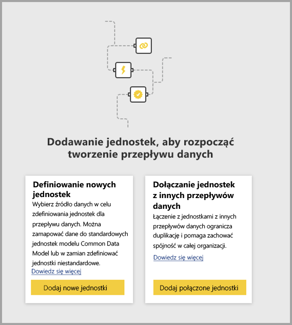
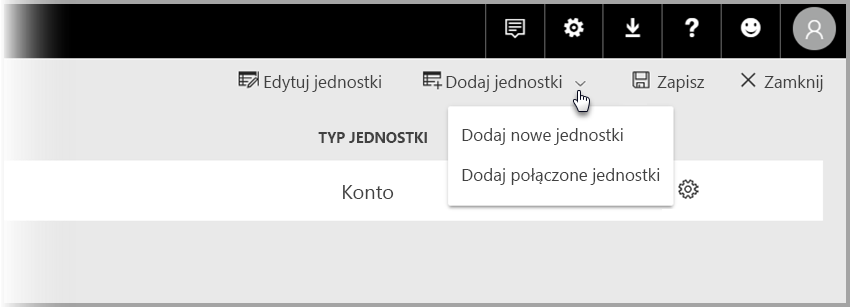

# Łączenie jednostek między przepływami danych w usłudze Power BI (wersja zapoznawcza)

Dzięki przepływom danych w usłudze Power BI można mieć pojedyncze źródło magazynu danych organizacyjnych, w którym analitycy biznesowi mogą raz przygotować dane i zarządzać nimi, a następnie ponownie używać tych danych w różnych aplikacjach analitycznych w organizacji. 

W przypadku łączenia jednostek między przepływami danych można ponownie użyć jednostek, które już zostały pozyskane, oczyszczone i przekształcone przez inne przepływy danych należące do innych osób, bez konieczności przechowywania tych danych. Połączone jednostki wskazują jednostki w ramach innych przepływów danych — *nie* kopiują ani powielają danych.

Połączone jednostki są przeznaczone **tylko do odczytu**. Jeśli chcesz utworzyć przekształcenia dla połączonej jednostki, musisz utworzyć nową obliczoną jednostkę z odwołaniem do połączonej jednostki.

## Dostępność połączonej jednostki

Do odświeżania połączonych jednostek jest wymagana subskrypcja usługi [Power BI Premium](service-premium.md). Połączone jednostki są dostępne w dowolnym przepływie danych w obszarze roboczym hostowanym w usłudze Power BI Premium. Źródłowy przepływ danych nie ma żadnych ograniczeń.

Połączone jednostki działają prawidłowo tylko w nowych obszarach roboczych usługi Power BI. Dowiedz się więcej o [nowych obszarach roboczych usługi Power BI](service-create-the-new-workspaces.md). Aby wszystkie połączone przepływy danych działały prawidłowo, muszą znajdować się w nowych obszarach roboczych.

> [!NOTE]
> Jednostki różnią się w zależności od tego, czy są to jednostki standardowe czy obliczone. Jednostki standardowe (często określane jako jednostki) wykonują zapytania o zewnętrzne źródło danych, takie jak baza danych SQL. Obliczone jednostki wymagają pojemności Premium w usłudze Power BI i uruchamiają przekształcenia w obrębie danych, które już znajdują się w magazynie usługi Power BI. 
>
>Jeśli przepływ danych znajduje się poza obszarem roboczym w pojemności Premium, nadal można odwoływać się do jednego zapytania lub łączyć co najmniej dwa zapytania, o ile przekształcenia nie zostały zdefiniowane jako przekształcenia w magazynie. Takie odwołania są traktowane jak jednostki standardowe. W tym celu wyłącz opcję **Włącz obciążenie** dla przywoływanych zapytań, aby zapobiec materializowaniu danych i pozyskiwaniu ich do magazynu. Z tego miejsca możesz odwoływać się do zapytań **Włącz obciążenie = false** i ustawiać opcję **Włącz obciążenie** na **Wł.** tylko dla zapytań wynikowych, które mają być materializowane.

## Jak łączyć jednostki między przepływami danych

Istnieje kilka sposobów łączenia jednostek między przepływami danych w usłudze Power BI. Możesz wybrać pozycję **Dodaj połączone jednostki** w narzędziu do tworzenia przepływów danych, jak pokazano na poniższej ilustracji. 

Możesz również wybrać pozycję **Dodaj połączone jednostki** w obrębie elementu menu **Dodaj jednostki** w usłudze Power BI.

Aby połączyć jednostki, musisz zalogować się przy użyciu poświadczeń usługi Power BI.

Zostanie otwarte okno **Nawigator**, w którym wybierzesz zestaw jednostek, z którymi możesz się łączyć. Wyświetlone jednostki to jednostki, do których masz uprawnienia, we wszystkich obszarach roboczych w dzierżawie usługi Power BI. 

Po wybraniu połączonych jednostek pojawią się one na liście jednostek dla Twojego przepływu danych w narzędziu do tworzenia, ze specjalną ikoną identyfikującą je jako połączone jednostki.

Można również wyświetlić źródłowy przepływ danych z poziomu ustawień przepływu danych połączonej jednostki.

## Logika odświeżania połączonych jednostek
Domyślna logika odświeżania połączonych jednostek zmienia się w zależności od tego, czy źródłowy przepływ danych znajduje się w tym samym obszarze roboczym co docelowy przepływ danych. W poniższych sekcjach opisano zachowanie w poszczególnych sytuacjach.

### Połączenia między obszarami roboczymi

Odświeżanie połączeń między jednostkami w różnych obszarach roboczych odbywa się tak jak w przypadku zewnętrznego źródła danych. Gdy przepływ danych jest odświeżany, najnowsze dane dla jednostki są pobierane ze źródłowego przepływu danych. Odświeżanie źródłowego przepływu danych nie wpływa automatycznie na dane w docelowym przepływie danych.

### Połączenia w tym samym obszarze roboczym

Jeśli odświeżasz dane dla źródłowego przepływu danych, to zdarzenie automatycznie wyzwala proces odświeżania dla jednostek zależnych we wszystkich docelowych przepływach danych w tym samym obszarze roboczym, w tym dla wszystkich opartych na nich obliczonych jednostkach. Wszystkie inne jednostki w docelowym przepływie danych są odświeżane zgodnie z harmonogramem danego przepływu danych. Jednostki, które są zależne od więcej niż jednego źródła, aktualizują swoje dane zawsze wtedy, gdy dowolne z ich źródeł zostanie pomyślnie zaktualizowane.

Warto zapamiętać, że cały proces odświeżania jest zatwierdzany równocześnie. W związku z tym, jeśli odświeżanie docelowego przepływu danych zakończy się niepowodzeniem, nie powiedzie się również odświeżanie jego źródłowego przepływu danych.

## Uprawnienia podczas wyświetlania raportów z przepływów danych

Podczas tworzenia raportu usługi Power BI, który zawiera dane oparte na przepływie danych, użytkownicy mogą zobaczyć połączone jednostki, tylko wtedy, gdy mają prawa dostępu do źródłowego przepływu danych.

## Ograniczenia i istotne zagadnienia

Istnieje kilka ograniczeń, o których warto pamiętać, pracując z połączonymi jednostkami:

* Maksymalna liczba przeskoków elementów źródłowych odwołania to pięć
* Zależności cykliczne połączonych jednostek są niedozwolone
* Przepływ danych musi znajdować się w [nowym obszarze roboczym usługi Power BI](service-create-the-new-workspaces.md)

## Następne kroki

Poniższe artykuły mogą być przydatne podczas tworzenia przepływów danych lub pracy z nimi. 

* [Przygotowywanie danych samoobsługi w usłudze Power BI (wersja zapoznawcza)](service-dataflows-overview.md)
* [Tworzenie i używanie przepływów danych w usłudze Power BI](service-dataflows-create-use.md)
* [Używanie obliczonych jednostek w usłudze Power BI Premium (wersja zapoznawcza)](service-dataflows-computed-entities-premium.md)
* [Używanie przepływów danych z lokalnymi źródłami danych (wersja zapoznawcza)](service-dataflows-on-premises-gateways.md)
* [Zasoby dla deweloperów dotyczące przepływów danych usługi Power BI (wersja zapoznawcza)](service-dataflows-developer-resources.md)

Aby uzyskać więcej informacji na temat dodatku Power Query oraz zaplanowanego odświeżania, możesz przeczytać następujące artykuły:
* [Omówienie zapytań w programie Power BI Desktop](desktop-query-overview.md)
* [Konfigurowanie zaplanowanego odświeżania](refresh-scheduled-refresh.md)

Aby uzyskać więcej informacji na temat modelu Common Data Model, można przeczytać artykuł zawierający jego omówienie:
* [Omówienie usługi Common Data Model](https://docs.microsoft.com/powerapps/common-data-model/overview)

