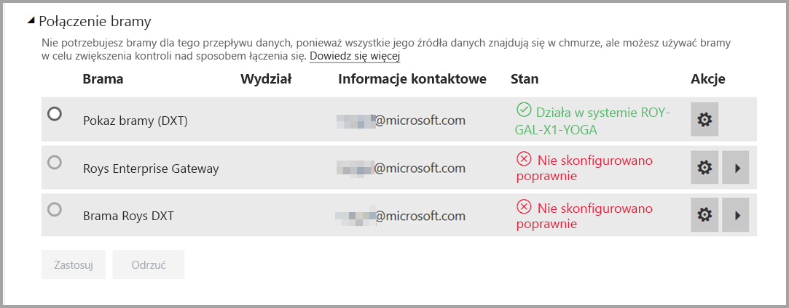

# Używanie przepływów danych z lokalnymi źródłami danych (wersja zapoznawcza)

Za pomocą **przepływów danych** można tworzyć kolekcję danych z różnych źródeł, czyścić dane, przekształcać je i ładować je do magazynu w usłudze Power BI. Podczas tworzenia przepływu danych można używać lokalnych źródeł danych. Ten artykuł objaśnia wymagania skojarzone z tworzeniem przepływów danych oraz sposób skonfigurowania **bramy przedsiębiorstwa** w celu włączenia tych połączeń.

> [!NOTE]
> Funkcjonalność przepływów danych jest dostępna w wersji zapoznawczej. Przed przejściem do wersji ogólnodostępnej może ona podlegać zmianom i aktualizacjom.
 
## Konfigurowanie bramy przedsiębiorstwa do używania z przepływami danych

Aby użyć lokalnego źródła danych w przepływie danych, każdy użytkownik tworzący przepływ danych musi mieć zainstalowaną i skonfigurowaną **bramę przedsiębiorstwa**. Użytkownik tworzący przepływ danych musi być również administratorem bramy przedsiębiorstwa, aby używać tej bramy na potrzeby przepływu danych.

> [!NOTE]
> Przepływy danych są obsługiwane tylko za pomocą bram przedsiębiorstwa.

## Używanie lokalnego źródła danych w przepływie danych

Podczas tworzenia przepływu danych wybierz lokalne źródło danych z listy źródeł danych, jak pokazano na poniższej ilustracji.

Po dokonaniu wyboru jest wyświetlany monit o podanie szczegółów połączenia dla bramy przedsiębiorstwa, która będzie używana do uzyskiwania dostępu do danych lokalnych. Należy wybrać bramę i podać jej poświadczenia. Na liście rozwijanej są wyświetlane tylko bramy, dla których użytkownik jest administratorem.

## Monitorowanie bramy

Bramę przedsiębiorstwa dla przepływu danych możesz monitorować tak samo jak bramy dla zestawu danych.

Na ekranie ustawień przepływu danych w usłudze Power BI możesz monitorować stan bramy przepływu danych i przypisywać bramę do przepływu danych, jak pokazano na poniższej ilustracji.

## Zmienianie bramy

Bramę przedsiębiorstwa używaną dla danego przepływu danych można zmienić na dwa sposoby:

1. **W narzędziu do tworzenia** — można zmienić bramę przypisaną do wszystkich zapytań przy użyciu narzędzia do tworzenia przepływu danych.

    > [!NOTE]
    > Przepływ danych spróbuje znaleźć lub utworzyć wymagane źródła danych przy użyciu nowej bramy. Jeśli okaże się to niemożliwe, nie będzie można zmienić bramy do momentu udostępnienia wszystkich potrzebnych przepływów danych w obrębie wybranej bramy.

2. **Na ekranie ustawień** — można zmienić przypisaną bramę za pomocą ekranu ustawień dla przepływu danych w usłudze Power BI.

Aby dowiedzieć się więcej o bramach przedsiębiorstwa, zobacz temat [Lokalna bramy danych](service-gateway-onprem.md).

## Istotne zagadnienia i ograniczenia

Istnieje kilka znanych ograniczeń dotyczących używania bram przedsiębiorstwa i przepływów danych:

* Każdy przepływ danych może używać tylko jednej bramy. W efekcie wszystkie zapytania należy konfigurować przy użyciu tej samej bramy.
* Zmiana bramy wpływa na cały przepływ danych.
* Jeśli potrzebujesz kilku bram, najlepszym rozwiązaniem jest skompilowanie szeregu przepływów danych (jednego dla każdej bramy) i używanie możliwości odwołania do obliczeń lub jednostki w celu ujednolicenia danych.
* Przepływy danych są obsługiwane tylko za pomocą bram przedsiębiorstwa. Bramy osobiste nie będą dostępne do wyboru na listach rozwijanych ani ekranach ustawień.

## Następne kroki

W tym artykule przedstawiono informacje na temat używania lokalnych źródeł danych dla przepływów danych oraz sposobów używania i konfigurowania bram na potrzeby uzyskiwania dostępu do tych danych. Następujące artykuły mogą również okazać się pomocne:

* [Przygotowywanie danych samoobsługi przy użyciu przepływów danych](service-dataflows-overview.md)
* [Tworzenie i używanie przepływów danych w usłudze Power BI](service-dataflows-create-use.md)
* [Używanie obliczonych jednostek w usłudze Power BI Premium (wersja zapoznawcza)](service-dataflows-computed-entities-premium.md)
* [Zasoby dla deweloperów dotyczące przepływów danych usługi Power BI (wersja zapoznawcza)](service-dataflows-developer-resources.md)

Aby uzyskać więcej informacji na temat dodatku Power Query oraz zaplanowanego odświeżania, możesz przeczytać następujące artykuły:
* [Omówienie zapytań w programie Power BI Desktop](desktop-query-overview.md)
* [Konfigurowanie zaplanowanego odświeżania](refresh-scheduled-refresh.md)

Aby uzyskać więcej informacji na temat modelu Common Data Model, można przeczytać artykuł zawierający jego omówienie:
* [Omówienie usługi Common Data Model](https://docs.microsoft.com/powerapps/common-data-model/overview)

