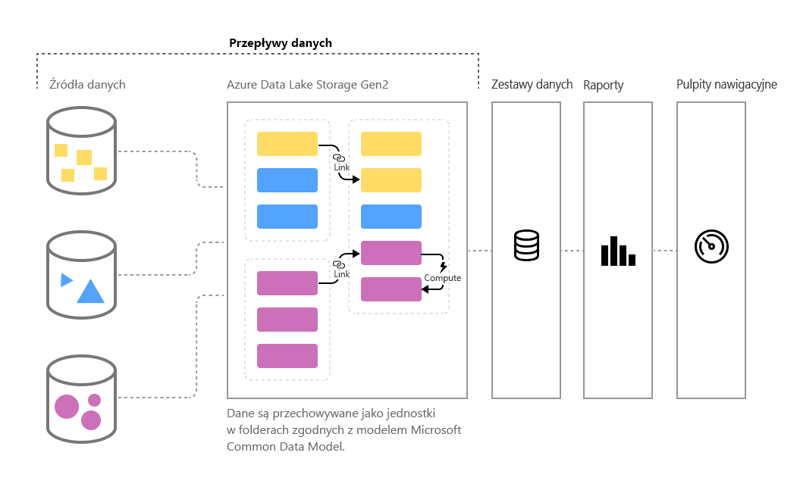

# Przygotowywanie danych samoobsługi w usłudze Power BI (wersja zapoznawcza)

W miarę wzrostu ilości danych zwiększają się wyzwania związane z przekształcaniem tych danych w dobrze sformułowane informacje umożliwiające wykonywanie akcji. Chcemy, aby dane gotowe do analizy wypełniały wizualizacje, raporty i pulpity nawigacyjne — pozwoli to szybko włączać nasze woluminy danych do szczegółowych informacji z możliwością podejmowania akcji. Dzięki funkcji **przygotowywania danych samoobsługi** na potrzeby danych big data w usłudze Power BI możesz przejść od danych do szczegółowych informacji usługi Power BI za pomocą kilku kliknięć.

Usługa Power BI wprowadza **przepływy danych**, aby pomóc organizacjom w ujednolicaniu danych z różnych źródeł i przygotowywaniu ich do modelowania. Analitycy mogą łatwo tworzyć przepływy danych przy użyciu dobrze znanych narzędzi samoobsługi. Przepływy danych są używane do pozyskiwania, przekształcania, integrowania i wzbogacania danych big data przez definiowanie połączeń ze źródłami danych, logiki ETL, harmonogramów odświeżania i innych elementów. Ponadto nowy aparat obliczeń oparty na modelu, który stanowi część przepływów danych, sprawia, że proces przygotowywania danych jest łatwiejszy do zarządzania, bardziej deterministyczny i wygodniejszy dla analityków danych oraz twórców raportu. Podobnie jak arkusze kalkulacyjne obsługują ponowne obliczenia dla wszystkich uwzględnionych formuł, przepływy danych zarządzają zmianami jednostki lub elementu danych w imieniu użytkownika, automatyzując aktualizacje oraz łagodząc wpływ uciążliwych i czasochłonnych operacji sprawdzania logiki nawet w przypadku podstawowego odświeżania danych. Dzięki przepływom danych zadania, które do tej pory wymagały nadzoru analityków danych (oraz wielu godzin lub dni na ukończenie), analitycy danych i twórcy raportów mogą teraz obsługiwać za pomocą kilku kliknięć. 

Dane są przechowywane jako jednostki w modelu [**Common Data Model**](https://docs.microsoft.com/powerapps/common-data-model/overview) w usłudze Azure Data Lake Storage Gen2. Przepływy danych są tworzone i zarządzane w obszarach roboczych aplikacji za pomocą usługi Power BI.  

> [!NOTE]
> Funkcjonalność przepływów danych jest dostępna w wersji zapoznawczej. Przed przejściem do wersji ogólnodostępnej może ona podlegać zmianom i aktualizacjom.

 
**Przepływy danych** zostały zaprojektowane z myślą o korzystaniu z modelu **Common Data Model**, czyli standardowego, modułowego, rozszerzalnego zbioru schematów danych publikowanych przez firmę Microsoft, ułatwiających tworzenie, używanie i analizowanie danych. Za pomocą tego modelu można przechodzić od źródła danych do pulpitów nawigacyjnych usługi Power BI prawie bez żadnych zakłóceń.

Przepływów danych można używać do pozyskiwania danych z dużego, stale rosnącego zestawu obsługiwanych lokalnych i opartych na chmurze źródeł danych, takich jak na przykład usługi Dynamics 365, Salesforce i Azure SQL Database, programy Excel i SharePoint oraz inne rozwiązania.

Następnie dane można mapować na jednostki standardowe w modelu Common Data Model, modyfikować i rozszerzać istniejące jednostki oraz tworzyć jednostki niestandardowe. Zaawansowani użytkownicy mogą tworzyć w pełni dostosowane przepływy danych, używając samoobsługowego, wbudowanego środowiska tworzenia dodatku Power Query z małą ilością kodu/bez kodu. Jest ono podobne do środowiska dodatku Power Query, które znają już miliony użytkowników programów Power BI Desktop i Excel.  

Po utworzeniu przepływu danych można używać programu Power BI Desktop i usługi Power BI do tworzenia zestawów danych, raportów, pulpitów nawigacyjnych i aplikacji, które za pośrednictwem możliwości modelu Common Data Model dodają szczegółowe informacje do operacji biznesowych. 

Planowanie odświeżania przepływu danych odbywa się bezpośrednio z poziomu obszaru roboczego, w którym przepływ danych został utworzony, podobnie jak w przypadku zestawów danych. 

## Jak działają przepływy danych

Poniżej przedstawiono kilka przykładów pokazujących, jak przepływy danych mogą pomóc Ci w pracy:

* Organizacje mogą mapować swoje dane na jednostki standardowe w modelu Common Data Model lub tworzyć własne jednostki niestandardowe. Te jednostki mogą być następnie używane jako bloki konstrukcyjne służące do tworzenia raportów, pulpitów nawigacyjnych i aplikacji działających zaraz po zainstalowaniu oraz dystrybuowania ich do użytkowników w organizacji. 

* Korzystając z obszernej kolekcji łączników danych firmy Microsoft, organizacje mogą łączyć własne źródła dane z przepływami danych, używać dodatku Power Query do mapowania danych na podstawie pochodzenia i przenosić je do usługi Power BI. Po zaimportowaniu danych przez przepływ danych (i odświeżeniu ich z określoną częstotliwością) jednostki przepływu danych mogą być używane w aplikacji Power BI Desktop do tworzenia atrakcyjnych raportów i pulpitów nawigacyjnych. 

## Jak używać przepływów danych

W poprzedniej sekcji opisano kilka sposobów używania przepływów danych w celu szybkiego tworzenia zaawansowanej analizy w usłudze Power BI. W tej sekcji pokażemy, jak można szybko tworzyć szczegółowe informacje przy użyciu przepływów danych w organizacji, uzyskiwać szybki wgląd w to, jak specjaliści ds. analizy biznesowej mogą tworzyć własne przepływy danych, oraz dostosowywać szczegółowe informacje do potrzeb własnej organizacji.

### Rozszerzanie wspólnego modelu danych w celu zaspokojenia potrzeb firmy
W organizacjach, które chcą rozszerzyć model Common Data Model (CDM), przepływy danych pozwalają specjalistom ds. analizy biznesowej na dostosowywanie jednostek standardowych lub tworzenie nowych. To podejście do dostosowywania modelu danych z uwzględnieniem samoobsługi może być następnie używane z przepływami danych do tworzenia aplikacji i pulpitów nawigacyjnych usługi Power BI, które są przystosowywane do potrzeb organizacji.

### Programowe definiowanie przepływów danych
Można również tworzyć własne rozwiązania programowe do tworzenia przepływów danych. Korzystając z publicznych interfejsów API i możliwości programowego tworzenia niestandardowych plików definicji przepływu danych (model.json), możesz utworzyć niestandardowe rozwiązanie, które będzie odpowiadać unikatowym potrzebom Twojej organizacji w zakresie danych i analizy. 

Publiczne interfejsy API oferują deweloperom proste i łatwe sposoby interakcji z usługą Power BI i przepływami danych.

### Rozszerzanie możliwości dzięki platformie Azure
Do każdej płatnej subskrypcji usługi Power BI (10 GB na użytkownika, 100 TB na węzeł P1) jest dołączana usługa Azure Data Lake Storage Gen2. Dlatego możesz łatwo rozpocząć przygotowywanie danych samoobsługi w usłudze Azure Data Lake. 

Usługę Power BI można skonfigurować tak, aby przechowywała dane przepływu danych na koncie usługi Azure Data Lake Storage Gen2 organizacji. Po połączeniu usługi Power BI z subskrypcją platformy Azure deweloperzy i analitycy danych mogą korzystać z zaawansowanych produktów platformy Azure, takich jak usługi Azure Machine Learning, Azure Databricks, Azure Data Factory i inne.

Usługa Power BI może również łączyć się z folderami przy użyciu danych objętych schematem w formacie Common Data Model, które są przechowywane na koncie usługi Azure Data Lake Storage organizacji. Te foldery mogą być tworzone przez usługi, takie jak usługi danych platformy Azure. Dzięki połączeniu z folderami analitycy mogą bezproblemowo współpracować z tymi danymi w usłudze Power BI. 

Aby uzyskać więcej informacji na temat integracji usługi Azure Data Lake Storage Gen2 i przepływów danych, w tym na temat sposobu tworzenia przepływów danych znajdujących się w usłudze Azure Data Lake organizacji, zobacz artykuł [Integracja przepływów danych z usługą Azure Data Lake (wersja zapoznawcza)](service-dataflows-azure-data-lake-integration.md).

## Możliwości przepływów danych w usłudze Power BI Premium

Aby obciążenia i funkcje przepływu danych działały w subskrypcji usługi Power BI Premium, należy włączyć obciążenie przepływu danych dla danej pojemności Premium. Dowiedz się więcej o usłudze Power BI Premium z artykułu [Czym jest usługa Microsoft Power BI Premium?](service-premium.md) 

W poniższej tabeli opisano funkcje przepływu danych i ich możliwości w przypadku korzystania z konta usługi Power BI Pro w porównaniu z kontem usługi Power BI Premium.

|Pojemność przepływu danych | Power BI Pro |   Power BI Premium |
|---------|---------|---------|
|Zaplanowane odświeżanie| 8 razy na dzień|  48|
|Łączny rozmiar magazynu| 10 GB/użytkownika  |100 TB/węzeł|
|Tworzenie przepływów danych za pomocą dodatku Power Query Online|    +   |+|
|Zarządzanie przepływami danych w usłudze Power BI|   +|  +|
|Łącznik danych przepływów danych w programie Power BI Desktop|  +|  +|
|Integracja z platformą Azure|    +|  +|
|Obliczone jednostki (przekształcenia w magazynie za pośrednictwem rozwiązania M) | |   +|
|Nowe łączniki|    +|  +|
|Odświeżanie przyrostowe przepływów danych|  |   +|
|Uruchamianie w ramach pojemności usługi Power BI Premium/równoległe wykonywanie przekształceń|   |   +|
|Połączone jednostki przepływu danych| |        +|
|Znormalizowany schemat/wbudowana obsługa modelu Common Data Model|  +|  +|

Aby uzyskać więcej informacji na temat sposobu włączania obciążeń przepływów danych w ramach pojemności Premium, zobacz artykuł dotyczący [konfigurowania obciążeń](service-admin-premium-manage.md#configure-workloads) dla usługi Power BI Premium.

## Podsumowanie procesu przygotowywania danych samoobsługi dla danych big data w usłudze Power BI
Jak wspomniano wcześniej, w tym artykule, istnieje wiele scenariuszy i przykładów, w których **przepływy danych** umożliwiają skuteczniejsze sprawowanie kontroli — i szybsze uzyskiwanie szczegółowych informacji — na podstawie własnych danych biznesowych. Dzięki użyciu standardowego modelu (schematu) danych zdefiniowanego przez model Common Data Model przepływy danych mogą importować cenne dane biznesowe i w bardzo krótkim czasie przygotować dane do modelowania i tworzenia szczegółowych informacji związanych z analizą biznesową, których tworzenie zajmowało kiedyś miesiące lub dłużej. 

Przechowując dane biznesowe w standaryzowanym formacie modelu **Common Data Model**, specjaliści ds. analizy biznesowej (lub deweloperzy) mogą tworzyć aplikacje generujące szybkie, proste i automatyczne wizualizacje oraz raporty. Obejmują one między innymi następujące rozwiązania:

* Mapowanie danych na jednostki standardowe w usłudze Common Data Model w celu ujednolicenia danych i korzystania ze znanego schematu, a w konsekwencji uzyskiwania szczegółowych informacji od razu po instalacji
* Tworzenie własnych jednostek niestandardowych w celu ujednolicenia danych w organizacji 
* Używanie i odświeżanie **danych zewnętrznych** w ramach przepływu danych i umożliwianie importu tych danych na potrzeby uzyskiwania szczegółowych informacji
* Wprowadzenie do przepływów danych dla deweloperów

## Następne kroki

W tym artykule omówiono proces przygotowywania danych samoobsługi dla danych big data w usłudze Power BI oraz różne sposoby korzystania z tych danych. Poniższe artykuły zawierają bardziej szczegółowe informacje na temat typowych scenariuszy użycia przepływów danych. 

* [Tworzenie i używanie przepływów danych w usłudze Power BI](service-dataflows-create-use.md)
* [Używanie obliczonych jednostek w usłudze Power BI Premium (wersja zapoznawcza)](service-dataflows-computed-entities-premium.md)
* [Używanie przepływów danych z lokalnymi źródłami danych (wersja zapoznawcza)](service-dataflows-on-premises-gateways.md)
* [Zasoby dla deweloperów dotyczące przepływów danych usługi Power BI (wersja zapoznawcza)](service-dataflows-developer-resources.md)
* [Integracja przepływów danych z usługą Azure Data Lake (wersja zapoznawcza)](service-dataflows-azure-data-lake-integration.md)

Aby uzyskać więcej informacji na temat dodatku Power Query oraz zaplanowanego odświeżania, możesz przeczytać następujące artykuły:
* [Omówienie zapytań w programie Power BI Desktop](desktop-query-overview.md)
* [Konfigurowanie zaplanowanego odświeżania](refresh-scheduled-refresh.md)

Aby uzyskać więcej informacji na temat modelu Common Data Model, można przeczytać artykuł zawierający jego omówienie:
* [Omówienie usługi Common Data Model](https://docs.microsoft.com/powerapps/common-data-model/overview)

