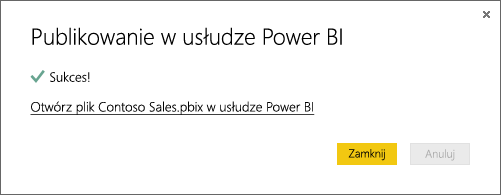

# Pobieranie danych z plików programu Power BI Desktop

Program **Power BI Desktop** ułatwia prowadzenie analiz biznesowych i tworzenie raportów. Niezależnie od tego, czy łączysz się z wieloma źródłami danych, wysyłasz zapytania i przekształcasz dane, modelujesz swoje dane, czy tworzysz zaawansowane i dynamiczne raporty, program **Power BI Desktop** sprawia, że zadania analizy biznesowej są intuicyjne i szybkie. Jeśli jesteś nowym użytkownikiem programu **Power BI Desktop**, zapoznaj się z tematem [Wprowadzenie do programu Power BI Desktop](desktop-getting-started.md).

Po przeniesieniu danych do programu **Power BI Desktop** i utworzeniu kilku raportów nadszedł czas na przeniesienie zapisanego pliku do **usługi Power BI**.

## Miejsce zapisu pliku jest istotne
**Lokalnie** — jeśli zapiszesz plik na dysku lokalnym na komputerze lub w innej lokalizacji w organizacji, będzie można *zaimportować* plik lub *opublikować* go z programu Power BI Desktop, aby przenieść jego dane i raporty do usługi Power BI. Plik pozostanie na dysku lokalnym, więc tak naprawdę nie jest w całości przenoszony do usługi Power BI. Właściwie nowy zestaw danych jest tworzony w usłudze Power BI, a dane oraz model danych z pliku programu Power BI Desktop są ładowane do zestawu danych. Jeśli plik zawiera jakiekolwiek raporty, zostaną one wyświetlone w witrynie usługi Power BI w sekcji Raporty.

**OneDrive — firmowe** — jeśli masz usługę OneDrive dla Firm i zalogujesz się do niej przy użyciu tego samego konta, z którego korzystasz do logowania się w usłudze Power BI, zapewnisz najwydajniejszy sposób na utrzymanie synchronizacji pracy w programie Power BI Desktop i zestawie danych, raportach oraz pulpitach nawigacyjnych w usłudze Power BI. Ponieważ usługi Power BI i OneDrive działają w chmurze, usługa Power BI *łączy się* z plikiem w usłudze OneDrive mniej więcej co godzinę. W przypadku wykrycia jakichkolwiek zmian zestaw danych, raporty i pulpity nawigacyjne zostaną automatycznie zaktualizowane w usłudze Power BI.

**OneDrive — dla osób prywatnych** — w przypadku zapisu plików na własnym koncie w usłudze OneDrive zapewnisz sobie wiele takich samych korzyści, jak w przypadku usługi OneDrive dla Firm. Największa różnica dotyczy pierwszego połączenia z plikiem (przy użyciu opcji Pobierz dane > Pliki > OneDrive — dla osób prywatnych), ponieważ trzeba zalogować się do usługi OneDrive przy użyciu konta Microsoft, które zazwyczaj różni się od konta używanego do logowania w usłudze Power BI. Podczas logowania do usługi OneDrive przy użyciu konta Microsoft należy wybrać opcję Nie wylogowuj mnie. Dzięki temu usługa Power BI będzie w stanie nawiązać połączenie z plikiem co godzinę i zapewnić synchronizację zestawu danych w usłudze Power BI.

**Witryny zespołu programu SharePoint** — zapisywanie plików programu Power BI Desktop w witrynach zespołu programu SharePoint jest bardzo podobne do zapisywania plików w usłudze OneDrive dla Firm. Największa różnica polega na sposobie nawiązywania połączenia z plikiem z poziomu usługi Power BI. Możesz określić adres URL lub połączyć się z folderem głównym.

## Importowanie pliku programu Power BI Desktop lub nawiązywanie połączenia z plikiem w usłudze Power BI
>[!IMPORTANT]
>Maksymalny rozmiar pliku, który można zaimportować do usługi Power BI, to 1 GB.

1. W usłudze Power BI w okienku nawigatora kliknij polecenie **Pobierz dane**.
   
   
2. W sekcji **Pliki** kliknij polecenie **Pobierz**.
   
   
3. Znajdź plik. Pliki programu Power BI Desktop mają rozszerzenie PBIX.
   
   

## Publikowanie pliku z programu Power BI Desktop do witryny usługi Power BI
Użycie opcji publikowania z programu Power BI Desktop daje taki sam efekt jak użycie opcji pobierania danych w usłudze Power BI w celu zaimportowanie pliku z dysku lokalnego lub nawiązania z nim połączenia w usłudze OneDrive.  Poniżej przedstawiono szybki poradnik, ale możesz też zapoznać się z tematem [Publikowanie z programu Power BI Desktop](desktop-upload-desktop-files.md), aby dowiedzieć się więcej.

1. W programie Power BI Desktop kliknij pozycję **Plik** > **Publikuj** > **Publikuj w usłudze Power BI** lub kliknij przycisk **Publikuj** na wstążce.
   
   
2. Zaloguj się do usługi Power BI. Trzeba to zrobić tylko za pierwszym razem.
   
   Po zakończeniu publikowania zostanie wyświetlony link umożliwiający otworzenie raportu w witrynie usługi Power BI.
   
   

## Następne kroki
**Eksploracja danych** — po pobraniu danych i raportów z pliku do usługi Power BI nadszedł czas na ich eksplorowanie. Jeśli plik zawiera już raporty, pojawią się w okienku nawigatora w sekcji **Raporty**. Jeśli plik zawiera tylko dane, możesz utworzyć nowe raporty; po prostu kliknij nowy zestaw danych prawym przyciskiem myszy, a następnie kliknij polecenie **Eksploruj**.

**Odśwież zewnętrzne źródła danych** — jeśli plik programu Power BI Desktop łączy się z zewnętrznymi źródłami danych, możesz skonfigurować zaplanowane odświeżanie, aby upewnić się, że zestaw danych jest zawsze aktualny. W większości przypadków skonfigurowanie zaplanowanego odświeżania jest całkiem proste, ale szczegółowe informacje wykraczają poza zakres tego artykułu. Aby dowiedzieć się więcej, zobacz [Odświeżanie danych w usłudze Power BI](refresh-data.md).

